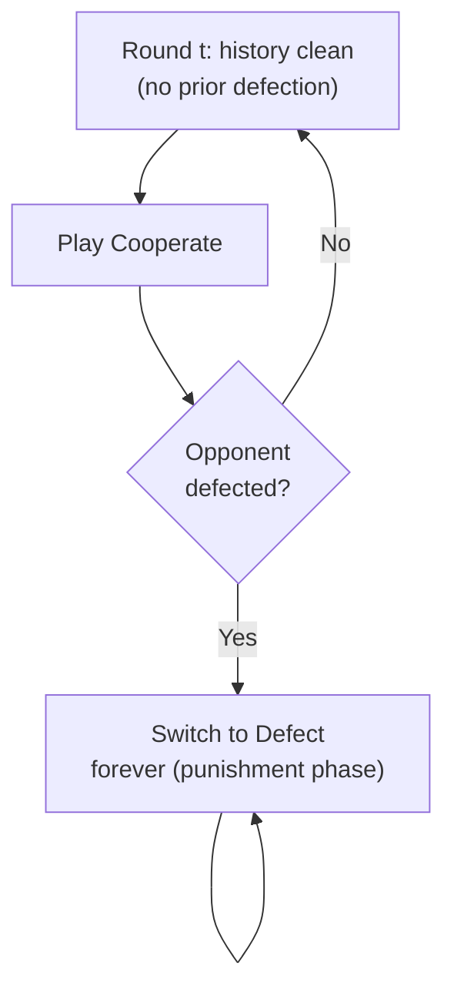

## Infinitely Repeated Games and Discounting

### Definition

An **infinitely repeated game** consists of a stage game $G$ played by the same players in every period $t = 1, 2, 3, \ldots$, without a fixed, known terminal round. Because payoffs received infinitely far in the future would otherwise sum to infinity (or be incomparable across strategies), players evaluate the infinite sequence of stage-game payoffs using a **discount factor** $\delta \in (0, 1)$, giving each player's total payoff as:

$$U_i = \sum_{t=1}^{\infty} \delta^{t-1} \, u_i(a^t) = u_i(a^1) + \delta \, u_i(a^2) + \delta^2 \, u_i(a^3) + \cdots$$

Equivalently, this is often normalized by $(1-\delta)$ to express payoffs in **average per-period terms**:

$$\bar{U}_i = (1 - \delta) \sum_{t=1}^{\infty} \delta^{t-1} \, u_i(a^t)$$

This normalization is convenient because it puts repeated-game payoffs on the same scale as stage-game payoffs, aiding direct comparison.

### Interpretations of the Discount Factor

The parameter $\delta$ admits two standard, mathematically equivalent interpretations:

1. **Time preference / interest rate**: Players value a payoff received tomorrow less than the same payoff received today, reflecting impatience or the opportunity cost of capital (analogous to discounting in finance, where $\delta = 1/(1+r)$ for interest rate $r$).
2. **Continuation probability**: The game continues to another round with probability $\delta$ and ends permanently with probability $1 - \delta$ after each round. Under this interpretation, the game is technically an **indefinitely repeated game** rather than a literal infinite horizon, but the mathematics and strategic analysis are identical, since players never know in advance which round will be the last.

**Key Points**

- Both interpretations yield the identical formal analysis; the choice is purely about which real-world motivation best fits the application (e.g., modeling a firm's patience versus modeling genuine uncertainty about whether a business relationship will continue).
- The critical feature enabling cooperation (discussed below) is that $\delta$ is **not zero** and the horizon is **not commonly known to be finite** — this is what breaks the backward-induction unraveling argument central to finitely repeated games.

### Why Backward Induction Fails Here

In a finitely repeated game, backward induction anchors reasoning at a known final round $T$ and works backward. In an infinitely repeated (or indefinitely repeated) game, **there is no final round to anchor the induction** — every round is followed by another round with positive probability $\delta$, so the argument "defect in the last round because there's no future" simply has no starting point. This structural difference is precisely what allows infinitely repeated games to sustain cooperative outcomes that are impossible in the finite case, connecting directly to the sharp contrast established in Finitely Repeated Games.

### Trigger Strategies: Sustaining Cooperation

The canonical mechanism for sustaining cooperation in an infinitely repeated Prisoner's Dilemma is the **grim trigger strategy**:

> "Cooperate in round 1. Continue cooperating in round $t$ as long as both players have cooperated in every previous round. If either player ever defects, defect in every subsequent round forever (punish permanently)."

**Deriving the sustainability condition**: Using the Prisoner's Dilemma payoffs $(3,3)$ for mutual cooperation, $(0,5)$/$(5,0)$ for unilateral defection, and $(1,1)$ for mutual defection, consider whether a player benefits from deviating (defecting) in some round, given the opponent plays grim trigger.

**Payoff from cooperating forever** (following the trigger strategy path):

$$V_{\text{cooperate}} = \frac{3}{1 - \delta}$$

**Payoff from defecting once** (grab the one-time defection payoff of $5$, then face permanent punishment yielding $1$ per period thereafter):

$$V_{\text{deviate}} = 5 + \delta \cdot \frac{1}{1 - \delta}$$

**Cooperation is sustainable (i.e., is a subgame perfect equilibrium) if and only if**:

$$\frac{3}{1-\delta} \geq 5 + \frac{\delta}{1-\delta}$$

Multiplying through by $(1-\delta)$:

$$3 \geq 5(1-\delta) + \delta$$

$$3 \geq 5 - 5\delta + \delta$$

$$3 \geq 5 - 4\delta$$

$$4\delta \geq 2$$

$$\delta \geq \frac{1}{2}$$

**Conclusion**: Cooperation via grim trigger is a subgame perfect equilibrium **if and only if $\delta \geq 1/2$** in this specific numerical example. Players sufficiently patient (or facing a sufficiently high probability of continued interaction) will sustain cooperation; sufficiently impatient players will not.

**Key Points**

- This threshold $\delta \geq 1/2$ is specific to these particular payoff values; the general formula for grim trigger sustainability in a Prisoner's Dilemma is $\delta \geq \frac{T - R}{T - P}$, where $T$ is the temptation payoff, $R$ is the mutual-cooperation reward, and $P$ is the mutual-defection punishment payoff (using standard Prisoner's Dilemma notation).
- Grim trigger is the "harshest" credible punishment (permanent defection), making it the easiest strategy to sustain cooperation with (i.e., it requires the lowest threshold $\delta$ among simple punishment schemes) — but it is also unforgiving: a single mistake or noise-induced deviation triggers permanent breakdown, which is a significant practical limitation addressed by more sophisticated strategies (see below).

### Diagram: Grim Trigger Decision Logic

### Alternative Punishment Strategies

**Tit-for-Tat**: Cooperate in round 1; thereafter, mimic the opponent's previous-round action. Famous for its strong performance in Axelrod's computer tournaments (1980s), tit-for-tat is more forgiving than grim trigger (a single defection is punished for only one round, not permanently), but this forgivingness means it requires a comparably high or sometimes higher $\delta$ threshold to sustain full cooperation against certain deviations, and it can be vulnerable to cycles of alternating defection under noisy observation (a single erroneous defection can trigger a persistent "echo" of mutual retaliation).

**Limited/finite punishment strategies**: Punish a deviation for only $k$ rounds before returning to cooperation, rather than forever. These require careful analysis of whether the finite punishment length is sufficient to deter deviation, generally requiring a *higher* $\delta$ than grim trigger (since the punishment is less severe) but offering more resilience to occasional mistakes.

**Key Points**

- There is a general strategic trade-off between the **severity** of a punishment and its **impact on players' incentive compatibility**: harsher punishments sustain cooperation at lower discount factors but are less robust to noise/errors in observing actions; more lenient punishments require higher patience but recover more gracefully from mistakes.

### The Folk Theorem

The **Folk Theorem** (so named because it was informally understood among game theorists before being formally published, with rigorous versions established by various authors including Friedman, 1971, for Nash-threat versions, and Fudenberg and Maskin, 1986, for the fully general subgame-perfect version) is the central existence result for infinitely repeated games. It states, informally:

> For a sufficiently high discount factor $\delta$, **any feasible and individually rational payoff vector** of the stage game can be sustained as the average payoff of a subgame perfect (or Nash) equilibrium of the infinitely repeated game.

**Formal ingredients**:

- **Feasible payoffs**: any payoff vector achievable as a (possibly correlated/mixed) convex combination of stage-game pure-strategy payoff vectors.
- **Individually rational payoffs**: any payoff vector $v_i$ for player $i$ that is at least as good as $i$'s **minmax payoff** $\underline{v}_i = \min_{a_{-i}} \max_{a_i} u_i(a_i, a_{-i})$ — the worst payoff the other players can hold player $i$ to, even if they coordinate solely to punish $i$, if player $i$ best-responds.

**Key Points**

- The Folk Theorem dramatically expands the set of equilibrium outcomes relative to the one-shot game: while the one-shot Prisoner's Dilemma has a *unique* Nash equilibrium payoff $(1,1)$, the infinitely repeated version (with sufficiently patient players) supports a continuum of equilibrium average payoffs, including full cooperation $(3,3)$ and many intermediate outcomes.
- This abundance of equilibria is often viewed as both the theorem's power (explaining a wide range of observed cooperative and semi-cooperative real-world behavior) and its limitation (a **multiplicity problem**: the theory alone does not pin down *which* equilibrium will be played without additional refinements, focal points, or behavioral assumptions).

### Worked Example: Verifying Individual Rationality

In the standard Prisoner's Dilemma, the minmax payoff for each player is exactly the mutual-defection payoff $1$ (since the opponent's best "punishment" against a player is simply to always defect, and the player's best response to permanent defection is also to defect, yielding $1$). Thus, by the Folk Theorem, any payoff vector $(v_1, v_2)$ with $v_1, v_2 \geq 1$ that is feasible (lies in the convex hull of $\{(3,3), (0,5), (5,0), (1,1)\}$) can be sustained as an equilibrium average payoff for sufficiently high $\delta$ — this includes the mutual cooperation payoff $(3,3)$, asymmetric payoffs like $(2, 4)$ achieved via alternating cooperation/defection patterns, and many others.

### Sensitivity to the Discount Factor: A Numerical Illustration

Using the general formula $\delta \geq \frac{T-R}{T-P}$ for grim trigger sustainability, consider how the required patience threshold changes with the temptation payoff $T$:

| Temptation $T$ | Reward $R$ | Punishment $P$ | Required $\delta$ |
| --- | --- | --- | --- |
| $5$ | $3$ | $1$ | $0.500$ |
| $6$ | $3$ | $1$ | $0.600$ |
| $8$ | $3$ | $1$ | $0.714$ |
| $10$ | $3$ | $1$ | $0.778$ |

**Key Points**

- As the temptation to defect $T$ grows relative to the cooperative reward $R$, players must be increasingly patient (higher $\delta$) to resist the short-term gain from defection — an intuitive and readily quantifiable comparative-static result directly derivable from the sustainability inequality.

### Applications

- **Industrial organization / collusion**: Repeated oligopoly interaction (e.g., repeated Cournot or Bertrand competition) is the classic application, explaining how firms can sustain tacit collusion (prices above the competitive/Nash level) without explicit communication, provided they are sufficiently patient and can detect and punish deviations (price wars as grim-trigger-style punishments) — this is foundational to modern antitrust economics.
- **International relations and treaties**: sustaining cooperation between nations (e.g., trade agreements, arms control) without a supranational enforcement mechanism, relying instead on the shadow of future retaliation.
- **Relational contracts**: sustaining implicit agreements between employers and employees, or between firms and suppliers, that are not explicitly enforceable in court, relying on the value of the ongoing relationship exceeding the temptation to renege.
- **Community and reputation systems**: online marketplaces and peer-to-peer platforms often rely on repeated-interaction logic (formalized via reputation scores) to sustain trustworthy behavior absent centralized enforcement.

### Common Pitfalls

- **Confusing "infinite" with "very long but finite"**: A very long but finite, commonly known horizon is still subject to the unraveling logic of finitely repeated games (via backward induction from the known final round); only a truly infinite or indefinite (unknown-end) horizon breaks the induction and enables the Folk Theorem's expanded equilibrium set.
- **Assuming any discount factor sustains cooperation**: Sustainability of a *specific* cooperative outcome via a *specific* strategy (e.g., grim trigger) requires $\delta$ to exceed a calculable threshold; low patience (low $\delta$, e.g., due to high interest rates or high probability of the relationship ending) can still make defection the dominant SPE outcome even in an infinite-horizon setting.
- **Treating the Folk Theorem as predicting a single, determinate outcome**: The theorem establishes a wide *set* of sustainable equilibrium payoffs; it does not by itself predict which particular equilibrium (e.g., full cooperation versus a harsher, less efficient equilibrium) will actually emerge — additional equilibrium selection reasoning or empirical/behavioral input is needed for that.
- **Behavior may vary**: The specific dynamics of real-world repeated interactions (imperfect monitoring, noisy signals of defection, bounded rationality) can cause substantial deviation from the idealized perfect-monitoring, fully rational trigger-strategy predictions described here.

**Related Topics**

- Finitely Repeated Games and the Unraveling Problem
- The Folk Theorem (Nash-threat and Subgame-Perfect versions)
- Grim Trigger and Tit-for-Tat Strategies
- Minmax Payoffs and Individual Rationality
- Tacit Collusion in Oligopoly (Industrial Organization)
- Imperfect Monitoring and Noisy Repeated Games
- Relational Contracts and Reputation Effects
- Axelrod's Iterated Prisoner's Dilemma Tournaments