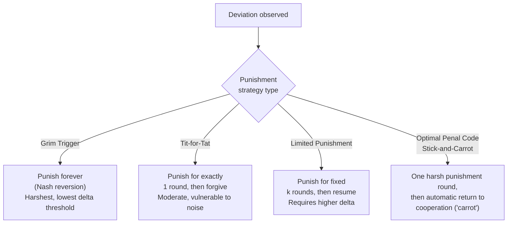

## Trigger Strategies and Punishment

### Definition

A **trigger strategy** is a class of strategy for repeated games in which a player conditions their current action on the observed history of play: the player cooperates (or plays some designated "cooperative" action) as long as the history remains consistent with cooperation, but switches ("triggers") to a punishment phase upon observing a deviation. Trigger strategies are the primary mechanism by which cooperative outcomes — otherwise unsupportable in the one-shot stage game — become sustainable as subgame perfect equilibria in repeated games, directly implementing the abstract existence guarantee of the Folk Theorem.

### General Structure of a Trigger Strategy

Every trigger strategy can be decomposed into three components:

1. **Cooperative phase**: the action(s) played as long as no deviation has been observed.
2. **Trigger condition**: the specific event (typically, observing any deviation from the cooperative path) that causes a switch to punishment.
3. **Punishment phase**: the action(s) played after the trigger condition is met, along with a rule for whether/how the strategy ever returns to the cooperative phase.

**Key Points**

- These three components fully characterize a trigger strategy, and most named strategies (grim trigger, tit-for-tat, limited punishment) differ from one another only in how they specify the punishment phase's severity and duration.
- For a trigger strategy profile to constitute a **subgame perfect equilibrium**, the punishment itself must be **credible** — i.e., carrying out the punishment must be optimal for the punishing player(s) given the strategy profile, not merely an empty threat. This credibility requirement is essential and easy to overlook.

### Grim Trigger (Nash Reversion)

**Grim trigger** (also called **Nash reversion**) is the strategy already introduced under Infinitely Repeated Games and Discounting:

> Cooperate in round 1. Continue cooperating as long as the history shows only cooperation. Upon any deviation by any player, defect (play the stage-game Nash equilibrium) forever after.

**Key Points**

- Grim trigger's punishment phase is simply **permanent reversion to a stage-game Nash equilibrium** — this guarantees credibility "for free," since playing a Nash equilibrium is always a best response to itself in every subsequent round of the punishment phase, requiring no further verification.
- Among simple trigger strategies, grim trigger imposes the **harshest possible punishment** (infinite duration, at the Nash equilibrium payoff), which makes it the **easiest strategy to sustain** — it requires the **lowest discount factor threshold** $\delta$ among common trigger strategies to deter deviation, as derived quantitatively in the discounting analysis.
- **Major drawback**: grim trigger is maximally unforgiving. In settings with **imperfect monitoring** (noisy signals of whether a deviation actually occurred) or the possibility of trembling-hand mistakes, a single false signal of defection triggers permanent breakdown of cooperation, with no path back — a significant practical and empirical limitation.

### Tit-for-Tat

**Tit-for-tat (TFT)** was popularized by Robert Axelrod's computer tournaments in the early 1980s, where it won repeated round-robin competitions against a wide field of more complex submitted strategies for the iterated Prisoner's Dilemma.

> Cooperate in round 1. In every subsequent round, play whatever action the opponent played in the previous round.

**Key Points**

- Unlike grim trigger, tit-for-tat's punishment is **proportionate and temporary**: a single defection by the opponent is met with exactly one round of retaliatory defection, after which tit-for-tat reverts to cooperation if the opponent also reverts.
- [Inference] Axelrod's tournament results are widely cited as empirical/computational evidence that "nice" (never defects first), "retaliatory" (punishes defection), "forgiving" (returns to cooperation quickly), and "clear" (easily recognized) strategies tend to perform well in noisy, repeated, evolutionary-style competitive environments — though this is a computational/experimental finding about strategy performance in a tournament setting, not a formal equilibrium-existence theorem in itself.
- **Vulnerability to noise**: in environments with imperfect observation (a cooperative action is occasionally misperceived as a defection), tit-for-tat can fall into persistent "echo" cycles of alternating mutual retaliation, since both players' TFT rules cause them to mirror the (erroneous) defection back and forth. This is a well-documented weakness addressed by more sophisticated variants.
- **Generous tit-for-tat**: a variant that occasionally cooperates even after an opponent's defection (with some probability), designed specifically to break out of noise-induced retaliation cycles; [Inference] this and related "forgiving" variants are generally found in the literature to outperform strict tit-for-tat in noisy environments, though optimal forgiveness probability depends on the specific noise level and payoff structure.

### Limited (Finite-Length) Punishment Strategies

Rather than punishing forever (grim trigger) or for exactly one round (tit-for-tat), a strategy can specify a **fixed punishment length** $k$:

> Cooperate as long as the history shows cooperation. Upon any deviation, play the punishment (e.g., stage-game Nash equilibrium or another low-payoff action) for exactly $k$ rounds, then return to the cooperative phase regardless of behavior during the punishment phase.

**Key Points**

- Because the punishment is less severe (finite rather than permanent), sustaining a given cooperative payoff with a limited-punishment strategy generally requires a **higher discount factor** $\delta$ than grim trigger requires for the same target payoff.
- The punishment length $k$ must be calibrated so that the temptation to deviate is still deterred — too short a punishment fails to deter, while excessively long punishment approaches grim trigger's severity without necessarily improving on it.
- **Credibility check required**: unlike grim trigger's "punish via Nash reversion," a finite punishment phase must be verified to be itself an equilibrium continuation — i.e., a player must not want to deviate *during* the punishment phase, and both players must find it optimal to actually resume cooperation exactly at the point specified. This is a subtler subgame perfection requirement that a well-designed limited-punishment strategy must satisfy explicitly.

### Optimal Penal Codes (Abreu's Stick-and-Carrot)

Dilip Abreu's work (1988) on **optimal penal codes** established that, rather than reverting to the stage-game Nash equilibrium, the **most severe credible punishment** is often a specially constructed **"stick-and-carrot"** strategy: punish deviation with one round of a harsh, possibly asymmetric punishment action (the "stick") — potentially harsher than any stage-game Nash equilibrium — followed by an immediate, automatic return to cooperation (the "carrot"), regardless of what happened during the stick round.

**Key Points**

- [Inference] Abreu's key insight is that the harshest possible one-period punishment, if properly designed to be self-enforcing (players prefer to comply with the harsh punishment action rather than deviate further, precisely because deviating further only delays or jeopardizes the return to the valuable cooperative "carrot" phase), can sustain cooperation at **lower discount factors** than grim trigger in certain settings — this is a more advanced and technically involved construction than grim trigger or tit-for-tat, and its exact optimality conditions depend on the specific stage-game structure.
- This body of work underlies the general **subgame-perfect Folk Theorem** proofs (e.g., Abreu, Pearce, Stacchetti, and separately Fudenberg and Maskin), which construct explicit, credible punishment schemes to support any individually rational, feasible payoff vector.

### Diagram: Comparing Punishment Severity and Duration

### Worked Example: Verifying Credibility of a Limited Punishment

Suppose two firms in a repeated Cournot duopoly consider a limited-punishment scheme: upon a deviation from a collusive quantity, both firms revert to the competitive (Nash) quantity for exactly $k = 2$ rounds, then resume colluding. To verify this is subgame perfect, one must check, within the punishment phase itself, that:

1. **No further deviation during punishment is profitable**: given the opponent is playing the competitive quantity for the remaining punishment rounds, a firm's best response should itself be the competitive quantity (this typically holds automatically if the punishment action is the stage-game Nash equilibrium, since the Nash equilibrium is by definition a mutual best response).
2. **Returning to collusion after $k$ rounds is itself incentive compatible**: the same original sustainability inequality (temptation vs. discounted future collusive value) must hold, now discounted by an additional $\delta^k$ to account for the delay imposed by the punishment phase.

**Key Points**

- This illustrates why limited-punishment schemes are more delicate to verify than grim trigger: the analyst must confirm equilibrium behavior *within* the punishment phase as well as on the cooperative path, whereas grim trigger's Nash-reversion punishment is automatically self-verifying.

### Applications

- **Antitrust and industrial organization**: real-world "price war" episodes are frequently interpreted through the lens of trigger-strategy punishment phases — a temporary breakdown of tacit collusion following a perceived deviation (e.g., a price cut), followed by eventual reversion to a higher, collusive price level, consistent with limited-punishment or stick-and-carrot dynamics rather than literal permanent grim-trigger breakdown.
- **International sanctions and trade agreements**: temporary trade sanctions or tariff retaliation following a treaty violation can be modeled as limited-punishment trigger strategies, with an eventual return to cooperative trade relations.
- **Labor and relational contracts**: informal norms of reciprocity in ongoing employer-employee or supplier relationships (e.g., temporarily reduced trust or cooperation following a perceived breach, followed by gradual relationship repair) parallel forgiving trigger-strategy structures like generous tit-for-tat.

### Common Pitfalls

- **Assuming any stated punishment is automatically credible**: A "threat" to punish is only meaningful in equilibrium analysis if carrying it out is itself optimal for the punisher when the trigger condition arises; threats that are not sequentially rational are not part of a subgame perfect equilibrium (this is the same core insight underlying the general concept of subgame perfection and the critique of non-credible threats in extensive form games).
- **Ignoring monitoring imperfections**: analyses that assume perfect, noiseless observation of deviations can dramatically overstate how easily grim-trigger-style strategies sustain cooperation in real settings where signals of defection are noisy — imperfect-monitoring repeated game theory (e.g., using statistical inference over noisy public signals) is a substantially more complex extension.
- **Treating tit-for-tat's tournament success as a formal proof of optimality**: Axelrod's results demonstrate strong *computational tournament performance* under specific conditions, not a general theorem that tit-for-tat is the *equilibrium-theoretically optimal* strategy in all repeated Prisoner's Dilemma settings; optimality depends on the discount factor, the opponent pool, and the presence or absence of noise.
- **Behavior may vary**: exact thresholds for sustaining a given punishment scheme (values of $\delta$, punishment length $k$, or the specific structure of an optimal penal code) are payoff-structure-specific and must be recalculated for each distinct stage game rather than assumed to transfer directly from a textbook Prisoner's Dilemma example.

**Related Topics**

- Infinitely Repeated Games and Discounting
- The Folk Theorem
- Subgame Perfect Equilibrium and Credible Threats
- Abreu's Optimal Penal Codes
- Imperfect Monitoring in Repeated Games
- Axelrod's Iterated Prisoner's Dilemma Tournaments
- Tacit Collusion and Price Wars in Oligopoly
- Reputation Effects and Relational Contracts