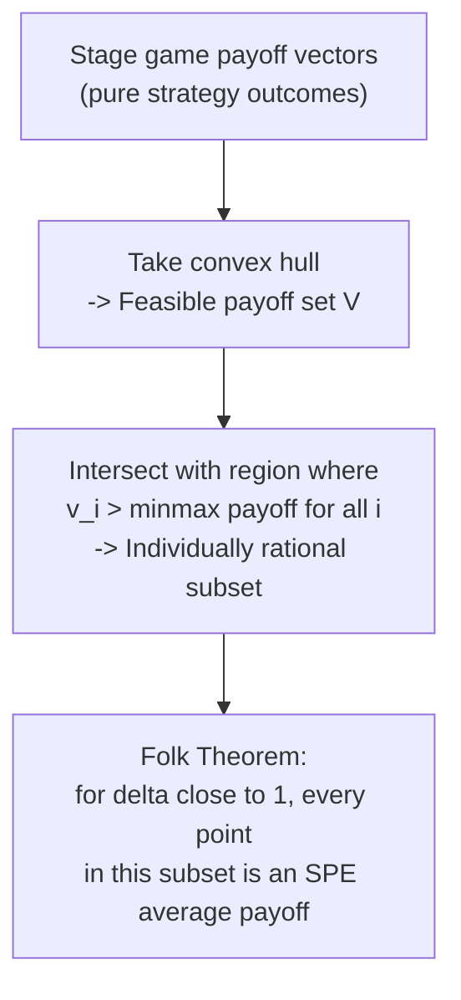

## Folk Theorems

### Definition

**Folk Theorems** are a family of results in repeated game theory establishing that, when a stage game is repeated with sufficient patience (a discount factor $\delta$ close enough to $1$, or equivalently, sufficiently frequent interaction), a very large set of payoff outcomes — far beyond the stage game's own Nash equilibrium payoffs — can be sustained as equilibria of the repeated game. The name "folk theorem" reflects that early, informal versions of the result were understood and circulated among game theorists well before formal statements and proofs were published in the literature.

### Motivation: Why the Result Is Needed

In the one-shot Prisoner's Dilemma, the unique Nash equilibrium yields payoff $(1,1)$, strictly worse for both players than mutual cooperation $(3,3)$. A natural question is whether *repetition* can somehow "rescue" the cooperative outcome as an equilibrium, without appealing to a separate contract-enforcement mechanism. Folk theorems answer this question affirmatively for the infinitely (or indefinitely) repeated case, and provide a precise characterization of exactly *which* payoff vectors can be sustained — connecting directly to the introduction of trigger strategies and discounting.

### The Two Key Ingredients

Every version of the folk theorem is built from two payoff concepts applied to the stage game.

**1. Feasible payoffs**: A payoff vector $v = (v_1, \ldots, v_n)$ is **feasible** if it lies in the convex hull of the set of achievable pure-strategy stage-game payoff vectors:

$$V = \text{co} \{ u(a) : a \in A \}$$

Convex combinations are achievable in the repeated game either via **public randomization** (an observed randomizing device determining which pure outcome is played) or by **alternating** between pure outcomes over time and taking the long-run time-average.

**2. Individually rational payoffs**: A payoff $v_i$ is **individually rational** for player $i$ if it is at least as large as player $i$'s **minmax payoff**:

$$\underline{v}_i = \min_{a_{-i}} \max_{a_i} u_i(a_i, a_{-i})$$

This is the lowest payoff the other players can hold player $i$ to, assuming they act solely to minimize $i$'s payoff (even at their own cost) and $i$ best-responds. It represents the worst credible punishment the rest of the group can inflict on player $i$.

**Key Points**

- The minmax payoff is generally **weakly lower** than player $i$'s payoff in any Nash equilibrium of the stage game (a player can always guarantee at least their minmax payoff by best-responding, so no equilibrium payoff can fall below it).
- In the standard Prisoner's Dilemma, each player's minmax payoff equals $1$ (achieved by the opponent always defecting, to which the best response is also to defect) — coincidentally equal to the stage-game Nash equilibrium payoff in this specific example, though this equivalence does not hold in general games.

### The Nash Folk Theorem (Friedman, 1971)

The earliest rigorous version, due to James Friedman, establishes existence of **Nash equilibria** (not yet the stronger subgame-perfect requirement) supporting cooperative payoffs:

> If $v$ is a feasible payoff vector that **strictly Pareto-dominates** some stage-game Nash equilibrium payoff $e$ (i.e., $v_i > e_i$ for all $i$), then for $\delta$ sufficiently close to $1$, $v$ can be sustained as the average payoff of a Nash equilibrium of the infinitely repeated game, using grim-trigger-style strategies that revert to the stage-game Nash equilibrium $e$ upon any deviation.

**Key Points**

- Friedman's version uses Nash-equilibrium reversion as the punishment, which — as established under Trigger Strategies and Punishment — is automatically credible (a Nash equilibrium is a best response to itself), making this version comparatively straightforward to prove.
- This version is limited to Nash equilibrium (not subgame perfection), and requires the target payoff to dominate an *existing* stage-game Nash equilibrium payoff, which is a more restrictive condition than the individual-rationality condition used in the full theorem.

### The Subgame-Perfect Folk Theorem (Fudenberg and Maskin, 1986)

The stronger and most cited modern version, due to Drew Fudenberg and Eric Maskin, replaces Nash equilibrium with the more demanding **subgame perfect equilibrium** and replaces "dominates a Nash payoff" with the broader **individual rationality** condition:

> For any feasible payoff vector $v$ that is **strictly individually rational** (i.e., $v_i > \underline{v}_i$ for every player $i$), if the discount factor $\delta$ is sufficiently close to $1$, there exists a subgame perfect equilibrium of the infinitely repeated game whose average payoff equals $v$.

**Key Points**

- This dramatically expands the class of sustainable outcomes beyond Friedman's version: the target payoff need only beat each player's own worst-case punishment (minmax), not necessarily dominate an existing Nash equilibrium.
- The standard proof constructs punishments using each player's **minmaxing strategies** (the other players' joint strategy that holds the deviator to their minmax payoff) as the credible threat, combined with careful bookkeeping to ensure that even the *punishers* have no incentive to deviate from carrying out the punishment (this last point requires additional machinery, such as switching briefly to "punish the punisher" if a punisher shirks, which is where the technical complexity of the full proof resides).
- [Inference] An important technical subtlety in the original construction concerns games with more than two players, where a punisher who deviates from minmaxing another player must themselves face a credible consequence; various extensions of the theorem (e.g., using public randomization or requiring only near-individual-rationality with $\dim(V)=n$ full-dimensionality conditions) address different technical variants of this issue.

### Diagram: The Feasible and Individually Rational Payoff Set

<svg xmlns="http://www.w3.org/2000/svg" viewBox="0 0 640 400">
\<style\>
.lbl { font-family: sans-serif; font-size: 13px; fill: #222; }
.title { font-family: sans-serif; font-size: 15px; fill: #111; font-weight: bold; }
.ax { stroke: #555; stroke-width: 1.5; }
.region { fill: #bfdbfe; fill-opacity: 0.6; stroke: #2563eb; stroke-width: 1.5; }
.pt { fill: #111; }
\</style\>
<text x="20" y="24" class="title">Feasible and Individually Rational Payoffs (svg_diagram)</text>
<line x1="80" y1="340" x2="580" y2="340" class="ax" />
<line x1="80" y1="340" x2="80" y2="40" class="ax" />
<text x="590" y="345" class="lbl">Player 1 payoff (v1)</text>
<text x="20" y="35" class="lbl">Player 2 payoff (v2)</text>
<polygon points="150,320 480,320 480,90 300,120" class="region" />
<line x1="150" y1="220" x2="580" y2="220" stroke="#c0392b" stroke-dasharray="5,4" />
<text x="490" y="215" class="lbl" fill="#c0392b">Player 2's minmax</text>
<line x1="300" y1="40" x2="300" y2="340" stroke="#c0392b" stroke-dasharray="5,4" />
<text x="305" y="55" class="lbl" fill="#c0392b">Player 1's minmax</text>
<circle cx="300" cy="120" r="6" class="pt" />
<text x="310" y="115" class="lbl">Mutual cooperation (3,3)</text>
<circle cx="200" cy="220" r="6" class="pt" />
<text x="150" y="245" class="lbl">Nash eq. (1,1)</text>
</svg>

### Worked Example: Applying the Folk Theorem to the Prisoner's Dilemma

Using the standard payoffs $(3,3)$, $(0,5)$, $(5,0)$, $(1,1)$:

**Feasible set**: the convex hull of $\{(3,3), (0,5), (5,0), (1,1)\}$ — a quadrilateral region in payoff space.

**Minmax payoffs**: $\underline{v}_1 = \underline{v}_2 = 1$ for both players.

**Individually rational feasible payoffs**: any $(v_1, v_2)$ in the feasible quadrilateral with $v_1 > 1$ and $v_2 > 1$.

By the subgame-perfect folk theorem, for $\delta$ sufficiently close to $1$, **every** such payoff vector — not just $(3,3)$, but also, for example, $(2.5, 3.5)$ achieved by alternating or correlating actions over time, or $(4, 2)$ achieved via an asymmetric time-sharing arrangement — can be sustained as an SPE average payoff. This starkly illustrates the **multiplicity** the folk theorem introduces: the theory supports a continuum of possible cooperative arrangements, not a single predicted outcome.

### The Multiplicity Problem

**Key Points**

- The folk theorem's chief theoretical strength (showing cooperation is *possible*) is simultaneously its chief practical limitation: it does not, by itself, predict *which* particular equilibrium payoff will be observed in practice.
- This has motivated substantial subsequent literature on **equilibrium selection** — using focal points (Schelling), evolutionary dynamics, behavioral assumptions (e.g., fairness norms favoring symmetric/equal-split outcomes), or refinements (e.g., renegotiation-proofness, requiring that punishment phases themselves not be jointly renegotiated away) to narrow down the predicted outcome.
- [Inference] In applied settings (e.g., empirical industrial organization studies of collusion), researchers typically supplement the folk theorem's existence result with additional structure — such as assuming firms coordinate on the most profitable sustainable collusive price, or using detailed institutional/historical evidence — to make sharper predictions about which equilibrium is actually played.

### Extensions and Related Refinements

- **Public randomization**: allowing an observable randomizing device (e.g., a publicly visible coin flip) simplifies the geometry of the feasible payoff set, making every point in the convex hull directly achievable in any single period's continuation value, rather than requiring long-run time-averaging.
- **Imperfect public monitoring**: when players observe only a noisy public signal of others' actions (rather than the actions themselves), a substantially more complex version of the folk theorem holds (Fudenberg, Levine, and Maskin, 1994), under a technical condition often called "individual full rank," ensuring the noisy signals carry enough statistical information to support effective punishment schemes.
- **Renegotiation-proof equilibria**: since harsh punishment phases (e.g., grim trigger's permanent breakdown) may be jointly unattractive to *both* players *after* a deviation has occurred (both would prefer to jointly "renegotiate" back to cooperation rather than carry out mutually damaging punishment), a refined literature studies **renegotiation-proof** folk theorems, which generally support a smaller set of sustainable payoffs than the unrestricted folk theorem.

### Applications

- **Industrial organization**: explaining the theoretical possibility of sustained tacit collusion among oligopolists without explicit agreements, a cornerstone of modern antitrust economic analysis.
- **International relations**: explaining sustained cooperation between sovereign states (trade agreements, arms control, environmental accords) absent a supranational enforcement authority, relying on the shadow of future retaliation.
- **Institutional design**: understanding how repeated interaction within organizations, communities, or informal economic networks (e.g., rotating credit associations, reputation-based trading networks) can sustain cooperative norms without formal contract enforcement.

### Common Pitfalls

- **Treating the folk theorem as predicting cooperation will occur**: the theorem is an *existence* result (cooperation *can* be sustained in equilibrium) — it does not claim cooperation *will* occur, nor does it rule out the harsh Nash-equilibrium outcome, which remains an equilibrium too (every game trivially supports its own repeated one-shot-equilibrium play as an SPE).
- **Ignoring the "sufficiently high $\delta$" qualifier**: the folk theorem is fundamentally a limiting result as $\delta \to 1$; for a fixed, possibly low, discount factor, only a strict subset of individually rational feasible payoffs may actually be sustainable, and the precise sustainable set at a given $\delta < 1$ generally requires separate, more detailed analysis (e.g., via the self-generation techniques of Abreu, Pearce, and Stacchetti).
- **Conflating the Nash and subgame-perfect versions**: Friedman's Nash folk theorem and the Fudenberg-Maskin subgame-perfect folk theorem have different hypotheses (domination of an existing Nash payoff versus individual rationality relative to the minmax) and should not be cited interchangeably.
- **Assuming folk theorems apply to finitely repeated games**: as established under Finitely Repeated Games, the folk theorem's expanded equilibrium set is a phenomenon specific to the infinite/indefinite horizon; finite, commonly-known horizons with a unique stage-game equilibrium generally unravel to the one-shot prediction regardless of how patient players are.

**Related Topics**

- Infinitely Repeated Games and Discounting
- Trigger Strategies and Punishment
- Minmax Payoffs and Individual Rationality
- Subgame Perfect Equilibrium
- Equilibrium Selection and Focal Points
- Renegotiation-Proof Equilibria
- Imperfect Public Monitoring in Repeated Games
- Tacit Collusion in Oligopoly