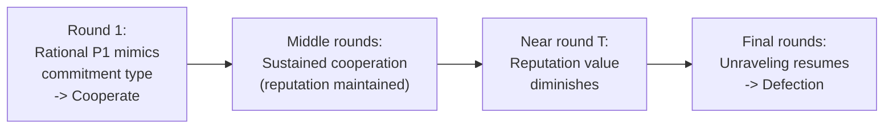

## Reputation Effects

### Definition

**Reputation effects** describe how, in repeated games with **incomplete information** about a player's type (their preferences, payoffs, or rationality), a player's history of past actions can serve as a credible signal about their unobserved type, allowing them to strategically influence opponents' beliefs and future behavior. Reputation-effect models explain how cooperative or aggressive behavior can be sustained even in settings where standard complete-information backward induction (as in Finitely Repeated Games) would predict unraveling to a fully non-cooperative outcome.

### Motivation: Resolving the Finite-Horizon Paradox

As established under Finitely Repeated Games, backward induction predicts full defection in every round of a finitely repeated Prisoner's Dilemma when the stage game has a unique Nash equilibrium — yet real experimental and observed behavior frequently shows sustained cooperation until near the very end. Reputation-effect models, pioneered by David Kreps, Paul Milgrom, John Roberts, and Robert Wilson (the "**KMRW**" result, 1982), provide a rigorous game-theoretic resolution: even a small amount of uncertainty about whether an opponent is a fully rational payoff-maximizer, versus a **"commitment type"** (a player mechanically programmed to cooperate, or to always play tit-for-tat, or otherwise), can restore substantial cooperation in equilibrium, even over a long but strictly finite horizon.

### Formal Setup: Incomplete Information About Types

Consider a finitely repeated game where Player 2 does not know with certainty whether Player 1 is:

- A **rational type** (probability $1 - p$): a standard payoff-maximizing player who would defect if it were optimal.
- A **commitment type** (probability $p > 0$, however small): a player mechanically committed to playing a particular strategy (e.g., always cooperate, or tit-for-tat) regardless of incentives.

**Key mechanism**: Because Player 2 cannot directly observe Player 1's type, Player 2 must form and update beliefs about which type Player 1 is, based on observed actions (via Bayesian updating). A **rational** Player 1 may find it optimal to *mimic* the commitment type's behavior (e.g., cooperate even when defection would be myopically better) in order to **build and preserve a reputation** for being the commitment type, since this reputation induces more favorable behavior from Player 2 in future rounds.

### The KMRW Theorem (Kreps, Milgrom, Roberts, Wilson, 1982)

> In a finitely repeated Prisoner's Dilemma with even a small, commonly known probability $p > 0$ that Player 1 is a commitment type who always cooperates (or plays tit-for-tat), there exists an equilibrium in which **both players cooperate in almost all rounds**, with defection concentrated only in a bounded number of rounds near the very end of the game — and as the probability $p \to 0$ or the horizon $T \to \infty$, the fraction of rounds with sustained cooperation approaches $100\%$.

**Key Points**

- This result directly overturns the sharp, pessimistic unraveling conclusion of the pure complete-information finitely repeated Prisoner's Dilemma: an arbitrarily small amount of "reputation uncertainty" is sufficient to restore substantial cooperative behavior for most of even a very long, finite, commonly known horizon.
- [Inference] The intuition is that a rational Player 1, recognizing that mimicking the commitment type induces continued cooperation from Player 2, finds it individually optimal to cooperate for an extended period purely to preserve the valuable ambiguity about their true type — cooperation becomes an *investment* in reputation rather than an act of unconditional altruism.
- The "unraveling" logic does not entirely disappear: near the very end of the finite horizon, the value of maintaining a reputation diminishes (fewer future rounds remain to benefit from it), so defection still eventually occurs — but it is compressed into a small number of final rounds rather than occurring from round 1.

### Diagram: Cooperation Timeline Under Reputation Effects

### Worked Intuition: Why Beliefs Matter

Suppose Player 2 assigns probability $p$ to Player 1 being a permanent-cooperator commitment type. If Player 1 (rational type) ever defects, Player 2's Bayesian updating immediately assigns probability $0$ to the commitment type (since a true commitment type, by construction, never defects) — Player 2 then knows with certainty that Player 1 is rational, and the game reverts to the standard finitely repeated logic (unraveling) for all remaining rounds. This creates a sharp incentive for a rational Player 1 to **delay defection**, since defecting even once permanently destroys the informational value of an ambiguous reputation, whereas continuing to cooperate preserves optionality and continues to induce favorable play from Player 2.

**Key Points**

- This "single deviation destroys the pooling" feature is a standard characteristic of many reputation-effect equilibria and is central to why reputational cooperation, once broken, typically does not resume within the same finite game — connecting to the broader theory of **signaling and screening games** under incomplete information.
- The precise equilibrium structure (exactly how many final rounds see defection, and the exact evolution of Player 2's posterior beliefs) depends on the specific initial probability $p$, the length $T$, and the specific stage-game payoffs, and generally requires formal equilibrium construction (a **perfect Bayesian equilibrium** or **sequential equilibrium**) rather than simple backward induction alone.

### The Chain-Store Paradox and Reputation for Toughness

A closely related application, also developed by Reinhard Selten (1978) and subsequently addressed via reputation-effect reasoning (notably by Kreps and Wilson, and Milgrom and Roberts, 1982), is the **chain-store paradox**: a multi-market monopolist (the "chain store") faces sequential entry threats from potential competitors in $T$ different markets. Standard backward induction predicts the chain store should always accommodate entry (fighting is costly and, by backward induction, provides no future deterrence value in the very last market) — yet real firms are often observed fighting early entrants aggressively, seemingly to "build a reputation" for toughness that deters subsequent entrants.

**Key Points**

- [Inference] Reputation-effect models resolve this paradox analogously to the KMRW result: if there is some probability the chain store is a "tough" commitment type (always fights entry) rather than a purely rational "accommodating" type, a rational chain store may find it optimal to fight early entrants to maintain a reputation for toughness, deterring many subsequent entrants, with a similar late-game unraveling of the reputation's deterrent value near the final markets.
- This provides a formal game-theoretic account of a real-world business strategy (aggressive early responses to competitive entry) that a naive complete-information backward-induction analysis would otherwise label irrational.

### Reputation in Infinitely Repeated Games

Reputation effects are not exclusive to finite horizons; in **infinitely repeated games with incomplete information**, similar mechanisms operate, though the strategic logic differs somewhat since the pure Folk Theorem already supports cooperation in the infinite-horizon, complete-information case. In the incomplete-information infinite-horizon setting, reputation-effect results (e.g., work following Fudenberg and Levine, 1989, 1992) typically focus on establishing **lower bounds on a patient (long-run) player's equilibrium payoff** when facing a sequence of short-run opponents — showing that a sufficiently patient long-run player can guarantee close to their **Stackelberg payoff** (the payoff from committing publicly to a fixed action) by exploiting the possibility that they might be a commitment type, even with a vanishingly small prior probability of actually being one.

**Key Points**

- [Inference] This "Stackelberg payoff as a lower bound" result is particularly relevant for modeling a long-lived firm or institution (e.g., a bank, a platform, a repeated seller) facing a sequence of one-shot or short-lived counterparties (e.g., individual customers) who each interact with the long-run player only once or a few times — a common real-world market structure not well captured by symmetric two-long-run-player Folk Theorem models.

### Applications

- **Business and branding**: firms invest in maintaining consistent quality or service reputations, which is difficult to explain via one-shot game theory but follows naturally from reputation-effect models when customers face uncertainty about a firm's true "type" (e.g., whether it is a genuinely high-quality committed provider or an opportunistic low-quality type).
- **Central bank credibility**: a central bank's commitment to low inflation can be modeled as a reputation-building exercise against a public uncertain whether the bank is a "tough" inflation-averse type or a more discretionary type willing to inflate for short-term gains — a well-known application in monetary economics (related to the time-inconsistency literature of Kydland and Prescott).
- **Negotiation and bargaining**: reputation for "toughness" or willingness to walk away from a deal can be strategically cultivated across a sequence of negotiations, consistent with the chain-store-paradox logic.
- **Online platforms and marketplaces**: seller/buyer reputation scores in e-commerce platforms operationalize a related (though often more direct, information-revealing rather than strategic-mimicry) mechanism for sustaining trustworthy behavior in repeated or one-shot-but-observed interactions.

### Common Pitfalls

- **Confusing reputation effects with simple repeated-game trigger strategies**: trigger strategies (grim trigger, tit-for-tat) operate under **complete information** about payoffs and rationality, relying purely on the shadow of future punishment; reputation effects specifically require **incomplete information about type** and operate via Bayesian belief updating — these are related but formally distinct mechanisms for sustaining cooperation.
- **Assuming reputation effects work in truly one-shot interactions**: reputation requires a *sequence* of interactions (even if with different, possibly short-lived counterparties) over which beliefs can be built and observed; a genuinely isolated one-shot game admits no scope for reputation-building.
- **Overstating the robustness of the cooperative outcome**: reputation-based cooperation in finite horizons is still generally followed by an unraveling phase near the end of the game; it does not fully eliminate endgame defection, only compresses and delays it.
- **Behavior may vary**: the exact fraction of rounds exhibiting cooperative behavior, and the precise timing of eventual unraveling, are sensitive to the assumed prior probability of commitment types and the specific payoff parameters, and can vary substantially across different modeled scenarios.

**Related Topics**

- Finitely Repeated Games and the Unraveling Problem
- The Chain-Store Paradox (Selten, 1978)
- Bayesian Games and Incomplete Information
- Perfect Bayesian Equilibrium and Sequential Equilibrium
- Signaling and Screening Games
- The Folk Theorem
- Stackelberg Commitment and Leadership
- Time Inconsistency in Monetary Policy