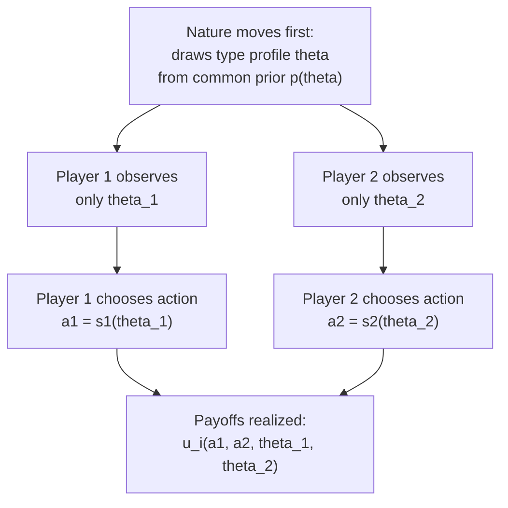

## Bayesian Games

### Definition

A **Bayesian game** (also called a **game of incomplete information**) is a game in which players lack full information about certain features of the game — most commonly, other players' payoffs, preferences, or private information (their "**type**") — and must reason under uncertainty using **Bayesian probability**. Formalized by John Harsanyi (1967-68), Bayesian games extend the standard normal-form and extensive-form game frameworks to settings where "nature" first selects each player's private type according to a known probability distribution, and players then choose actions based on their own type and their beliefs about others' types.

### The Harsanyi Transformation

Prior to Harsanyi's contribution, games of incomplete information posed a conceptual puzzle: how can players form well-defined beliefs about opponents' beliefs about opponents' beliefs, and so on, in a game where the very structure of payoffs is itself uncertain (an infinite regress problem)? Harsanyi's key insight was to model incomplete information as **imperfect information about a move by Nature**: introduce a fictitious initial move by "Nature" that randomly assigns each player a **type** $\theta_i \in \Theta_i$ according to a commonly known joint probability distribution, and let each player observe only their own realized type (not others'). This reduces the analysis of incomplete-information games to the already well-understood machinery of imperfect-information extensive-form games.

**Key Points**

- This transformation is often called the **Harsanyi doctrine**: it assumes a **common prior** — all players share the same underlying probabilistic model of how types are distributed and correlated, differing only in what they have privately observed (their own realized type), not in their fundamental beliefs about the type-generating process.
- [Inference] The common prior assumption is a substantive modeling choice, not a logical necessity; models that relax it (allowing players to have genuinely different, non-common priors) exist in the literature but are less standard and raise additional conceptual questions about where such differing priors would originate.

### Formal Elements of a Bayesian Game

A Bayesian game is formally specified by the tuple:

$$G = \langle N, \; (A_i)_{i \in N}, \; (\Theta_i)_{i \in N}, \; p(\theta), \; (u_i)_{i \in N} \rangle$$

- $N$: the set of players.
- $A_i$: the action set available to player $i$.
- $\Theta_i$: the set of possible types for player $i$ (private information, e.g., valuation, cost, preference parameter).
- $p(\theta)$: the joint probability distribution over the type profile $\theta = (\theta_1, \ldots, \theta_n) \in \Theta_1 \times \cdots \times \Theta_n$, commonly known to all players.
- $u_i(a_1, \ldots, a_n, \theta)$: player $i$'s payoff, which can depend on the entire action profile *and* the entire type profile (allowing for the possibility that a player's payoff depends on others' private information, e.g., in a common-value auction).

**Key Points**

- Each player $i$ observes their own type $\theta_i$ but not the types of others; they hold **beliefs** about others' types given their own type, derived via Bayes' rule from the common prior: $p(\theta_{-i} \mid \theta_i)$.
- A **strategy** in a Bayesian game is a function $s_i: \Theta_i \to A_i$ (or a distribution over actions for each type, if mixing), mapping each possible realized type to an action — this reflects that a player must specify what they would do *for every type they might turn out to be*, not just their single realized choice.

### Bayesian Nash Equilibrium

The equilibrium concept for Bayesian games is **Bayesian Nash Equilibrium (BNE)**: a strategy profile $(s_1^*, \ldots, s_n^*)$ such that, for every player $i$ and every possible type $\theta_i$, the action $s_i^*(\theta_i)$ maximizes player $i$'s **expected** payoff given their beliefs about others' types and others' equilibrium strategies:

$$s_i^*(\theta_i) \in \arg\max_{a_i \in A_i} \; \mathbb{E}_{\theta_{-i} \mid \theta_i} \left[ u_i(a_i, s_{-i}^*(\theta_{-i}), \theta_i, \theta_{-i}) \right] \quad \text{for all } \theta_i \in \Theta_i$$

**Key Points**

- This is the direct Bayesian-uncertainty analogue of standard Nash equilibrium: each type of each player best-responds, in expectation over the unknown types of others, to the (correctly anticipated) equilibrium strategies of all other players' types.
- By Harsanyi's transformation, a Bayesian Nash equilibrium of the incomplete-information game corresponds exactly to a (Bayesian, i.e., type-contingent) Nash equilibrium of the associated extensive-form game with Nature's initial move — this equivalence is what justifies applying standard Nash equilibrium existence and computation techniques to Bayesian games.

### Worked Example: A Simple Sealed-Bid Auction with Private Values

Consider a **first-price sealed-bid auction** with two bidders, each with a privately known valuation $\theta_i$ drawn independently and uniformly from $[0, 1]$ (a canonical Bayesian game). Each bidder simultaneously submits a bid $b_i \geq 0$; the highest bidder wins the item and pays their own bid; the loser pays and receives nothing.

**Step 1 — Specify the payoff function:**

$$u_i(b_i, b_{-i}, \theta_i) = \begin{cases} \theta_i - b_i & \text{if } b_i > b_{-i} \\ 0 & \text{if } b_i < b_{-i} \\ \frac{\theta_i - b_i}{2} & \text{if } b_i = b_{-i} \text{ (tie-break)} \end{cases}$$

**Step 2 — Conjecture a symmetric linear bidding strategy** $b_i(\theta_i) = c \cdot \theta_i$ for some constant $c$ to be determined, and solve for the best response.

**Step 3 — Derive the equilibrium** (standard result for this canonical setup): the symmetric Bayesian Nash equilibrium bidding strategy is:

$$b^*(\theta_i) = \frac{n-1}{n} \, \theta_i$$

For $n = 2$ bidders: $b^*(\theta_i) = \frac{1}{2} \theta_i$ — each bidder optimally **shades their bid** to exactly half their true valuation, trading off a higher probability of winning (by bidding more) against a lower profit margin conditional on winning (by bidding less than true value).

**Key Points**

- This result is a foundational example in **auction theory**, illustrating how Bayesian game analysis produces sharp, quantitative, testable predictions (bid shading) directly from the assumed type distribution and payoff structure.
- [Inference] The specific bid-shading formula $\frac{n-1}{n}\theta_i$ is well-established for this canonical independent-private-values, uniform-distribution setup; different value distributions or auction formats (second-price, all-pay, common-value) generally yield different equilibrium bidding functions, each requiring separate derivation.

### Diagram: Structure of a Bayesian Game

### Independent Private Values vs. Common Values

**Key Points**

- **Independent private values (IPV)**: each player's own payoff depends only on their own type and the action profile, and types are independently distributed — the canonical auction example above is an IPV setting.
- **Common values**: the object's true value is the same for all players but unknown, and each player's type is merely a private, noisy *signal* about this common underlying value (e.g., bidding for oil-drilling rights, where the true quantity of oil is objectively fixed but each firm has different exploratory data). Common-value settings introduce the **winner's curse**: the winning bidder, having necessarily received among the most optimistic signals, should rationally infer their signal was likely an overestimate and must shade bids accordingly — a subtlety absent from pure IPV settings.
- **Affiliated/correlated values**: a general intermediate case (types correlated but not perfectly common) studied extensively in the mechanism design and auction theory literature.

### Applications

- **Auction design**: as illustrated above, virtually all modern auction theory (procurement auctions, spectrum auctions, ad-exchange auctions) is built on the Bayesian game framework.
- **Mechanism design and contract theory**: principal-agent problems with adverse selection (e.g., insurance markets, screening contracts) are modeled as Bayesian games where the principal must design a mechanism that induces different agent types to reveal or act consistently with their private information.
- **Bargaining under incomplete information**: models of negotiation where each party has private information about their own reservation value or costs, directly extending the incomplete-information framework to bilateral trade settings.
- **Signaling and screening games**: dynamic Bayesian games (Bayesian extensive-form games with sequential moves) underlie the theory of signaling (e.g., education as a signal of ability, Spence 1973) and screening (e.g., menu-based price discrimination).
- **Reputation effects in repeated games**: as covered under Reputation Effects, the KMRW model is itself a Bayesian game embedded within a repeated-game structure, where a player's "type" (rational vs. commitment type) is private information updated via Bayesian inference over the course of play.

### Relationship to Other Equilibrium Concepts

| Concept | Information Structure | Sequential Moves? |
| --- | --- | --- |
| Nash Equilibrium | Complete information | No (or simultaneous-move stage) |
| Bayesian Nash Equilibrium | Incomplete information (types) | No (or simultaneous-move stage) |
| Perfect Bayesian Equilibrium | Incomplete information | Yes — adds belief consistency requirements at each information set in a dynamic game |
| Sequential Equilibrium | Incomplete information | Yes — a more technically demanding refinement ensuring belief consistency via sequences of trembles |

**Key Points**

- Bayesian Nash equilibrium is the natural starting point for **static** (simultaneous-move) games of incomplete information; when the incomplete-information game unfolds **dynamically** (sequential moves with updating beliefs over time, e.g., signaling games), the stronger solution concepts of **Perfect Bayesian Equilibrium** or **Sequential Equilibrium** are typically required to rule out non-credible off-path beliefs and threats, analogous to how subgame perfection refines Nash equilibrium in complete-information dynamic games.

### Common Pitfalls

- **Confusing a Bayesian game's "type" with a literal personality trait**: "type" is a formal modeling device encompassing any privately known payoff-relevant parameter (valuation, cost, quality, preference), not necessarily a psychological or behavioral characteristic.
- **Neglecting the distinction between IPV and common-value settings**: applying private-value auction intuitions (e.g., "shade your bid based only on your own value") to a common-value setting without accounting for the winner's curse is a frequent and consequential analytical error.
- **Assuming the common prior is empirically given rather than a modeling assumption**: in applied work, the assumed type distribution $p(\theta)$ is a modeling choice that should be justified or estimated, not treated as an unquestionable primitive of the real-world situation being modeled.
- **Treating Bayesian Nash equilibrium as sufficient for dynamic settings**: static BNE does not address the sequential belief-updating and credibility issues that arise once the game unfolds over multiple observable stages — dynamic incomplete-information games generally require Perfect Bayesian or Sequential Equilibrium instead.

**Related Topics**

- Harsanyi Transformation and Types
- Bayesian Nash Equilibrium
- Auction Theory (First-Price, Second-Price, Common-Value)
- The Winner's Curse
- Mechanism Design and Adverse Selection
- Signaling and Screening Games
- Perfect Bayesian Equilibrium
- Reputation Effects in Repeated Games