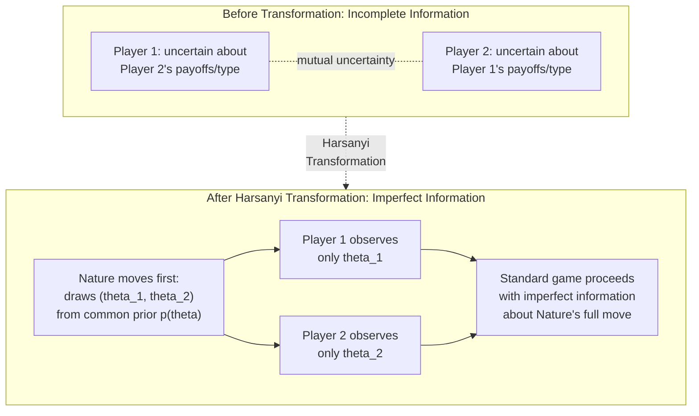

## The Harsanyi Transformation

### Definition

The **Harsanyi transformation** is the modeling technique, introduced by John Harsanyi (1967-68), that converts a game of **incomplete information** — where players are uncertain about fundamental features of the game such as opponents' payoffs or preferences — into an equivalent game of **complete but imperfect information**, by introducing a fictitious initial move by "**Nature**" that randomly assigns each player a private **type**. This transformation is the foundational conceptual move that makes Bayesian games analytically tractable using the standard tools of extensive-form game theory.

### The Problem the Transformation Solves

Before Harsanyi's contribution, modeling incomplete information posed a deep conceptual difficulty, sometimes called the **infinite regress of beliefs** problem: if Player 1 doesn't know Player 2's payoffs, Player 1 must have some *belief* about them; but a fully rigorous analysis would also require modeling what Player 2 believes Player 1 believes about Player 2's payoffs, and what Player 1 believes about *that*, and so on, ad infinitum. Without a systematic way to close off this infinite hierarchy of beliefs, it was unclear how to even formally specify — let alone solve — a game of incomplete information.

**Key Points**

- [Inference] Harsanyi's approach is often described as elegant precisely because it sidesteps the need to explicitly construct this infinite hierarchy: by positing a single, commonly known probability distribution from which Nature draws all players' types simultaneously, the entire hierarchy of higher-order beliefs is implicitly and consistently generated in one step, rather than needing separate specification at each level.
- Subsequent work (notably by Mertens and Zamir, 1985) rigorously demonstrated the conditions under which the infinite hierarchy of beliefs can indeed always be represented by such a "universal type space," providing formal justification for why Harsanyi's simplifying device is generally without loss of rigor under the common prior assumption.

### The Transformation, Step by Step

**Step 1 — Identify the source of incomplete information.** Determine what feature of the game is uncertain: this is typically a player's payoff function, valuation, cost structure, or preferences, but formally it can be modeled as an uncertain **type** $\theta_i$ belonging to player $i$.

**Step 2 — Define the type space and prior.** Specify the set of possible types $\Theta_i$ for each player, and a **joint probability distribution** $p(\theta_1, \ldots, \theta_n)$ over the full type profile — this distribution is assumed to be **common knowledge** among all players (the **common prior assumption**).

**Step 3 — Introduce Nature's move.** Insert a new, initial "move" in the game tree, made by a fictitious player called "**Nature**," who randomly draws the type profile $\theta = (\theta_1, \ldots, \theta_n)$ according to $p(\theta)$.

**Step 4 — Assign information sets.** Each real player $i$ is placed in an information set that reveals **only their own realized type** $\theta_i$, not the types of any other player. This is what converts the game from one of *incomplete* information (uncertain payoffs) into one of *imperfect* information (uncertain about a specific, well-defined move by Nature) — a crucial conceptual distinction.

**Step 5 — Proceed with standard analysis.** Once transformed, the game is a standard extensive-form (or normal-form, if moves are simultaneous) game with imperfect information, to which standard solution concepts (Bayesian Nash equilibrium, Perfect Bayesian equilibrium) can be directly applied.

### Diagram: Before and After the Transformation

### Distinguishing Incomplete Information from Imperfect Information

**Key Points**

- **Incomplete information**: players are uncertain about the *structure* of the game itself — payoffs, available strategies, or preferences of other players (or even their own, in rarer specifications).
- **Imperfect information**: players are uncertain about a *specific move* that has already occurred within a fully and commonly known game structure — as in a card game where a player has not seen an opponent's hand, but the full rules, possible hands, and payoff structure are common knowledge.
- The Harsanyi transformation's technical achievement is precisely to **re-express incomplete information as imperfect information** by making the uncertain "structure" itself into an explicit, well-defined move by Nature within a now fully and commonly specified larger game — after the transformation, there is no longer any genuine uncertainty about the rules of the game, only about the realized outcome of Nature's single random move.

### Worked Example: Transforming an Incomplete-Information Bargaining Setup

Consider two firms negotiating a deal, where Firm 1 does not know whether Firm 2 has **high** or **low** production costs (Firm 2's private type), and this uncertainty affects the payoffs from any given deal.

**Before transformation**: "Firm 1 faces a game against an opponent whose payoff function is uncertain — it could be $u_2^{high}$ or $u_2^{low}$, with Firm 1 holding some belief about which is more likely."

**Applying the transformation**:

1. Define $\Theta_2 = \{\text{high}, \text{low}\}$, with common prior probabilities $p(\text{high}) = 0.3$, $p(\text{low}) = 0.7$ (commonly known to both firms).
2. Insert Nature's move: Nature draws Firm 2's cost type according to this distribution.
3. Firm 2 observes its own realized type (it knows its own true costs); Firm 1 does not observe Firm 2's type directly, only the common prior probabilities.
4. The bargaining game now proceeds as a standard extensive-form game with imperfect information: Firm 1's information set at its decision node spans both possible realizations of Firm 2's type (since Firm 1 cannot distinguish them), while Firm 2, at each of its own decision nodes, is in a singleton information set specific to its own realized type.

**Result**: The originally ill-specified "uncertainty about the opponent's payoffs" is now a fully rigorous extensive-form game with imperfect information, amenable to backward-induction-style reasoning restricted appropriately by the information-set structure, and solvable via Bayesian Nash equilibrium or, if the game has multiple sequential stages, Perfect Bayesian equilibrium.

### The Common Prior Assumption: Content and Critique

**Key Points**

- The Harsanyi transformation's validity as a simplifying device rests on the **common prior assumption**: all players agree on the same underlying probability distribution $p(\theta)$ over types, differing only in what they have privately observed.
- [Inference] This is sometimes philosophically justified via the "Harsanyi doctrine," which holds that any differences in players' beliefs should ultimately be traceable to differences in privately observed information, not to fundamentally different priors held even before any information is received — a view that some game theorists and philosophers of probability have contested as a substantive (rather than purely technical) assumption about the nature of rational belief formation.
- Models that explicitly relax the common prior assumption (allowing players to hold genuinely different priors even in the absence of differing information) exist in the literature but are considerably less standard, and their equilibrium implications and philosophical foundations remain a more specialized and debated area, [Speculation] partly because dropping the common prior reopens some of the very infinite-regress and consistency concerns the transformation was designed to resolve.

### Type Spaces: Finite vs. Continuous

**Key Points**

- **Finite type spaces**: each player has a finite list of possible types (e.g., "high cost" or "low cost"), with a discrete joint probability distribution — analytically simpler and common in introductory treatments and many applied models.
- **Continuous type spaces**: types are drawn from a continuum (e.g., valuations uniformly distributed on $[0,1]$, as in the auction example under Bayesian Games), requiring probability density functions rather than discrete probabilities, and typically requiring calculus-based equilibrium derivation (as in first-order conditions for optimal bidding functions).
- **Correlated vs. independent types**: the joint distribution $p(\theta)$ may specify types as statistically independent across players or correlated (e.g., in a common-value auction, where each bidder's private signal is correlated with the same underlying true value) — this distinction has substantial implications for equilibrium behavior, as highlighted by the winner's curse phenomenon in correlated/common-value settings.

### Significance and Legacy

**Key Points**

- The Harsanyi transformation is widely regarded, alongside Nash's equilibrium concept and Selten's subgame perfection, as one of the foundational conceptual advances that shaped modern non-cooperative game theory; Harsanyi shared the 1994 Nobel Memorial Prize in Economic Sciences with John Nash and Reinhard Selten specifically for this and related contributions to game-theoretic analysis of equilibria under uncertainty.
- The transformation underlies essentially all subsequent work in **auction theory**, **mechanism design**, **signaling and screening**, and **reputation effects in repeated games** (as seen in the KMRW model), since each of these areas fundamentally relies on modeling private information as a type drawn according to a common, commonly known distribution.

### Common Pitfalls

- **Conflating the transformation with a solution concept**: the Harsanyi transformation is a *modeling device* (a way of specifying the game), not itself an equilibrium concept — Bayesian Nash equilibrium (or Perfect Bayesian equilibrium for dynamic settings) is the solution concept applied *after* the transformation has been performed.
- **Forgetting that Nature's move must be commonly known in structure, even if unobserved in realization**: the *distribution* $p(\theta)$ must be common knowledge for the transformation to be well-specified; only the *realized* type draw is private information — confusing these two (e.g., assuming players don't even know the prior probabilities) breaks the standard Bayesian game framework.
- **Assuming the common prior assumption is realistic in every applied context**: as noted, this is a substantive assumption; in some applied settings (e.g., agents with genuinely different, hard-to-reconcile worldviews) it may be a strong idealization, worth flagging when precision matters.
- **Treating type spaces as necessarily finite**: many important applications (auctions, screening) require continuous type spaces and correspondingly more advanced (calculus-based) solution techniques rather than simple finite-case enumeration.

**Related Topics**

- Bayesian Games and Bayesian Nash Equilibrium
- The Common Prior Assumption and Its Critiques
- Mertens-Zamir Universal Type Spaces
- Auction Theory and the Winner's Curse
- Mechanism Design and Adverse Selection
- Signaling and Screening Games
- Perfect Bayesian Equilibrium
- Reputation Effects in Repeated Games