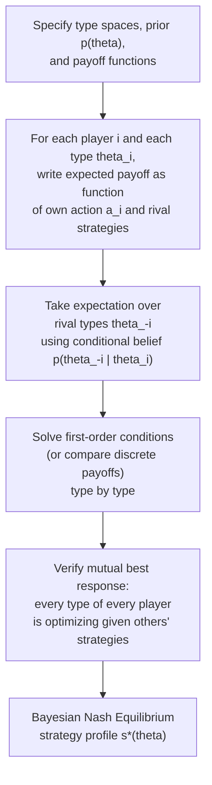

## Bayesian Nash Equilibrium

### Definition

**Bayesian Nash Equilibrium (BNE)** is the core solution concept for static (simultaneous-move) games of incomplete information. It requires that each player, for every possible realization of their own private type, chooses an action that maximizes their **expected payoff**, given their beliefs about the distribution of other players' types (derived from the common prior via Bayes' rule) and given correct anticipation of every other player's equilibrium strategy. BNE is the direct incomplete-information analogue of Nash equilibrium, applied to the game obtained after performing the Harsanyi Transformation.

### Formal Definition

Given a Bayesian game $G = \langle N, (A_i), (\Theta_i), p(\theta), (u_i) \rangle$, a strategy profile $s^* = (s_1^*, \ldots, s_n^*)$, where each $s_i^*: \Theta_i \to A_i$ maps types to actions, is a **Bayesian Nash Equilibrium** if, for every player $i$ and every type $\theta_i \in \Theta_i$ with positive probability:

$$s_i^*(\theta_i) \in \arg\max_{a_i \in A_i} \; \sum_{\theta_{-i} \in \Theta_{-i}} p(\theta_{-i} \mid \theta_i) \; u_i\big(a_i, \, s_{-i}^*(\theta_{-i}), \, \theta_i, \, \theta_{-i}\big)$$

(or the corresponding integral expression when types are continuous). Equivalently, no type of any player can achieve a strictly higher expected payoff by unilaterally deviating to a different action, given the equilibrium strategies of all other players' types.

**Key Points**

- Each **type** of each player is effectively treated as its own "virtual player" for the purposes of the best-response condition — a player with multiple possible types must specify an optimal action *for each type separately*, and each such type-specific action must independently satisfy the best-response condition.
- When types are independent across players, the conditional belief $p(\theta_{-i} \mid \theta_i)$ simplifies to the unconditional marginal distribution $p(\theta_{-i})$, since observing one's own type provides no additional information about others' types — a simplification frequently used in canonical examples (such as independent private value auctions).

### The Ex-Ante vs. Interim Perspective

**Key Points**

- **Interim perspective**: the standard perspective used in the BNE definition above — each type of each player optimizes *after* learning their own type but *before* learning others' types, taking expectations over the remaining uncertainty. This is the perspective under which the best-response condition is actually checked, type by type.
- **Ex-ante perspective**: a hypothetical perspective *before* any player learns their own type, used mainly for welfare comparisons (e.g., computing expected total surplus across all possible type realizations) rather than for defining equilibrium behavior itself.
- [Inference] This interim/ex-ante distinction is important because a strategy profile that looks "optimal in expectation across all type realizations" (ex-ante efficient) is not the same requirement as being a best response for *every individual type* (interim optimal, the actual BNE requirement) — a profile can satisfy one without satisfying the other in specific constructed examples, though this subtlety is often glossed over in introductory treatments.

### Worked Example: A Bayesian Game with Discrete Types

Consider a simple entry-deterrence-style Bayesian game. An entrant (Player 1) decides whether to **Enter** or **Stay Out** of a market. An incumbent (Player 2) has a privately known type: **Strong** (probability $0.5$) or **Weak** (probability $0.5$), which affects the incumbent's payoff from fighting versus accommodating entry.

| Entrant \ Incumbent Type | Strong: Fight | Strong: Accommodate | Weak: Fight | Weak: Accommodate |
| --- | --- | --- | --- | --- |
| **Enter** | $(-1, 2)$ | $(1, 1)$ | $(-1, 0)$ | $(1, 1)$ |
| **Stay Out** | $(0, 4)$ | $(0, 4)$ | $(0, 2)$ | $(0, 2)$ |

Here, the incumbent's strategy must be specified per type: $s_2(\text{Strong}) \in \{\text{Fight}, \text{Accommodate}\}$ and $s_2(\text{Weak}) \in \{\text{Fight}, \text{Accommodate}\}$, while the entrant, not observing the incumbent's type, chooses a single action based on expected payoff.

**Step 1 — Determine each incumbent type's dominant strategy** (conditional on entry occurring, since the incumbent's choice only matters if entry happens): a Strong incumbent prefers Accommodate ($2 > $ wait, compare Fight's payoff $2$ vs Accommodate's payoff $1$ — actually Fight gives the Strong incumbent $2$, Accommodate gives $1$, so **Strong incumbent prefers to Fight**). A Weak incumbent compares Fight ($0$) versus Accommodate ($1$), so **Weak incumbent prefers to Accommodate**.

**Step 2 — Compute the entrant's expected payoff from Entering**, given the incumbent plays Fight if Strong and Accommodate if Weak:

$$E[\text{payoff} \mid \text{Enter}] = 0.5 \times (-1) + 0.5 \times (1) = 0$$

**Step 3 — Compare to Staying Out**, which guarantees a payoff of $0$ regardless of the incumbent's type.

**Step 4 — Identify the equilibrium**: since $E[\text{payoff} \mid \text{Enter}] = 0 = \text{payoff from Staying Out}$, the entrant is indifferent in this exact numerical specification — in a strict version of this example (with payoffs adjusted so entry is strictly worse in expectation, e.g., a slightly more costly Fight outcome), the entrant would strictly prefer Stay Out, and the resulting BNE would be: Incumbent plays (Fight if Strong, Accommodate if Weak); Entrant plays Stay Out.

**Key Points**

- This example illustrates the essential BNE logic: the incumbent's optimal action is determined *type by type* (each type independently maximizing its own payoff given the entrant's action), while the entrant's single action must be optimal *in expectation* over the incumbent's unobserved type, using the correctly anticipated type-contingent incumbent strategy.
- This kind of entry-deterrence Bayesian game is a stylized version of models used to study how uncertainty about a rival's cost structure or resolve affects strategic entry decisions.

### Existence of Bayesian Nash Equilibrium

**Key Points**

- Because a Bayesian game, via the Harsanyi Transformation, reduces to a standard (larger) game with a finite (or appropriately well-behaved continuous) strategy space, **standard Nash equilibrium existence results apply directly**: for finite Bayesian games (finite type spaces and finite action sets), a Bayesian Nash equilibrium in (possibly mixed) strategies always exists, by the same fixed-point argument (Kakutani/Nash) underlying general Nash equilibrium existence.
- For continuous type and action spaces (as in the auction example under Bayesian Games), existence typically requires additional regularity conditions (e.g., continuity and appropriate concavity/quasi-concavity of payoffs in own action), analogous to the conditions needed for Nash equilibrium existence in continuous complete-information games.

### Worked Example: Cournot Duopoly with Private Cost Information

Consider two firms competing in quantities (Cournot competition), where each firm's marginal cost $c_i$ is privately known (drawn independently from some distribution) and unknown to the rival firm. Each firm chooses a quantity $q_i(c_i)$ as a function of its own realized cost, to maximize expected profit given the rival's (correctly anticipated) cost-contingent quantity strategy $q_j(c_j)$.

**Key Points**

- [Inference] The general solution technique involves each firm's first-order condition for profit maximization, taking an expectation over the unknown rival cost $c_j$ (via the rival's equilibrium strategy function), and then solving the resulting system of "best-response functionals" for the equilibrium strategy functions $q_1(\cdot)$ and $q_2(\cdot)$ simultaneously — this is analytically more involved than the complete-information Cournot case, since the unknowns are entire *functions* (strategies mapping cost to quantity) rather than single numbers.
- This class of model underlies applied work on how private cost information affects market competitiveness and is a standard building block in industrial organization courses covering incomplete information.

### Diagram: Solving for BNE

### Relationship to Ex-Post Equilibrium

**Key Points**

- A stronger (and less commonly satisfied) related concept is **ex-post equilibrium**: a strategy profile that remains a best response even if a player were to learn the *realized* types of all other players after choosing their action (i.e., no regret even with full hindsight information). Ex-post equilibrium is a demanding refinement primarily relevant in specific mechanism-design contexts (e.g., certain robust auction formats); ordinary BNE only requires optimality *in expectation*, not for every possible ex-post realization.
- [Inference] Most standard applications (auctions, Cournot competition with private costs, entry games) rely on ordinary BNE rather than the stronger ex-post equilibrium concept, since ex-post equilibria typically fail to exist except in specially structured settings (e.g., private values with certain independence properties).

### Applications

- **Auction theory**: as detailed under Bayesian Games, BNE is the standard equilibrium concept for deriving optimal bidding strategies across auction formats (first-price, second-price, all-pay).
- **Oligopoly with private information**: Cournot or Bertrand competition where firms have private cost or demand information, as illustrated above.
- **Public goods and voting games**: models of voter turnout or public goods contribution under uncertainty about others' preferences or valuations frequently use BNE as the solution concept.
- **Insurance and screening markets**: models of adverse selection in insurance (where insurers face applicants of privately known risk type) use BNE-style reasoning, often combined with mechanism design tools, to characterize market outcomes (e.g., the Rothschild-Stiglitz model of separating equilibria in insurance markets).

### Common Pitfalls

- **Confusing "optimal for the average type" with "optimal for every type"**: BNE requires the best-response condition to hold **separately for each type** with positive probability, not merely in some aggregated or averaged sense across all types.
- **Ignoring belief updating when types are correlated**: when types are correlated across players (not independent), the conditional belief $p(\theta_{-i} \mid \theta_i)$ differs from the unconditional marginal, and using the wrong (unconditional) distribution is a common computational error, particularly relevant in common-value settings prone to the winner's curse.
- **Assuming uniqueness**: like standard Nash equilibrium, Bayesian games can have multiple BNE; identifying "the" equilibrium in an applied model typically requires additional assumptions (e.g., focusing on symmetric, pure-strategy, or monotone equilibria) to select among possibly multiple candidates.
- **Applying BNE to dynamic, multi-stage incomplete-information games without further refinement**: as with standard Nash equilibrium in dynamic complete-information games, BNE alone does not rule out non-credible strategies off the equilibrium path in sequential settings; Perfect Bayesian Equilibrium or Sequential Equilibrium is required once the game involves multiple sequential decision points with belief updating over time.

**Related Topics**

- The Harsanyi Transformation
- Bayesian Games
- Auction Theory and Bid Shading
- Cournot Competition Under Incomplete Information
- Ex-Post Equilibrium and Robust Mechanism Design
- Perfect Bayesian Equilibrium
- Adverse Selection and the Rothschild-Stiglitz Model
- The Winner's Curse in Common-Value Settings