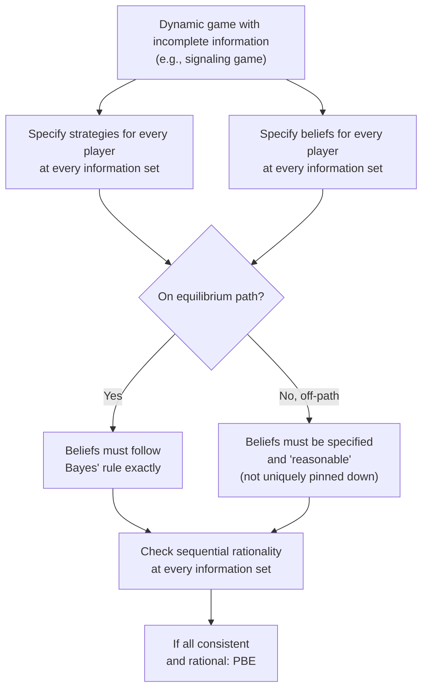

## Perfect Bayesian Equilibrium

### Definition

**Perfect Bayesian Equilibrium (PBE)** is the standard solution concept for **dynamic** (multi-stage, sequential-move) games of incomplete information. It extends Bayesian Nash Equilibrium by requiring not only that strategies be expected-payoff-maximizing given beliefs, but also that players' **beliefs** about others' types be updated consistently over the course of play — via Bayes' rule wherever possible — and that strategies be **sequentially rational** at every information set, both on and off the equilibrium path. PBE is the incomplete-information analogue of subgame perfect equilibrium, adapted to handle information sets that are not singletons.

### Motivation: Why BNE Is Insufficient for Dynamic Games

Bayesian Nash Equilibrium, as covered previously, is well-suited to **static** (simultaneous-move) incomplete-information games, but it says nothing about how beliefs should evolve as a dynamic game unfolds, nor does it rule out non-credible behavior off the equilibrium path — the same basic limitation that motivated the move from Nash equilibrium to subgame perfect equilibrium in complete-information dynamic games. In an incomplete-information dynamic setting, this problem is compounded: not only must non-credible threats be ruled out, but players' **beliefs** about opponents' types must themselves be pinned down at every information set — including those that are never reached in equilibrium — since a player's optimal action at an information set generally depends on what they believe about the type(s) of the player(s) who moved previously.

### The Four Formal Requirements of PBE

A strategy profile together with a system of beliefs constitutes a Perfect Bayesian Equilibrium if it satisfies four conditions (following the standard formulation, e.g., as in Fudenberg and Tirole, 1991):

**1. Sequential rationality**: At every information set, each player's strategy must be optimal given their beliefs at that information set and the strategies of all other players, in every continuation of the game (not just along the equilibrium path).

**2. Bayesian belief updating (on-path)**: Wherever an information set is reached with positive probability under the equilibrium strategy profile, beliefs at that information set must be derived from the prior and the equilibrium strategies via **Bayes' rule**.

**3. Belief consistency off-path**: At information sets reached with **zero probability** under the equilibrium strategies (off-path information sets), beliefs must still be specified, but Bayes' rule does not pin them down uniquely (since it involves dividing by zero); beliefs here must be "reasonable" in some specified sense (this is where PBE's formal requirements are the least restrictive, and where the stronger refinement of Sequential Equilibrium adds further discipline via the "trembles" or consistency requirement).

**4. Consistency across information sets**: Beliefs at different information sets belonging to the same player, or connected via the equilibrium path, must be mutually consistent with a single, coherent updating process, not independently and arbitrarily assigned.

**Key Points**

- Condition 3 (off-path beliefs) is frequently the source of ambiguity and the focus of most advanced refinements in this area (e.g., the Cho-Kreps Intuitive Criterion for signaling games, which further restricts which off-path beliefs are deemed "reasonable").
- [Inference] PBE is generally considered a weaker, more permissive equilibrium concept than the closely related **Sequential Equilibrium** (Kreps and Wilson, 1982), which imposes a more technically demanding consistency requirement on off-path beliefs (requiring that beliefs be limits of beliefs generated by sequences of fully mixed "trembling" strategies); in many standard applied games, however, the two concepts coincide or are used relatively interchangeably.

### Diagram: PBE Requirements in a Sequential Game

### Canonical Application: Signaling Games

The most important class of applications for PBE is the **signaling game**, where an informed player (the **Sender**) with a privately known type takes an observable action (a **signal**), and an uninformed player (the **Receiver**) observes the signal, updates beliefs about the Sender's type via Bayes' rule, and responds.

**Formal structure**:

1. Nature draws the Sender's type $\theta \in \Theta$ according to a commonly known prior $p(\theta)$.
2. The Sender, observing their own type, chooses a signal (message or action) $m \in M$.
3. The Receiver observes $m$ (but not $\theta$ directly), forms a posterior belief $\mu(\theta \mid m)$ via Bayes' rule, and chooses a response $a \in A$.
4. Payoffs $u_S(\theta, m, a)$ and $u_R(\theta, m, a)$ are realized.

**Key Points**

- PBE in a signaling game requires: (i) the Sender's signal choice is optimal for their type, given the Receiver's anticipated response; (ii) the Receiver's response is optimal given their posterior beliefs; (iii) the Receiver's posterior beliefs are derived via Bayes' rule from the Sender's equilibrium signaling strategy, wherever the observed signal occurs with positive probability under that strategy.

### Types of Signaling Equilibria: Separating, Pooling, and Semi-Separating

**Separating equilibrium**: different Sender types choose **different** signals, so the Receiver can perfectly infer the Sender's type upon observing the signal (posterior beliefs become degenerate — probability $1$ on the true type).

**Pooling equilibrium**: all Sender types choose the **same** signal, so the Receiver's posterior beliefs upon observing that signal remain equal to the prior (no information is revealed).

**Semi-separating (partially pooling) equilibrium**: some types randomize between signals shared with other types and signals unique to themselves, producing intermediate, non-degenerate posterior updating.

**Key Points**

- Whether a separating, pooling, or semi-separating equilibrium emerges (and which of potentially several is selected) depends on the specific payoff structure and cost differentials across types — an important applied modeling question in each specific context.

### Worked Example: Spence's Job Market Signaling Model

Michael Spence's classic 1973 model treats **education** as a costly signal of unobserved worker productivity.

**Setup**: A worker's type is either High ability ($H$) or Low ability ($L$), each with prior probability $0.5$. The worker chooses an education level $e \geq 0$, at a cost $c(e, \theta)$ that is **lower for high-ability workers** (the crucial "single-crossing" condition: $\frac{\partial c}{\partial e}\Big|_{H} < \frac{\partial c}{\partial e}\Big|_{L}$, meaning education is relatively cheaper to acquire for high-ability types). A firm (Receiver), observing only the education level (not the worker's true ability), pays a wage equal to the expected productivity conditional on the observed education signal.

**Step 1 — Candidate separating equilibrium**: suppose High types choose $e = e^*$ and Low types choose $e = 0$, with the firm paying a high wage $w_H$ for $e = e^*$ and a low wage $w_L$ for $e = 0$.

**Step 2 — Incentive compatibility for High types**: the wage premium from acquiring education $e^*$ must exceed the (low) cost of education for the High type:

$$w_H - c(e^*, H) \geq w_L$$

**Step 3 — Incentive compatibility for Low types (deterrence condition)**: the Low type must **not** want to mimic the High type by also acquiring $e^*$, i.e., the cost of $e^*$ for a Low type must exceed the wage premium:

$$w_L \geq w_H - c(e^*, L)$$

**Step 4 — Combine conditions**: for a separating equilibrium to exist, there must be an education level $e^*$ satisfying both inequalities simultaneously, which — given the single-crossing condition (education cheaper for High types) — defines a **range** of possible separating equilibrium education levels, not a single unique value.

**Key Points**

- This model produces a striking and famous economic insight: education can function as a valuable **signal** of ability and raise the signaler's wage **even if education itself adds zero direct productive value** — the pure signaling/sorting function alone can rationalize costly educational investment as an equilibrium phenomenon.
- [Inference] The resulting **multiplicity of separating equilibria** (many possible values of $e^*$ can satisfy the incentive constraints) is a standard feature of signaling models and has motivated significant subsequent literature on equilibrium refinement (e.g., the Cho-Kreps Intuitive Criterion, which typically selects the **least-cost separating equilibrium**, sometimes called the **Riley outcome**, as the most plausible prediction among the multiple PBE).

### The Cho-Kreps Intuitive Criterion (Brief Overview)

**Key Points**

- Because PBE's off-path belief requirements are relatively permissive, signaling games frequently admit multiple PBE, including implausible pooling equilibria sustained only by "unreasonable" off-path beliefs (e.g., the Receiver believing that any deviation to an unexpected signal must come from the *worst* possible type, even when this belief makes no sense given the payoff structure).
- The **Intuitive Criterion** (In-Koo Cho and David Kreps, 1987) refines PBE by requiring that off-path beliefs place zero probability on any type for whom the deviation could **never** be profitable (for any belief the Receiver might hold in response), effectively ruling out certain implausible pooling equilibria and typically narrowing the equilibrium set toward the least-cost separating outcome in canonical signaling models like Spence's.

### Applications

- **Labor economics**: education signaling (Spence), as detailed above, remains a foundational application shaping how economists interpret the returns to education.
- **Finance and corporate signaling**: firms' choices of capital structure, dividend policy, or IPO underpricing are frequently modeled as signals of unobserved firm quality to outside investors (e.g., Ross's 1977 signaling model of capital structure).
- **Product quality and warranties**: firms offering costly warranties as a credible signal of product quality (since offering a generous warranty is more costly for a firm producing low-quality, failure-prone goods).
- **Political economy and cheap talk**: models of political candidates' policy announcements, campaign spending as costly signaling, and strategic communication more broadly draw heavily on the signaling-game/PBE framework (including related "cheap talk" models, e.g., Crawford and Sobel 1982, where signals are costless rather than costly, yielding different equilibrium structures).
- **Reputation effects in repeated games**: the KMRW model (covered under Reputation Effects) is itself formally a PBE of a repeated game with incomplete information about player type, with beliefs about "commitment type" versus "rational type" updated via Bayes' rule at each stage.

### Relationship to Other Equilibrium Concepts

| Concept | Handles Dynamic Moves? | Handles Incomplete Information? | Belief Consistency Requirement |
| --- | --- | --- | --- |
| Nash Equilibrium | No | No | None |
| Subgame Perfect Equilibrium | Yes | No | None (complete info, no beliefs needed) |
| Bayesian Nash Equilibrium | No | Yes | Prior-based, static only |
| Perfect Bayesian Equilibrium | Yes | Yes | Bayes' rule on-path; "reasonable" off-path |
| Sequential Equilibrium | Yes | Yes | Stronger: consistency via trembling-hand limits |

### Common Pitfalls

- **Neglecting to specify off-path beliefs entirely**: a common error in constructing a PBE is to define strategies and on-path beliefs but forget that off-path information sets still require an explicit (if less constrained) belief specification for the sequential rationality check to be complete.
- **Assuming off-path beliefs can be arbitrary**: while Bayes' rule does not uniquely pin down off-path beliefs, they are not entirely unconstrained either — advanced refinements like the Intuitive Criterion place substantive, economically motivated restrictions on which off-path beliefs are admissible.
- **Failing to check for multiple equilibria**: signaling games are notorious for supporting many PBE (multiple separating, pooling, and semi-separating equilibria); a complete analysis should characterize the full equilibrium set or explicitly justify a refinement used to select among them.
- **Confusing signaling (costly, informative actions) with cheap talk (costless communication)**: these are related but distinct model classes with different equilibrium properties (cheap talk equilibria, per Crawford-Sobel, are characterized by partition structures rather than the separating/pooling dichotomy of costly signaling).

**Related Topics**

- Bayesian Nash Equilibrium
- The Harsanyi Transformation
- Sequential Equilibrium
- Signaling Games and Spence's Education Model
- The Cho-Kreps Intuitive Criterion
- Cheap Talk Games (Crawford-Sobel)
- Reputation Effects in Repeated Games
- Screening and Mechanism Design