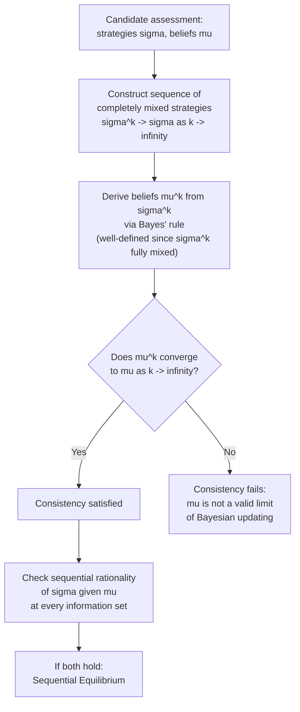

## Sequential Equilibrium

### Definition

**Sequential Equilibrium**, introduced by David Kreps and Robert Wilson (1982), is a refinement of Perfect Bayesian Equilibrium that imposes a more technically rigorous consistency requirement on beliefs at every information set, including those never reached along the equilibrium path. Rather than requiring off-path beliefs to be merely "reasonable" (as in the looser standard PBE formulation), Sequential Equilibrium requires that the entire system of beliefs be **consistent** in a precise sense: derivable as the limit of beliefs generated by a sequence of fully mixed ("trembling-hand") strategy profiles converging to the equilibrium strategies.

### Motivation: Tightening the Off-Path Belief Requirement

As established under Perfect Bayesian Equilibrium, PBE's formal requirements leave considerable latitude in specifying beliefs at information sets that are never reached in equilibrium (off-path information sets), since Bayes' rule cannot pin these down (it would require dividing by a zero probability of reaching that information set). This latitude, while making PBE a tractable and widely applicable concept, can permit some belief assignments that seem intuitively arbitrary or economically unmotivated — Sequential Equilibrium was developed specifically to impose additional discipline on exactly this off-path belief specification, without abandoning the general framework of sequentially rational strategies paired with a system of beliefs.

### Formal Structure: Assessments

A **Sequential Equilibrium** is defined as an **assessment** $(\sigma, \mu)$, consisting of:

- $\sigma$: a (behavior) **strategy profile**, specifying a probability distribution over actions at every information set for every player.
- $\mu$: a **system of beliefs**, specifying a probability distribution over the nodes within every information set, for every information set in the game.

satisfying two conditions:

**1. Sequential rationality**: given the beliefs $\mu$, the strategy $\sigma$ must be optimal for every player at every information set, taking into account the beliefs about which node within that information set has actually been reached.

**2. Consistency**: the assessment $(\sigma, \mu)$ must be the limit of a sequence of assessments $(\sigma^k, \mu^k)$, where each $\sigma^k$ is a **completely mixed** strategy profile (every action at every information set is played with strictly positive probability) and $\mu^k$ is derived from $\sigma^k$ via Bayes' rule (which is always well-defined for a completely mixed strategy, since every information set is then reached with positive probability), and $(\sigma^k, \mu^k) \to (\sigma, \mu)$ as $k \to \infty$.

**Key Points**

- The consistency condition is the technical heart of the refinement: it operationalizes the intuitive idea that even "impossible," off-path beliefs should represent a sensible limit of what a rational player would believe if there were a small, vanishing probability of "trembling" into that off-path information set — this is conceptually similar in spirit to Selten's trembling-hand perfect equilibrium for complete-information games, but adapted to the belief-systems framework needed for incomplete-information dynamic games.
- [Inference] This consistency requirement, while conceptually appealing, is also known to be technically demanding to verify directly in complex games, since it requires exhibiting an explicit converging sequence of fully mixed strategies and their associated Bayesian-updated beliefs — in practice, many applied papers verify sequential rationality and argue informally for consistency, or rely on the fact that PBE and Sequential Equilibrium coincide in many standard signaling and screening game structures.

### Diagram: Constructing a Sequential Equilibrium via Trembles

### Relationship to Perfect Bayesian Equilibrium

**Key Points**

- **Every Sequential Equilibrium is a Perfect Bayesian Equilibrium**, but the converse does not always hold: Sequential Equilibrium's consistency requirement is strictly stronger than the looser "reasonable beliefs" criterion typically used to define PBE, so Sequential Equilibrium can rule out some PBE that fail to arise as trembling-hand limits.
- [Inference] In practice, particularly in the canonical two-stage signaling games most commonly used in economics courses and applications (e.g., Spence's education model), the sets of Sequential Equilibria and (appropriately refined) Perfect Bayesian Equilibria frequently coincide, since the class of games typically studied is often simple enough that the additional discipline of the consistency requirement does not further restrict the equilibrium set beyond what sensible PBE refinements (like the Intuitive Criterion) already achieve — however, this coincidence is not guaranteed in general and should be checked on a game-by-game basis for more complex extensive forms.
- Sequential Equilibrium is generally considered technically well-founded and complete as an extension of subgame perfection to incomplete-information settings, but its verification complexity has made the somewhat less formally demanding Perfect Bayesian Equilibrium the more commonly applied concept in much of the mainstream applied economics literature, particularly in textbook treatments.

### Sequential Equilibrium vs. Trembling-Hand Perfect Equilibrium

**Key Points**

- **Trembling-hand perfect equilibrium** (Selten, 1975) is the direct precursor concept for **complete-information** extensive-form games: it requires the equilibrium strategy profile to remain a best response even when all players face a small, vanishing probability of "trembling" into any action by mistake.
- Sequential Equilibrium can be understood as the natural generalization of this trembling-hand idea to games where beliefs about **types** (not just about others' possible mistakes) must also be specified and shown to arise as limits of a well-defined convergent process — the core mathematical machinery (sequences of fully mixed strategies converging to the equilibrium) is closely related across both concepts, though Sequential Equilibrium explicitly incorporates the belief-system component necessary for incomplete-information games.

### Worked Example: Distinguishing Consistent from Inconsistent Off-Path Beliefs

Consider a simple signaling game (as introduced under Perfect Bayesian Equilibrium) with two Sender types, $H$ and $L$, and two possible signals, $m_1$ and $m_2$. Suppose a candidate pooling equilibrium has both types sending $m_1$, leaving $m_2$ off the equilibrium path.

**Checking consistency of an off-path belief at $m_2$**: suppose the candidate assessment specifies that, upon observing $m_2$ (never sent in equilibrium), the Receiver believes with certainty that the Sender is type $L$ (i.e., $\mu(\theta = L \mid m_2) = 1$).

To check whether this belief is consistent, one must ask: is there a sequence of fully mixed strategies $\sigma^k$ — where both types send $m_2$ with some small, vanishing probability $\epsilon^k \to 0$ — such that the Bayes'-rule-derived posterior $\mu^k(\theta = L \mid m_2)$ converges to $1$ as $k \to \infty$? [Inference] If, for instance, the trembling probabilities of sending $m_2$ are specified to vanish at the *same rate* for both types (e.g., both types tremble into $m_2$ with the identical vanishing probability $\epsilon^k$), the resulting limiting belief would simply equal the prior probability of type $L$, not degenerate certainty — in that case, the originally proposed off-path belief ($\mu = 1$ on type $L$) would **fail** the consistency requirement unless it can be supported by some *other*, differentially-vanishing sequence of trembles (e.g., type $H$'s trembling probability toward $m_2$ vanishing faster than type $L$'s, which is a legitimate and often exploitable degree of freedom in constructing consistent beliefs).

**Key Points**

- This example illustrates the genuinely technical nature of verifying consistency: the same *qualitative* off-path belief can be consistent or inconsistent depending on the specific *relative rates* at which different types' trembling probabilities are assumed to vanish — a substantially more intricate exercise than simply asserting a "reasonable-sounding" off-path belief, as looser PBE treatments sometimes do.

### Existence

**Key Points**

- Kreps and Wilson's original 1982 paper establishes that **every finite extensive-form game with (possibly incomplete) information has at least one Sequential Equilibrium** — an existence result directly paralleling Nash's and Selten's existence theorems for their respective equilibrium concepts, and providing formal assurance that the refinement, despite its added technical stringency, does not risk failing to identify any equilibrium at all in finite games.

### Applications and Practical Use

- **Signaling and screening games**: Sequential Equilibrium (or PBE refined via the Intuitive Criterion, which often coincides with it) is the standard tool for rigorously justifying which of potentially many candidate equilibria in models like Spence's education-signaling model should be considered plausible.
- **Reputation models in repeated games**: rigorous treatments of the KMRW reputation-effects model (covered under Reputation Effects) formally rely on Sequential Equilibrium (or the closely related and largely overlapping Perfect Bayesian Equilibrium with well-justified beliefs) to establish the precise belief-updating dynamics that sustain cooperative behavior over most of a finite horizon.
- **Bargaining under incomplete information**: dynamic bargaining models with private information about reservation values often use Sequential Equilibrium to ensure that proposed strategies remain robust to careful scrutiny of off-path beliefs following unexpected offers or rejections.

### Common Pitfalls

- **Treating "reasonable-sounding" off-path beliefs as automatically consistent**: as the worked example shows, consistency is a precise mathematical requirement about limits of Bayesian updating along fully mixed strategy sequences, not simply a matter of the belief seeming intuitively sensible — a belief can seem economically well-motivated yet fail the formal consistency test, or vice versa.
- **Conflating Sequential Equilibrium with Perfect Bayesian Equilibrium**: while the two concepts frequently coincide in standard applied models, they are formally distinct, with Sequential Equilibrium imposing the strictly stronger consistency requirement; using the terms interchangeably without noting this distinction can obscure important technical differences in more complex games.
- **Underestimating the complexity of verifying consistency in large or complex games**: for games with many players, types, or stages, explicitly constructing the required converging sequence of fully mixed strategies can be highly involved; many applied treatments therefore focus on sequential rationality checks and cite general existence/coincidence results rather than performing the full consistency verification from first principles.
- **Behavior may vary**: the specific equilibrium (or equilibria) selected as sequentially rational and consistent can be sensitive to fine details of the extensive-form game's structure (e.g., exact timing of moves, precise specification of information sets), so conclusions drawn from one specific game formulation should not be assumed to generalize automatically to superficially similar but structurally different variants.

**Related Topics**

- Perfect Bayesian Equilibrium
- Trembling-Hand Perfect Equilibrium
- Signaling Games and the Cho-Kreps Intuitive Criterion
- Reputation Effects in Repeated Games
- The Harsanyi Transformation and Bayesian Games
- Extensive-Form Games and Subgame Perfect Equilibrium
- Bargaining Under Incomplete Information