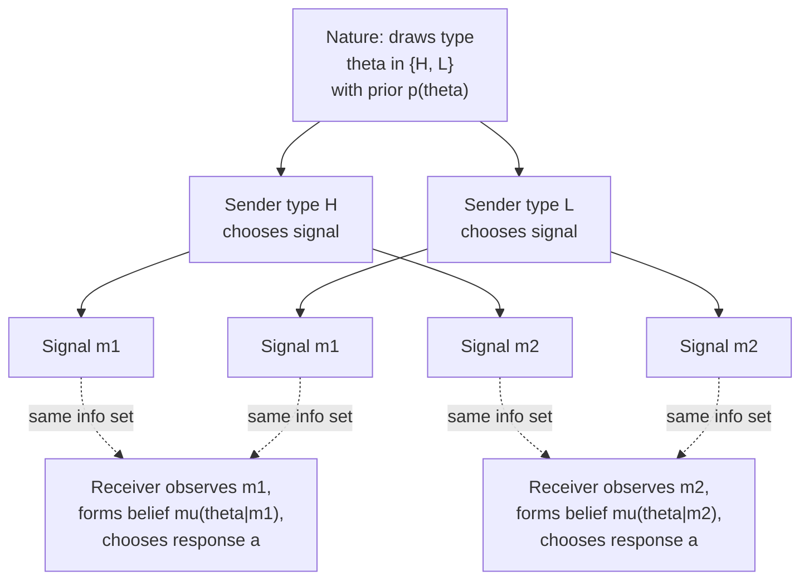

## Signaling Games

### Definition

A **signaling game** is a dynamic game of incomplete information in which an informed party (the **Sender**) possesses private information (a **type**) and takes an observable action (a **signal**) before an uninformed party (the **Receiver**) responds. Because the signal is potentially **costly** and its cost may vary systematically with the Sender's type, the signal can credibly convey information about the Sender's type even though the Sender might have an incentive to misrepresent it — the central strategic question in every signaling game is precisely *when* and *how* such credible information transmission is possible in equilibrium.

### Formal Structure

A canonical signaling game unfolds in four stages:

1. **Nature moves**: draws the Sender's type $\theta$ from a finite (or continuous) type space $\Theta$, according to a commonly known prior distribution $p(\theta)$.
2. **Sender observes own type and signals**: the Sender, knowing $\theta$, chooses a signal $m \in M$ (a message or costly action).
3. **Receiver observes signal and responds**: the Receiver, observing $m$ but not $\theta$ directly, forms a posterior belief $\mu(\theta \mid m)$ via Bayes' rule (where possible) and chooses a response $a \in A$.
4. **Payoffs realize**: both players receive payoffs $u_S(\theta, m, a)$ and $u_R(\theta, m, a)$, which depend on the Sender's true type, the signal sent, and the Receiver's response.

The equilibrium concept applied is **Perfect Bayesian Equilibrium** (or the closely related Sequential Equilibrium), as introduced previously, since the game is both dynamic and features incomplete information requiring belief updating at the Receiver's information set.

### The Single-Crossing Property

The pivotal structural condition determining whether informative signaling is possible is the **single-crossing property** (also called the **sorting condition**): different Sender types must have systematically different marginal costs (or benefits) of signaling, such that the trade-off between signal cost and signal benefit differs monotonically across types.

$$\frac{\partial}{\partial \theta} \left( \frac{\partial c(m, \theta) / \partial m}{\text{marginal benefit of } m} \right) \neq 0 \quad \text{(monotonic in a consistent direction across types)}$$

**Key Points**

- In Spence's education-signaling model (introduced under Perfect Bayesian Equilibrium), the single-crossing property takes the concrete form that education is **less costly at the margin for high-ability types**, which is precisely what allows education to function as a credible, separating signal despite adding no direct productivity value.
- Without single-crossing (e.g., if all types faced identical signaling costs), no signal could ever credibly separate types, since every type would have identical incentives to mimic any other type's chosen signal — separation would then be impossible in any equilibrium, and only pooling equilibria (or babbling in cheap-talk variants) could arise.

### Types of Equilibria: Separating, Pooling, Semi-Separating

**Separating equilibrium**: distinct types choose **distinct** signals, fully revealing type to the Receiver. Requires that each type finds its own designated signal optimal, given the Receiver's type-revealing response, and finds mimicking any other type's signal unprofitable (the incentive-compatibility conditions, as derived in the Spence model example).

**Pooling equilibrium**: all types choose the **same** signal, revealing no additional information; the Receiver's posterior beliefs upon observing the pooling signal equal the prior. Off-path beliefs (following any signal not sent in the pooling equilibrium) must be specified to support the pooling outcome as a PBE, and are frequently the target of equilibrium refinements like the Intuitive Criterion.

**Semi-separating (hybrid) equilibrium**: some, but not all, types **randomize** between signals also used by other types and signals used uniquely by themselves, generating partial (non-degenerate but non-fully-revealing) belief updating.

**Key Points**

- Signaling games frequently admit **multiple** equilibria of different types simultaneously (e.g., several separating equilibria differing in the exact signal level chosen, plus one or more pooling equilibria), a multiplicity problem that motivates the equilibrium refinement literature discussed below.

### Diagram: Signaling Game Extensive Form

### Worked Example: Beer-Quiche Signaling Game

A well-known pedagogical example (Cho and Kreps, 1987) involves a Sender who is either **Wimpy** (probability $0.1$) or **Surly** (probability $0.9$), choosing between having **Beer** or **Quiche** for breakfast; a Receiver (potential duelist) observes the breakfast choice and decides whether to **Duel** or **Not Duel**. Surly types prefer Beer intrinsically; Wimpy types prefer Quiche intrinsically; both types strongly prefer avoiding a duel.

**Candidate pooling equilibrium 1**: both types choose Beer; the Receiver, upon observing Beer, believes the Sender is Surly with probability $0.9$ (matching the prior) and chooses Not Duel (since dueling is unattractive against a likely-Surly opponent); if the Receiver observes the off-path signal Quiche, an off-path belief that the Sender is Wimpy would rationalize a Duel response, which is sufficient to deter deviation to Quiche — this is a valid PBE.

**Candidate pooling equilibrium 2**: symmetric to the above, with both types choosing Quiche, sustained by an off-path belief following Beer that similarly rationalizes dueling.

**Applying the Intuitive Criterion**: [Inference] Cho and Kreps use this example specifically to demonstrate that one of these pooling equilibria (typically the Quiche-pooling equilibrium in the standard exposition) survives the Intuitive Criterion refinement while the other does not, because in the surviving equilibrium, the off-path deviation to Beer could **never** benefit the Wimpy type under any belief the Receiver might hold, making the off-path belief that "a Beer-deviator must be Surly" the only economically sensible one — this selectively eliminates the less plausible pooling equilibrium and is the canonical textbook illustration of the refinement's practical bite.

### Job Market Signaling (Spence Model) — Summary Cross-Reference

**Key Points**

- As detailed under Perfect Bayesian Equilibrium, Spence's (1973) education-signaling model is the paradigmatic economic application of signaling game theory: education level serves as the signal, worker ability is the private type, and the single-crossing property (lower marginal cost of education for high-ability workers) is what enables separating equilibria to exist — with the **least-cost separating equilibrium** (the "Riley outcome") typically identified as the most plausible prediction once standard refinements are applied.

### Signaling vs. Cheap Talk

**Key Points**

- **Signaling** (as covered here) involves **costly** actions, where the cost structure differs by type (single-crossing), enabling credible information transmission even when interests are partially misaligned.
- **Cheap talk** (Crawford and Sobel, 1982) involves **costless** messages with no direct payoff consequence from the message itself; credible information transmission in cheap-talk games instead depends on the degree of **preference alignment** between Sender and Receiver, and equilibria typically take the form of coarse **partitions** of the type space (the Sender's message reveals only which interval/partition element their type falls into, not the exact type) — informativeness increases as Sender and Receiver preferences become more closely aligned, with fully informative communication achievable only in the limiting case of perfectly aligned preferences.
- This is a fundamentally distinct model class from costly signaling, despite superficial similarity (both involve an informed party communicating to an uninformed party), and the two should not be conflated when selecting a modeling framework for a given applied question.

### Applications

- **Labor markets**: education as a signal of ability (Spence).
- **Finance**: corporate capital structure and dividend policy as signals of firm quality to investors (e.g., Ross, 1977); IPO underpricing as a costly signal by issuers of high-quality firms.
- **Product markets**: warranties, advertising expenditure, and brand-building as costly signals of unobserved product quality (e.g., Milgrom and Roberts, 1986, on advertising as a signal).
- **Biology and evolutionary game theory**: costly signaling theory (e.g., the "handicap principle" in evolutionary biology, associated with Amotz Zahavi) applies closely related logic to explain costly biological traits (e.g., elaborate peacock tail displays) as credible signals of underlying fitness, since only genuinely fit individuals can afford the fitness cost of the display.
- **Political economy**: costly campaign spending, policy commitments, and public displays of resolve as signals of a politician's or nation's true underlying type or intentions.

### Common Pitfalls

- **Confusing costly signaling with cheap talk**: as emphasized above, these are structurally distinct models with different equilibrium mechanics (single-crossing-driven separation vs. preference-alignment-driven partition equilibria); applying signaling-game intuitions to a genuinely costless-communication setting (or vice versa) is a frequent conceptual error.
- **Overlooking the single-crossing requirement**: assuming any privately-informed dynamic interaction automatically supports informative separating equilibria, without verifying that the relevant cost/benefit structure actually satisfies single-crossing, can lead to incorrectly concluding that separation is possible when it is not.
- **Ignoring equilibrium multiplicity**: presenting a single separating (or pooling) equilibrium as "the" solution to a signaling game without acknowledging or addressing the frequently large multiplicity of PBE, and without applying (or at least discussing) a standard refinement such as the Intuitive Criterion, is a common oversimplification in applied treatments.
- **Behavior may vary**: real-world signaling behavior (e.g., actual education choices, actual corporate financial signaling) is influenced by many factors beyond the idealized single-crossing cost structure assumed in canonical models, so predictions from stylized signaling-game analysis should be applied to real settings with appropriate caution about omitted real-world complexity.

**Related Topics**

- Perfect Bayesian Equilibrium
- Sequential Equilibrium
- The Cho-Kreps Intuitive Criterion
- Spence's Job Market Signaling Model
- Cheap Talk Games (Crawford-Sobel)
- The Harsanyi Transformation and Bayesian Games
- Screening and Mechanism Design
- Costly Signaling in Evolutionary Biology