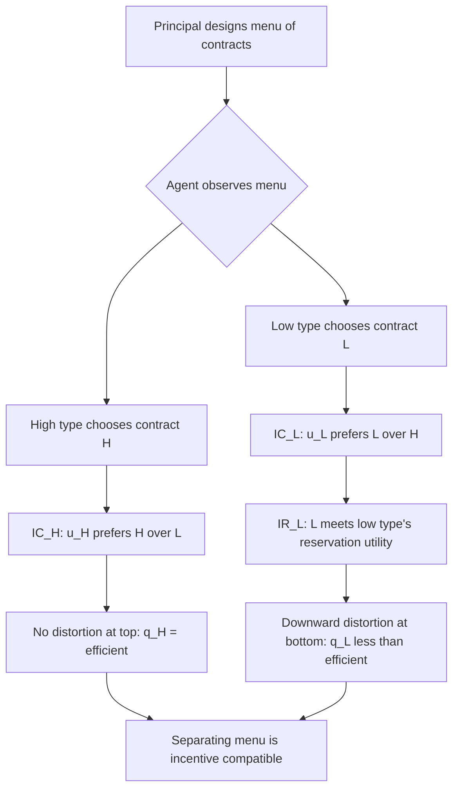

## Screening and Self-Selection

### Definition and Conceptual Overview

Screening is a mechanism through which an uninformed party in a market with asymmetric information designs a set of options or contracts to induce informed parties to reveal their private information indirectly, through the choices they make. Unlike signaling, where the informed party moves first, screening is initiated by the uninformed party (the **principal**), who offers a menu of contracts to the informed party (the **agent**). The agent's self-interested choice from this menu reveals their private type.

Self-selection is the behavioral mechanism underlying screening: when a menu of contracts is properly designed, agents of different types will voluntarily sort themselves into different contracts because each type finds a different contract optimal given their own preferences or costs. The principal cannot observe type directly but can observe the choice, which serves as a proxy for type.

**Key Points**

- Screening is initiated by the uninformed party; signaling is initiated by the informed party
- The informed party moves second in the game (chooses from a menu), but this is still a game of incomplete information because the principal does not know the agent's type when designing the menu
- Self-selection requires the menu to satisfy incentive compatibility: each type must weakly prefer its intended contract over any other contract in the menu
- Screening menus must also satisfy individual rationality (participation constraints): each type must find its assigned contract at least as good as not participating

### Formal Structure

Consider a principal who does not know the agent's type $\theta \in \Theta$, where $\Theta$ is a finite or continuous set of possible types with a commonly known prior distribution $F(\theta)$. The principal designs a menu of contracts $\{(x_\theta, t_\theta)\}_{\theta \in \Theta}$, where $x_\theta$ is an allocation (e.g., quantity, quality, effort level) and $t_\theta$ is a payment or price associated with that allocation.

The agent, upon observing the menu, selects the contract $(x_{\theta'}, t_{\theta'})$ that maximizes their own utility given their true type $\theta$:

$$\theta \in \arg\max_{\theta' \in \Theta} \, u(x_{\theta'}, t_{\theta'}; \theta)$$

For the menu to induce truthful self-selection, it must satisfy two constraint classes for every type $\theta$:

**Incentive Compatibility (IC):**

$$u(x_\theta, t_\theta; \theta) \geq u(x_{\theta'}, t_{\theta'}; \theta) \quad \forall \theta' \neq \theta$$

**Individual Rationality (IR):**

$$u(x_\theta, t_\theta; \theta) \geq \bar{u}(\theta)$$

where $\bar{u}(\theta)$ is the agent's reservation utility (outside option).

The principal's problem is to choose $\{(x_\theta, t_\theta)\}$ to maximize expected profit or welfare subject to the IC and IR constraints holding for every type simultaneously — this is the **revelation principle** at work: any screening mechanism can be represented, without loss of generality, as a direct mechanism in which agents report their type and the mechanism is designed so that truthful reporting is optimal.

### Canonical Example: Second-Degree Price Discrimination

A monopolist sells a good of variable quality $q$ to buyers with private valuation type $\theta \in \{\theta_L, \theta_H\}$, where $\theta_H > \theta_L$ (high type values quality more). The monopolist cannot observe $\theta$ but knows the proportion of each type. Buyer utility is:

$$u(q, t; \theta) = \theta v(q) - t$$

where $v(q)$ is increasing and concave, and $t$ is the price paid.

**Naive approach (fails):** If the monopolist offers each type its first-best (efficient) quality-price pair, the high type will find the low type's contract attractive, because the low type's contract is priced based on lower valuation but the high type values quality more, so the "markup" embedded in the low-type contract is smaller relative to the high type's marginal benefit. This violates IC.

**Screening solution:**

1. The low type receives their efficient (first-best) quality $q_L^*$, priced to extract full surplus — IR binds for the low type: $t_L = \theta_L v(q_L)$.
2. The high type's quality is undistorted at the top: $q_H = q_H^*$ (efficient), but their price is set so that IC binds for the high type, meaning they are indifferent between their own contract and the low type's contract:

   $$\theta_H v(q_H) - t_H = \theta_H v(q_L) - t_L$$
3. The low type's quality is typically distorted **downward** relative to the efficient level, because reducing $q_L$ relaxes the high type's incentive to mimic the low type (it makes the low-type contract less attractive to the high type), which allows the principal to extract more surplus from the high type.

This produces the standard result known as **"no distortion at the top, downward distortion at the bottom"** — a hallmark finding across screening models (nonlinear pricing, insurance, regulation, labor contracts).

### Rothschild-Stiglitz Insurance Screening Model

A classic application is insurance markets with adverse selection (Rothschild and Stiglitz, 1976). Insurers cannot observe whether a customer is high-risk or low-risk, but customers know their own risk type. The insurer screens by offering a menu of contracts differing in premium and coverage level.

- **Full insurance for high-risk types:** Since high-risk types have a higher probability of loss, offering them full coverage at an actuarially fair premium does not create an incentive problem, because low-risk types would not want to pay the higher premium associated with full coverage priced for high-risk probabilities.
- **Partial insurance for low-risk types:** To prevent high-risk types from choosing the low-risk contract, the low-risk contract must offer only partial coverage, sacrificing full insurance to make it unattractive to high-risk types. Low-risk agents bear residual risk as a self-selection device.

A notable feature of this model is that a **pooling equilibrium** (all types purchase the same contract) is never a Nash equilibrium in the classic setting, since a rival insurer can always profitably "cream-skim" by offering a contract attractive only to low-risk types. Only a **separating equilibrium** — where each type self-selects a distinct contract — can survive, and it may fail to exist entirely under certain market conditions, a limitation extensively discussed in later work (e.g., Wilson equilibrium, reactive equilibrium concepts).

### Screening in Labor Markets: Menus of Contracts

Firms facing workers of unknown ability $\theta$ can screen using **menus of wage-effort or wage-tenure contracts**. For example:

- Contracts featuring a low base salary with high performance bonuses appeal disproportionately to high-ability workers confident in their own productivity.
- Contracts featuring a flat, guaranteed salary appeal to low-ability or risk-averse workers.

Self-selection here substitutes for direct ability testing, which may be costly, imperfect, or legally constrained.

### Graphical/Structural Intuition: Single-Crossing Property

Screening models with a well-behaved separating solution typically require the **single-crossing property** (also called the **Spence-Mirrlees condition**): indifference curves of different types, plotted in $(x, t)$ space, cross at most once, and the ranking of slopes is monotonic in type. Formally, for the two-type case:

$$\frac{\partial}{\partial \theta}\left(\frac{MU_x(x,t;\theta)}{MU_t(x,t;\theta)}\right) \text{ has a consistent sign across } \theta$$

This condition ensures that a menu inducing separation is well-defined and that "local" IC constraints (adjacent types) imply "global" IC constraints (all pairwise comparisons), substantially simplifying the mechanism design problem to binding only adjacent-type constraints.

### Diagram: Single-Crossing and Contract Menu (svg_diagram)

<svg xmlns="http://www.w3.org/2000/svg" viewBox="0 0 640 420">
<text x="320" y="24" font-size="16" text-anchor="middle" font-weight="bold">Screening Menu: Single-Crossing Property (svg_diagram)</text>
<line x1="60" y1="380" x2="600" y2="380" stroke="black" stroke-width="1.5" />
<line x1="60" y1="380" x2="60" y2="40" stroke="black" stroke-width="1.5" />
<text x="600" y="400" font-size="13" text-anchor="middle">Quality / Quantity (x)</text>
<text x="30" y="40" font-size="13" text-anchor="middle" transform="rotate(-90 30,200)">Payment (t)</text>

<path d="M 100,340 Q 250,260 420,220" fill="none" stroke="#2563eb" stroke-width="2" />
<text x="430" y="215" font-size="12" fill="#2563eb">Low type IC</text>

<path d="M 100,360 Q 300,180 480,90" fill="none" stroke="#dc2626" stroke-width="2" />
<text x="490" y="88" font-size="12" fill="#dc2626">High type IC</text>

<circle cx="290" cy="228" r="4" fill="black" />
<text x="300" y="245" font-size="11">single crossing point</text>

<circle cx="230" cy="270" r="6" fill="#2563eb" />
<text x="205" y="295" font-size="12" fill="#2563eb">Contract L (q_L, t_L)</text>
<circle cx="420" cy="120" r="6" fill="#dc2626" />
<text x="395" y="105" font-size="12" fill="#dc2626">Contract H (q_H*, t_H)</text>

<text x="60" y="415" font-size="11" fill="#555">Slopes differ monotonically by type, ensuring at most one crossing between any two types' indifference curves.</text>

</svg>

### Distinguishing Screening from Signaling

| Dimension | Screening | Signaling |
| --- | --- | --- |
| Who moves first | Uninformed party (principal) | Informed party (agent) |
| Mechanism | Menu of contracts | Costly action prior to contracting |
| Revelation channel | Self-selection (choice from menu) | Direct action observed by uninformed party |
| Classic example | Rothschild-Stiglitz insurance, second-degree price discrimination | Spence education signaling |
| Equilibrium concept | Perfect Bayesian Equilibrium in a mechanism-design game | Perfect Bayesian Equilibrium (separating/pooling) |

Both are solutions to adverse selection problems, but they are complementary rather than mutually exclusive; real markets often exhibit both simultaneously (e.g., education signals ability *and* firms screen using wage-tenure contract menus).

### Existence and Robustness Issues

[Unverified] The exact conditions under which a separating equilibrium exists in general screening games can be sensitive to the equilibrium refinement used (Nash vs. Wilson vs. reactive equilibrium), and different refinements can yield different predictions about market outcomes, particularly in the Rothschild-Stiglitz setting where a pure-strategy Nash equilibrium may fail to exist when the proportion of high-risk types is sufficiently small.

Standard results that are well-established and not merely inferential:

- The revelation principle guarantees that restricting attention to direct, truthful mechanisms is without loss of generality for characterizing the set of implementable outcomes.
- "No distortion at the top" is a general feature of standard screening models with a single-crossing property and a finite or continuum type space ordered from lowest to highest.

### Applications Beyond Classic Markets

- **Auction design:** Optimal auctions (Myerson, 1981) are screening mechanisms where bidders self-select bids based on private valuations.
- **Regulation:** A regulator screens firms of unknown cost type by offering menus of price-quantity or cost-reimbursement contracts (Baron-Myerson model).
- **Taxation:** Optimal nonlinear income taxation (Mirrlees model) is a screening problem where the government screens workers of unknown productivity via a menu of (income, tax) bundles implied by the tax schedule.
- **Venture capital and financing contracts:** Investors screen entrepreneurs of unknown quality using menus of equity-debt combinations.

**Related Topics**

- Adverse Selection and the Market for Lemons
- Signaling Games and the Spence Education Model
- The Revelation Principle and Mechanism Design
- Optimal Auction Theory (Myerson Optimal Auctions)
- Nonlinear Pricing and Second-Degree Price Discrimination
- Rothschild-Stiglitz Equilibrium Existence and Refinements
- Principal-Agent Models with Hidden Information vs. Hidden Action
- Optimal Income Taxation (Mirrlees Model)