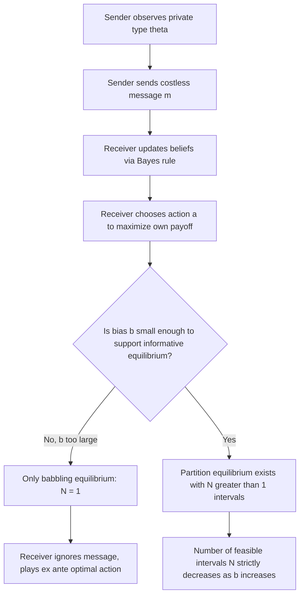

## Cheap Talk Games

### Definition and Conceptual Overview

Cheap talk refers to pre-play communication between players that is costless, non-binding, and unverifiable — messages carry no direct payoff consequences and cannot be enforced as commitments. A cheap talk game is a game of incomplete information in which an informed **Sender** (S) observes a private type $\theta$ and sends a costless message $m$ to an uninformed **Receiver** (R), who then takes an action $a$ affecting both players' payoffs. Because messages have no intrinsic cost or binding force, whether communication conveys any real information at all depends entirely on the alignment of interests between Sender and Receiver — this is the central question cheap talk theory addresses.

The canonical reference model is Crawford and Sobel (1982), which established the foundational framework for how the degree of preference divergence between Sender and Receiver determines how much information can be credibly transmitted in equilibrium.

**Key Points**

- Messages are costless: sending any message $m$ costs the Sender the same regardless of content or type
- Messages are non-binding: the Sender cannot commit to an action described in the message
- Messages are unverifiable: the Receiver cannot check the truth of a message directly (distinguishing cheap talk from disclosure games with verifiable information)
- Because messages are free-form and unconstrained, the meaning of any message is determined **endogenously** in equilibrium — there is no exogenous language mapping messages to types

### Formal Structure: The Crawford-Sobel Model

**Players:** Sender $S$, Receiver $R$

**Type space:** $\theta \in [0,1]$, drawn from a commonly known distribution $F(\theta)$, observed only by $S$

**Message space:** $M$ (typically $[0,1]$ or unrestricted; message content itself carries no meaning ex ante)

**Action space:** $a \in \mathbb{R}$, chosen by $R$ after observing $m$

**Payoffs:**

$$U^S(a, \theta, b) = -(a - \theta - b)^2$$

$$U^R(a, \theta) = -(a - \theta)^2$$

where $b > 0$ is the **bias parameter** representing the degree of preference divergence between Sender and Receiver. When $b = 0$, both players want the same action given the true type (fully aligned interests). As $b$ increases, the Sender's ideal action diverges further from the Receiver's ideal action for any given $\theta$.

**Equilibrium concept:** Perfect Bayesian Equilibrium, characterized by:

1. A message strategy $m(\theta)$ for the Sender (or a mixed/behavioral strategy)
2. An action rule $a(m)$ for the Receiver that is a best response given beliefs
3. Beliefs $\mu(\theta \mid m)$ derived from the Sender's strategy via Bayes' rule wherever possible

### Types of Equilibria

**Babbling (uninformative) equilibrium:** The Sender sends messages uncorrelated with type (e.g., always sends the same message regardless of $\theta$), and the Receiver ignores the message entirely, taking the ex ante optimal action $a = E[\theta]$ regardless of $m$. This equilibrium always exists in cheap talk games, for any value of $b$, because if the Receiver is expected to ignore messages, the Sender has no incentive to make messages informative, and if the Sender's messages carry no information, the Receiver's best response is indeed to ignore them — a self-confirming, degenerate equilibrium.

**Partition (interval) equilibria:** These are the informative equilibria of interest. The type space $[0,1]$ is partitioned into a finite number of intervals $[0, x_1), [x_1, x_2), \ldots, [x_{N-1}, 1]$, and the Sender sends a distinct message for each interval (equivalently, types within the same interval pool and send the same message). The Receiver, upon receiving a message associated with interval $[x_{i-1}, x_i)$, responds with the action that is optimal given the posterior belief that $\theta$ is uniformly (or otherwise) distributed over that interval:

$$a_i = E[\theta \mid \theta \in [x_{i-1}, x_i)]$$

**Central result — bounded partition size:** Crawford and Sobel prove that the maximum number of intervals $N^*$ that can be supported in equilibrium is **strictly decreasing in the bias parameter** $b$. As $b \to 0$, $N^* \to \infty$ (communication approaches full revelation). As $b$ increases beyond a threshold, only the babbling equilibrium ($N=1$) survives. This formalizes the intuition that **greater conflict of interest reduces the informativeness of communication**, even though communication remains individually costless.

### Why Full Revelation Typically Fails

If the Sender could credibly reveal $\theta$ exactly, the Receiver would choose $a = \theta$ (their ideal action given full information). But the Sender's ideal action is $a = \theta + b$, not $\theta$. Since the Sender always wants the Receiver to choose an action higher than what the Receiver would choose under full information, the Sender has an incentive to misrepresent type upward. Anticipating this, a rational Receiver cannot believe any message that isn't consistent with the Sender's incentives — this unraveling logic is why fully separating (fully revealing) equilibria generally do not exist whenever $b \neq 0$, and why information can only be transmitted "coarsely," through pooling into intervals rather than through exact revelation.

### Equilibrium Refinement and Selection

Cheap talk games are notorious for having **multiple equilibria** — the babbling equilibrium always coexists with any informative partition equilibria that may exist for a given $b$. The most common refinement used to select among informative equilibria is:

- **Most-informative equilibrium (Pareto-dominant among informative equilibria):** For a fixed $b$, both players are typically better off (in expected payoff terms) in the equilibrium with the largest number of intervals $N^*$, since finer partitions convey more information and reduce the Receiver's forecast error. This equilibrium is often the focal prediction in applications, though it requires an ex ante coordination assumption that the model itself does not fully resolve.

**Key Points**

- Existence of the babbling equilibrium is a structural feature of *all* cheap talk games with any $b \neq 0$ that creates conflicting interests
- Multiplicity is a genuine indeterminacy problem: nothing purely within the model pins down which equilibrium the players coordinate on, absent additional assumptions (focal points, communication protocols, evolutionary/learning dynamics)

### Diagram: Partition Equilibrium Structure (svg_diagram)

<svg xmlns="http://www.w3.org/2000/svg" viewBox="0 0 640 260">
<text x="320" y="24" font-size="16" text-anchor="middle" font-weight="bold">Crawford-Sobel Partition Equilibrium (svg_diagram)</text>
<line x1="60" y1="120" x2="580" y2="120" stroke="black" stroke-width="2" />
<text x="60" y="145" font-size="12" text-anchor="middle">0</text>
<text x="580" y="145" font-size="12" text-anchor="middle">1</text>

<line x1="180" y1="105" x2="180" y2="135" stroke="black" stroke-width="1.5" />
<text x="180" y="150" font-size="11" text-anchor="middle">x1</text>
<line x1="320" y1="105" x2="320" y2="135" stroke="black" stroke-width="1.5" />
<text x="320" y="150" font-size="11" text-anchor="middle">x2</text>
<line x1="440" y1="105" x2="440" y2="135" stroke="black" stroke-width="1.5" />
<text x="440" y="150" font-size="11" text-anchor="middle">x3</text>

<text x="120" y="100" font-size="12" fill="`#2563eb`">Interval 1</text>

<text x="245" y="100" font-size="12" fill="`#dc2626`">Interval 2</text>

<text x="375" y="100" font-size="12" fill="`#059669`">Interval 3</text>

<text x="505" y="100" font-size="12" fill="`#7c3aed`">Interval 4</text>

<text x="120" y="185" font-size="12" text-anchor="middle">m1</text>

<text x="245" y="185" font-size="12" text-anchor="middle">m2</text>

<text x="375" y="185" font-size="12" text-anchor="middle">m3</text>

<text x="505" y="185" font-size="12" text-anchor="middle">m4</text>

<text x="320" y="210" font-size="12" text-anchor="middle" fill="#555">Sender pools all θ in an interval into the same message</text>

<text x="320" y="235" font-size="12" text-anchor="middle" fill="#555">Receiver responds a_i = E[θ | θ in interval i]</text>

</svg>

### Diagram: Equilibrium Selection Overview

### Comparison: Cheap Talk vs. Signaling vs. Verifiable Disclosure

| Dimension | Cheap Talk | Signaling (Spence-type) | Verifiable Disclosure |
| --- | --- | --- | --- |
| Message cost | None (costless) | Costly, type-dependent cost | Costless but truth is enforceable |
| Commitment | Non-binding | Action taken is binding | Claims can be verified/audited |
| Information revealed | Coarse (partitions) at best | Can be fully separating | Often fully revealing (unraveling toward disclosure) |
| Driver of informativeness | Alignment of interests ($b$) | Cost differential across types (single-crossing) | Ability to verify or penalize lying |

### Extensions and Applications

- **Multiple senders:** When two or more Senders with different biases communicate simultaneously with a single Receiver, competition between Senders can sometimes support **full revelation** even when a single Sender could not, since a Receiver can cross-check inconsistent messages (Krishna and Morgan, 2001).
- **Communication with multiple rounds:** Allowing repeated rounds of cheap talk before the action is taken can, in some settings, expand the set of implementable outcomes relative to one-shot cheap talk, though the babbling equilibrium remains a persistent baseline.
- **Applications in economics and political science:**
  - Expert advice to policymakers (e.g., central bank communication, monetary policy forward guidance)
  - Lobbying and interest group communication with legislators
  - Managerial communication within firms (subordinates reporting private information to superiors)
  - Diplomatic signaling and pre-negotiation communication
- **Behavioral departures:** [Unverified] Experimental evidence on cheap talk games often finds more information transmitted than the Crawford-Sobel equilibrium prediction, a finding sometimes attributed to lying aversion or honesty norms not captured in the standard payoff-maximizing framework; the robustness and generalizability of these findings across contexts remains an active empirical research question.

### Worked Numerical Example

Suppose $\theta \sim U[0,1]$, $U^R = -(a-\theta)^2$, $U^S = -(a - \theta - b)^2$. For the two-interval ($N=2$) equilibrium, the partition boundary $x_1$ and the maximum sustainable bias are related by the Crawford-Sobel arithmetic condition. For $N$ intervals with uniform types, the boundaries follow a recursive difference equation, and the maximum $b$ supporting $N$ intervals is:

$$b < \frac{1}{2N(N-1)}$$

For example, with $N=2$, informative communication requires $b < \frac{1}{4}$; if $b \geq \frac{1}{4}$, only babbling is possible. This illustrates concretely how the *feasible granularity* of communication shrinks as preference divergence grows.

**Related Topics**

- Signaling Games and the Spence Education Model
- Screening and Self-Selection Mechanisms
- Verifiable Disclosure and Unraveling Results
- Crawford-Sobel Model: Multi-Sender Extensions
- Reputation and Repeated Cheap Talk
- Mechanism Design with Non-Binding Communication
- Behavioral and Experimental Tests of Cheap Talk Predictions