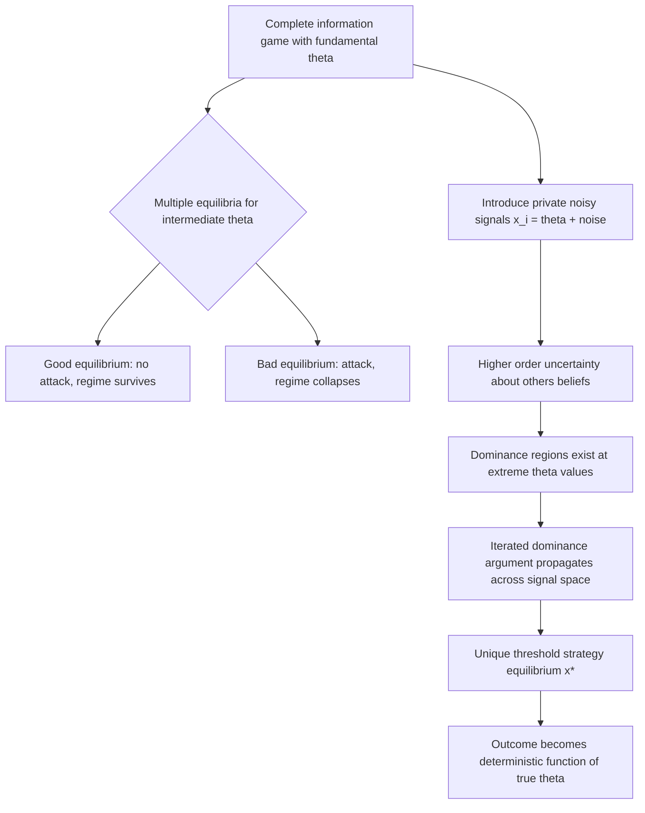

## Global Games and Equilibrium Selection

### Definition and Conceptual Overview

Global games are a class of games of incomplete information introduced to resolve the problem of **multiple equilibria** in coordination games. In many coordination games with complete information (e.g., bank runs, currency attacks, technology adoption), the same underlying game admits multiple Nash equilibria — typically at least one "good" (coordinated success) equilibrium and one "bad" (coordination failure) equilibrium — with no way, purely from the game's structure, to predict which one will occur. Global games introduce a small amount of **payoff uncertainty** with **private, noisy signals** about a common underlying fundamental, and show that this perturbation, however small, can eliminate all but one equilibrium — a striking and influential **equilibrium selection** result formalized by Carlsson and van Damme (1993) and substantially extended by Morris and Shin (1998, 2003).

**Key Points**

- The starting point is a complete-information coordination game with multiple equilibria (typically a $2\times 2$ symmetric coordination game generalized to a continuum of players)
- The global game perturbation replaces common knowledge of the payoff-relevant fundamental $\theta$ with private noisy signals $x_i = \theta + \varepsilon_i$
- As the noise vanishes ($\varepsilon_i \to 0$), the game does **not** converge back to multiple equilibria; instead, it converges to a **unique equilibrium** characterized by threshold strategies
- This result is often summarized as: "vanishingly small private information can have large equilibrium effects" — the selection result is discontinuous relative to the complete-information limit

### Motivating Example: Currency Attacks

Consider a continuum of speculators (traders) deciding whether to attack a fixed exchange rate regime. Let $\theta$ represent the strength of the regime's fundamentals (e.g., foreign reserves, macroeconomic health). Each speculator $i$ chooses an action $a_i \in \{0, 1\}$: attack (1) or not (0). The regime collapses if the aggregate mass of attackers exceeds a threshold that depends on $\theta$ — weaker fundamentals require fewer attackers to trigger collapse.

**Payoffs:**

- Attacking costs $c$ (e.g., transaction costs)
- If the regime collapses, an attacker gains $y - c$ (where $y$ is the devaluation gain)
- If the regime survives, an attacker loses $-c$
- Non-attackers receive $0$ regardless of outcome

Under **complete information** about $\theta$, this game exhibits multiple equilibria for an intermediate range of $\theta$: if everyone expects everyone else to attack, attacking is a best response (self-fulfilling collapse); if everyone expects no one to attack, not attacking is a best response (self-fulfilling survival). The same fundamentals $\theta$ can support either outcome — a canonical instance of **strategic complementarity** generating equilibrium multiplicity.

### The Global Games Perturbation

Instead of assuming common knowledge of $\theta$, suppose each speculator observes a private noisy signal:

$$x_i = \theta + \varepsilon_i, \quad \varepsilon_i \sim \text{i.i.d.}, \; \varepsilon_i \to 0 \text{ (noise vanishes)}$$

Because each player observes a slightly different signal, players face genuine **strategic uncertainty**: not only are they uncertain about $\theta$, but they are also uncertain about what signal *other* players received, and therefore uncertain about what others will do. This higher-order uncertainty — uncertainty about others' beliefs about $\theta$, others' beliefs about others' beliefs, and so on — is the key structural feature that breaks the multiplicity.

**Result (Carlsson-van Damme, Morris-Shin):** Under standard conditions (strategic complementarities, dominance regions at the extremes of $\theta$, and sufficiently small noise), the game has a **unique equilibrium in threshold strategies**:

$$a_i^* = \begin{cases} \text{attack} & \text{if } x_i < x^* \\ \text{not attack} & \text{if } x_i \geq x^* \end{cases}$$

where $x^*$ is a threshold signal value determined endogenously by the model's parameters. All players use the same cutoff rule, and the aggregate outcome (regime collapse or survival) becomes a **deterministic function of the true $\theta$**, rather than being subject to self-fulfilling expectations.

### Why Uniqueness Emerges: Iterated Dominance Logic

The uniqueness result relies on the existence of **dominance regions**:

- For sufficiently high $\theta$ (very strong fundamentals), not attacking is a dominant strategy regardless of beliefs about others' actions
- For sufficiently low $\theta$ (very weak fundamentals), attacking is a dominant strategy regardless of beliefs about others' actions

Given these dominance regions, the equilibrium is pinned down via **iterated elimination of dominated strategies** operating over the signal space:

1. A player receiving a very low signal (extremely weak fundamentals) attacks, because they can infer that even in the least favorable scenario about others, attacking is optimal
2. This inference propagates: a player receiving a slightly higher signal reasons about the behavior of players with lower signals (who they know will attack), and can determine their own best response
3. Iterating this logic across the entire signal space uniquely determines the threshold $x^*$, because at each step the noise ensures players face a non-degenerate distribution over others' signals, ruling out the self-fulfilling multiplicity that arises under common knowledge

This process is why the global games literature is described as **using incomplete information to achieve equilibrium selection via a contagion/iterated-dominance argument**, rather than through an external refinement criterion imposed by the analyst (as in, e.g., risk dominance selection in complete-information games).

### Formal Threshold Characterization (Morris-Shin Framework)

In the standard Morris-Shin setup with a continuum of players, uniform-noise signals, and linear payoff structure, the equilibrium threshold $x^*$ solves an indifference condition: the marginal player who receives signal $x^*$ must be indifferent between attacking and not attacking, given their posterior beliefs about $\theta$ and about the proportion of other players attacking (derived from the equilibrium threshold strategy itself). This produces a fixed-point condition of the form:

$$\int P(\text{regime collapses} \mid \theta, \text{threshold } x^*) \, d\Pi(\theta \mid x^*) \cdot y = c$$

where $\Pi(\theta \mid x^*)$ is the posterior distribution over $\theta$ given the marginal signal $x^*$, and the equation equates expected benefit from attacking to the cost $c$.

[Unverified] Exact closed-form solutions for $x^*$ depend heavily on the specific noise distribution and payoff parameterization assumed; in most applied treatments, the threshold is characterized implicitly via this indifference condition rather than derived in closed form, except in special parametric cases (e.g., Gaussian noise with linear payoffs).

### Diagram: Global Games Selection Mechanism

### Diagram: Threshold Equilibrium Structure (svg_diagram)

<svg xmlns="http://www.w3.org/2000/svg" viewBox="0 0 640 260">
<text x="320" y="24" font-size="16" text-anchor="middle" font-weight="bold">Global Games Threshold Equilibrium (svg_diagram)</text>
<line x1="60" y1="140" x2="580" y2="140" stroke="black" stroke-width="2" />
<text x="60" y="165" font-size="12" text-anchor="middle">Low theta</text>
<text x="580" y="165" font-size="12" text-anchor="middle">High theta</text>
<line x1="320" y1="120" x2="320" y2="160" stroke="black" stroke-width="2" />
<text x="320" y="185" font-size="12" text-anchor="middle">x* (threshold signal)</text>
<rect x="60" y="60" width="260" height="30" fill="#fecaca" opacity="0.6" />
<text x="190" y="80" font-size="12" text-anchor="middle">Attack region (signal below x*)</text>
<rect x="320" y="60" width="260" height="30" fill="#bbf7d0" opacity="0.6" />
<text x="450" y="80" font-size="12" text-anchor="middle">No-attack region (signal above x*)</text>

<text x="90" y="220" font-size="11" fill="#555">Extreme low theta:</text>

<text x="90" y="235" font-size="11" fill="#555">attacking dominant</text>

<text x="410" y="220" font-size="11" fill="#555">Extreme high theta:</text>

<text x="410" y="235" font-size="11" fill="#555">not attacking dominant</text>

</svg>

### Comparison: Global Games vs. Standard Refinements

| Dimension | Global Games | Risk Dominance / Focal Points | Common Knowledge Coordination Game |
| --- | --- | --- | --- |
| Source of uniqueness | Endogenous, from private noisy information structure | Exogenous selection criterion applied by analyst | No selection — multiplicity persists |
| Information structure | Private, noisy, correlated signals about fundamental | Common knowledge of payoffs | Common knowledge of payoffs |
| Predicts outcome as function of fundamentals | Yes — deterministic threshold rule | Not directly tied to fundamentals | No — indeterminate |
| Requires vanishing noise limit | Yes, central to the result | No | N/A |

### Applications

- **Currency crises and speculative attacks:** The original motivating application (Morris and Shin), used to explain sudden regime collapses without requiring large fundamental shocks — a small change in $\theta$ near the threshold can trigger discontinuous jumps in outcomes.
- **Bank runs:** Depositors decide whether to withdraw based on noisy private signals about bank solvency, with global games providing a microfounded alternative to the multiple-equilibria Diamond-Dybvig framework.
- **Political regime change and revolutions:** Citizens decide whether to join a protest/uprising based on private assessments of the regime's weakness and beliefs about others' participation.
- **Technology adoption and network effects:** Firms or consumers decide whether to adopt a new technology or standard, where adoption benefits depend on the mass of other adopters.
- **Debt rollover crises:** Creditors decide whether to roll over short-term debt based on private signals about a borrower's solvency, connecting global games to sovereign debt crisis models.

### Key Technical Conditions for the Result to Hold

1. **Strategic complementarity:** The incentive to take an action must be increasing in the number/proportion of other players taking that action
2. **State monotonicity:** Payoffs from each action must be monotonic in the fundamental $\theta$
3. **Dominance regions:** There must exist extreme values of $\theta$ where each action is dominant, providing the "anchors" for the iterated dominance argument
4. **Vanishing noise limit:** The uniqueness result is a limiting result as private signal noise shrinks to zero; for large noise levels, multiplicity can persist, and the sharp selection result is specifically a small-noise phenomenon

[Unverified] The robustness of the uniqueness result to alternative information structures (e.g., public signals mixed with private signals, or higher-dimensional signal spaces) has been explored extensively in follow-up literature, and the precise boundary conditions under which uniqueness breaks down (e.g., when public information becomes too precise relative to private information) remain an active area with nuanced, parameter-dependent findings.

**Related Topics**

- Coordination Games and Strategic Complementarity
- Higher-Order Beliefs and Common Knowledge
- Bank Runs and the Diamond-Dybvig Model
- Currency Crisis Models (First and Second Generation)
- Iterated Elimination of Dominated Strategies
- Public vs. Private Information in Coordination Settings
- Sovereign Debt Rollover Crises and Global Games Applications