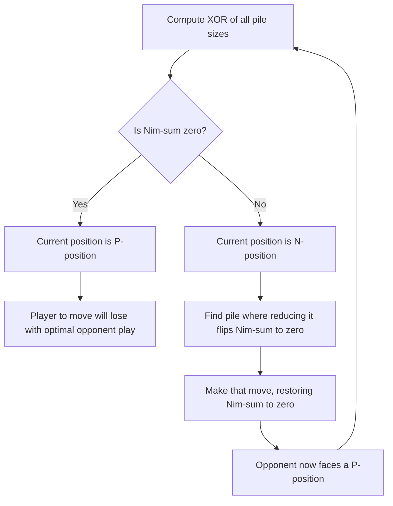

## Impartial Games and Nim

### Definition and Conceptual Overview

Combinatorial game theory studies a distinct class of games from classical (economic) game theory: **two-player, sequential, perfect-information games with no chance moves**, where the game ends when a player cannot move. **Impartial games** are a subclass in which the set of legal moves available from any given position is identical for both players — the only thing that differs between players is whose turn it is, not what moves they are allowed to make. This contrasts with **partisan games** (e.g., Chess, Go), where the two players typically have different sets of available moves (e.g., only one player can move a given piece).

**Nim** is the canonical impartial game and serves as the foundational building block of the entire theory, because of the **Sprague-Grundy theorem**, which shows that *every* finite impartial game under the normal play convention is equivalent to a single Nim-pile of some size — an extraordinarily powerful reduction result.

**Key Points**

- Impartial games: both players have the same set of legal moves from any position
- **Normal play convention:** the player who cannot move **loses** (the last player to move wins)
- **Misère play convention:** the player who cannot move **wins** (the last player to move loses) — analysis is generally much harder under misère play
- Nim is played with several piles of objects; a legal move removes any positive number of objects from exactly one pile; the player unable to move (all piles empty) loses under normal play

### Rules of Nim

Nim is played with $n$ piles of sizes $x_1, x_2, \ldots, x_n$. On each turn, a player selects one non-empty pile and removes any positive number of objects from it (removing the entire pile is allowed). Players alternate turns. Under **normal play**, the player who removes the last object wins (equivalently, the player facing all-empty piles on their turn loses).

### The Sprague-Grundy Theorem

**Statement:** Every position in a finite impartial game (under normal play) is equivalent to a Nim-pile of a certain size, called its **Grundy value** (or **nimber**), denoted $\mathcal{G}(P)$ for position $P$. The Grundy value is computed recursively via the **minimum excludant (mex)** rule:

$$\mathcal{G}(P) = \text{mex}\{\mathcal{G}(P') : P' \text{ is a position reachable from } P \text{ in one move}\}$$

where $\text{mex}(S)$ is the smallest non-negative integer **not** contained in the set $S$.

**Base case:** A terminal position (no moves available) has $\mathcal{G}(P) = 0$, since $\text{mex}(\emptyset) = 0$.

**Key consequence:** A position $P$ is a **P-position** (previous player wins — i.e., the player about to move will lose with optimal play) if and only if $\mathcal{G}(P) = 0$. A position is an **N-position** (next player wins) if and only if $\mathcal{G}(P) \neq 0$.

### The Nim-Value of a Single Pile

For a single Nim-pile of size $x$, the Grundy value equals $x$ itself:

$$\mathcal{G}(\text{pile of size } x) = x$$

This is proven by induction: from a pile of size $x$, a move can reduce it to any pile of size $0, 1, \ldots, x-1$, whose Grundy values are (by induction) $0, 1, \ldots, x-1$ respectively. The mex of $\{0, 1, \ldots, x-1\}$ is exactly $x$.

### Sums of Games and the Sprague-Grundy Addition Rule

Combinatorial game theory defines the **disjunctive sum** of games: given games $G_1, G_2, \ldots, G_n$ played simultaneously, a move consists of choosing exactly one component game and making a legal move in it (this is precisely the structure of multi-pile Nim, where each pile is a separate component game). The Sprague-Grundy theorem's key computational tool is:

$$\mathcal{G}(G_1 + G_2 + \cdots + G_n) = \mathcal{G}(G_1) \oplus \mathcal{G}(G_2) \oplus \cdots \oplus \mathcal{G}(G_n)$$

where $\oplus$ denotes the **bitwise XOR** operation (also called **Nim-addition**). This is the central computational engine of the theory: it reduces the analysis of a sum of arbitrarily complex impartial games to computing each component's Grundy value independently, then XOR-ing them together.

### Solving Nim: The XOR (Nim-Sum) Criterion

For multi-pile Nim specifically, since each pile's Grundy value equals its size, the overall position's Grundy value is the **XOR of all pile sizes**, often called the **Nim-sum**:

$$\mathcal{G}(x_1, x_2, \ldots, x_n) = x_1 \oplus x_2 \oplus \cdots \oplus x_n$$

**Winning condition:**

- If the Nim-sum is $0$, the position is a **P-position**: the player about to move will lose under optimal opposing play
- If the Nim-sum is nonzero, the position is an **N-position**: the player about to move has a winning strategy

**Winning strategy construction:** If the Nim-sum $S \neq 0$, find the most significant bit where $S$ has a 1. There must exist at least one pile $x_i$ whose corresponding bit is also 1 (otherwise the XOR of all piles could not have that bit set). Reduce that pile to $x_i \oplus S$ (which is guaranteed to be smaller than $x_i$, since XOR-ing with $S$ flips that leading 1 bit to 0). This move restores the Nim-sum to $0$, placing the opponent in a P-position.

### Worked Example

Consider three piles: $x_1 = 3, x_2 = 4, x_3 = 5$.

**Step 1 — compute Nim-sum** (binary representation):

$$3 = 011_2, \quad 4 = 100_2, \quad 5 = 101_2$$

$$011 \oplus 100 \oplus 101 = 010_2 = 2$$

Since the Nim-sum is $2 \neq 0$, this is an N-position — the player to move wins.

**Step 2 — find the winning move:** We need a pile $x_i$ such that $x_i \oplus 2 < x_i$. Check each pile:

- $x_1 \oplus 2 = 3 \oplus 2 = 1$ (less than 3) ✓
- $x_2 \oplus 2 = 4 \oplus 2 = 6$ (greater than 4, invalid)
- $x_3 \oplus 2 = 5 \oplus 2 = 7$ (greater than 5, invalid)

The winning move is to reduce pile 1 from $3$ to $1$ (remove 2 objects), producing piles $(1, 4, 5)$.

**Verification:** $1 \oplus 4 \oplus 5 = 001 \oplus 100 \oplus 101 = 000_2 = 0$. The Nim-sum is now $0$, confirming this is a P-position for the opponent.

### Diagram: Nim Game Tree and Grundy Values (svg_diagram)

<svg xmlns="http://www.w3.org/2000/svg" viewBox="0 0 640 320">
<text x="320" y="24" font-size="16" text-anchor="middle" font-weight="bold">Single-Pile Grundy Value Computation (svg_diagram)</text>
<circle cx="320" cy="60" r="22" fill="#dbeafe" stroke="#2563eb" stroke-width="1.5" />
<text x="320" y="65" font-size="13" text-anchor="middle">x=3</text>
<text x="320" y="95" font-size="11" text-anchor="middle" fill="#555">G=3</text>
<line x1="320" y1="82" x2="150" y2="150" stroke="#555" />
<line x1="320" y1="82" x2="320" y2="150" stroke="#555" />
<line x1="320" y1="82" x2="490" y2="150" stroke="#555" />
<circle cx="150" cy="170" r="20" fill="#fef3c7" stroke="#d97706" stroke-width="1.5" />
<text x="150" y="175" font-size="12" text-anchor="middle">x=0</text>
<text x="150" y="200" font-size="11" text-anchor="middle" fill="#555">G=0</text>
<circle cx="320" cy="170" r="20" fill="#fef3c7" stroke="#d97706" stroke-width="1.5" />
<text x="320" y="175" font-size="12" text-anchor="middle">x=1</text>
<text x="320" y="200" font-size="11" text-anchor="middle" fill="#555">G=1</text>
<circle cx="490" cy="170" r="20" fill="#fef3c7" stroke="#d97706" stroke-width="1.5" />
<text x="490" y="175" font-size="12" text-anchor="middle">x=2</text>
<text x="490" y="200" font-size="11" text-anchor="middle" fill="#555">G=2</text>

<text x="320" y="250" font-size="12" text-anchor="middle" fill="#333">mex{0, 1, 2} = 3, confirming G(pile of size 3) = 3</text>

<text x="320" y="275" font-size="11" text-anchor="middle" fill="#555">Each child position's Grundy value is computed recursively; mex gives the parent's value</text>

</svg>

### Diagram: Nim-Sum Winning Strategy Logic

### Nim Variants and Related Impartial Games

| Game | Rule Difference from Standard Nim | Key Result |
| --- | --- | --- |
| **Misère Nim** | Last player to move **loses** | Same strategy as normal Nim *except* when all piles have size ≤ 1, where the strategy inverts (leave an odd number of 1-piles) |
| **Nim with a move-size limit (Bounded Nim)** | Maximum objects removable per turn is capped | Analysis reduces to modular arithmetic on pile sizes relative to the cap |
| **Wythoff's Game** | Two piles; can remove from one pile or an equal amount from both | Losing positions follow the golden-ratio-based Beatty sequence |
| **Turning Games / Mock Turtles / Kayles** | Different combinatorial move structures (e.g., removing tokens from a row, splitting piles) | All reducible to Nim-values via Sprague-Grundy theorem; Grundy values often follow periodic or quasi-periodic sequences (nim-sequences) |
| **Northcott's Game** | Played on a board with tokens moved along a line, cannot pass opponent's token | Equivalent to Nim on the gaps between tokens |

### Misère Play: Why It's Harder

Under the **misère convention**, the Sprague-Grundy theorem's clean reduction to Nim-values **does not directly apply** for determining winner/loser status, although Grundy values can still be computed for the disjunctive-sum arithmetic in some contexts. For misère Nim specifically, a simplified special-case strategy exists:

- **Misère Nim strategy:** Play exactly as in normal Nim (aim for Nim-sum $= 0$ after your move) **unless** the move would leave all piles at size $\leq 1$; in that special case, instead leave an **odd** number of piles of size $1$ (rather than the even number that normal-play optimal strategy would leave).

[Unverified] For general impartial games beyond simple Nim, misère play analysis is substantially more complex and historically required specialized tools (e.g., the "misère quotient" theory developed by Plambeck and Siegel), and no single simple criterion analogous to the Nim-sum rule applies uniformly across all impartial games under misère convention.

### Applications and Extensions

- **Combinatorial game theory as a broader field:** Nim-values and the Sprague-Grundy framework underlie the analysis of many recreational and competitive games (Kayles, Dawson's Chess, Turning Turtles, Mock Turtles, Green Hackenbush restricted to impartial configurations).
- **Surreal numbers and partisan game values:** While Nim and impartial games reduce to a single number (Grundy value), the broader theory of partisan combinatorial games (developed by Conway) generalizes this using **surreal numbers**, of which Nim-values are a special "nimber" subclass.
- **Algorithmic game solving:** Grundy value computation via mex and memoization is a standard dynamic programming technique used in competitive programming to solve impartial game problems efficiently.
- **Pedagogical role:** Nim is frequently used as the canonical entry point for teaching game trees, backward induction, and the P-position/N-position dichotomy before introducing the more abstract Sprague-Grundy machinery.

**Related Topics**

- Sprague-Grundy Theorem and Nimber Arithmetic
- Partisan Combinatorial Games and Surreal Numbers
- Misère Play Convention and Misère Quotient Theory
- Wythoff's Game and Beatty Sequences
- Green Hackenbush and Graph-Based Combinatorial Games
- P-positions, N-positions, and Backward Induction in Perfect-Information Games
- Algorithmic Computation of Grundy Values (Dynamic Programming Approaches)