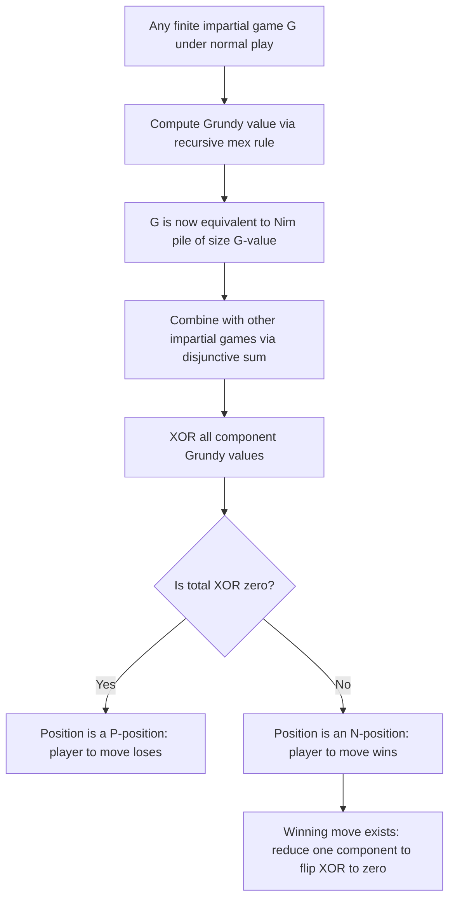

## The Sprague-Grundy Theorem

### Definition and Conceptual Overview

The Sprague-Grundy theorem is the central structural result of combinatorial game theory for **impartial games** under the **normal play convention**. It establishes that every finite impartial game, no matter how structurally complex, is equivalent in strategic value to a single Nim-pile of some determinable size. This equivalence is what allows arbitrarily complicated impartial games — and, critically, **sums** of many different impartial games played simultaneously — to be analyzed using simple arithmetic on integers, rather than requiring exhaustive game-tree search.

The theorem was discovered independently by Roland Sprague (1935) and Patrick Michael Grundy (1939), and it underlies essentially all of modern impartial combinatorial game theory.

**Key Points**

- Applies to **finite, impartial, normal-play** games: both players have identical move options from any position, and the game must terminate in a finite number of moves
- Reduces any such game's strategic value to a single non-negative integer: its **Grundy value** (or **nimber**)
- Enables the analysis of **disjunctive sums** of games via simple XOR arithmetic on Grundy values
- Does **not** directly extend to misère play (where the last player to move loses) without significant additional machinery

### Formal Statement

**Theorem (Sprague-Grundy):** Let $G$ be a finite impartial game under normal play. Then $G$ is equivalent to the single-pile Nim game $\text{Nim}(n)$ for some non-negative integer $n = \mathcal{G}(G)$, called the Grundy value (or Grundy number, or nimber) of $G$. Two games are "equivalent" in the sense that either can be substituted for the other in any disjunctive sum without changing which player wins under optimal play.

**Recursive definition of the Grundy value:**

$$\mathcal{G}(G) = \text{mex}\big(\{\mathcal{G}(G') : G' \text{ is reachable from } G \text{ in exactly one move}\}\big)$$

where $\text{mex}(S)$ (**minimum excludant**) denotes the smallest non-negative integer not belonging to the set $S$. The base case is any terminal position (no legal moves), which has Grundy value $0$, since $\text{mex}(\emptyset) = 0$ by convention.

### Proof Sketch and Intuition

The proof proceeds by strong induction on game length (or equivalently, using the fact that combinatorial games are well-founded, meaning there are no infinite sequences of legal moves).

**Step 1 — Grundy values are well-defined:** Since the game is finite (terminates in finitely many moves from any position), every position's set of "positions reachable in one move" consists of strictly "shorter" games. By strong induction, each of those already has a well-defined Grundy value, so the mex operation can always be computed.

**Step 2 — Grundy value 0 corresponds to a losing position (P-position):** If $\mathcal{G}(G) = 0$, then by definition of mex, no reachable position has Grundy value $0$ — every move leads to a position with Grundy value $\geq 1$ (an N-position for the opponent, i.e., a winning position for whoever is about to move there). Conversely, from any position with $\mathcal{G}(G) \neq 0$, since $0$ is excluded from the *mex* set only if it does not appear among reachable Grundy values — but since $\mathcal{G}(G) \neq 0$ and mex always returns the smallest **missing** value, $0$ *is* attainable as a reachable Grundy value, meaning there exists a move to a position with Grundy value $0$.

**Step 3 — This exactly reproduces the P-position/N-position recursive structure:**

- Grundy value $0 \iff$ **P-position** (previous player wins; whoever is to move loses under optimal play)
- Grundy value $\neq 0 \iff$ **N-position** (next player wins; whoever is to move can force a win)

**Step 4 — Equivalence to a Nim-pile follows from matching Grundy values:** Since a single Nim-pile of size $n$ has Grundy value exactly $n$ (shown by direct induction — from a pile of size $n$, one can move to piles of size $0, 1, \ldots, n-1$, so $\text{mex}\{0,\ldots,n-1\} = n$), any game $G$ with $\mathcal{G}(G) = n$ has, by construction, the identical reachable-Grundy-value profile as $\text{Nim}(n)$ at the relevant level of abstraction needed for win/loss determination in sums.

### The Addition Theorem: Grundy Values of Disjunctive Sums

The full power of the theorem emerges when combined with the **disjunctive sum** operation. Given $n$ independent impartial games $G_1, \ldots, G_n$ played as components of a single combined game (a move consists of choosing exactly one component and making a legal move within it), the Grundy value of the sum is:

$$\mathcal{G}(G_1 + G_2 + \cdots + G_n) = \mathcal{G}(G_1) \oplus \mathcal{G}(G_2) \oplus \cdots \oplus \mathcal{G}(G_n)$$

where $\oplus$ is bitwise XOR (Nim-addition). This is proven by showing that the XOR combination satisfies the same mex-recursive property that defines Grundy values for the sum game — specifically, that from any sum position with nonzero XOR, there exists a move in exactly one component reducing that component's Grundy value so as to zero out the overall XOR, and that from any sum position with zero XOR, every possible single-component move necessarily produces a nonzero XOR.

**Corollary — winner determination in sums:** The player to move in $G_1 + \cdots + G_n$ wins if and only if $\mathcal{G}(G_1) \oplus \cdots \oplus \mathcal{G}(G_n) \neq 0$.

This corollary is what makes multi-pile Nim solvable by the simple Nim-sum rule: each pile is itself a component game with Grundy value equal to its size, so the overall Grundy value of the multi-pile position is the XOR of pile sizes.

### Worked Example: Computing Grundy Values by Hand

Consider a simple impartial game "Subtraction Game $S = \{1, 2\}$": from a pile of $n$ tokens, a player may remove either $1$ or $2$ tokens; the player who removes the last token wins (normal play).

Compute Grundy values iteratively:

| $n$ | Reachable positions | Reachable Grundy values | $\mathcal{G}(n) = \text{mex}(\cdot)$ |
| --- | --- | --- | --- |
| 0 | none (terminal) | $\emptyset$ | 0 |
| 1 | $n=0$ | $\{0\}$ | 1 |
| 2 | $n=0, n=1$ | $\{0, 1\}$ | 2 |
| 3 | $n=1, n=2$ | $\{1, 2\}$ | 0 |
| 4 | $n=2, n=3$ | $\{2, 0\}$ | 1 |
| 5 | $n=3, n=4$ | $\{0, 1\}$ | 2 |
| 6 | $n=4, n=5$ | $\{1, 2\}$ | 0 |

The Grundy sequence $0, 1, 2, 0, 1, 2, 0, \ldots$ is **periodic with period 3**. This periodicity is a common and useful phenomenon in subtraction games and many other impartial game families — Grundy sequences for many well-known games have been tabulated and shown to be eventually periodic, which allows fast computation for large $n$ without full recursive evaluation.

**Application:** Suppose the actual game being played is the sum of three independent subtraction-game piles of sizes $4$, $5$, and $6$ (each governed by the "$\{1,2\}$" subtraction rule above). Using the table: $\mathcal{G}(4) = 1$, $\mathcal{G}(5) = 2$, $\mathcal{G}(6) = 0$. The Nim-sum is $1 \oplus 2 \oplus 0 = 3 \neq 0$, so the player to move wins — despite this not being ordinary Nim at all, the same XOR machinery applies because of the Sprague-Grundy reduction.

### Diagram: Sprague-Grundy Reduction Pipeline

### Diagram: Mex Computation Example (svg_diagram)

<svg xmlns="http://www.w3.org/2000/svg" viewBox="0 0 640 260">
<text x="320" y="24" font-size="16" text-anchor="middle" font-weight="bold">Mex Rule for Grundy Value Computation (svg_diagram)</text>

<text x="60" y="70" font-size="13">Reachable Grundy values from position P:</text>

<rect x="60" y="85" width="50" height="35" fill="`#dbeafe`" stroke="`#2563eb`" />

<text x="85" y="107" font-size="14" text-anchor="middle">0</text>

<rect x="115" y="85" width="50" height="35" fill="`#dbeafe`" stroke="`#2563eb`" />

<text x="140" y="107" font-size="14" text-anchor="middle">1</text>

<rect x="170" y="85" width="50" height="35" fill="`#dbeafe`" stroke="`#2563eb`" />

<text x="195" y="107" font-size="14" text-anchor="middle">3</text>

<rect x="225" y="85" width="50" height="35" fill="`#dbeafe`" stroke="`#2563eb`" />

<text x="250" y="107" font-size="14" text-anchor="middle">4</text>

<text x="60" y="160" font-size="13">Set = {0, 1, 3, 4} → smallest missing non-negative integer is 2</text>

<rect x="60" y="180" width="50" height="35" fill="#bbf7d0" stroke="#059669" stroke-width="2" />
<text x="85" y="202" font-size="14" text-anchor="middle" font-weight="bold">2</text>
<text x="130" y="202" font-size="13">← mex({0,1,3,4}) = 2 = G(P)</text>

<text x="60" y="240" font-size="11" fill="#555">Note: 2 is excluded from the reachable set, making it the smallest available value</text>

</svg>

### Scope, Limitations, and Extensions

- **Normal play requirement:** The theorem, in this clean form, applies to normal play only. Under **misère play**, Grundy values can still technically be computed via the same mex recursion, but the correspondence between Grundy value $0$ and "the player to move loses" **breaks down** — misère analysis generally requires separate, more intricate tools (e.g., **misère quotients**, developed by Plambeck and Siegel), except in special cases like Nim itself, which has a simple known adjustment.
- **Finiteness requirement:** The theorem as stated requires the game to be finite (guaranteed to terminate). Extensions to certain classes of infinite or "loopy" games exist in the more advanced combinatorial game theory literature but require substantially more sophisticated machinery (values involving transfinite structures or specialized loopy-game theory).
- **Impartiality requirement:** The theorem does **not** apply to **partisan games** (where the two players have different move sets, e.g., Go, Chess, Domineering, Hackenbush restricted to colored edges). Partisan games instead require the more general theory of **surreal numbers and game values** developed by Conway, of which Nim-values (nimbers) form a special, algebraically distinct subclass.
- **Computational complexity:** [Unverified] While the mex-based recursive definition is conceptually simple, computing Grundy values for games with very large or unbounded state spaces can be computationally intensive in the worst case, and whether a given game's Grundy sequence is eventually periodic (enabling fast computation) is not guaranteed a priori and often requires game-specific proof or extensive computational search.

### Comparison: Grundy Values vs. Simple Win/Loss (P/N) Analysis

| Aspect | P-position/N-position analysis alone | Full Grundy value (Sprague-Grundy) analysis |
| --- | --- | --- |
| Information captured | Binary: who wins this single game | Full integer value enabling composition with other games |
| Composability with other games | Not directly composable | Composable via XOR for any disjunctive sum |
| Computational effort | Can sometimes be determined via simpler direct argument | Requires full mex computation at each position |
| Necessary for single, standalone games | Sufficient on its own | Overkill if the game will never be summed with another |
| Necessary for sums of multiple different games | Insufficient alone | Essential — this is precisely the situation the theorem is built for |

**Related Topics**

- Impartial Games and Nim
- Misère Play Convention and Misère Quotient Theory
- Disjunctive Sums and Composability of Combinatorial Games
- Partisan Games, Surreal Numbers, and Conway's Theory of Game Values
- Subtraction Games and Periodicity of Grundy Sequences
- Algorithmic Computation of Grundy Values via Dynamic Programming
- Green Hackenbush and Other Classical Impartial Game Families