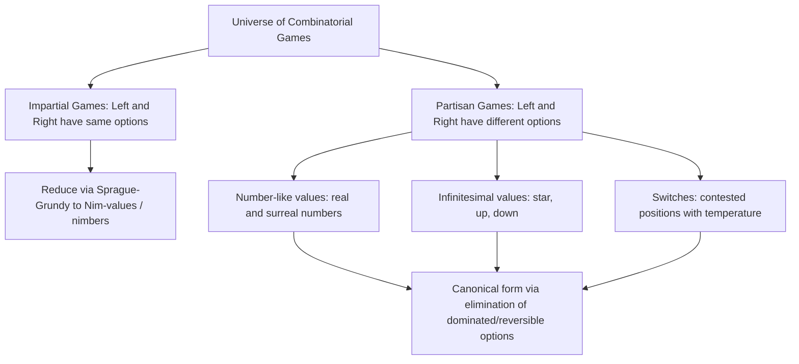

## Partisan Games

### Definition and Conceptual Overview

Partisan games are combinatorial games in which the two players — conventionally named **Left** and **Right** — do **not** have identical sets of legal moves from a given position. This contrasts directly with impartial games (e.g., Nim), where both players share the same move options and only turn order differs. Partisan game theory, developed primarily by John Horton Conway and popularized through the book *On Numbers and Games* and the multi-volume *Winning Ways for Your Mathematical Plays* (Berlangy, Conway, Guy), generalizes far beyond the single-integer Grundy-value framework of impartial games into a rich algebraic structure involving **surreal numbers** and **game values**.

**Key Points**

- Left and Right have potentially different move options from any given position — this asymmetry is the defining feature
- Game values are not simply non-negative integers (as in Nim); they form a much richer algebraic system encompassing numbers, infinitesimals, and more exotic values
- Partisan games can be added, compared, and assigned canonical "simplest form" values, extending arithmetic operations to games themselves
- Classic examples include **Hackenbush** (with colored edges), **Domineering**, and **Go endgames**

### Formal Game Definition (Conway's Recursive Construction)

A combinatorial game $G$ is formally defined recursively as an ordered pair of sets of games:

$$G = \{ G^L \mid G^R \}$$

where $G^L$ is the set of positions Left can move to ("Left options") and $G^R$ is the set of positions Right can move to ("Right options"). This recursive definition bottoms out at the empty game with no options for either player:

$$0 = \{ \mid \}$$

This single recursive definition, seeded from the empty game, generates the entire universe of combinatorial games (and, within that universe, the surreal numbers as a special case).

### Basic Examples of Simple Game Values

$$1 = \{0 \mid \} \quad \text{(Left has a move to 0, Right has no moves — Left is ahead by "one free move")}$$

$$-1 = \{ \mid 0\} \quad \text{(Right has a move to 0, Left has no moves)}$$

$$2 = \{1 \mid \}, \quad -2 = \{\mid -1\}$$

$$\frac{1}{2} = \{0 \mid 1\} \quad \text{(a value strictly between 0 and 1)}$$

These constructions show that **surreal numbers** — a proper superclass of the real numbers, including infinitesimals and infinite ordinals — emerge naturally as a special subclass of partisan game values, specifically those games where every Left option is strictly less than every Right option.

### Special Non-Number Values: Star, Up, and Down

Beyond ordinary numbers, partisan game theory identifies canonical values with distinct strategic character:

**Star ($*$):** $* = \{0 \mid 0\}$ — both players can move to the terminal position $0$. This is the game value of a single Nim-pile of size $1$. Star is neither positive, negative, nor equal to zero in the usual ordering sense — it is **confused with $0$** (denoted $* \| 0$), meaning whoever moves first in the game $*$ wins, matching the intuition that a lone Nim-pile of size 1 favors whoever moves.

**Up ($\uparrow$)** and **Down ($\downarrow$):** $\uparrow = \{0 \mid *\}$, $\downarrow = \{* \mid 0\} = -\uparrow$. These represent **infinitesimal** advantages — values smaller in magnitude than any positive real number but still strictly greater than (or less than) zero. Up is infinitesimally positive (favors Left slightly), Down is infinitesimally negative (favors Right slightly), yet neither is exactly equal to $0$, and both are distinct from $*$.

**Key Points**

- Numbers, star, up, down, and their combinations (e.g., $\uparrow\uparrow, \uparrow* $) form an extremely rich algebraic hierarchy
- Infinitesimal values like $\uparrow$ matter in the **endgame theory of Go**, where they correspond to extremely small but non-negligible point differences that can decide close games

### Game Comparison and Ordering

Partisan games admit a partial order (not a total order) via comparison against $0$:

- $G > 0$: Left wins regardless of who moves first (Left advantage)
- $G < 0$: Right wins regardless of who moves first (Right advantage)
- $G = 0$: The **second** player to move wins (a P-position in Left/Right terms)
- $G \| 0$ (G is "confused with" or "fuzzy with" 0): The **first** player to move wins, regardless of who that is

This four-way outcome classification (Left wins always / Right wins always / second player wins / first player wins) generalizes the simpler P-position/N-position binary classification used for impartial games.

### Canonical Form and Simplification

Every game has a unique **canonical form** — the simplest game value equal to it, obtained by iteratively removing **dominated options** (options strictly worse for the player who has them, given other available options) and **reversible options** (options that can be "seen through" because the opponent has an even better reply). This canonical form is essential for tractable analysis, since the raw recursive game tree of a position can be enormously larger than its simplified equivalent value.

### Sum of Partisan Games

Like impartial games, partisan games can be combined via **disjunctive sum**:

$$G + H = \{G^L + H, \, G + H^L \mid G^R + H, \, G + H^R\}$$

A move in the sum consists of moving in exactly one component. Unlike the impartial case, there is **no simple XOR-style arithmetic** for combining arbitrary partisan game values directly analogous to Nim-addition — the algebra of partisan games is instead governed by the full recursive definition and the notion of the **canonical form**, with numbers, infinitesimals, and switches (values like $\{n \mid -n\}$ that represent contested, temperature-bearing positions) each obeying different compositional rules.

### Canonical Example: Hackenbush

**Hackenbush** is played on a graph of edges attached (directly or via a chain of other edges) to a "ground" line. In the **partisan (bicolor)** variant, edges are colored Blue (Left can only remove Blue edges) or Red (Right can only remove Red edges); a move removes an edge, and any edges no longer connected to the ground are also removed. The player unable to move loses (normal play).

Hackenbush values correspond directly to **binary/surreal number expansions**: a "stalk" of alternating colors from the ground encodes a specific numeric value based on the sequence of colors, illustrating concretely how surreal numbers arise from combinatorial structures. A third color (Green, movable by either player) introduces impartial-style sub-positions, connecting back to Nim-values within an otherwise partisan game — a construction often used to illustrate how impartial games are a strict special case nested within the broader partisan framework.

### Canonical Example: Domineering

**Domineering** is played on a grid; Left places vertical $1\times2$ dominoes, Right places horizontal $2\times1$ dominoes, and the player unable to move loses. This game is fully partisan (Left and Right have structurally different placements available) and has been extensively analyzed using Conway's game-value framework, with many small board positions having been fully solved and expressed in canonical form, including nontrivial combinations of numbers, switches, and infinitesimals.

### Diagram: Partisan Game Value Hierarchy

### Diagram: Simple Game Value Tree for the Number 1 (svg_diagram)

<svg xmlns="http://www.w3.org/2000/svg" viewBox="0 0 640 260">
<text x="320" y="24" font-size="16" text-anchor="middle" font-weight="bold">Recursive Construction of Game Value 1 (svg_diagram)</text>
<circle cx="320" cy="70" r="26" fill="#dbeafe" stroke="#2563eb" stroke-width="2" />
<text x="320" y="76" font-size="14" text-anchor="middle">1</text>
<text x="320" y="105" font-size="11" text-anchor="middle" fill="#555">{0 | }</text>
<line x1="320" y1="96" x2="220" y2="160" stroke="#2563eb" stroke-width="1.5" />
<text x="180" y="150" font-size="12" fill="#2563eb">Left option</text>
<circle cx="220" cy="180" r="22" fill="#fef3c7" stroke="#d97706" stroke-width="1.5" />
<text x="220" y="186" font-size="13" text-anchor="middle">0</text>
<text x="220" y="215" font-size="11" text-anchor="middle" fill="#555">{ | }</text>

<text x="420" y="150" font-size="12" fill="`#dc2626`">No Right option</text>

<text x="420" y="170" font-size="11" fill="#555">(Right cannot move)</text>

<text x="320" y="245" font-size="11" text-anchor="middle" fill="#555">Left is one free move ahead of the terminal position</text>

</svg>

### Comparison: Impartial vs. Partisan Games

| Dimension | Impartial Games | Partisan Games |
| --- | --- | --- |
| Move sets for both players | Identical from any position | Generally different |
| Value system | Single non-negative integer (Grundy value / nimber) | Rich algebraic structure: numbers, surreals, infinitesimals, switches |
| Composition rule for sums | Simple XOR (Nim-addition) | Full recursive game-sum definition; no single closed-form shortcut |
| Canonical example | Nim | Hackenbush, Domineering, Go endgames |
| Outcome classes | P-position / N-position (2 classes) | Left wins / Right wins / 2nd player wins / 1st player wins (4 classes) |

### Applications and Significance

- **Go endgame theory:** Partisan combinatorial game theory, particularly the concept of **temperature** (a measure of how urgent/valuable it is to move in a given local region), has been directly applied to analyzing Go endgames, where local board regions can be treated as separate partisan games and summed.
- **Surreal number theory:** The construction of partisan games provides one of the cleanest constructive definitions of the surreal numbers, a number system that contains the reals, the ordinals, and infinitesimals within a single unified algebraic framework.
- **Algorithmic game solving:** Canonical form computation and simplification algorithms allow computer analysis of games like Domineering on boards too large for brute-force search, by decomposing the board into independent regions and summing their simplified game values.

[Unverified] The practical computational complexity of finding canonical forms for arbitrary partisan game positions can grow rapidly with position complexity, and while many specific small games and board sizes have been fully solved, general partisan game solving remains computationally demanding for larger or more intricate positions.

**Related Topics**

- Impartial Games, Nim, and the Sprague-Grundy Theorem
- Surreal Numbers and Conway's Construction
- Hackenbush (Blue-Red-Green Variants)
- Domineering and Grid-Based Partisan Games
- Temperature Theory and Go Endgame Analysis
- Canonical Form, Dominated and Reversible Options
- Switches and Infinitesimal Game Values (Up, Down, Star)