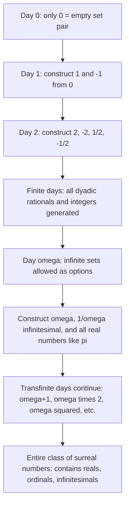

## Surreal Numbers

### Definition and Conceptual Overview

Surreal numbers are a number system, invented by John Horton Conway (originally motivated by his work on combinatorial game theory), that simultaneously contains the real numbers, the ordinal numbers, and infinitesimal quantities within a single unified algebraic field. They arise naturally as the special subclass of **partisan combinatorial games** in which every Left option is strictly less than every Right option — this places surreal numbers directly within the recursive game-value framework covered elsewhere in this chapter, while also giving them a fully self-contained identity as a number system with addition, multiplication, and a total order.

Conway's construction is notable for its extraordinary generality: a single recursive rule generates an enormous ordered field that properly contains every ordered field, including the real numbers, in a precise set-theoretic sense — a result formalized as the **surreal numbers being the largest possible ordered field** (up to the class-size caveats of set theory).

**Key Points**

- Every surreal number is constructed as $x = \{X^L \mid X^R\}$, a pair of sets of previously constructed surreal numbers, subject to the constraint that no element of $X^L$ is $\geq$ any element of $X^R$
- Surreal numbers include the familiar integers and reals, the transfinite ordinals ($\omega, \omega+1, \ldots$), and infinitesimals (numbers smaller in magnitude than any positive real, such as $1/\omega$)
- Surreal numbers form a **totally ordered field** (unlike the broader class of all combinatorial games, which are only partially ordered)
- The construction proceeds in a well-ordered sequence of "days," with each day generating new numbers from all numbers created on strictly earlier days

### Formal Construction Rule

**Definition:** A surreal number is a pair of sets of previously constructed surreal numbers, written $x = \{X^L \mid X^R\}$, subject to the constraint:

$$\text{no element of } X^L \text{ is} \geq \text{any element of } X^R$$

This is the identical recursive form used for general combinatorial games ($G = \{G^L \mid G^R\}$), but surreal numbers impose the additional "no crossing" constraint that guarantees the result behaves as a genuine number (totally ordered) rather than merely a game value (only partially ordered, potentially "confused with" other values).

**Comparison rule:** $x \geq y$ if and only if no element of $X^L$ is $\geq y$, and $x$ is not $\geq$ any element of $Y^R$ (defined mutually recursively along with the construction itself).

**Equality:** $x = y$ if and only if $x \geq y$ and $y \geq x$ — note that this does **not** require $X^L, X^R$ to be identical to $Y^L, Y^R$ as sets; many different representations can denote the same numeric value, motivating the notion of **canonical (simplest) form**.

### The Construction "Day by Day"

Surreal numbers are built up in a transfinite sequence of stages called "days," starting from the empty set.

**Day 0:** The only number constructible from no prior numbers is:

$$0 = \{\, \mid \,\}$$

**Day 1:** Using $\{0\}$ as the available pool of prior numbers, construct:

$$1 = \{0 \mid \,\}, \qquad -1 = \{\, \mid 0\}$$

(The pairing $\{0 \mid 0\}$ is disallowed since it violates the "no element of $X^L \geq$ any element of $X^R$" rule when $X^L$ and $X^R$ share an element — this actually generates the game value $*$, not a *number*, precisely because it fails the surreal ordering constraint.)

**Day 2:** Using $\{-1, 0, 1\}$, new numbers include:

$$2 = \{1 \mid \}, \quad -2 = \{\mid -1\}, \quad \frac{1}{2} = \{0 \mid 1\}, \quad -\frac{1}{2} = \{-1 \mid 0\}$$

**Pattern:** After $n$ finite days, exactly the dyadic rationals (rationals with denominator a power of 2) within a bounded range, together with the integers up to $\pm n$, have been constructed. This finite-day process alone generates all dyadic rationals but not yet all real numbers (e.g., $1/3$ requires an infinite construction process, appearing only "at day $\omega$").

### Emergence of Infinite and Infinitesimal Numbers

**Day $\omega$ (the first infinite day):** Having constructed all finite integers and all dyadic rationals across the finite days, new numbers become constructible using **infinite sets** as $X^L$ or $X^R$:

$$\omega = \{0, 1, 2, 3, \ldots \mid \,\} \quad \text{(the first infinite ordinal, and a surreal number)}$$

$$\frac{1}{\omega} = \{0 \mid 1, \frac{1}{2}, \frac{1}{4}, \frac{1}{8}, \ldots\} \quad \text{(a positive infinitesimal, smaller than every positive real number)}$$

$$\pi = \{3, 3.1, 3.14, \ldots \mid 4, 3.2, 3.15, \ldots\}$$

The construction of $\pi$ (and every other real number) at day $\omega$ illustrates the deep result that **every real number is a surreal number**, obtained as the unique surreal number that is the "simplest" value squeezed between rational approximations from below (as $X^L$) and above (as $X^R$).

**Key Points**

- $\omega$ is simultaneously the first infinite ordinal number *and* a legitimate surreal number, capable of being added, multiplied, and compared using ordinary field arithmetic — this is a genuinely new capability, since ordinal arithmetic in standard set theory is famously **not** a field (e.g., ordinal addition is non-commutative: $1 + \omega = \omega \neq \omega + 1$)
- Surreal arithmetic, by contrast, **is** commutative and satisfies full field axioms, so surreal $\omega$ behaves completely differently under $+$ and $\times$ than the ordinal $\omega$ does under ordinal arithmetic, despite sharing the same symbol and originating from the same construction
- Infinitesimals like $1/\omega$ satisfy $0 < 1/\omega < r$ for every positive real number $r$ — genuinely non-Archimedean behavior absent from the standard real number system

### Arithmetic Operations

**Addition:**

$$x + y = \{X^L + y, \, x + Y^L \mid X^R + y, \, x + Y^R\}$$

**Negation:**

$$-x = \{-X^R \mid -X^L\}$$

(swap the two sides and negate every element)

**Multiplication** (more intricate, defined recursively):

$$xy = \{X^L y + x Y^L - X^L Y^L, \; X^R y + x Y^R - X^R Y^R \mid X^L y + x Y^R - X^L Y^R, \; X^R y + x Y^L - X^R Y^L\}$$

[Unverified] The multiplication rule's correctness proof (that it is well-defined, respects the ordering, and satisfies the field axioms including associativity and distributivity) is one of the more technically demanding parts of the theory and is typically established through careful induction across the "birthday" ordering; it is not a simple direct consequence of the addition and comparison rules alone.

### The Simplicity Theorem

A cornerstone structural result: **every surreal number has a unique simplest representation**, and the entire numeric universe can be understood via the **Simplicity Theorem**: given any "gap" bounded below by a set $L$ of numbers and above by a set $R$ of numbers (with every element of $L$ less than every element of $R$), there exists a **unique simplest number** — the one constructed on the earliest possible "day" — that fits in the gap and equals $\{L \mid R\}$. This theorem is what allows real numbers to be recovered as the simplest surreal numbers sandwiched between rational approximations, and is the same underlying principle used in games to find the canonical/simplest game value equal to a complicated position.

### Diagram: The Birthday Construction Sequence

### Diagram: Number Line Placement of Key Surreal Values (svg_diagram)

<svg xmlns="http://www.w3.org/2000/svg" viewBox="0 0 640 220">
<text x="320" y="24" font-size="16" text-anchor="middle" font-weight="bold">Surreal Numbers Relative to the Reals (svg_diagram)</text>
<line x1="60" y1="110" x2="580" y2="110" stroke="black" stroke-width="2" />
<circle cx="120" cy="110" r="5" fill="#2563eb" />
<text x="120" y="135" font-size="12" text-anchor="middle">-1</text>
<circle cx="320" cy="110" r="5" fill="#2563eb" />
<text x="320" y="135" font-size="12" text-anchor="middle">0</text>
<circle cx="520" cy="110" r="5" fill="#2563eb" />
<text x="520" y="135" font-size="12" text-anchor="middle">1</text>
<circle cx="335" cy="110" r="4" fill="#dc2626" />
<text x="335" y="90" font-size="11" text-anchor="middle" fill="#dc2626">1/ω (infinitesimal)</text>
<line x1="335" y1="98" x2="335" y2="105" stroke="#dc2626" />

<text x="600" y="115" font-size="14" text-anchor="middle" fill="`#059669`">ω</text>

<text x="600" y="135" font-size="10" text-anchor="middle" fill="#555">(infinite,</text>

<text x="600" y="148" font-size="10" text-anchor="middle" fill="#555">far right)</text>

<text x="320" y="180" font-size="11" text-anchor="middle" fill="#555">Infinitesimals cluster arbitrarily close to 0 but are never equal to it</text>

</svg>

### Relationship to Combinatorial Game Theory

| Aspect | Surreal Numbers | General Partisan Games |
| --- | --- | --- |
| Ordering constraint | Total order (every pair comparable) | Only partial order (some pairs "confused," i.e., $G \| H$) |
| Construction rule | $\{X^L \mid X^R\}$ with no-crossing constraint | $\{G^L \mid G^R\}$ with no additional constraint |
| Contains as special case | N/A (is the special case) | Surreal numbers are the numeric subset |
| Non-number example excluded | $*= \{0\mid 0\}$ is excluded (violates ordering constraint) | $*$ is a perfectly valid game value |
| Algebraic structure | Ordered field | Partially ordered abelian group (under addition) but not a field |

### Applications and Significance

- **Foundational role in combinatorial game theory:** Surreal numbers provide the "number" backbone against which more general game values (infinitesimals like $\uparrow, \downarrow$, and switches) are measured and compared, since determining whether a game is "close to" a number is central to endgame analysis in games like Go.
- **Set-theoretic and foundational mathematics:** The surreal numbers illustrate how a remarkably simple recursive definition can generate a proper class containing the real numbers, all ordinals, and non-Archimedean infinitesimals — of interest in mathematical logic and foundations independent of any game-theoretic application.
- **Non-standard analysis connections:** [Unverified] Surreal numbers share conceptual territory with other systems of infinitesimals (such as those in non-standard analysis via ultrafilters), though the two constructions are built through substantially different formal machinery, and the precise technical relationship between surreal numbers and hyperreal numbers involves subtleties beyond a simple equivalence.
- **Recreational and pedagogical value:** The surreal number construction is frequently used as an elegant, self-contained illustration of how axiomatic recursive definitions in mathematics can yield surprisingly rich structures from minimal starting assumptions.

**Related Topics**

- Partisan Games and Conway's Recursive Game Definition
- Star, Up, Down, and Infinitesimal Game Values
- Canonical Form and the Simplicity Theorem in Game Values
- Ordinal Numbers and Transfinite Arithmetic (Contrast with Surreal Arithmetic)
- Temperature Theory and Go Endgame Applications
- Hackenbush as a Constructive Model of Surreal Numbers
- Non-Standard Analysis and Alternative Infinitesimal Number Systems