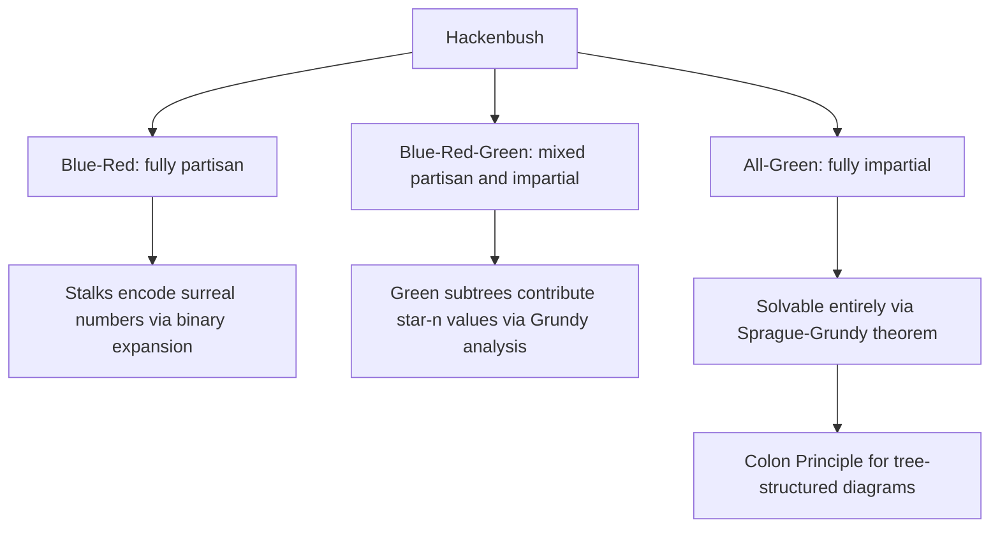

## Hackenbush and Related Games

### Definition and Conceptual Overview

Hackenbush is a combinatorial game played on a diagram of line segments ("edges") connected to a horizontal "ground" line, either directly or via a chain of other edges. On each turn, a player removes a single edge; any edges no longer connected to the ground (directly or transitively through remaining edges) are also removed as a consequence ("falling" away). The player unable to move (when no edges remain) loses under the standard normal play convention. Hackenbush is significant not merely as a recreational game but as a **concrete, constructive model** that makes the abstract algebra of surreal numbers and game values tangible — specific Hackenbush positions correspond directly and computably to specific surreal number values.

Hackenbush comes in several variants distinguished by how many colors of edges are used and which player may remove which color, and each variant sits at a different point in the impartial/partisan spectrum covered elsewhere in this chapter.

**Key Points**

- **Blue-Red Hackenbush (bicolor, fully partisan):** Blue edges can only be removed by Left, Red edges only by Right — no impartial component at all
- **Blue-Red-Green Hackenbush (tricolor, mixed):** adds Green edges removable by *either* player, introducing impartial sub-structure into an otherwise partisan game
- **All-Green Hackenbush:** every edge is Green (removable by either player), making the entire game **impartial**, analyzable directly via the Sprague-Grundy theorem rather than the full partisan machinery
- The "falling" rule (edges disconnected from the ground are removed) is what gives Hackenbush its distinctive combinatorial richness relative to simpler edge-removal games

### Blue-Red Hackenbush and Surreal Number Values

In Blue-Red Hackenbush, a simple vertical "stalk" of edges directly above the ground, alternating or uniformly colored, encodes a specific numeric (surreal) value through binary-expansion-like logic.

**Simplest case — uniform stalk:** A stalk of $n$ Blue edges stacked on the ground has game value exactly $n$ (Left is $n$ free moves ahead). A stalk of $n$ Red edges has value $-n$.

**Mixed stalks and binary expansion:** A stalk with a Blue edge at the ground followed by a Red edge has value $\frac{1}{2}$; more generally, reading a stalk from the ground upward, each edge contributes a term in a binary-fraction-like expansion, where Blue edges contribute positively and Red edges contribute negatively, with the contribution of the $k$-th edge above the first sign-change scaled by $1/2^{k}$. This gives a direct, constructive way to represent **any dyadic rational number** as a specific finite Hackenbush stalk — an elegant concrete illustration of the abstract surreal number construction discussed for partisan games generally.

**Branching structures:** More complex Hackenbush diagrams (trees or graphs, not just simple stalks) can represent more exotic surreal and game values, including infinitesimals, though computing the exact value of an arbitrary branching Hackenbush position can require applying the general recursive game-value machinery (canonical form simplification) rather than a simple direct-reading rule.

### Worked Example: Computing a Stalk Value

Consider a stalk with, from the ground upward: Blue, Blue, Red.

- The bottom Blue edge alone (ignoring the rest) would be worth $1$ if it were the entire stalk.
- Adding the second Blue edge on top increases the value toward $2$, but it is not yet "locked in" as $2$ because a Red edge sits above it, contingent on the lower edges surviving.
- Following the standard Hackenbush stalk-reading algorithm (read from the ground, tally full points for consecutive same-colored edges from the bottom, then add binary fractions for the color change): this specific stalk evaluates to $1\tfrac{1}{2}$ (two full Blue moves' worth, adjusted down by the trailing Red edge's fractional contribution).

[Unverified] Exact numeric evaluation of longer or more complex mixed stalks is mechanical but detail-sensitive; readers applying the binary-expansion rule to non-trivial branching structures should verify results against the general recursive game-value definition, since the simple "stalk-reading" shortcut applies cleanly only to straight vertical stalks, not general graphs.

### Blue-Red-Green Hackenbush: Mixing Partisan and Impartial Elements

When Green edges are added, both players may remove them. A pure subtree made entirely of Green edges, when analyzed as an isolated component, behaves like an **impartial game** and can be assigned a Grundy value via the Sprague-Grundy theorem. When such a Green subtree is attached within a larger mixed diagram, its contribution to the overall game value corresponds to the game value $*n$ (a "star" value of size $n$, generalizing the basic star value $* = \{0\mid 0\}$ introduced for impartial games), reflecting that its Grundy value determines a fuzzy (first-player-advantageous), non-numeric contribution to the total position.

This tricolor variant is often used pedagogically precisely because it demonstrates, within a single unified diagram, how **impartial games (Green subtrees) are a strict special case nested inside the broader partisan framework** — a Green Hackenbush component's Grundy-value analysis and a general partisan component's surreal-value analysis must be combined using the full disjunctive-sum machinery for mixed games, since the simple XOR shortcut of pure Nim does not directly apply once numeric (non-star) values are also present in the sum.

### All-Green Hackenbush: A Purely Impartial Variant

When every edge is Green, Hackenbush reduces to a fully impartial game, directly solvable via Grundy value computation. A well-known specific structural result:

**Colon Principle (for Green Hackenbush trees):** For a tree structure (a Green Hackenbush diagram with no cycles) rooted at the ground, the Grundy value of the whole tree can be computed by a bottom-up procedure: replace each subtree hanging from a vertex with a single edge of length equal to the Grundy value already computed for that subtree (this uses the fact that a stalk of length $n$ has Grundy value $n$, matching a single Nim-pile), then combine sibling subtrees via Nim-addition (XOR) at each branching vertex, working from the leaves down to the ground.

[Unverified] The Colon Principle applies cleanly to tree-structured (acyclic) Green Hackenbush diagrams; general graphs with cycles in Green Hackenbush require more care, and the straightforward XOR-based reduction is not guaranteed to extend without modification to arbitrary cyclic configurations.

### Diagram: Hackenbush Stalk Value Encoding (svg_diagram)

<svg xmlns="http://www.w3.org/2000/svg" viewBox="0 0 640 300">
<text x="320" y="24" font-size="16" text-anchor="middle" font-weight="bold">Hackenbush Stalk Encoding a Surreal Value (svg_diagram)</text>
<line x1="60" y1="260" x2="580" y2="260" stroke="black" stroke-width="4" />
<text x="320" y="285" font-size="12" text-anchor="middle">Ground</text>
<line x1="200" y1="260" x2="200" y2="200" stroke="#2563eb" stroke-width="6" />
<text x="235" y="235" font-size="11" fill="#2563eb">Blue edge 1</text>
<line x1="200" y1="200" x2="200" y2="140" stroke="#2563eb" stroke-width="6" />
<text x="235" y="175" font-size="11" fill="#2563eb">Blue edge 2</text>
<line x1="200" y1="140" x2="200" y2="80" stroke="#dc2626" stroke-width="6" />
<text x="235" y="115" font-size="11" fill="#dc2626">Red edge 3</text>

<text x="380" y="150" font-size="14" text-anchor="middle" fill="#333">Value = 1.5</text>

<text x="380" y="175" font-size="11" text-anchor="middle" fill="#555">(two full Blue points,</text>

<text x="380" y="190" font-size="11" text-anchor="middle" fill="#555">reduced by trailing Red fraction)</text>

</svg>

### Diagram: Hackenbush Variant Classification

### Related Games in the Same Family

| Game | Description | Theoretical Classification |
| --- | --- | --- |
| **Blue-Red Hackenbush** | Colored edges, ground-connectivity removal rule | Fully partisan; values are surreal numbers |
| **Blue-Red-Green Hackenbush** | Adds neutral removable edges | Mixed; combines Grundy analysis and surreal values |
| **Green Hackenbush** | All edges neutral | Fully impartial; solved via Sprague-Grundy theorem |
| **Toads and Frogs** | Tokens on a strip move/jump in restricted directions per player | Fully partisan; produces rich number and switch values |
| **Domineering** | Grid-based domino placement, orientation-restricted per player | Fully partisan; extensively computer-solved for small boards |
| **Col / Snort** | Graph vertex-coloring games with adjacency restrictions | Partisan (Col) / partisan variant (Snort), related to graph coloring theory |

### Applications and Significance

- **Constructive pedagogy for surreal numbers:** Hackenbush's stalk-value correspondence is one of the most commonly used teaching devices for making the otherwise highly abstract surreal number construction concrete and computable by hand.
- **Illustrating the impartial-partisan spectrum within one game family:** The tricolor variant explicitly shows how impartial game theory (Sprague-Grundy) nests inside the broader partisan framework, rather than being a wholly separate theory.
- **Testbed for canonical form algorithms:** Because Hackenbush diagrams can be constructed with arbitrary branching complexity, they serve as a standard test case in computational combinatorial game theory for algorithms that compute canonical (simplest) game forms.
- **Connections to graph theory:** The all-Green variant, and related games like Col and Snort, connect combinatorial game theory directly to graph-theoretic properties (connectivity, coloring, tree structure), making Hackenbush a bridge topic between the two fields.

**Related Topics**

- Partisan Games and Conway's Recursive Game Definition
- Surreal Numbers and the Simplicity Theorem
- Impartial Games, Nim, and the Sprague-Grundy Theorem
- Canonical Form, Dominated and Reversible Options
- Domineering and Grid-Based Partisan Games
- Temperature Theory and Endgame Applications
- Graph-Theoretic Combinatorial Games (Col, Snort)