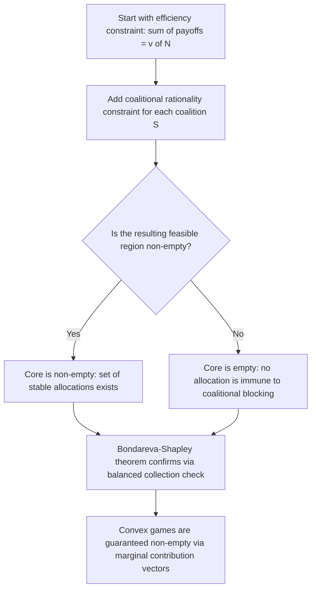

## The Core

### Definition and Conceptual Overview

The Core is a foundational **solution concept** in cooperative game theory that characterizes the set of allocations of a transferable utility (TU) game's total value which are **stable against coalitional deviation** — no subgroup of players, acting together, can do better for all its members by breaking away from the grand coalition and dividing their own achievable value $v(S)$ among themselves instead. The Core formalizes the idea of a "self-enforcing" or "blocking-proof" agreement: it is the set of allocations that no coalition has both the ability and the incentive to reject.

The Core was introduced by Gillies (1953) and Shapley (1953) and remains the primary stability-based (as opposed to fairness-based) solution concept in cooperative game theory, contrasting with allocation rules like the Shapley value that are motivated by axiomatic fairness rather than coalitional stability directly.

**Key Points**

- An allocation is in the Core if and only if **no coalition can improve upon it** by acting alone
- The Core can be **empty** — some games admit no stable allocation at all, a central limitation of the concept
- When non-empty, the Core is typically a large set (a polytope) rather than a single point, unlike the Shapley value or Nucleolus, which each select a unique allocation
- Convex games are guaranteed to have a non-empty Core; this is one of the primary motivations for studying convexity as a game property

### Formal Definition

For a TU game $(N, v)$, the Core is the set of allocations $x = (x_1, \ldots, x_n) \in \mathbb{R}^n$ satisfying:

**Efficiency:**

$$\sum_{i \in N} x_i = v(N)$$

**Coalitional rationality (no blocking):** for every coalition $S \subseteq N$,

$$\sum_{i \in S} x_i \geq v(S)$$

The second condition is the defining constraint: it requires that every possible coalition $S$ receives, in total, at least as much under allocation $x$ as they could guarantee by breaking away and achieving $v(S)$ on their own. If this condition fails for some coalition $S$, that coalition is said to **block** the allocation $x$ — the members of $S$ would strictly prefer to leave the grand coalition and split $v(S)$ among themselves under some alternative allocation, making $x$ unstable.

Note that individual rationality ($x_i \geq v(\{i\})$, required merely for an imputation) is the special case of coalitional rationality applied to singleton coalitions $S = \{i\}$ — the Core's requirement is a strict strengthening that must hold for **every** subset, not just individuals.

### Worked Example: The Glove Game Revisited

Recall the three-player glove game: Player 1 has a left glove, Players 2 and 3 each have a right glove, and a matched pair is worth $1.

$$v(\{1\})=v(\{2\})=v(\{3\})=0, \quad v(\{1,2\})=v(\{1,3\})=1, \quad v(\{2,3\})=0, \quad v(N)=1$$

**Finding the Core:** We need $x_1+x_2+x_3=1$, and the coalitional rationality constraints:

$$x_1 \geq 0, \; x_2 \geq 0, \; x_3 \geq 0$$

$$x_1 + x_2 \geq 1, \; x_1 + x_3 \geq 1, \; x_2 + x_3 \geq 0$$

Since $x_1+x_2+x_3 = 1$ and $x_1+x_2 \geq 1$, it follows that $x_3 \leq 0$; combined with $x_3 \geq 0$, this forces $x_3 = 0$. By the same logic applied to $x_1+x_3 \geq 1$, we get $x_2 = 0$. Therefore $x_1 = 1$.

**Conclusion:** The Core of this game contains the **single allocation** $(1, 0, 0)$ — Player 1, being essential to any positive-value pairing, captures the entire surplus, while Players 2 and 3 (perfect substitutes for each other) receive nothing, since either one alone with Player 1 could achieve the full value, undercutting any positive payment demanded by the other. This example illustrates how the Core can sometimes single out a unique, highly asymmetric allocation driven purely by coalitional bargaining leverage.

### Worked Example: An Empty Core

Consider a three-player majority game where any two-player coalition (a "majority") can secure the full value, but a single player secures nothing:

$$v(\{1\})=v(\{2\})=v(\{3\})=0, \quad v(\{1,2\})=v(\{1,3\})=v(\{2,3\})=1, \quad v(N)=1$$

**Checking for a Core allocation:** We would need $x_1+x_2+x_3=1$ and simultaneously $x_1+x_2\geq1$, $x_1+x_3\geq1$, $x_2+x_3\geq1$. Summing all three coalition constraints: $2(x_1+x_2+x_3) \geq 3$, i.e., $x_1+x_2+x_3 \geq 1.5$. But efficiency requires $x_1+x_2+x_3=1$. Since $1 < 1.5$, **no allocation can satisfy all constraints simultaneously** — the Core is **empty**.

**Interpretation:** In this majority game, any two players can always profitably defect and split the full value $v(N)=1$ between just themselves, leaving the third player with nothing — but this logic applies symmetrically to every pair, so no allocation is immune to being blocked by some rival coalition. This is the canonical illustration of Core emptiness and reflects deep instability in simple majority-voting-style games.

### The Bondareva-Shapley Theorem: Characterizing Non-Emptiness

The **Bondareva-Shapley theorem** provides a complete characterization of when a TU game's Core is non-empty, in terms of **balanced collections** of coalitions.

**Balanced collection:** A collection of coalitions $\{S_1, \ldots, S_k\}$ (with possible repeats/weights) is **balanced** if there exist non-negative weights $\lambda_1, \ldots, \lambda_k$ such that for every player $i \in N$:

$$\sum_{k : i \in S_k} \lambda_k = 1$$

(intuitively, the weighted coalitions "cover" each player's total available time/participation exactly once, generalizing the idea of a partition).

**Theorem statement:** The Core of $(N,v)$ is non-empty if and only if the game is **balanced**, meaning for every balanced collection of coalitions with weights $\lambda_k$:

$$\sum_k \lambda_k \, v(S_k) \leq v(N)$$

This theorem generalizes the simple observation used in the empty-Core example above (where the "balanced collection" was the three pairwise coalitions, each weighted $\frac{1}{2}$, exactly covering each player once) into a fully general necessary-and-sufficient condition applicable to any TU game.

### Convexity Guarantees Non-Emptiness

As established when convex games were introduced, **every convex game has a non-empty Core**. In fact, for convex games, a natural class of Core allocations can be constructed directly: for any ordering (permutation) $\pi$ of the players, assigning each player their **marginal contribution** when added to the coalition of players preceding them in the ordering always produces a Core allocation. This is the same construction used to define the Shapley value (as an average over all such marginal-contribution vectors), which is why, for convex games specifically, **the Shapley value is always guaranteed to lie inside the Core** — a coincidence of stability and fairness properties that does not hold for general (non-convex) games.

### Diagram: Core as an Intersection of Half-Spaces

### Diagram: Core Region in a 3-Player Game (svg_diagram)

<svg xmlns="http://www.w3.org/2000/svg" viewBox="0 0 640 320">
<text x="320" y="24" font-size="16" text-anchor="middle" font-weight="bold">Core as a Region on the Efficiency Simplex (svg_diagram)</text>
<polygon points="320,60 140,280 500,280" fill="none" stroke="black" stroke-width="2" />
<text x="320" y="45" font-size="12" text-anchor="middle">x1 = v(N)</text>
<text x="110" y="300" font-size="12" text-anchor="middle">x2 = v(N)</text>
<text x="530" y="300" font-size="12" text-anchor="middle">x3 = v(N)</text>
<polygon points="290,140 350,140 320,200" fill="#bbf7d0" stroke="#059669" stroke-width="2" />
<text x="320" y="175" font-size="11" text-anchor="middle" fill="#065f46">Core</text>

<text x="320" y="310" font-size="11" text-anchor="middle" fill="#555">Every allocation on the triangle satisfies efficiency; only shaded region also satisfies coalitional rationality</text>

</svg>

### Related Refinements and Extensions

| Concept | Relationship to the Core |
| --- | --- |
| **Least Core** | The set of allocations minimizing the maximum coalitional "excess" (deficit); always non-empty even when the ordinary Core is empty, obtained by relaxing coalitional rationality by the smallest uniform amount $\epsilon$ needed |
| **Nucleolus** | A unique allocation found by lexicographically minimizing coalitional excesses; always lies within the Core when the Core is non-empty, and always exists (using the Least Core relaxation) even when the Core is empty |
| **Kernel and Bargaining Set** | Alternative stability concepts using pairwise bargaining power comparisons rather than full coalitional blocking; generally larger (less restrictive) than the Core |
| **Strong Core / Epsilon-Core** | Variants relaxing or strengthening the blocking condition to account for transaction costs or coalition formation frictions |

### Comparison: Core vs. Shapley Value

| Dimension | The Core | The Shapley Value |
| --- | --- | --- |
| Motivating criterion | Coalitional stability (no profitable deviation) | Axiomatic fairness (efficiency, symmetry, additivity, null player) |
| Uniqueness | Typically a set (polytope), can be empty | Always a single unique allocation |
| Existence guarantee | Not guaranteed (requires balancedness) | Always exists for any TU game |
| Relationship | Shapley value may or may not lie in the Core | For convex games, always lies in the Core |

### Applications

- **Cost-sharing agreements:** Municipalities or firms sharing infrastructure use the Core to identify cost allocations that no subgroup would find profitable to reject in favor of building independently
- **Market and exchange economies:** The Core concept extends to general equilibrium theory, where it characterizes allocations robust to any subgroup of traders re-contracting among themselves (connecting cooperative game theory to the **Edgeworth box** and general equilibrium)
- **Matching markets:** Stable matching concepts (e.g., in the Gale-Shapley framework) are closely related to Core-like stability notions, generalized to non-transferable-utility contexts
- **Assessing coalition viability in political science:** Analysts use Core (non-)emptiness to assess whether stable governing coalitions can form given a particular distribution of bargaining power among parties

[Unverified] Empirical application of the Core to real-world bargaining or coalition-formation settings often requires simplifying assumptions about how characteristic function values are estimated, and predictions based on Core stability may not fully capture behavioral or institutional frictions present in actual negotiations.

**Related Topics**

- Transferable Utility Games and Characteristic Functions
- The Shapley Value and Axiomatic Characterization
- The Nucleolus and Least-Core Construction
- Convex Games and Marginal Contribution Vectors
- Bondareva-Shapley Theorem and Balanced Collections
- Stable Matching and the Gale-Shapley Algorithm
- General Equilibrium Theory and the Edgeworth Box