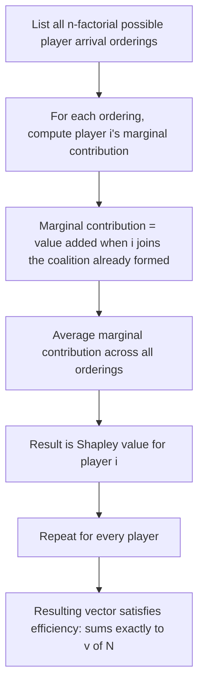

## The Shapley Value

### Definition and Conceptual Overview

The Shapley value is a unique payoff allocation rule for transferable utility (TU) cooperative games, introduced by Lloyd Shapley (1953), that distributes the total value $v(N)$ generated by the grand coalition among all players according to a precise notion of **average marginal contribution**. Unlike the Core, which is motivated by coalitional stability and may be empty or a large set, the Shapley value is motivated by **axiomatic fairness**: it is the *unique* allocation rule satisfying a small set of natural fairness properties, and it always exists and is always a single point, for every TU game.

The Shapley value's central intuition: imagine the grand coalition forms by players joining one at a time, in some random order. Each player, upon joining, receives their **marginal contribution** — the additional value they bring to the coalition already assembled. The Shapley value of a player is that player's marginal contribution **averaged over all possible orderings** in which the coalition could form.

**Key Points**

- The Shapley value always exists and is unique for every TU game $(N,v)$ — no balancedness or convexity condition is required, unlike the Core
- It is characterized axiomatically by four properties: Efficiency, Symmetry, Null Player (Dummy), and Additivity
- It does **not** guarantee coalitional stability in general — the Shapley value allocation may lie outside the Core for non-convex games
- For convex games specifically, the Shapley value is always guaranteed to lie within the Core

### Formal Definition

For player $i$ in game $(N,v)$, the Shapley value is:

$$\phi_i(v) = \sum_{S \subseteq N \setminus \{i\}} \frac{|S|! \, (n - |S| - 1)!}{n!} \Big[ v(S \cup \{i\}) - v(S) \Big]$$

where $n = |N|$. The term $v(S \cup \{i\}) - v(S)$ is player $i$'s marginal contribution to coalition $S$, and the combinatorial weight $\frac{|S|!(n-|S|-1)!}{n!}$ represents the probability that, in a uniformly random ordering of all $n$ players, the set of players preceding $i$ is exactly $S$.

**Equivalent "random order" formulation:**

$$\phi_i(v) = \frac{1}{n!} \sum_{\pi \in \Pi(N)} \Big[ v(P_i^\pi \cup \{i\}) - v(P_i^\pi) \Big]$$

where $\Pi(N)$ is the set of all $n!$ orderings (permutations) of players, and $P_i^\pi$ denotes the set of players who precede player $i$ in ordering $\pi$. This formulation makes explicit that the Shapley value is a simple arithmetic **average of marginal contributions across all possible arrival orders**.

### The Four Defining Axioms

The Shapley value is the **unique** allocation rule satisfying all four of the following axioms simultaneously (Shapley's original characterization theorem):

**1. Efficiency:** $\sum_{i \in N} \phi_i(v) = v(N)$ — the entire value generated by full cooperation is completely distributed among the players.

**2. Symmetry (Equal Treatment of Equals):** If players $i$ and $j$ are **interchangeable** — meaning $v(S \cup \{i\}) = v(S \cup \{j\})$ for every coalition $S$ not containing either — then $\phi_i(v) = \phi_j(v)$. Players who contribute identically to every coalition must receive identical payoffs.

**3. Null Player (Dummy Player):** If player $i$ is a **null player** — meaning $v(S \cup \{i\}) = v(S)$ for every coalition $S$ (i.e., $i$ never adds any value to any coalition) — then $\phi_i(v) = 0$. A player who contributes nothing receives nothing.

**4. Additivity (Linearity):** For any two games $v$ and $w$ defined on the same player set, $\phi_i(v + w) = \phi_i(v) + \phi_i(w)$, where $(v+w)(S) = v(S) + w(S)$. If a player participates in two separate cooperative ventures simultaneously, their total Shapley payoff equals the sum of what they would receive from each venture analyzed independently.

**Shapley's Theorem:** These four axioms uniquely pin down the formula above — no other allocation rule satisfies all four simultaneously.

### Worked Example: The Glove Game

Recall the glove game: Player 1 has a left glove; Players 2, 3 each have a right glove; a matched pair is worth $1.

$$v(\{1\})=v(\{2\})=v(\{3\})=0, \; v(\{1,2\})=v(\{1,3\})=1, \; v(\{2,3\})=0, \; v(N)=1$$

**Computing $\phi_1$ by averaging marginal contributions over all $3! = 6$ orderings:**

| Ordering | Player 1's marginal contribution |
| --- | --- |
| 1,2,3 | $v(\{1\}) - v(\emptyset) = 0$ |
| 1,3,2 | $v(\{1\}) - v(\emptyset) = 0$ |
| 2,1,3 | $v(\{1,2\}) - v(\{2\}) = 1$ |
| 3,1,2 | $v(\{1,3\}) - v(\{3\}) = 1$ |
| 2,3,1 | $v(\{1,2,3\}) - v(\{2,3\}) = 1 - 0 = 1$ |
| 3,2,1 | $v(\{1,2,3\}) - v(\{2,3\}) = 1 - 0 = 1$ |

$$\phi_1 = \frac{0+0+1+1+1+1}{6} = \frac{4}{6} = \frac{2}{3}$$

By the **symmetry axiom**, since Players 2 and 3 are interchangeable (each contributes identically to every coalition not containing the other), $\phi_2 = \phi_3$. By **efficiency**, $\phi_1+\phi_2+\phi_3 = 1$, so $\phi_2+\phi_3 = \frac{1}{3}$, giving $\phi_2 = \phi_3 = \frac{1}{6}$.

**Result:** $\phi = \left(\frac{2}{3}, \frac{1}{6}, \frac{1}{6}\right)$.

**Comparison with the Core:** Recall the Core of this same game was the single point $(1,0,0)$. The Shapley value $\left(\frac{2}{3},\frac{1}{6},\frac{1}{6}\right)$ is **not** in the Core (check: $\phi_2+\phi_3 = \frac{1}{3} < 1 = v(\{2,3\})$... actually verify against $v(\{1,2\})=1$: $\phi_1+\phi_2 = \frac{2}{3}+\frac{1}{6}=\frac{5}{6} < 1$, violating coalitional rationality for coalition $\{1,2\}$). This concretely demonstrates that the **Shapley value's fairness criterion and the Core's stability criterion can diverge** — the Shapley value gives Players 2 and 3 something for their "option value" as potential substitutes, even though the Core assigns them nothing given their lack of essential bargaining power.

### Diagram: Marginal Contribution Averaging Process

### Diagram: Marginal Contribution Across Orderings (svg_diagram)

<svg xmlns="http://www.w3.org/2000/svg" viewBox="0 0 640 260">
<text x="320" y="24" font-size="16" text-anchor="middle" font-weight="bold">Player i's Marginal Contribution Across Orderings (svg_diagram)</text>

<text x="60" y="70" font-size="12">Ordering 1: [A, B, i, C] → i joins {A,B}, contributes v({A,B,i}) - v({A,B})</text>

<text x="60" y="105" font-size="12">Ordering 2: [C, i, A, B] → i joins {C}, contributes v({C,i}) - v({C})</text>

<text x="60" y="140" font-size="12">Ordering 3: [A, C, B, i] → i joins {A,B,C}, contributes v(N) - v({A,B,C})</text>

<line x1="60" y1="170" x2="580" y2="170" stroke="#999" stroke-dasharray="4,4" />

<text x="60" y="200" font-size="13" font-weight="bold">Shapley value = average of all such marginal contributions</text>

<text x="60" y="225" font-size="11" fill="#555">Each ordering is equally likely (probability 1/n!); weighting by coalition-size combinatorics</text>

<text x="60" y="240" font-size="11" fill="#555">gives the closed-form Shapley formula without enumerating every permutation explicitly</text>

</svg>

### The Shapley Value for Convex Games

As noted when discussing the Core, for **convex games** the marginal-contribution vector associated with *any* fixed ordering is itself a Core allocation. Since the Shapley value is precisely the average of these marginal-contribution vectors across all orderings, and the Core is a convex set, the average of points within the Core is itself in the Core. This is why **convexity guarantees that the Shapley value lies inside the Core** — a result that does not extend to general (non-convex) TU games, as the glove game example above demonstrates.

### Alternative Characterizations and Extensions

- **Potential function approach (Hart-Mas-Colell):** The Shapley value can alternatively be derived from a single real-valued "potential function" $P(N,v)$ via $\phi_i(v) = P(N,v) - P(N\setminus\{i\}, v)$, offering an alternative axiomatic route to the same allocation.
- **Random-order values and weighted Shapley values:** Generalizations relax the assumption that all orderings are equally likely, instead using arbitrary probability distributions over orderings or player-specific weights, producing a broader family of "weighted Shapley values" for contexts where players are not treated symmetrically ex ante.
- **Banzhaf value:** A related but distinct power/allocation index that averages marginal contributions over all possible *coalitions* (not weighted by ordering-consistent probabilities as the Shapley value is), commonly used in voting power analysis alongside or instead of the Shapley-Shubik index.

### Comparison: Shapley Value vs. Core vs. Nucleolus

| Dimension | Shapley Value | Core | Nucleolus |
| --- | --- | --- | --- |
| Existence | Always exists | May be empty | Always exists |
| Uniqueness | Always unique | Typically a set, not a point | Always unique |
| Motivating principle | Axiomatic fairness | Coalitional stability | Lexicographic minimization of maximum dissatisfaction |
| Guaranteed in Core? | Only for convex games | N/A (defines the Core itself) | Always in the Core when Core is non-empty |
| Computational complexity | Exponential in naive form; efficient closed forms exist for special game classes | Requires solving for feasibility of a linear system with exponentially many constraints | Requires solving a sequence of linear programs |

### Applications

- **Cost and profit allocation:** Widely used to fairly divide joint costs (e.g., shared infrastructure costs among municipalities) or joint profits (e.g., revenue-sharing in business consortia) based on each party's marginal contribution
- **Voting power measurement:** The **Shapley-Shubik power index** applies the Shapley value formula directly to simple (0/1-valued) games representing voting bodies, quantifying each voter or party's influence
- **Machine learning feature attribution:** The Shapley value has been adapted (via "SHAP" — SHapley Additive exPlanations) as a model-agnostic method for attributing a machine learning model's prediction to individual input features, treating features as "players" contributing to the "coalition" that produces a prediction
- **Network and supply chain value attribution:** Used to fairly allocate the value created by a supply chain or network among constituent firms or nodes, based on each participant's marginal contribution to overall network value

[Unverified] The computational cost of the exact Shapley value formula grows factorially with the number of players in the naive enumeration approach; practical applications with large player/feature sets (as in SHAP-based machine learning explainability) typically rely on sampling-based or model-specific approximation algorithms rather than exact computation, and the fidelity of these approximations can vary by implementation and use case.

**Related Topics**

- Transferable Utility Games and Characteristic Functions
- The Core and Coalitional Stability
- The Nucleolus and Lexicographic Allocation
- Convex Games and Marginal Contribution Vectors
- Simple Games and the Shapley-Shubik Power Index
- The Banzhaf Value and Alternative Power Indices
- SHAP Values in Machine Learning Interpretability