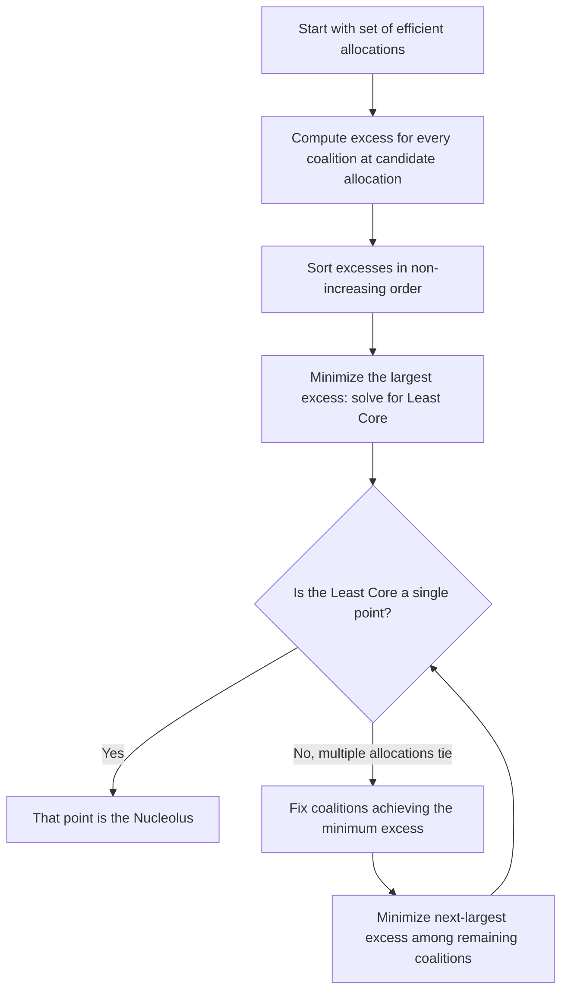

## The Nucleolus and Kernel

### Definition and Conceptual Overview

The Nucleolus and the Kernel are cooperative game theory solution concepts that, like the Core and the Shapley value, address how to allocate the value $v(N)$ of a transferable utility (TU) game, but each embodies a distinct principle for doing so. The **Nucleolus**, introduced by Schmeidler (1969), selects the allocation that **lexicographically minimizes the maximum dissatisfaction (excess)** of any coalition — it is the allocation that makes the worst-off coalition's grievance as small as possible, then the second-worst, and so on. The **Kernel**, introduced by Davis and Maschler (1965), is a related but distinct concept based on pairwise comparisons of bargaining power between individual players rather than full coalitional excess minimization.

Both concepts address a key limitation of the Core: the Core may contain many allocations (or none at all), providing no way to select a single "best" one. The Nucleolus, in particular, is prized because it **always exists and is always unique** for any TU game, and — critically — when the Core is non-empty, the Nucleolus is always **guaranteed to be a member of the Core**, combining stability with a principled selection criterion.

**Key Points**

- The Nucleolus always exists, is always unique, and lies within the Core whenever the Core is non-empty
- The Nucleolus is defined via the **excess function**, which measures how much a coalition "loses" relative to what it could achieve alone
- The Kernel is generally a *larger* set than the Nucleolus (the Nucleolus is always contained within the Kernel), and is based on pairwise "outweighing" comparisons between players rather than a single global lexicographic minimization
- Both concepts require solving optimization problems, historically making them more computationally demanding than the Shapley value's closed-form combinatorial formula

### The Excess Function

For a TU game $(N,v)$ and an allocation $x = (x_1,\ldots,x_n)$, the **excess** of coalition $S$ at $x$ is defined as:

$$e(S, x) = v(S) - \sum_{i \in S} x_i$$

The excess measures the **gap** between what coalition $S$ could achieve on its own ($v(S)$) and what its members actually receive under allocation $x$ ($\sum_{i \in S} x_i$). A **positive** excess means $S$ is dissatisfied — they could do better by breaking away (this is exactly the condition that would make $S$ **block** $x$ in the Core sense: $e(S,x) > 0 \iff x$ violates coalitional rationality for $S$). A negative excess means $S$ is receiving a "surplus" beyond what it could guarantee alone.

**Reformulating the Core using excess:** The Core is precisely the set of efficient allocations $x$ such that $e(S,x) \leq 0$ for every coalition $S$ — no coalition has positive excess (no coalition is dissatisfied enough to want to leave).

### Formal Definition of the Nucleolus

For a given allocation $x$, form the vector of excesses for all $2^n$ coalitions, and **sort this vector in non-increasing order**: $\theta(x) = (e_1(x), e_2(x), \ldots)$ where $e_1(x) \geq e_2(x) \geq \cdots$.

The **Nucleolus** is the imputation $x^*$ that **lexicographically minimizes** $\theta(x)$ over all efficient, individually rational allocations $x$: that is, $x^*$ minimizes the largest excess $e_1(x)$; among all allocations achieving that minimum, it further minimizes the second-largest excess $e_2(x)$; and so on, sequentially, until the allocation is uniquely pinned down.

**Intuition:** The Nucleolus repeatedly asks "which coalition is most dissatisfied right now?" and adjusts the allocation to reduce that coalition's grievance as much as possible, then moves on to the next-most-dissatisfied coalition, continuing until no further improvement is possible without worsening a coalition that was previously satisfied. This sequential, egalitarian-style minimization is what guarantees both existence and uniqueness.

### The Least Core: A Key Intermediate Construction

The **Least Core** is the first step of the Nucleolus computation and a useful concept in its own right. It is defined as the set of allocations minimizing the **maximum excess** $e_1(x)$ across all efficient allocations:

$$\epsilon^* = \min_x \max_{S \subsetneq N, S \neq \emptyset} e(S,x)$$

subject to efficiency. The Least Core is the set of allocations achieving this minimum $\epsilon^*$.

- If $\epsilon^* \leq 0$: the ordinary Core is **non-empty**, and the Least Core is a face or subset of the Core (specifically, the Least Core coincides with the Core when $\epsilon^*<0$ is not tight, or sits at its boundary when $\epsilon^*=0$)
- If $\epsilon^* > 0$: the ordinary Core is **empty**, but the Least Core still exists — it is the set of "as stable as possible" allocations, minimizing the worst blocking incentive even though some coalition will always have positive excess

The Nucleolus refines the Least Core further: if the Least Core contains more than one allocation, the Nucleolus continues the lexicographic minimization process on the *remaining* (non-maximal) coalitions, iterating until uniqueness is achieved.

### Worked Example: Nucleolus of the Empty-Core Majority Game

Recall the three-player majority game: $v(\{1\})=v(\{2\})=v(\{3\})=0$, $v(\{1,2\})=v(\{1,3\})=v(\{2,3\})=1$, $v(N)=1$, whose Core was shown to be empty.

By the evident symmetry of the game (all three players are interchangeable — each pairwise coalition has identical value, and each singleton has identical value), the Nucleolus must, by a symmetry argument analogous to the Shapley value's symmetry axiom, assign **equal payoffs** to all three players:

$$x^* = \left(\frac{1}{3}, \frac{1}{3}, \frac{1}{3}\right)$$

**Verification via excess:** For any two-player coalition $S$ (say $\{1,2\}$): $e(S,x^*) = v(\{1,2\}) - (x_1^*+x_2^*) = 1 - \frac{2}{3} = \frac{1}{3}$. By symmetry, every two-player coalition has the same excess $\frac{1}{3}$, and this is the smallest possible maximum excess achievable across all efficient allocations (any asymmetric allocation would increase the excess of at least one coalition above $\frac{1}{3}$, worsening the lexicographic minimum). Thus $\left(\frac13,\frac13,\frac13\right)$ is the Nucleolus, representing the natural "equal division" outcome despite the underlying Core being empty.

### Diagram: Nucleolus Computation Procedure

### Diagram: Excess Minimization Concept (svg_diagram)

<svg xmlns="http://www.w3.org/2000/svg" viewBox="0 0 640 260">
<text x="320" y="24" font-size="16" text-anchor="middle" font-weight="bold">Lexicographic Excess Minimization (svg_diagram)</text>

<text x="60" y="70" font-size="12">Round 1: identify coalition(s) with the largest excess (most dissatisfied)</text>

<rect x="60" y="85" width="200" height="30" fill="`#fecaca`" stroke="`#dc2626`" />

<text x="160" y="105" font-size="11" text-anchor="middle">Max excess coalition(s)</text>

<text x="60" y="140" font-size="12">Adjust allocation to minimize this maximum excess</text>

<rect x="60" y="155" width="200" height="30" fill="`#fed7aa`" stroke="`#ea580c`" />

<text x="160" y="175" font-size="11" text-anchor="middle">Least Core reached</text>

<text x="60" y="210" font-size="12">Round 2+: repeat on remaining coalitions until unique</text>

<rect x="60" y="225" width="200" height="25" fill="`#bbf7d0`" stroke="`#059669`" />

<text x="160" y="243" font-size="11" text-anchor="middle">Nucleolus (unique point)</text>

</svg>

### The Kernel: Pairwise Bargaining Power

The **Kernel** takes a different approach, based on pairwise comparisons between individual players rather than a single global lexicographic minimization over all coalitions. Define the **maximum surplus** of player $i$ over player $j$ at allocation $x$ as:

$$s_{ij}(x) = \max_{S: i \in S, j \notin S} e(S,x)$$

This represents the largest excess achievable by any coalition containing $i$ but not $j$ — intuitively, the strongest threat $i$ can make against $j$ by proposing to form a coalition without $j$.

**Kernel condition:** An allocation $x$ (satisfying individual rationality) is in the Kernel if, for every pair of players $i, j$ in the same coalition (typically the grand coalition):

$$s_{ij}(x) > s_{ji}(x) \implies x_j = v(\{j\})$$

(and symmetrically for the reverse). Informally: if player $i$ has strictly greater bargaining leverage over player $j$ than vice versa, then $j$ must already be held down to their individually rational minimum — otherwise the imbalance in bargaining power would be "unresolved."

**Relationship between the concepts:**

$$\text{Nucleolus} \subseteq \text{Kernel} \subseteq \text{Bargaining Set}$$

The Nucleolus is always contained within the Kernel (proven by Schmeidler), and the Kernel is in turn contained within the still-larger **Bargaining Set** (a further relaxation based on pairwise objections and counter-objections). This nesting reflects a spectrum from the most restrictive/unique (Nucleolus) to progressively less restrictive pairwise-stability-based concepts.

### Comparison: Nucleolus vs. Kernel vs. Core vs. Shapley Value

| Dimension | Nucleolus | Kernel | Core | Shapley Value |
| --- | --- | --- | --- | --- |
| Existence | Always | Always (non-empty) | May be empty | Always |
| Uniqueness | Always unique | Generally a set (may contain multiple points) | Set (or empty) | Always unique |
| Basis | Lexicographic minimization of coalition excess | Pairwise bargaining power comparisons | No coalition can profitably deviate | Axiomatic fairness (average marginal contribution) |
| Relation to Core | Always in Core when Core non-empty | Not necessarily a subset of Core | Defines the Core itself | Only guaranteed in Core for convex games |
| Computational approach | Sequence of linear programs | System of pairwise surplus comparisons | Linear feasibility problem | Closed-form combinatorial sum (or efficient algorithms for special classes) |

### Applications

- **Bankruptcy and claims problems:** The Nucleolus provides a well-studied solution to dividing insufficient assets among creditors; notably, the Nucleolus of certain classical bankruptcy game formulations coincides with the ancient **Talmudic division rule**, a widely cited example connecting an axiomatic modern solution concept to a historical fairness rule.
- **Cost allocation with guaranteed stability:** Because the Nucleolus is always in the Core when the Core is non-empty, it is frequently preferred over the Shapley value in cost-sharing applications where stability against renegotiation is a hard requirement, not merely a fairness preference.
- **Facility and infrastructure cost-sharing:** Airport landing fee allocation, water resource allocation among municipalities, and similar shared-cost problems have used Nucleolus-based allocation to guarantee that no subset of participants would prefer to secede and build independently.
- **Labor and wage negotiation modeling:** The Kernel's pairwise bargaining-power framework has been applied to model wage negotiation outcomes reflecting relative leverage between employer and employee coalitions.

[Unverified] Computing the exact Nucleolus for large games requires solving a sequence of linear programs with a number of constraints that can grow exponentially in the number of players (one constraint per coalition at each stage); practical computation for large-scale applications typically relies on specialized algorithms or problem-specific structure (e.g., exploiting the structure of assignment games or bankruptcy games) rather than brute-force enumeration of all coalitions.

**Related Topics**

- The Core and Coalitional Stability
- The Shapley Value and Axiomatic Characterization
- Transferable Utility Games and Characteristic Functions
- Bankruptcy Problems and the Talmudic Division Rule
- The Bargaining Set and Further Stability Relaxations
- Convex Games and Guaranteed Core Membership
- Linear Programming Approaches to Cooperative Game Solution Concepts