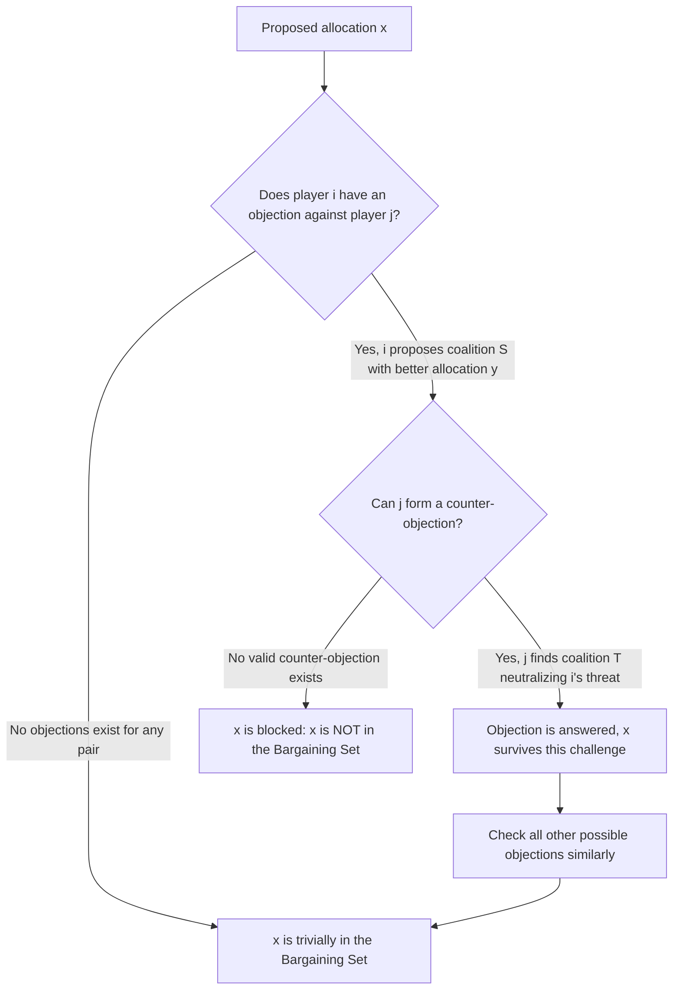

## Bargaining Sets and Stable Sets

### Definition and Conceptual Overview

Bargaining sets and stable sets are cooperative game theory solution concepts developed as alternatives to the Core, designed to address the Core's central weakness: **the Core can be empty**, leaving no prediction at all for many important classes of games. Both concepts relax the Core's stability requirement in different structural ways, trading the Core's strict "no coalition can profitably deviate" criterion for more nuanced notions of stability that remain applicable even when the Core fails to exist.

The **Bargaining Set** (Aumann and Maschler, 1964) relaxes stability by allowing an allocation to be blocked by an "objection," but only counts the block as effective if the objecting coalition cannot itself be neutralized by a "counter-objection" from an affected player. The **Stable Set** (von Neumann and Morgenstern, 1944 — historically the *first* cooperative solution concept ever proposed, predating the Core, Shapley value, and Nucleolus) takes an entirely different approach based on internal and external stability among a *set* of allocations, rather than evaluating a single allocation against individual coalitional deviations.

**Key Points**

- The Bargaining Set uses objections and counter-objections between individual players to determine whether a given allocation is defensible
- The Stable Set (von Neumann-Morgenstern stable set) evaluates an entire **set** of allocations at once, requiring both internal consistency (no allocation in the set dominates another) and external completeness (every allocation outside the set is dominated by something inside it)
- Both concepts generally exist more often than the Core, but at the cost of reduced determinacy (stable sets, in particular, are often highly non-unique) or increased conceptual complexity
- The Kernel (covered elsewhere) is a further refinement/subset relationship: Nucleolus ⊆ Kernel ⊆ Bargaining Set, placing these concepts in a nested hierarchy of decreasing restrictiveness

### The Domination Relation

Both concepts build on the **domination relation** between allocations. An imputation $y$ **dominates** imputation $x$ via coalition $S$ if:

1. $\sum_{i \in S} y_i \leq v(S)$ (the allocation $y$ restricted to $S$ is feasible for $S$ to achieve on its own)
2. $y_i > x_i$ for every $i \in S$ (every member of $S$ strictly prefers $y$ to $x$)

If such an $S$ exists, $y$ **dominates** $x$ (written $y \succ x$), meaning coalition $S$ would unanimously prefer to break away and implement $y$ among themselves rather than accept $x$.

**Connection to the Core:** The Core is precisely the set of imputations that are **undominated** by any other imputation via any coalition — no allocation exists that some coalition could unanimously prefer over the Core allocation.

### Formal Definition: The Von Neumann-Morgenstern Stable Set

A set of imputations $K$ is a **stable set** if it satisfies two conditions simultaneously:

**1. Internal stability:** No imputation in $K$ dominates another imputation in $K$. Formally, for all $x, y \in K$, it is not the case that $y \succ x$.

**2. External stability:** Every imputation *not* in $K$ is dominated by some imputation in $K$. Formally, for every $x \notin K$, there exists $y \in K$ such that $y \succ x$.

**Interpretation:** A stable set represents a self-consistent "standard of behavior" — a set of outcomes that are mutually non-dominating among themselves (so none is obviously superior to another within the set, making the set internally coherent as a social norm), yet collectively "cover" every other possible outcome by dominating it (so any outcome outside the set can be persuasively challenged by pointing to some outcome inside the set that some coalition prefers).

### Key Properties and Complications of Stable Sets

- **Non-uniqueness:** A single game can have **multiple, structurally very different stable sets** simultaneously — unlike the Core, Nucleolus, or Shapley value, the Stable Set concept does not generally deliver a unique prediction, and different stable sets can support radically different social conventions or discriminatory norms within the same underlying game
- **Non-existence in some games:** [Unverified] While von Neumann and Morgenstern conjectured stable sets always exist, this was later shown to be false in general — Lucas (1969) constructed an explicit counterexample of a 10-player game with no stable set at all, refuting the general existence conjecture, though many important game classes (including all games with non-empty Cores under certain conditions) do admit stable sets
- **Relationship to the Core:** If the Core is non-empty, the Core is contained within every stable set (when a stable set exists) — but a stable set may also contain additional imputations beyond the Core, representing alternative coalitional "standards of behavior" that are stable in the internal/external sense even though they are dominated relative to the strict Core-blocking criterion in a narrower sense captured differently by the two frameworks

### Formal Definition: The Bargaining Set

The Bargaining Set formalizes stability through a structured argument-counterargument process between pairs of players, rather than the Core's direct coalition-vs-coalition blocking or the Stable Set's set-level domination.

**Objection:** Given an allocation $x$ (typically relative to some coalition structure), player $i$ has an **objection** against player $j$ (both members of some coalition, say the grand coalition) if there exists a coalition $S$ containing $i$ but not $j$, and a feasible allocation $y$ for $S$, such that every member of $S$ (including $i$) does at least as well under $y$ as under $x$, and $i$ strictly better — i.e., $S$ can profitably break away in a way that benefits $i$ (and does not harm any other member of $S$), directly at the expense of excluding $j$.

**Counter-objection:** Player $j$ has a **counter-objection** to $i$'s objection if there exists a coalition $T$ containing $j$ but not $i$, and a feasible allocation $z$ for $T$, such that every member of $T$ does at least as well under $z$ as under $x$, and members of $T \cap S$ (players belonging to both the original objecting coalition and the counter-objecting coalition) do at least as well under $z$ as they did under the original objection $y$ — meaning $j$ can assemble a rival coalition that neutralizes $i$'s threat without leaving anyone who was won over by $i$'s proposal worse off.

**Bargaining Set membership:** An allocation $x$ is in the **Bargaining Set** $\mathcal{M}$ if, for every objection that any player raises against any other player, a valid counter-objection exists. In other words, $x$ survives the Bargaining Set test if **no objection goes unanswered**.

### Diagram: Objection-Counter-Objection Structure

### Diagram: Nesting of Solution Concepts (svg_diagram)

<svg xmlns="http://www.w3.org/2000/svg" viewBox="0 0 640 320">
<text x="320" y="24" font-size="16" text-anchor="middle" font-weight="bold">Nesting of Cooperative Solution Concepts (svg_diagram)</text>
<ellipse cx="320" cy="180" rx="280" ry="120" fill="#f3f4f6" stroke="#555" stroke-width="1.5" />
<text x="320" y="70" font-size="12" text-anchor="middle">Bargaining Set</text>
<ellipse cx="320" cy="190" rx="190" ry="80" fill="#dbeafe" stroke="#2563eb" stroke-width="1.5" />
<text x="320" y="120" font-size="12" text-anchor="middle" fill="#1e3a8a">Kernel</text>
<ellipse cx="320" cy="200" rx="100" ry="45" fill="#fef3c7" stroke="#d97706" stroke-width="1.5" />
<text x="320" y="170" font-size="11" text-anchor="middle" fill="#92400e">Core (when non-empty)</text>
<circle cx="320" cy="205" r="6" fill="#dc2626" />
<text x="320" y="230" font-size="11" text-anchor="middle" fill="#991b1b">Nucleolus</text>

<text x="320" y="300" font-size="11" text-anchor="middle" fill="#555">Stable Sets sit in a separate framework; may extend beyond or diverge from this nesting</text>

</svg>

### Worked Conceptual Illustration: Why the Bargaining Set Helps with Empty Cores

Recall the three-player majority game where the Core is empty (any two players can jointly claim the full value $v(N)=1$, undercutting any allocation). Under the strict Core criterion, **every** allocation is blocked by some pair. But under the Bargaining Set's objection/counter-objection logic: if player 1 objects against player 3 by proposing to team with player 2 (offering player 2 slightly more than their current share), player 3 can typically mount a **counter-objection** by instead proposing to team with player 2 under a rival, equally or more attractive offer — since players 2 and 3 are symmetric, this back-and-forth tends to settle into the symmetric allocation $\left(\frac13,\frac13,\frac13\right)$ (matching the Nucleolus computed for this same game), because at that allocation, no objection can be raised without an equally valid symmetric counter-objection neutralizing it. This illustrates concretely why the Bargaining Set (and the Kernel, and the Nucleolus) can select a meaningful, non-empty prediction precisely in cases where the Core provides none.

### Comparison: Bargaining Set vs. Stable Set vs. Core

| Dimension | Core | Bargaining Set | Stable Set |
| --- | --- | --- | --- |
| Stability criterion | No coalition can unilaterally profit by deviating | No unanswered objection between any pair of players | Set-level internal non-domination + external domination of everything outside |
| Existence | Not guaranteed | Guaranteed to be non-empty for any game with a coalition structure (Aumann-Maschler proved general existence) | Not guaranteed in all games (Lucas counterexample) |
| Uniqueness | Set (possibly empty) | Typically a set, generally non-empty | Often multiple, structurally distinct stable sets can coexist |
| Historical origin | Gillies/Shapley, 1953 | Aumann-Maschler, 1964 | Von Neumann-Morgenstern, 1944 (first cooperative solution concept) |
| Relation to Nucleolus | Nucleolus ⊆ Core (when Core non-empty) | Kernel ⊆ Bargaining Set; Nucleolus ⊆ Kernel | Core ⊆ Stable Set (when both exist and Core is non-empty) |

### Applications and Significance

- **Modeling persistent social norms and conventions:** The Stable Set's ability to support multiple, mutually exclusive stable "standards of behavior" for the same underlying game has been used to model how different societies or institutions can settle on different, path-dependent distributive conventions even facing identical structural incentives.
- **Labor and coalition negotiation with unstable cores:** The Bargaining Set's guaranteed existence makes it a practical fallback for analyzing coalition/labor negotiation settings (e.g., voting blocs, union bargaining structures) where the underlying game's Core is empty and the analyst still needs a defensible stability-based prediction.
- **Historical significance in game theory's development:** The Stable Set, being the original solution concept proposed in von Neumann and Morgenstern's foundational 1944 work *Theory of Games and Economic Behavior*, played a crucial role in establishing cooperative game theory as a field, even though it was later partly superseded in popularity by the more tractable Core, Shapley value, and Nucleolus for many applications.

[Unverified] Determining whether a stable set exists for an arbitrary given game, and computing it explicitly when it does exist, is generally a substantially harder computational and theoretical problem than computing the Core, Nucleolus, or Shapley value, which limits the Stable Set's use in large-scale applied settings relative to its historical and conceptual importance.

**Related Topics**

- The Core and Coalitional Stability
- The Nucleolus and the Kernel
- Transferable Utility Games and Characteristic Functions
- Von Neumann-Morgenstern Foundations of Game Theory
- Domination Relations and Imputation Sets
- Coalition Structures and Structure-Dependent Solution Concepts
- Existence Theorems in Cooperative Game Theory