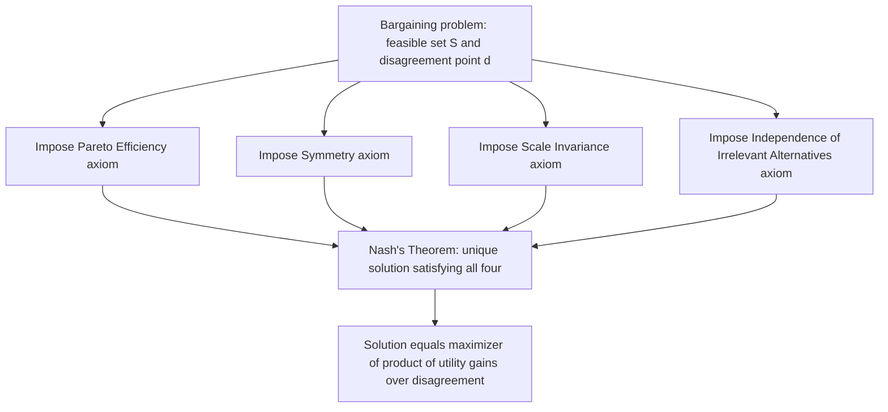

## Axiomatic Bargaining and the Nash Solution

### Definition and Conceptual Overview

Axiomatic bargaining theory addresses the two-player (or $n$-player) bargaining problem — a situation where players can jointly achieve various feasible outcomes but must agree on which one, with a specified fallback ("disagreement point") if no agreement is reached — by proposing a small set of normatively appealing **axioms** that a "fair" or "reasonable" solution should satisfy, then characterizing which specific solution rule (if any) satisfies all of them simultaneously. This axiomatic approach, pioneered by John Nash (1950), stands in contrast to non-cooperative bargaining models (e.g., the Rubinstein alternating-offers model) that derive an outcome from explicit strategic play; axiomatic bargaining instead asks "what outcome *should* result, given a list of properties we want it to satisfy?"

The **Nash Bargaining Solution** is the foundational result of this literature: it is the *unique* solution function satisfying four specific axioms, and it takes the elegant form of maximizing the product of the players' utility gains over the disagreement point.

**Key Points**

- The bargaining problem is defined by a pair $(S, d)$: a feasible set $S \subseteq \mathbb{R}^n$ of achievable utility vectors, and a disagreement point $d \in S$ representing the outcome if bargaining fails
- Nash's axioms are: Pareto Efficiency, Symmetry, Invariance to Affine Transformations, and Independence of Irrelevant Alternatives (IIA)
- The Nash Bargaining Solution is the unique point maximizing the product $\prod_i (x_i - d_i)$ over feasible $x \in S$
- This is a direct application of axiomatic reasoning closely related to, but conceptually distinct from, the NTU cooperative game solution concepts covered elsewhere, since bargaining theory typically focuses on the two-player (or small-group) case with an explicit disagreement point rather than a general coalition structure

### Formal Setup: The Bargaining Problem

A (two-player) bargaining problem is a pair $(S, d)$ where:

- $S \subseteq \mathbb{R}^2$ is a **feasible set** of achievable utility pairs, assumed to be closed, convex, and bounded above
- $d = (d_1, d_2) \in S$ is the **disagreement point** (also called the threat point or status quo point), representing the payoffs each player receives if no agreement is reached
- It is assumed there exists at least one point $x \in S$ with $x_i > d_i$ for both players (there is *something* to gain from agreement — otherwise the problem is trivial)

A **bargaining solution** is a function $f(S,d)$ mapping every such problem to a specific feasible outcome $f(S,d) \in S$.

### Nash's Four Axioms

**1. Pareto Efficiency:** The solution should not leave any unexploited joint gains. Formally, there should be no $y \in S$ with $y_i \geq f_i(S,d)$ for both players and $y_j > f_j(S,d)$ for at least one — the solution must lie on the Pareto frontier of $S$.

**2. Symmetry:** If the bargaining problem is symmetric (meaning $d_1 = d_2$ and $S$ is symmetric under swapping the two players' roles, i.e., $(x_1,x_2) \in S \iff (x_2,x_1) \in S$), then the solution should treat both players identically: $f_1(S,d) = f_2(S,d)$. Players with identical positions and identical feasible options should receive identical outcomes.

**3. Invariance to Affine Transformations (Scale Invariance):** If each player's utility is rescaled by a positive affine transformation ($u_i' = a_i u_i + b_i$ with $a_i > 0$), the solution should transform correspondingly: $f_i(S', d') = a_i f_i(S,d) + b_i$. This reflects the standard economic principle that von Neumann-Morgenstern utility is only meaningful up to positive affine transformation — the bargaining solution should not depend on arbitrary choices of utility scale or origin.

**4. Independence of Irrelevant Alternatives (IIA):** If $T \subseteq S$ is a smaller feasible set (a subset of the original options) and the original Nash solution $f(S,d)$ happens to lie within $T$, then $f(T,d) = f(S,d)$ — removing feasible options that were not going to be chosen anyway should not change the outcome. This is the most conceptually contested of the four axioms and the one most frequently challenged or relaxed in alternative bargaining solution proposals.

### Nash's Theorem: Characterization of the Unique Solution

**Theorem (Nash, 1950):** There exists a **unique** bargaining solution $f(S,d)$ satisfying all four axioms simultaneously, and it is given by:

$$f(S,d) = \arg\max_{x \in S, \, x \geq d} \; (x_1 - d_1)(x_2 - d_2)$$

This is the **Nash Product** maximization: among all feasible, individually rational outcomes (those weakly better for both players than disagreement), select the one that maximizes the product of each player's **gain over disagreement**.

**General $n$-player form:**

$$f(S,d) = \arg\max_{x \in S, \, x \geq d} \; \prod_{i=1}^{n} (x_i - d_i)$$

### Worked Example

Suppose two players bargain over a feasible set defined by $x_1 + x_2 \leq 10$ (with $x_1, x_2 \geq 0$), and the disagreement point is $d = (2,1)$.

**Maximize:** $(x_1 - 2)(x_2 - 1)$ subject to $x_1 + x_2 = 10$ (efficiency implies binding the constraint since increasing the product requires using the full available surplus).

Substitute $x_2 = 10 - x_1$:

$$\max_{x_1} \; (x_1 - 2)(10 - x_1 - 1) = (x_1-2)(9-x_1)$$

Taking the derivative with respect to $x_1$ and setting it to zero:

$$\frac{d}{dx_1}\left[(x_1-2)(9-x_1)\right] = (9-x_1) - (x_1-2) = 11 - 2x_1 = 0 \implies x_1 = 5.5$$

Then $x_2 = 10 - 5.5 = 4.5$.

**Result:** $f(S,d) = (5.5, 4.5)$. **Verification of the intuitive "split the surplus" property:** the total surplus available beyond disagreement is $(10 - 2 - 1) = 7$; the Nash solution gives player 1 a gain of $5.5-2=3.5$ and player 2 a gain of $4.5-1=3.5$ — in this symmetric-surplus linear setting, the **Nash solution splits the incremental surplus equally** between the two players, a general feature whenever the feasible frontier is linear (a simple transferable-utility-style bargaining frontier).

### Diagram: Nash Product Maximization Geometry (svg_diagram)

<svg xmlns="http://www.w3.org/2000/svg" viewBox="0 0 640 320">
<text x="320" y="24" font-size="16" text-anchor="middle" font-weight="bold">Nash Bargaining Solution: Geometric Interpretation (svg_diagram)</text>
<line x1="80" y1="280" x2="80" y2="60" stroke="black" stroke-width="1.5" />
<line x1="80" y1="280" x2="560" y2="280" stroke="black" stroke-width="1.5" />
<text x="40" y="70" font-size="12">x2</text>
<text x="570" y="295" font-size="12">x1</text>
<path d="M 120,260 L 500,80" fill="none" stroke="#059669" stroke-width="2.5" />
<text x="480" y="65" font-size="11" fill="#059669">Feasible frontier S</text>
<circle cx="200" cy="220" r="5" fill="#dc2626" />
<text x="205" y="215" font-size="11" fill="#dc2626">Disagreement point d</text>
<path d="M 200,220 Q 280,160 340,150" fill="none" stroke="#7c3aed" stroke-width="1" stroke-dasharray="4,3" />
<circle cx="340" cy="150" r="6" fill="#2563eb" />
<text x="350" y="145" font-size="11" fill="#2563eb">Nash solution: maximizes (x1-d1)(x2-d2)</text>
<path d="M 200,280 Q 270,200 340,150 Q 380,120 420,60" fill="none" stroke="#f59e0b" stroke-width="1" stroke-dasharray="2,2" />
<text x="420" y="55" font-size="10" fill="#f59e0b">Hyperbola: constant Nash product</text>

<text x="320" y="310" font-size="11" text-anchor="middle" fill="#555">Nash solution is the point where the highest attainable Nash-product hyperbola is tangent to the feasible frontier</text>

</svg>

### Diagram: Axiomatic Characterization Logic

### Alternative Axiomatic Bargaining Solutions

The Nash solution's Independence of Irrelevant Alternatives axiom is the one most frequently relaxed or replaced in the literature, giving rise to alternative, equally axiomatically-motivated solutions:

**Kalai-Smorodinsky Solution (1975):** Replaces IIA with a **Monotonicity** axiom: if the feasible set expands in a way that increases the *maximum possible* payoff available to player $i$ (holding the maximum available to the other player fixed), player $i$'s payoff under the solution should not decrease. This solution selects the point on the Pareto frontier lying on the straight line connecting the disagreement point $d$ to the **ideal point** $(a_1, a_2)$, where $a_i$ is the maximum payoff player $i$ could achieve on the frontier (given the other player's utility is at least $d_j$).

**Egalitarian (Kalai) Solution (1977):** Selects the Pareto-efficient point that **equalizes the utility gains** of both players: $x_1 - d_1 = x_2 - d_2$, satisfying a strong equal-treatment principle but sacrificing the scale-invariance axiom (since equalizing raw utility gains is not preserved under independent rescaling of each player's utility function).

**Utilitarian Solution:** Simply maximizes the **sum** $x_1 + x_2$ (or a weighted sum), which is Pareto efficient but generally fails both symmetry (in weighted forms) and scale invariance (since the meaning of "sum of utilities" is itself scale-dependent), illustrating why this simple aggregative approach is typically not favored in the axiomatic literature despite its intuitive appeal.

### Comparison: Major Axiomatic Bargaining Solutions

| Solution | Key Distinguishing Axiom | Geometric Characterization |
| --- | --- | --- |
| **Nash** | Independence of Irrelevant Alternatives | Maximizes product of utility gains $(x_1-d_1)(x_2-d_2)$ |
| **Kalai-Smorodinsky** | Monotonicity (in place of IIA) | Point where the line from $d$ to the ideal point meets the Pareto frontier |
| **Egalitarian (Kalai)** | Equal gains (in place of scale invariance) | Point where $x_1 - d_1 = x_2 - d_2$ on the Pareto frontier |
| **Utilitarian** | Maximize total surplus | Point maximizing $x_1 + x_2$ (or weighted sum) on the Pareto frontier |

### Relationship to Non-Cooperative Bargaining: The Nash Program

A major research tradition, explicitly initiated by Nash himself and termed the **"Nash Program,"** seeks to provide **non-cooperative (strategic) foundations** for axiomatically-derived cooperative bargaining solutions — showing that a specific extensive-form bargaining game's equilibrium coincides with (or converges to) the Nash Bargaining Solution or its variants.

**Key connecting result (Rubinstein-Binmore-Wolinsky):** In the Rubinstein alternating-offers bargaining model with discounting, as the time between offers shrinks to zero (bargaining frictions vanish), the unique subgame-perfect equilibrium outcome converges to the Nash Bargaining Solution, with the disagreement point determined by each player's discount factor (patience) and the relative bargaining "power" implicitly determined by the specific alternating-offers protocol assumed. This result is widely cited as providing compelling **non-cooperative underpinnings** for what was originally a purely axiomatic (cooperative) solution concept, linking this chapter's material directly back to the extensive-form bargaining models covered in non-cooperative game theory.

### Applications

- **Wage and labor negotiation:** The Nash Bargaining Solution is a standard tool in labor economics for modeling union-firm wage bargaining, with the disagreement point typically representing outcomes under a strike or lockout.
- **International trade and treaty negotiations:** Applied to model outcomes of bilateral trade negotiations, with the disagreement point representing the status quo (no-agreement) tariff or trade regime.
- **Divorce settlement and family bargaining models:** Economic models of household formation, dissolution, and resource allocation frequently use Nash bargaining (and its variants) to predict how disagreement-point outside options (e.g., single-life utility) affect negotiated household resource splits.
- **Business partnership and joint-venture profit splitting:** Used to model how partners with different outside options and different bargaining leverage split jointly generated surplus.

[Unverified] Empirical tests of the Nash Bargaining Solution's predictive accuracy relative to competing solutions (Kalai-Smorodinsky, Egalitarian) in real-world negotiation settings have produced mixed results across different experimental and field contexts, and no single axiomatic solution has been established as uniformly more empirically accurate across all bargaining environments studied.

**Related Topics**

- Non-Transferable Utility Games and General Bargaining Sets
- Rubinstein Alternating-Offers Bargaining Model
- The Nash Program: Cooperative-Noncooperative Foundations
- Kalai-Smorodinsky and Egalitarian Bargaining Solutions
- Von Neumann-Morgenstern Expected Utility and Affine Invariance
- Outside Options and Disagreement Point Determination
- Bargaining Power in Labor and Wage Negotiation Models