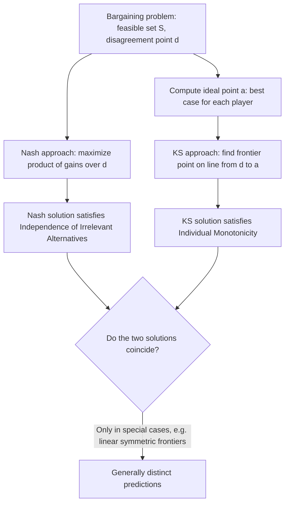

## The Kalai-Smorodinsky Solution

### Definition and Conceptual Overview

The Kalai-Smorodinsky solution is an axiomatic bargaining solution introduced by Ehud Kalai and Meir Smorodinsky (1975) as a direct response to a specific criticism of the Nash Bargaining Solution's **Independence of Irrelevant Alternatives (IIA)** axiom. Kalai and Smorodinsky replaced IIA with an alternative axiom — **Individual Monotonicity** — and showed that this substitution yields a different, equally well-defined unique solution with markedly different distributive implications, particularly in asymmetric bargaining problems. The Kalai-Smorodinsky solution selects the point on the Pareto frontier that lies on the straight line connecting the disagreement point to each player's **ideal point** (their best conceivable outcome given the other player's minimal acceptable payoff).

**Key Points**

- Retains three of Nash's four axioms (Pareto Efficiency, Symmetry, Scale Invariance) but replaces Independence of Irrelevant Alternatives with **Individual Monotonicity**
- The solution is geometrically characterized as the intersection of the Pareto frontier with the line segment from the disagreement point to the **ideal point**
- Unlike the Nash solution, the Kalai-Smorodinsky solution is sensitive to the shape of the *entire* feasible set (via the ideal point), not just to local properties around the eventual solution — this is precisely what IIA would have ruled out
- The two solutions coincide in some special cases (e.g., symmetric problems with a fully linear frontier) but generally diverge when the feasible set is asymmetric or non-linear

### The Ideal Point

For a bargaining problem $(S,d)$, define the **ideal point** $a = (a_1, a_2)$ where:

$$a_i = \max \{ x_i : x \in S, \, x_j \geq d_j \text{ for the other player } j \}$$

That is, $a_i$ is the **best payoff player $i$ could conceivably achieve** in the feasible set, subject only to the constraint that the other player receives at least their disagreement payoff. The ideal point $a$ is generally **not itself feasible** as a joint outcome (both players cannot simultaneously achieve their individual best case) — it represents an aspirational benchmark against which actual outcomes are measured, not an achievable point on the frontier.

### The Individual Monotonicity Axiom

**Individual Monotonicity:** Suppose the feasible set expands from $S$ to $S'$ (i.e., $S \subseteq S'$) in such a way that player $j$'s ideal payoff is unaffected ($a_j$ stays the same under $S'$ as under $S$), but player $i$'s ideal payoff increases ($a_i$ under $S'$ is larger than under $S$). Then the solution should give player $i$ **at least as much** under the expanded problem $(S', d)$ as under the original $(S,d)$: $f_i(S',d) \geq f_i(S,d)$.

**Intuition and contrast with IIA:** This axiom captures the idea that if the bargaining "pie" expands specifically in a way that benefits player $i$'s best-case potential (without changing what player $j$ could ideally achieve), player $i$ should not end up worse off. Nash's IIA, by contrast, explicitly permits (and indeed can require) a player's payoff to be **unaffected or even paradoxically reduced** in certain feasible-set expansions, so long as the original solution point remains available in the smaller set — a property that some theorists find counterintuitive precisely because it ignores information about the shape of the frontier away from the eventual solution.

### Kalai-Smorodinsky's Theorem: The Unique Solution

**Theorem (Kalai-Smorodinsky, 1975):** There exists a unique bargaining solution satisfying Pareto Efficiency, Symmetry, Scale Invariance, and Individual Monotonicity, given by:

$$f^{KS}(S,d) = \text{the point on the Pareto frontier of } S \text{ lying on the line segment from } d \text{ to } a$$

Formally, $f^{KS}(S,d)$ is the unique Pareto-efficient point $x^* \in S$ such that:

$$\frac{x_1^* - d_1}{a_1 - d_1} = \frac{x_2^* - d_2}{a_2 - d_2}$$

This condition states that each player's **fraction of the way from disagreement to their own ideal payoff** is equalized between the two players — an intuitive notion of proportional/equal relative satisfaction, rather than the Nash solution's product-maximization criterion.

### Worked Example

Consider the same feasible set used in the Nash Bargaining Solution example: $x_1+x_2 \leq 10$, $x_1,x_2\geq 0$, disagreement point $d=(2,1)$.

**Step 1 — find the ideal point:**

- $a_1$: the maximum $x_1$ achievable while $x_2 \geq d_2 = 1$. Given $x_1+x_2 \leq 10$, setting $x_2=1$ gives $x_1 = 9$. So $a_1 = 9$.
- $a_2$: the maximum $x_2$ achievable while $x_1 \geq d_1 = 2$. Setting $x_1=2$ gives $x_2 = 8$. So $a_2 = 8$.

Ideal point: $a = (9, 8)$.

**Step 2 — find the point on the frontier proportional to $(a_1-d_1, a_2-d_2) = (7,7)$:**

Since the direction from $d=(2,1)$ toward $a=(9,8)$ is $(7,7)$ — equal in both coordinates — the line from $d$ toward $a$ is the 45-degree line $x_2 - 1 = x_1 - 2$, i.e., $x_2 = x_1 - 1$.

**Step 3 — intersect with the Pareto frontier** $x_1+x_2=10$:

$$x_1 + (x_1 - 1) = 10 \implies 2x_1 = 11 \implies x_1 = 5.5, \; x_2 = 4.5$$

**Result:** $f^{KS}(S,d) = (5.5, 4.5)$ — **identical to the Nash solution** computed earlier for this same problem. This coincidence occurs precisely because the feasible frontier is linear and the ideal-point direction happens to align symmetrically in this particular example; in general, with a non-linear or more asymmetric frontier, the two solutions diverge, as the next example shows.

### Worked Example Illustrating Divergence from Nash

Suppose instead the feasible frontier is **concave/curved** rather than linear, and highly asymmetric: e.g., player 1's ideal payoff $a_1$ is very large while player 2's ideal payoff $a_2$ is only modestly larger than $d_2$, but the frontier bulges heavily in player 1's favor near player 2's ideal point.

[Unverified] In such asymmetric, non-linear feasible sets, the Nash solution (maximizing the product of gains) and the Kalai-Smorodinsky solution (equalizing proportional distance to the ideal point) can select **substantially different points** on the frontier — the Nash solution being more sensitive to the local curvature of the frontier near the eventual solution, and the Kalai-Smorodinsky solution being more sensitive to the global position of each player's best-case (ideal) outcome. The precise direction and magnitude of this divergence depends on the specific shape of the frontier and cannot be characterized by a single simple rule of thumb.

### Diagram: Kalai-Smorodinsky Geometric Construction (svg_diagram)

<svg xmlns="http://www.w3.org/2000/svg" viewBox="0 0 640 340">
<text x="320" y="24" font-size="16" text-anchor="middle" font-weight="bold">Kalai-Smorodinsky Solution Construction (svg_diagram)</text>
<line x1="80" y1="300" x2="80" y2="60" stroke="black" stroke-width="1.5" />
<line x1="80" y1="300" x2="580" y2="300" stroke="black" stroke-width="1.5" />
<text x="40" y="70" font-size="12">x2</text>
<text x="590" y="315" font-size="12">x1</text>
<path d="M 120,280 Q 300,200 480,90" fill="none" stroke="#059669" stroke-width="2.5" />
<text x="470" y="75" font-size="11" fill="#059669">Pareto frontier</text>
<circle cx="140" cy="240" r="5" fill="#dc2626" />
<text x="150" y="235" font-size="11" fill="#dc2626">d (disagreement)</text>
<circle cx="480" cy="150" r="5" fill="#7c3aed" />
<text x="440" y="140" font-size="11" fill="#7c3aed">a (ideal point, generally infeasible)</text>
<line x1="140" y1="240" x2="480" y2="150" stroke="#f59e0b" stroke-width="1.5" stroke-dasharray="5,3" />
<circle cx="320" cy="195" r="6" fill="#2563eb" />
<text x="330" y="190" font-size="11" fill="#2563eb">KS solution: frontier intersects d-to-a line</text>

<text x="320" y="330" font-size="11" text-anchor="middle" fill="#555">Both players achieve the same proportion of their gain-to-ideal-point distance</text>

</svg>

### Diagram: Nash vs. Kalai-Smorodinsky Selection Logic

### Comparison: Nash vs. Kalai-Smorodinsky Solutions

| Dimension | Nash Bargaining Solution | Kalai-Smorodinsky Solution |
| --- | --- | --- |
| Distinguishing axiom | Independence of Irrelevant Alternatives | Individual Monotonicity |
| Geometric characterization | Maximizes product $(x_1-d_1)(x_2-d_2)$ | Frontier intersection with line from $d$ to ideal point $a$ |
| Dependence on feasible set shape | Only local (near the solution point) | Global (depends on ideal point, i.e., the extremes of the frontier) |
| Sensitivity to "irrelevant" expansions | Insensitive by construction (IIA) | Sensitive — expansions can shift the solution via the ideal point |
| Coincide when? | Symmetric problems, linear frontiers | Same conditions — generally diverge otherwise |

### Critiques and the Broader Axiomatic Debate

The choice between Nash's IIA and Kalai-Smorodinsky's Individual Monotonicity reflects a genuine normative disagreement about what "fairness" in bargaining should mean:

- **In favor of IIA (Nash):** Removing options that were never going to be selected shouldn't matter — a form of rationality/consistency across related problems.
- **In favor of Individual Monotonicity (Kalai-Smorodinsky):** A player's fortunes should track their own best-case potential; a solution that can leave a player *worse off* after their own upside potential increases (a scenario IIA permits) strikes many observers as an unattractive property for a "fair" division rule.

[Unverified] There is no consensus within the axiomatic bargaining literature that one of these two axioms is more fundamentally "correct" than the other; the appropriate choice is generally treated as depending on which normative property is considered more important for the specific application being modeled, rather than being resolved by a further meta-level axiomatic argument.

### Applications

- **Environmental treaty negotiation:** The Kalai-Smorodinsky solution has been applied to model burden-sharing agreements (e.g., emissions reduction targets) where each country's "ideal point" (their best-case unilateral outcome) is a natural and observable benchmark, making the KS framework's reliance on ideal points practically convenient in this context.
- **Water rights and resource-sharing disputes:** Used in resource economics to model equitable allocation of shared resources (river water rights, fishing quotas) between parties with clearly identifiable best-case unilateral claims.
- **Wage bargaining with asymmetric outside options:** Applied similarly to Nash bargaining in labor economics, but preferred in some models specifically because it responds monotonically to changes in a party's best-case potential outcome (e.g., an improved outside job offer), which some researchers view as a more behaviorally plausible response pattern than the Nash solution's IIA-driven insensitivity in certain scenarios.
- **Multi-criteria decision analysis and negotiation support systems:** The ideal-point construction is a well-established broader technique in decision analysis (related to "goal programming" and "compromise programming" methods) independent of its specific bargaining-theoretic origin, illustrating cross-pollination between axiomatic bargaining theory and applied decision science.

**Related Topics**

- Axiomatic Bargaining and the Nash Solution
- The Egalitarian (Kalai) Bargaining Solution
- Non-Transferable Utility Games and General Bargaining Sets
- The Nash Program: Cooperative-Noncooperative Foundations
- Pareto Efficiency and Frontier Construction in Bargaining Problems
- Multi-Criteria Decision Analysis and Compromise Programming
- Outside Options and Disagreement Point Determination