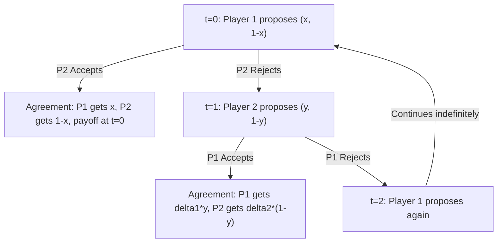

## Rubinstein Alternating Offers Model

### Overview

The Rubinstein Alternating Offers Model, introduced by Ariel Rubinstein in 1982, is a foundational framework in noncooperative bargaining theory. It models two players negotiating over the division of a fixed surplus (often called "the pie") by making alternating proposals over an infinite time horizon. The model's central result is that under standard assumptions, there exists a **unique subgame perfect equilibrium (SPE)** in which agreement is reached immediately, at a division determined entirely by the players' discount factors (patience levels).

This model resolved a long-standing gap in bargaining theory: earlier cooperative approaches (e.g., the Nash Bargaining Solution) specified desirable outcomes via axioms but did not model the bargaining *process*. Rubinstein's contribution provided a noncooperative, strategic foundation that yields a determinate, unique prediction rather than a set of Pareto-efficient possibilities.

### Setup and Assumptions

**The Pie**: Two players, Player 1 and Player 2, bargain over how to split a surplus normalized to size 1.

**Alternating Protocol**:

- At time $t=0$, Player 1 proposes a split $(x, 1-x)$ where $x \in [0,1]$ is Player 1's share.
- Player 2 either **accepts** (bargaining ends, payoffs realized) or **rejects**.
- If rejected, at $t=1$, Player 2 makes a counteroffer $(y, 1-y)$.
- Player 1 accepts or rejects, and so on, alternating indefinitely if no agreement is reached.

**Discounting**: Delay is costly. Each player $i$ has a discount factor $\delta_i \in (0,1)$. If agreement on a split giving player $i$ a share $s$ is reached at period $t$, player $i$'s payoff is:

$$u_i = \delta_i^t \cdot s$$

**Key Assumptions**:

- Preferences exhibit **stationarity**: the passage of time affects payoffs only via discounting, not via changing the structure of the game.
- Players have **complete information**: discount factors and the pie size are common knowledge.
- The game has an **infinite horizon** — there is no exogenous deadline forcing agreement.
- Players are rational and forward-looking, correctly anticipating equilibrium continuation play.

### The Unique Subgame Perfect Equilibrium

Rubinstein's central theorem states that this game has a unique SPE with **immediate agreement** — no delay occurs on the equilibrium path.

**Equilibrium shares**: Let $\delta_1$ and $\delta_2$ be the discount factors of Player 1 (first proposer) and Player 2, respectively. The unique SPE gives Player 1 (the first mover) a share:

$$x^* = \frac{1 - \delta_2}{1 - \delta_1 \delta_2}$$

and Player 2 receives $1 - x^*$.

**Equilibrium strategies**:

- Player 1 always proposes $(x^*, 1-x^*)$ and accepts any offer giving them at least $\delta_1(1-x^{**})$, where $x^{**}$ is the analogous share Player 2 would secure as first mover in a subgame beginning with Player 2 proposing.
- Symmetric logic governs Player 2's strategy.
- Both players accept immediately in equilibrium; rejection is only a threat that is never executed on-path.

**Special case — equal discount factors**: If $\delta_1 = \delta_2 = \delta$, the formula simplifies to:

$$x^* = \frac{1}{1+\delta}$$

As $\delta \to 1$ (players become arbitrarily patient/frictionless), $x^* \to \frac{1}{2}$, recovering the intuitive equal-split outcome. As $\delta \to 0$ (players are highly impatient), $x^* \to 1$, meaning the first proposer captures nearly the entire pie — the **first-mover advantage** is maximized when delay is maximally costly.

### Derivation Logic (Stationarity Argument)

The proof relies on a clever "shrinking the problem" argument rather than direct backward induction (impossible in an infinite game). The key steps:

1. Because the game is stationary, the subgame beginning with Player 2 proposing (after Player 1's first offer is rejected) is strategically identical in structure to the game beginning with Player 2 as first proposer.
2. Let $M_1$ and $m_1$ denote the supremum and infimum of Player 1's payoff across all SPE. By stationarity, these bounds recur identically in every subgame where Player 1 is the responder.
3. Since Player 2, when proposing, will offer Player 1 just enough to make Player 1 indifferent between accepting and waiting to counter-propose, Player 2's optimal offer to Player 1 is $\delta_1 m_1$ (extracting the responder down to their continuation value).
4. This generates a system of inequalities linking $M_1$ and $m_1$ across proposer and responder roles; solving these (via a squeeze/sandwich argument) shows $M_1 = m_1$, proving uniqueness.
5. Substituting back yields the closed-form share above.

**Key Points**:

- The equilibrium is derived using a "one-shot deviation" and "squeezing" argument, since standard finite backward induction does not apply to infinite-horizon games.
- Uniqueness (not just existence) is the paper's most celebrated result — many bargaining games admit multiple equilibria; Rubinstein's does not, given complete information and stationary discounting.

### Comparative Statics and Patience

The formula $x^* = \frac{1-\delta_2}{1-\delta_1\delta_2}$ generates intuitive comparative statics:

- **Patience is power**: $\partial x^*/\partial \delta_1 > 0$ and $\partial x^*/\partial \delta_2 < 0$. Being more patient (higher own $\delta$) increases your equilibrium share; facing a more patient opponent decreases it.
- **First-mover advantage vanishes as frictions vanish**: The identity of who moves first matters less as $\delta_i \to 1$, but never fully disappears for $\delta < 1$.
- **Risk of breakdown vs. discounting**: The original model uses pure time discounting as the cost of delay. Binmore, Rubinstein, and Wolinsky (1986) showed an economically equivalent formulation exists where delay costs arise from **exogenous risk of breakdown** (an outside chance the game ends with no deal) rather than pure impatience, producing an isomorphic solution.

### Relationship to Nash Bargaining Solution

A celebrated result (Binmore, Rubinstein, Wolinsky 1986) shows that as the time between offers shrinks to zero (frictionless limit, $\delta_i \to 1$ at matched rates), the Rubinstein SPE outcome **converges to the (generalized) Nash Bargaining Solution**, with bargaining power weights determined by the relative rates at which players' discount factors approach 1 (i.e., relative impatience/risk of breakdown).

This is significant because it provides a **noncooperative foundation (a "Nash program" result)** for the previously axiomatic Nash Bargaining Solution — showing that an axiomatically justified cooperative solution concept can emerge as the limit of an explicit strategic, noncooperative process.

$$\lim_{\Delta \to 0} x^*(\Delta) = \arg\max_{x} \left[ x^{\alpha} (1-x)^{1-\alpha} \right]$$

where $\Delta$ is the length of each bargaining period and $\alpha$ reflects relative patience.

### Game Tree Illustration

### Worked Numerical Example

**Setup**: Pie = $100. Player 1's discount factor $\delta_1 = 0.9$, Player 2's discount factor $\delta_2 = 0.8$.

**Step 1** — Compute Player 1's equilibrium share:

$$x^* = \frac{1 - 0.8}{1 - (0.9)(0.8)} = \frac{0.2}{1 - 0.72} = \frac{0.2}{0.28} \approx 0.714$$

**Step 2** — Interpretation: Player 1 secures approximately 71.4% of the pie ($71.40), and Player 2 receives approximately 28.6% ($28.60).

**Step 3** — Verify intuition: Player 1 is more patient ($\delta_1 = 0.9 > \delta_2 = 0.8$) and also moves first, both of which favor Player 1 — consistent with the result.

**Step 4** — Compare to symmetric case: If instead $\delta_1 = \delta_2 = 0.9$, then $x^* = \frac{1}{1.9} \approx 0.526$ — much closer to an even split, since the first-mover advantage is small when both players are patient and equally so.

### Extensions and Variants

- **Outside options**: If either player has a positive-payoff outside option (a guaranteed alternative to continued bargaining), the equilibrium share formula is modified — the outside option only binds (affects the outcome) if it exceeds what that player would receive in the baseline Rubinstein equilibrium.
- **Risk of breakdown (Binmore-Rubinstein-Wolinsky)**: Replaces discounting with an exogenous probability $p_i$ that negotiations collapse each period; yields an analogous closed-form solution.
- **Incomplete information**: Relaxing common knowledge of discount factors or valuations (e.g., Rubinstein 1985, and subsequent literature) destroys the uniqueness result — delay can occur in equilibrium (as a costly signal of type), connecting to the broader literature on bargaining with asymmetric information and the Coase conjecture.
- **N-player bargaining**: Extensions to more than two players (e.g., Krishna and Serrano) introduce additional complexities around coalition formation and are not as cleanly characterized.
- **Finite-horizon variants**: If a deadline exists (finite number of alternating offers), the model reduces to a finite-horizon bargaining game solvable by ordinary backward induction, converging to the Rubinstein solution as the horizon grows large under discounting.

### Applications

- **Labor negotiations**: Wage bargaining between firms and unions, where relative patience (e.g., strike funds, financial reserves) determines bargaining power.
- **International relations**: Modeling negotiation over treaties or territorial disputes with discounting representing costs of prolonged conflict.
- **Legal settlement bargaining**: Plaintiff-defendant settlement negotiations, where litigation costs and time value of money play the role of discount factors.
- **Corporate mergers and acquisitions**: Alternating-offer structures in deal-making, where financing costs create discounting.

**[Inference]** The precise real-world applicability of the immediate-agreement prediction is often limited in practice, since observed negotiations frequently exhibit delay — this is one motivation for the incomplete-information extensions noted above, which better accommodate observed bargaining frictions and delay.

### Common Misconceptions

- **Misconception**: The model predicts a 50-50 split. **Correction**: A 50-50 split only emerges in the special case of equal discount factors approaching 1; otherwise, patience and (to a vanishing degree) proposer order create asymmetric splits.
- **Misconception**: Delay/disagreement occurs in equilibrium. **Correction**: Under the standard complete-information formulation, the unique SPE features **immediate** agreement — threats of rejection exist off-path but are never executed.
- **Misconception**: The identity of the first mover is the dominant determinant of bargaining power. **Correction**: Relative discount factors (patience) typically dominate; the first-mover advantage shrinks as $\delta \to 1$ and vanishes in the frictionless limit.

### Related Topics

- Nash Bargaining Solution (axiomatic bargaining theory)
- Nash Program (noncooperative foundations for cooperative solutions)
- Binmore-Rubinstein-Wolinsky Model (risk-of-breakdown formulation)
- Bargaining with Incomplete Information / Coase Conjecture
- Outside Options in Bargaining Games
- Subgame Perfect Equilibrium and Backward Induction
- Repeated Games and the Folk Theorem
- Ståhl's Finite-Horizon Bargaining Model (precursor to Rubinstein's infinite-horizon extension)