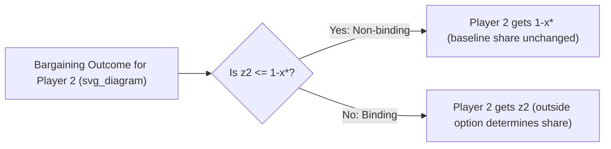

## Outside Options and Threats

### Overview

Outside options and threats are extensions to noncooperative bargaining theory that model what happens when players have alternatives to continued negotiation. An **outside option** is a guaranteed payoff a player can secure by unilaterally exiting the bargaining relationship (e.g., accepting another job offer, walking away to a competing buyer). A **threat** more broadly refers to any credible action a player can take to affect the bargaining outcome, including the option to disagree, delay, or exit. These concepts refine the basic Rubinstein alternating-offers framework by asking: does the mere *availability* of an alternative change the negotiated split, even if that alternative is never actually exercised in equilibrium?

The central and often counterintuitive finding is the **Outside Option Principle**: an outside option affects the bargaining outcome *only if* it exceeds what the player would receive from the bargaining process itself. Otherwise, it is irrelevant to the equilibrium split — its mere existence does nothing.

### Formal Setup

Extend the standard Rubinstein alternating-offers model (two players, discount factors $\delta_1, \delta_2$, pie normalized to 1) by giving each player $i$ an outside option $z_i \in [0,1]$, representing the payoff obtained if player $i$ unilaterally exits after any rejection.

**Modified timing**: After a proposal is rejected, the responder does not merely counter-propose next period — they additionally have the choice, at the moment of rejecting, to **exit and take $z_i$** instead of continuing to bargain.

**Payoff structure**: If player $i$ exits at period $t$, they receive $\delta_i^t z_i$. If agreement is reached at period $t$ on a share $s$, they receive $\delta_i^t s$.

### The Outside Option Principle

Let $x^*$ be the baseline Rubinstein equilibrium share (no outside options) for Player 1:

$$x^* = \frac{1-\delta_2}{1-\delta_1\delta_2}$$

**Key Points**:

- If $z_2 \le 1 - x^*$ (Player 2's outside option is less than what they'd get in the baseline equilibrium), the outside option is **non-binding**: the equilibrium outcome is unchanged; $x^{**} = x^*$.
- If $z_2 > 1 - x^*$ (Player 2's outside option exceeds their baseline share), the outside option **binds**: Player 1 must now offer Player 2 exactly $z_2$ to prevent them from exiting, so Player 1's equilibrium share becomes:

$$x^{**} = 1 - z_2$$

This produces a **kinked response function**: Player 1's payoff is unaffected by increases in Player 2's outside option until it crosses the baseline threshold, after which every additional unit of Player 2's outside option is transferred dollar-for-dollar out of Player 1's share.

**[Inference]** This kink is one of the more surprising results in bargaining theory for newcomers, since it implies two outside options with different values below the threshold produce *identical* bargaining outcomes — a discontinuous sensitivity that can seem to conflict with intuitions of "more outside value should always help."

### Diagrammatic Representation

### Intuition for the Principle

The logic follows from the equilibrium's stationarity argument (as in the base Rubinstein model). The outside option functions like a **participation constraint** rather than a direct bargaining chip:

- If your outside option is worse than what you'd secure by patiently bargaining, threatening to "walk away" is not credible — your counterpart knows you're better off continuing to negotiate, so the threat carries no weight.
- If your outside option is better than the negotiated share, walking away *is* credible, and your counterpart must match it (exactly, at the margin) to keep you at the table — but no more, since anything above $z_i$ is a needless concession.

This mirrors the logic of **outside options in the Nash Bargaining Solution with a disagreement point**: the disagreement/threat point only shifts the outcome if it lies outside the feasible bargaining set implied by the status quo split.

### Distinguishing Outside Options from Inside Options (Disagreement Payoffs)

A critical distinction in the literature (Shaked and Sutton, 1984, being the canonical reference for the principle above) is between:

- **Outside option**: a payoff obtained only by *permanently exiting* the relationship (no further bargaining possible afterward).
- **Inside option / disagreement payoff**: a payoff obtained *during* an impasse while bargaining *continues* (e.g., a strike fund paid out per period while a labor dispute persists, or a firm's flow profits during an ongoing but unresolved negotiation).

These are modeled differently:

- Outside options generate the kinked "principle" result above.
- Inside/disagreement payoffs (sometimes called **flow payoffs during delay**) directly enter every period's continuation value and generally *do* shift the equilibrium split smoothly and continuously, unlike outside options — because they are received regardless of whether bargaining eventually succeeds, not merely as an exit payoff.

**Key Points**:

- Confusing these two concepts is one of the most common errors students make; always ask "does taking this payoff end the game, or can bargaining still continue afterward?"

### Threats and Commitment

Beyond simple exit options, the bargaining literature more broadly studies **threats** as any action a player can commit to that changes the strategic environment:

- **Nash's variable-threat game**: In Nash's original (1953) bargaining formulation, players first simultaneously choose "threats" (which determine the disagreement point/payoffs if no deal is struck), and *then* bargain over the surplus given that disagreement point. Optimal threats are chosen to maximize one's own bargaining leverage, subject to the opponent's best response.
- **Credibility requirement**: A threat only affects the outcome if it is credible — i.e., if the threatening player would actually be willing to carry it out. Non-credible threats (that the threatener would not follow through on) do not affect subgame perfect equilibrium outcomes, per standard refinement logic — this is the same credibility logic underlying the Outside Option Principle itself.
- **Strategic commitment devices**: Players may take real, costly actions (e.g., publicly burning bridges, signing exclusive contracts, incurring sunk costs) specifically to make an otherwise non-credible threat credible, thereby shifting bargaining power in their favor. This connects to the broader game-theoretic literature on **commitment and credibility** (e.g., Schelling's "The Strategy of Conflict").

### Worked Numerical Example

**Setup**: Pie = $100. $\delta_1 = \delta_2 = 0.9$. Baseline (no outside options) equilibrium share for Player 1:

$$x^* = \frac{1}{1+0.9} \approx 0.526 \;(\$52.60)$$

So baseline Player 2 share is $1 - x^* \approx 0.474$ ($47.40).

**Case A — Non-binding outside option**: Suppose Player 2 has an outside option of $z_2 = \$30$ (i.e., $z_2 = 0.30$). Since $0.30 < 0.474$, this is *below* Player 2's baseline share.

- **Result**: Outside option has zero effect. Equilibrium remains $x^{**} = 0.526$ ($52.60 for P1, $47.40 for P2), exactly as in the baseline case.

**Case B — Binding outside option**: Suppose Player 2's outside option rises to $z_2 = \$60$ (i.e., $z_2 = 0.60$). Since $0.60 > 0.474$, this exceeds Player 2's baseline share.

- **Result**: The outside option binds. Player 1 must concede $z_2 = 0.60$ to Player 2 to prevent exit, so:

$$x^{**} = 1 - 0.60 = 0.40 \;(\$40 \text{ for P1}, \$60 \text{ for P2})$$

**Step-by-step interpretation**: Going from $z_2 = \$30$ to $z_2 = \$47.40$ has *zero* marginal effect on the split. Crossing $\$47.40$, however, every additional dollar of outside option value transfers directly and fully to Player 2 at Player 1's expense.

### Applications

- **Labor markets**: A worker's outside job offer only raises their negotiated wage with their current employer if it exceeds what continued negotiation with the employer would yield; below that threshold, the outside offer is "bargaining-irrelevant" even though it may seem to strengthen the worker's position.
- **Mergers and acquisitions**: A target firm's ability to solicit a competing bid ("go-shop" provisions) only improves negotiated terms with the primary acquirer once the competing bid exceeds the deal terms otherwise achievable.
- **Divorce and family bargaining**: The value of remaining single (or of an alternative partnership) as an outside option in models of household bargaining (e.g., McElroy and Horney's application of Nash bargaining to marriage).
- **Union-firm bargaining with strike funds**: Distinguishes strike funds (inside options — flow payoffs during ongoing disputes) from resignation/relocation opportunities (outside options — exit payoffs).

### Common Misconceptions

- **Misconception**: A better outside option always improves your bargaining outcome. **Correction**: Only improves it once the outside option exceeds your baseline negotiated share — below that, it has no effect (the Outside Option Principle).
- **Misconception**: Outside options and disagreement/flow payoffs during delay are the same thing. **Correction**: They are modeled and behave differently; outside options create a kink, disagreement/flow payoffs shift the outcome continuously.
- **Misconception**: Any stated threat changes bargaining power. **Correction**: Only *credible* threats (ones the threatening party would actually execute) affect equilibrium outcomes under standard subgame perfection.

### Related Topics

- Rubinstein Alternating Offers Model
- Nash Bargaining Solution and the Disagreement Point
- Nash's Variable-Threat Bargaining Game
- Shaked-Sutton Outside Option Theorem
- Commitment Devices and Credibility (Schelling)
- Bargaining with Inside Options / Flow Payoffs During Delay
- Strikes and Delay in Labor Negotiation Models
- Renegotiation-Proofness in Dynamic Bargaining