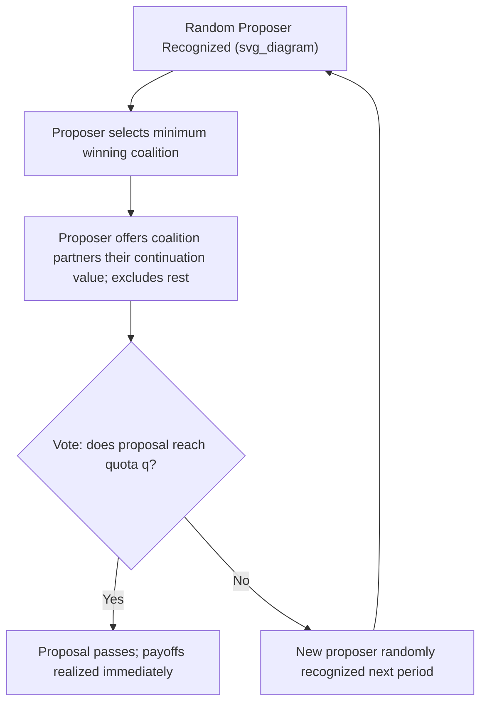

## Multilateral Bargaining

### Overview

Multilateral bargaining extends noncooperative bargaining theory from the two-player case (as in the Rubinstein alternating-offers model) to settings with three or more players negotiating over the division of a surplus, the formation of coalitions, or the allocation of resources. Moving beyond bilateral bargaining introduces qualitatively new phenomena absent from two-player models: **coalition formation**, **majority/voting rules for agreement**, **non-uniqueness of equilibria**, and the interaction between bargaining protocols and cooperative solution concepts like the core and the Shapley value. Multilateral bargaining theory underlies applications ranging from legislative bargaining and coalition governments to committee decision-making and multi-party business negotiations.

### Why the Two-Player Result Does Not Simply Generalize

In Rubinstein's two-player model, uniqueness of the subgame perfect equilibrium (SPE) arises from a sharp squeeze argument exploiting the fact that a rejection sends the game to a symmetric subgame with the *other* player proposing. In multilateral settings, this symmetry breaks down for several reasons:

- **Multiple responders**: A proposal must be accepted by some rule (unanimity, majority, or a specific voting quota) among $n-1$ other players, not a single responder, changing the strategic calculus entirely.
- **Order and recognition uncertainty**: Who proposes next after a rejection is often stochastic (a "recognition rule") rather than deterministically alternating, since there is no natural "next player" in a group of three or more.
- **Coalition possibilities**: With more than two players, subsets of players (coalitions) can potentially do better by excluding others, introducing considerations entirely absent in bilateral bargaining.

**[Inference]** As a result, most multilateral bargaining models require additional structure (e.g., specific recognition/proposer-selection rules, stationarity restrictions on strategies) to recover any form of equilibrium uniqueness — outcomes in general multilateral bargaining games are frequently non-unique without such restrictions.

### Baron-Ferejohn Legislative Bargaining Model

The dominant workhorse model for multilateral bargaining, developed by Baron and Ferejohn (1989), applies the alternating-offers logic to a committee/legislature setting.

**Setup**:

- $n$ players (legislators) bargain over dividing a fixed budget/pie of size 1.
- In each period, one player is randomly recognized (with some probability distribution, often uniform $1/n$) to propose a division $(x_1, \ldots, x_n)$ with $\sum x_i = 1$.
- All players vote on the proposal; if it receives support from a specified quota $q$ (e.g., simple majority, $q > n/2$), it passes and the game ends; otherwise, a new proposer is recognized next period and the process repeats.
- All players discount future payoffs at a common discount factor $\delta$.

**Key stationary equilibrium result**: Under a **stationary strategies** restriction (players use the same strategy regardless of history, conditioning only on the current proposer), a symmetric stationary SPE exists in which:

- The recognized proposer allocates a share to themselves and offers the *minimum winning coalition* just enough to secure their votes, giving zero to excluded players.
- Because being excluded is costly (delay is costly under discounting), the minimal winning coalition members accept a payment equal to their discounted continuation value from waiting for a future recognition, rather than the full pie.

For $n$ players with recognition probability $1/n$ each and a simple-majority quota, the proposer's equilibrium share as $\delta \to 1$ approaches:

$$x_{proposer} \to 1 - \frac{q-1}{n}\cdot(\text{expected share to coalition partners})$$

**[Inference]** The precise closed-form values depend heavily on the specified quota rule and $n$; the qualitative and most cited result is that the proposer captures a **disproportionately large share**, and only a **minimum winning coalition** (not all players) receives any payoff — excluded players get nothing in the stationary equilibrium.

### Minimum Winning Coalitions

A central prediction of the Baron-Ferejohn framework is the **minimum winning coalition** result: the proposer includes just enough other players to reach the passage quota $q$, and no more, since including additional players would only dilute the proposer's own share without any strategic benefit.

**Key Points**:

- This formalizes long-standing political science intuitions (originating with William Riker's *size principle*) that rational coalition-builders in majority-rule settings prefer coalitions of minimal winning size rather than large, inclusive coalitions.
- The identity of *which* minimum winning coalition forms can be indeterminate or determined by the random recognition order, depending on model specifics.

### Diagrammatic Representation

### Rubinstein-Style Multilateral Bargaining Under Unanimity

An alternative multilateral extension retains **unanimity** as the acceptance rule (all $n$ players must agree), rather than a majority quota, closely paralleling the two-player Rubinstein logic.

- Under unanimity with stationary strategies and common discounting, a unique stationary SPE typically exists, generalizing the two-player closed-form solution, with each player's equilibrium share shrinking as $n$ grows (since delay affects — and is costly to — all players symmetrically, and any single player can block agreement).
- As $n \to \infty$ under unanimity, bargaining frictions and blocking power interact in ways that can produce very slow convergence to efficient outcomes, since unanimous consent becomes progressively harder to coordinate.
- **[Inference]** Unanimity-rule multilateral bargaining is comparatively less studied in applied contexts than majority-rule (Baron-Ferejohn) models, largely because most real-world multilateral institutions (legislatures, corporate boards) operate under majority or supermajority rules rather than strict unanimity.

### Coalitional Bargaining and Cooperative Solution Concepts

Multilateral bargaining connects closely to **cooperative game theory**, which studies the *characteristic function* form of a game (the value achievable by any coalition) independent of a specific bargaining protocol:

- **The Core**: The set of payoff allocations that no coalition can profitably deviate from (block); multilateral noncooperative bargaining models are often evaluated by whether their equilibrium outcomes converge to core allocations as frictions vanish.
- **The Shapley Value**: An axiomatic allocation rule assigning each player their average marginal contribution across all possible orders of coalition formation; several noncooperative multilateral bargaining protocols (e.g., certain random-proposer models with specific recognition rules) have been shown to implement the Shapley Value in equilibrium as a **noncooperative foundation**, analogous to how Rubinstein's model provides a foundation for the Nash Bargaining Solution.
- **Nash Program for $n$ players**: The broader research agenda of finding explicit noncooperative bargaining protocols whose equilibria replicate cooperative solution concepts (core, Shapley value, nucleolus) for $n > 2$ players.

### Worked Numerical Example — Baron-Ferejohn with 3 Players

**Setup**: $n=3$ legislators, uniform recognition probability $1/3$ each, simple majority quota $q=2$ (need 2 of 3 votes), common discount factor $\delta = 0.9$.

**Step 1** — In the symmetric stationary equilibrium, each player's *ex-ante* expected continuation value (before knowing who is recognized) is denoted $v$. By symmetry and budget-balance (someone always eventually gets the whole pie in present-value terms), $v = 1/3$ for each of the 3 players in expectation.

**Step 2** — When recognized, a proposer needs only 1 more vote (to reach quota 2 of 3). They offer the cheapest coalition partner exactly $\delta v = 0.9 \times \frac{1}{3} = 0.3$ to secure their vote (making that partner indifferent between accepting now and waiting for their own future recognition).

**Step 3** — The proposer keeps the remainder: $1 - 0.3 = 0.7$.

**Step 4** — The third (excluded) player receives $0$ in that period's agreement.

**Interpretation**: The recognized proposer captures 70% of the pie, one coalition partner receives 30%, and the excluded player receives nothing — illustrating the stark "minimum winning coalition" prediction, and the substantial premium attached to proposal power.

### Applications

- **Legislative and parliamentary bargaining**: Budget allocation, coalition government formation, and committee agenda-setting (the original Baron-Ferejohn motivation).
- **Corporate bargaining**: Multi-party joint ventures, syndicate lending negotiations, and multi-stakeholder merger negotiations.
- **International negotiations**: Multilateral trade or climate agreements, where coalition subsets may credibly threaten to proceed without holdout parties.
- **Household/family economics**: Extensions of bargaining models to multi-member households (beyond the two-person couple case).

### Common Misconceptions

- **Misconception**: Multilateral bargaining simply generalizes the two-player Rubinstein result to "everyone eventually gets an equal share." **Correction**: Under majority-rule protocols like Baron-Ferejohn, outcomes are typically **highly asymmetric**, with proposers and minimum winning coalition members capturing gains and excluded players receiving nothing.
- **Misconception**: All possible coalitions matter equally in equilibrium. **Correction**: In majority-rule models, only **minimum winning coalitions** form in equilibrium; larger coalitions are strictly suboptimal for the proposer.
- **Misconception**: Multilateral bargaining games always have a unique equilibrium like the two-player Rubinstein model. **Correction**: Uniqueness generally requires imposing a **stationarity restriction** on strategies; without it, multilateral bargaining games frequently admit multiple (including non-stationary) SPE.

### Related Topics

- Rubinstein Alternating Offers Model
- Baron-Ferejohn Legislative Bargaining Model
- Minimum Winning Coalitions (Riker's Size Principle)
- Cooperative Game Theory: The Core
- The Shapley Value and Its Noncooperative Foundations
- Nash Program (Bridging Cooperative and Noncooperative Theory)
- Coalition Formation Games
- Voting Theory and Quota Rules in Committees