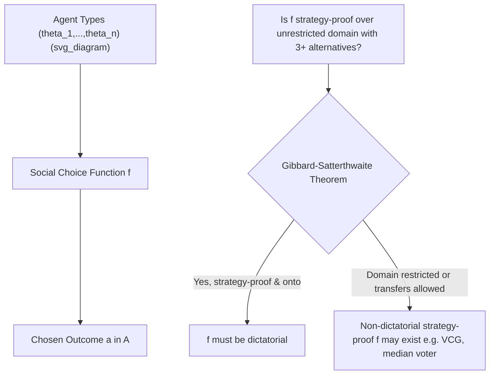

## Social Choice Functions

### Overview

A social choice function (SCF) is a mathematical rule that aggregates the individual preferences of multiple agents into a single collective decision or outcome. Formally, it maps a profile of individual preference orderings (or utility functions, depending on the informational setting) over a set of alternatives to a chosen outcome (or, in the related concept of a social welfare function, to a complete social ordering). Social choice functions form the foundational object of study in mechanism design, since a mechanism is typically evaluated by whether it can be constructed to *implement* a desired social choice function under agents' strategic (self-interested) behavior.

### Formal Definition

Let $N = \{1, \ldots, n\}$ be a set of agents, $A$ a set of feasible alternatives (outcomes), and $\Theta_i$ the set of possible **types** (private information, typically representing preferences) for agent $i$. Each agent $i$ has a type $\theta_i \in \Theta_i$ that determines their preferences over $A$, often represented by a utility function $u_i(a, \theta_i)$ for $a \in A$.

A **social choice function** is a mapping:

$$f: \Theta_1 \times \Theta_2 \times \cdots \times \Theta_n \rightarrow A$$

That is, $f$ takes a profile of types $\theta = (\theta_1, \ldots, \theta_n)$ (one per agent) and selects a single alternative $f(\theta) \in A$.

**Distinction from a social welfare function**: A **social welfare function** (SWF) maps a profile of individual preference *orderings* to a complete social preference *ordering* over all alternatives (studied classically by Arrow), whereas a social choice function maps directly to a single chosen *outcome*. SCFs are the object of primary interest in mechanism design because implementation concerns which single outcome results, not the entire induced ranking.

### Key Properties of Social Choice Functions

**Pareto Efficiency**: $f(\theta)$ is Pareto efficient if there is no alternative $a' \in A$ such that $u_i(a', \theta_i) \geq u_i(f(\theta), \theta_i)$ for all $i$, with strict inequality for at least one agent. No agent can be made better off without making another worse off.

**Anonymity (Symmetry)**: The outcome does not depend on the labeling/identity of agents — permuting which agent reports which type permutes the outcome correspondingly.

**Neutrality**: The outcome does not depend on the labeling of alternatives — relabeling alternatives correspondingly relabels the chosen outcome.

**Monotonicity (Maskin Monotonicity)**: If alternative $a = f(\theta)$ is chosen at profile $\theta$, and at a new profile $\theta'$ every agent's ranking of $a$ relative to every other alternative weakly improves, then $f(\theta') = a$ must still hold. This is a central property because **Maskin's Theorem** establishes Maskin monotonicity as a *necessary* condition for a social choice function to be implementable in Nash equilibrium, and (together with a mild no-veto-power condition) *sufficient* for implementability with 3 or more agents.

**Non-dictatorship**: There is no single agent $i$ whose most-preferred alternative is always chosen by $f$, irrespective of all other agents' reported types.

**Strategy-Proofness (Incentive Compatibility)**: $f$ is strategy-proof (dominant-strategy incentive compatible) if truthful reporting of one's type is a weakly dominant strategy for every agent, regardless of others' reports:

$$u_i(f(\theta_i, \theta_{-i}), \theta_i) \geq u_i(f(\theta_i', \theta_{-i}), \theta_i) \quad \forall \theta_i, \theta_i', \theta_{-i}, i$$

### The Gibbard-Satterthwaite Theorem

This is the central impossibility result governing social choice functions over general (unrestricted) preference domains.

**Statement**: If the set of alternatives $A$ has at least 3 elements, and every possible strict preference ordering over $A$ is a permissible type (the unrestricted domain assumption), then any social choice function $f$ that is both (a) strategy-proof and (b) has a range containing at least 3 alternatives (or, in a common formulation, is onto/surjective) must be **dictatorial**.

**Key Points**:

- This is the ordinal-preference analogue of Arrow's Impossibility Theorem for social welfare functions; the two results are deeply related, and Gibbard-Satterthwaite can be derived from Arrow's theorem (and vice versa, under suitable conditions).
- The theorem implies that **no reasonable general-purpose voting rule can be strategy-proof** — every non-dictatorial voting rule over 3+ alternatives is manipulable by some agent misreporting their true preferences, for some preference profile.
- This impossibility motivates the entire subsequent research program in mechanism design: since general strategy-proofness is impossible, researchers instead (a) restrict the preference domain (e.g., single-peaked preferences, quasilinear utility with monetary transfers), (b) weaken the solution concept (e.g., Bayesian incentive compatibility instead of dominant-strategy), or (c) accept implementation in a weaker equilibrium notion (e.g., Nash equilibrium rather than dominant strategies).

### Escaping Impossibility: Restricted Domains and Quasilinear Environments

**Single-Peaked Preferences**: If preferences are restricted to be single-peaked over a one-dimensional alternative space (each agent has an ideal point, and utility strictly decreases moving away from it in either direction), the **median voter rule** is strategy-proof, efficient, and anonymous — Gibbard-Satterthwaite's impossibility is circumvented because the domain restriction removes the preference profiles that generate manipulability.

**Quasilinear Utility with Monetary Transfers**: In settings where alternatives include both a "public" decision component and monetary transfers, and utility is quasilinear ($u_i = v_i(a,\theta_i) - t_i$, i.e., linear in money), a much richer class of strategy-proof mechanisms becomes available:

- **Vickrey-Clarke-Groves (VCG) mechanisms**: A general class of mechanisms achieving Pareto-efficient outcomes with dominant-strategy incentive compatibility, by having each agent pay a transfer equal to the externality they impose on others (their effect on the others' total welfare).
- The classic **second-price (Vickrey) auction** is the single-good special case of the VCG mechanism.

**Bayesian Implementation**: Relaxing dominant-strategy incentive compatibility to **Bayesian incentive compatibility** (truth-telling is a best response given beliefs about others' types, rather than for all possible types of others) substantially expands the set of implementable social choice functions, at the cost of requiring common knowledge of the type distribution.

### Diagrammatic Representation

### Worked Example: Manipulability Under Plurality Rule

**Setup**: 3 agents, 3 alternatives $\{A, B, C\}$, plurality voting (each agent votes for one alternative; the alternative with the most votes wins; assume some fixed tie-break rule).

**True preferences**:

- Agent 1: $A \succ B \succ C$
- Agent 2: $A \succ B \succ C$
- Agent 3: $B \succ C \succ A$

**Step 1** — Truthful voting outcome: Agents 1 and 2 vote $A$; Agent 3 votes $B$. Plurality winner: $A$ (2 votes vs. 1).

**Step 2** — Suppose Agent 3 instead knows (or believes) that Agent 2 might be persuadable, and there's a scenario where votes split $A$: 1, $B$: 1, $C$: 1 in a tie-prone configuration—but more directly, consider a scenario with 5 agents where Agent 3's true favorite $B$ is unlikely to win, but $C$ is closer to beating $A$ than $B$ is.

**Step 3 (Simplified Manipulation Illustration)** — Consider instead: Agent 3's sincere vote for $B$ has no chance of winning (only 1 of 3 votes). If Agent 3 instead votes for $C$ (their second choice) hoping to combine with a hypothetical fourth agent who also prefers $C$, they could tip the outcome to $C \succ_3 A$, which they sincerely prefer to $A$ winning. This illustrates: **misreporting (voting for a non-top preference) can produce a better outcome for Agent 3 than sincere voting**, given others' behavior — precisely the manipulability Gibbard-Satterthwaite proves is unavoidable in some profile for any non-dictatorial rule over unrestricted domains with 3+ alternatives.

**[Inference]** The specific manipulation profile that breaks strategy-proofness varies by voting rule (plurality, Borda count, etc.); the Gibbard-Satterthwaite Theorem guarantees *some* such manipulable profile exists for every non-dictatorial rule, without specifying which profile it is for a given rule.

### Relationship to Arrow's Impossibility Theorem

- Arrow's Theorem concerns **social welfare functions** (aggregating preference orderings into a social ordering) and shows no SWF can simultaneously satisfy Pareto efficiency, independence of irrelevant alternatives (IIA), and non-dictatorship, over an unrestricted domain with 3+ alternatives.
- Gibbard-Satterthwaite concerns **social choice functions** (aggregating into a single outcome) and strategy-proofness.
- The two theorems are formally connected: a strategy-proof, onto social choice function can be used to construct a social welfare function satisfying Arrow's axioms, and vice versa, meaning the theorems are essentially two facets of the same underlying impossibility given unrestricted preference domains.

### Applications

- **Voting system design**: Understanding why all realistic voting rules are theoretically manipulable, and choosing rules that minimize manipulability in practice even if they cannot eliminate it entirely.
- **Auction design**: VCG mechanisms and the second-price auction are direct applications of strategy-proof social choice functions in quasilinear environments.
- **Public goods provision**: Determining how much of a public good to provide and how to fund it, subject to agents' private valuations (the domain of the **Groves-Clarke mechanism**, a specific VCG instance).
- **School and resident matching**: Deferred acceptance and related matching mechanisms are social choice functions defined over preference profiles in two-sided matching markets, studied for strategy-proofness (see the Gale-Shapley literature).
- **Committee and resource allocation problems**: Selecting a location for a public facility along a line (single-peaked domain) via the median voter rule.

### Common Misconceptions

- **Misconception**: Gibbard-Satterthwaite means "no voting system is any good." **Correction**: It means no *general-purpose, unrestricted-domain* voting system can be simultaneously non-dictatorial and perfectly strategy-proof; restricting the domain (e.g., single-peaked preferences) or allowing monetary transfers (quasilinear settings) permits many good, non-dictatorial, strategy-proof mechanisms.
- **Misconception**: Social choice functions and social welfare functions are the same object. **Correction**: SCFs select a single outcome; SWFs produce a complete ranking of all outcomes — they are related but formally distinct objects of study (Arrow vs. Gibbard-Satterthwaite).
- **Misconception**: Strategy-proofness is the only desirable property in mechanism design. **Correction**: Efficiency, budget balance, individual rationality, and fairness/equity are all independently important and frequently trade off against strategy-proofness (see, e.g., the Myerson-Satterthwaite impossibility theorem for bilateral trade).

### Related Topics

- Arrow's Impossibility Theorem
- Gibbard-Satterthwaite Theorem
- Vickrey-Clarke-Groves (VCG) Mechanisms
- Maskin Monotonicity and Nash Implementation
- Single-Peaked Preferences and the Median Voter Theorem
- Myerson-Satterthwaite Impossibility Theorem
- Revelation Principle
- Matching Theory and the Gale-Shapley Algorithm