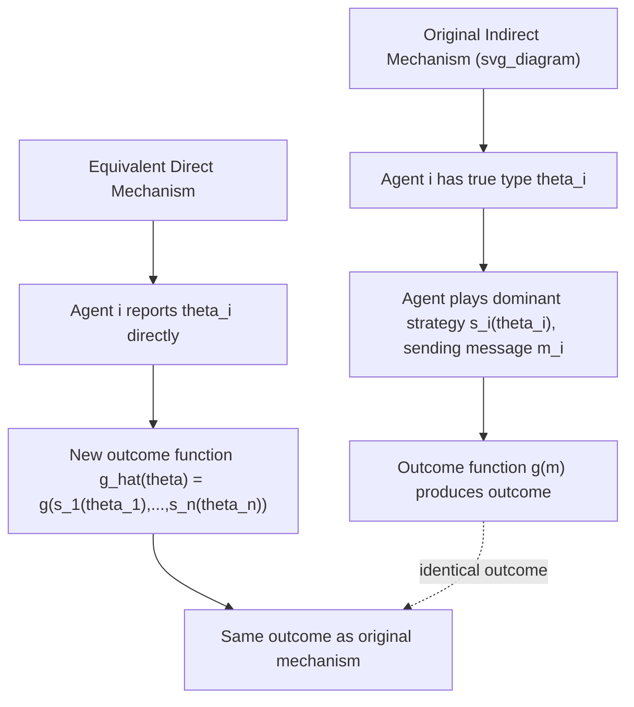

## The Revelation Principle

### Overview

The Revelation Principle is a foundational result in mechanism design stating that **any outcome achievable by any mechanism under any equilibrium concept can also be achieved by a direct mechanism in which truth-telling is an equilibrium**. This is one of the most powerful simplifying tools in the field: it justifies restricting the entire search for optimal or feasible mechanisms to the class of **direct, truthful mechanisms**, without loss of generality. Rather than considering the vast space of arbitrary message spaces, communication protocols, and strategies that agents might use, a mechanism designer can focus exclusively on mechanisms where each agent simply reports their private type directly, and where reporting truthfully is optimal for every agent.

### Formal Setup

**Direct vs. Indirect Mechanisms**:

- A **direct mechanism** is one in which each agent's message space equals their type space ($M_i = \Theta_i$) — agents report a type directly.
- An **indirect mechanism** allows arbitrary message spaces $M_i$ (e.g., bids in an auction, which are not literally "my valuation" but a strategic choice from a broader message space) and an outcome function mapping reported messages to outcomes.

**General mechanism**: A mechanism is a pair $(M, g)$ where $M = M_1 \times \cdots \times M_n$ is the joint message space and $g: M \rightarrow A$ maps messages to outcomes (and possibly transfers).

**Equilibrium concept**: Given a mechanism, agents choose strategies $s_i: \Theta_i \rightarrow M_i$ mapping their private type to a message. An equilibrium (e.g., dominant strategy, Bayesian Nash) is a strategy profile from which no agent wants to deviate, given their beliefs and the others' strategies.

### Statement of the Theorem

**Revelation Principle (Dominant Strategy Version)**: Suppose a mechanism $(M, g)$ implements a social choice function $f$ in dominant strategies via strategy profile $s = (s_1, \ldots, s_n)$ (i.e., $g(s_1(\theta_1), \ldots, s_n(\theta_n)) = f(\theta)$ for all $\theta$, and each $s_i$ is a dominant strategy). Then the **direct mechanism** $(Θ, f)$ — where each agent reports their type directly and the outcome function is $f$ itself — implements $f$ in dominant strategies with **truthful reporting** as each agent's dominant strategy.

**Revelation Principle (Bayesian Nash Version)**: Analogously, if a mechanism implements $f$ in Bayesian Nash equilibrium via strategies $s_i(\theta_i)$, then the direct mechanism where each agent reports their type, using outcome function $f(\theta) = g(s_1(\theta_1), \ldots, s_n(\theta_n))$, implements $f$ with truthful reporting constituting a Bayesian Nash equilibrium.

### Proof Sketch (Dominant Strategy Case)

The proof is a simple and elegant "relabeling" argument:

1. Suppose in the original (possibly indirect) mechanism $(M, g)$, agent $i$'s dominant strategy, given true type $\theta_i$, is to send message $s_i(\theta_i) \in M_i$.
2. Construct the direct mechanism $\hat{g}(\theta) := g(s_1(\theta_1), \ldots, s_n(\theta_n))$ — i.e., the new outcome function simply "simulates" what each agent would have sent under their equilibrium strategy in the original mechanism, then applies the original outcome function $g$.
3. In this new direct mechanism, if agent $i$ reports their true type $\theta_i$, the direct mechanism computes the exact same outcome as if agent $i$ had played their dominant strategy $s_i(\theta_i)$ in the original mechanism. Since $s_i(\theta_i)$ was optimal (dominant) in the original mechanism for every possible profile of others' messages, truthfully reporting $\theta_i$ in the new mechanism — which reproduces exactly the same induced outcome — must also be optimal (dominant) for agent $i$.
4. Since this holds for every agent, truthful reporting is a dominant strategy equilibrium of the direct mechanism $(\Theta, \hat{g})$, and by construction $\hat{g}(\theta) = f(\theta)$ for all $\theta$.

**Key Points**:

- The proof is essentially a **change of variables / relabeling** argument: the direct mechanism designer does the strategic "translation" work internally (computing what the agent *would have* strategically reported) so the agent no longer needs to.
- This logic is often summarized as: "Let the mechanism designer do the lying for you" — instead of the agent strategically misreporting to a naive mechanism, the mechanism itself absorbs that strategic computation and simply asks for the truth.

### Diagrammatic Representation

### Worked Example: From a Bidding Mechanism to a Direct Mechanism

**Setup**: Consider a simplified single-good auction where agents submit bids $b_i \in \mathbb{R}_{\geq 0}$ (an indirect mechanism, since $b_i$ need not equal the agent's true valuation $\theta_i$). Suppose this is a **second-price (Vickrey) auction**: highest bidder wins, pays the second-highest bid.

**Step 1** — In the second-price auction, it is a well-established, standard, dominant-strategy result that each bidder's optimal (dominant) strategy is $s_i(\theta_i) = \theta_i$ — i.e., bid your true value. (This mechanism happens to already be "accidentally" truthful in its natural strategy space.)

**Step 2** — Apply the Revelation Principle's construction: define the direct mechanism where agents report values $\hat{\theta}_i$ directly, and the outcome function is $\hat{g}(\hat{\theta}) = g(s_1(\hat{\theta}_1), \ldots, s_n(\hat{\theta}_n)) = g(\hat{\theta}_1, \ldots, \hat{\theta}_n)$ (since $s_i$ is already the identity function here).

**Step 3** — The resulting direct mechanism is: allocate the good to the agent with the highest *reported* value, charge them the second-highest *reported* value. This is exactly the standard direct-mechanism description of the second-price auction — illustrating that when the underlying dominant strategy is already "truthful" in its natural space, the direct-mechanism construction simply reproduces the familiar rule.

**Step 4 (Illustrating the general case)** — Now suppose instead we had a hypothetical indirect mechanism where the dominant strategy was $s_i(\theta_i) = \theta_i / 2$ (bid half your value) — the direct mechanism construction would define $\hat{g}(\hat\theta) = g(\hat\theta_1/2, \ldots, \hat\theta_n/2)$, so that truthfully reporting $\hat\theta_i = \theta_i$ produces exactly the same outcome as the original mechanism did when the agent bid $\theta_i/2$. This demonstrates the "internalizing the strategic translation" logic even when the original optimal strategy is not literally truthful in its own message space.

### Scope, Uses, and Limitations

**Primary use — existence and characterization, not necessarily implementation**: The Revelation Principle is chiefly a tool for **theoretical characterization**: it lets researchers derive necessary and sufficient conditions for *which* social choice functions are implementable at all, by restricting attention to direct mechanisms and their associated incentive compatibility (IC) and individual rationality (IR) constraints. Nearly all major results in mechanism design (VCG mechanisms, Myerson's optimal auction, the Myerson-Satterthwaite theorem) rely on the Revelation Principle as their first analytical step.

**Not necessarily a design recommendation**: Although the Revelation Principle guarantees a truthful direct mechanism achieving any implementable outcome *exists*, this does not imply that direct mechanisms are always the most *practical* choice for real-world deployment. **[Inference]** Reasons direct mechanisms may be avoided in practice include: computational complexity of processing full type reports (e.g., in combinatorial settings with high-dimensional types), privacy concerns around revealing full private information even to a trusted mechanism, and robustness considerations (indirect mechanisms may be less sensitive to designer errors or manipulation of the mechanism itself).

**Limitations and caveats**:

- The Revelation Principle's equivalence is about **equilibrium outcomes**, not about **off-equilibrium properties** (robustness, computational tractability, or behavior under bounded rationality) — these can differ substantially between an original indirect mechanism and its direct-mechanism equivalent.
- In some settings (e.g., mechanism design with **collusion**, **multi-stage/dynamic mechanisms with limited commitment**, or **undominated Nash equilibrium** as the solution concept rather than dominant strategy or Bayesian Nash), the Revelation Principle can fail or require substantial modification — this remains an active research area.
- The principle assumes the mechanism designer can costlessly and credibly commit to the direct mechanism's outcome function; if commitment is imperfect, the equivalence can break down.

### Applications

- **Auction theory**: Foundational to Myerson's (1981) characterization of the revenue-maximizing (optimal) auction, which is derived entirely within the class of direct, Bayesian incentive-compatible mechanisms, justified by the Revelation Principle.
- **Optimal taxation and regulation**: Screening problems (e.g., a regulator setting prices for a monopolist with private costs) are analyzed via direct mechanisms where the regulated party reports its type (cost), justified by the Revelation Principle.
- **Bilateral trade**: The Myerson-Satterthwaite impossibility theorem (no mechanism achieves efficiency, budget balance, and individual rationality simultaneously with private information) is proven by first invoking the Revelation Principle to restrict to direct mechanisms.
- **Matching markets**: Strategy-proofness analysis of mechanisms like deferred acceptance relies on direct-mechanism reasoning enabled by the Revelation Principle.

### Common Misconceptions

- **Misconception**: The Revelation Principle implies real-world mechanisms should always ask agents to report their full type directly. **Correction**: It establishes a theoretical equivalence useful for *characterizing* implementable outcomes; practical considerations (complexity, privacy, robustness) often favor indirect mechanisms that are *equivalent in outcome* to some direct mechanism, without literally being one.
- **Misconception**: The Revelation Principle guarantees that truthful mechanisms are easy to find or that good social choice functions are always implementable. **Correction**: The principle only says that *if* an outcome is implementable by some mechanism, it is *also* implementable by a truthful direct mechanism — it says nothing about whether the underlying social choice function is implementable in the first place (that question is separately governed by results like Gibbard-Satterthwaite or the Myerson-Satterthwaite theorem).
- **Misconception**: "Truthful" and "direct" are two separate principles. **Correction**: They are bundled together in the single Revelation Principle — the constructed mechanism is simultaneously direct (message space equals type space) *and* truthful (truth-telling is the equilibrium strategy).

### Related Topics

- Social Choice Functions and Implementation Theory
- Gibbard-Satterthwaite Theorem
- Vickrey-Clarke-Groves (VCG) Mechanisms
- Myerson's Optimal Auction Design
- Myerson-Satterthwaite Impossibility Theorem
- Incentive Compatibility (Dominant Strategy vs. Bayesian)
- Screening and Adverse Selection Models
- Dynamic Mechanism Design and Limited Commitment