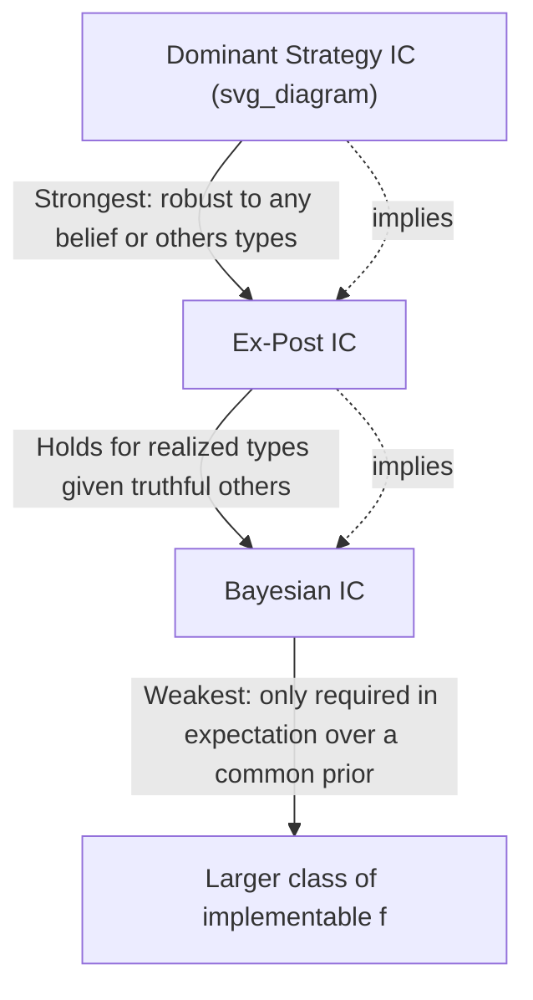

## Incentive Compatibility

### Overview

Incentive compatibility (IC) is the property of a mechanism whereby agents find it optimal to report their private information (type) truthfully, or more generally to behave as the mechanism designer intends, given their own self-interested objectives. It is the central constraint governing mechanism design: any mechanism that relies on agents voluntarily revealing private information must be structured so that honesty (or the desired behavior) is individually rational for each agent, given the strategic environment created by the mechanism itself. Incentive compatibility comes in several distinct strengths — dominant-strategy, Bayesian, and ex-post — each corresponding to different assumptions about what agents know and how robust the truth-telling requirement must be.

### Formal Framework

Let $\theta_i \in \Theta_i$ denote agent $i$'s private type, $f: \Theta \rightarrow A$ a social choice function (or, in mechanisms with transfers, $f$ paired with a payment rule $t_i(\theta)$), and $u_i(f(\theta), \theta_i)$ agent $i$'s utility from the outcome given their true type.

A **direct mechanism** asks each agent to report a type $\hat{\theta}_i \in \Theta_i$ (possibly untruthfully) and implements $f(\hat\theta)$. Incentive compatibility requires that truthful reporting be optimal under some solution concept.

### Dominant Strategy Incentive Compatibility (DSIC)

**Definition**: A mechanism is dominant-strategy incentive compatible if truthful reporting is a **weakly dominant strategy** for every agent — optimal regardless of what types (and hence reports) other agents have or report:

$$u_i(f(\theta_i, \theta_{-i}), \theta_i) \geq u_i(f(\hat\theta_i, \theta_{-i}), \theta_i) \quad \forall i, \theta_i, \hat\theta_i \in \Theta_i, \theta_{-i} \in \Theta_{-i}$$

**Key Points**:

- DSIC is the **strongest and most robust** form of incentive compatibility: it requires no assumptions about agents' beliefs regarding others' types or rationality — truth-telling is optimal for every possible realization of others' types.
- Because of this robustness, DSIC mechanisms are especially attractive in practice: they do not require agents to form (or the designer to specify) a common prior over the type distribution.
- The canonical example is the **second-price (Vickrey) auction**, where bidding one's true value is a dominant strategy irrespective of competitors' valuations or bids.
- Vickrey-Clarke-Groves (VCG) mechanisms generalize this dominant-strategy property to a broad class of efficient social choice problems with quasilinear utility.

### Bayesian Incentive Compatibility (BIC)

**Definition**: A mechanism is Bayesian incentive compatible if truthful reporting is optimal for each agent **in expectation over other agents' types**, given a common prior distribution over types and assuming other agents also report truthfully:

$$\mathbb{E}_{\theta_{-i}}\left[u_i(f(\theta_i, \theta_{-i}), \theta_i)\right] \geq \mathbb{E}_{\theta_{-i}}\left[u_i(f(\hat\theta_i, \theta_{-i}), \theta_i)\right] \quad \forall i, \theta_i, \hat\theta_i$$

**Key Points**:

- BIC is a **weaker requirement** than DSIC: it only needs to hold in expectation given a specified prior, not for every possible realization of others' types.
- Because it is weaker, BIC allows implementation of a strictly larger class of social choice functions than DSIC — this expanded feasibility is central to Myerson's optimal auction design, which is generally only Bayesian (not dominant-strategy) incentive compatible.
- **Trade-off**: BIC mechanisms require the common-prior assumption (agents and the designer share the same beliefs about the type distribution), which is a stronger informational/common-knowledge assumption than DSIC requires, even though the incentive requirement itself is weaker.

### Ex-Post Incentive Compatibility

**Definition**: A mechanism is ex-post incentive compatible if truthful reporting is optimal for each agent given the *realized* (rather than expected) types of others, assuming others report truthfully:

$$u_i(f(\theta_i, \theta_{-i}), \theta_i) \geq u_i(f(\hat\theta_i, \theta_{-i}), \theta_i) \quad \forall i, \theta_i, \hat\theta_i, \text{ given actual realized } \theta_{-i}$$

**Key Points**:

- Ex-post IC sits **strictly between** DSIC and BIC in strength: like DSIC, it requires the inequality to hold for the actual (not merely expected) realization of others' types; but like BIC, it presumes others are reporting truthfully (rather than requiring optimality against *any* possible report from others, truthful or not).
- Particularly relevant in settings with **interdependent values** (where an agent's utility depends on others' private information, not just their own type, such as common-value auctions), where DSIC is frequently unattainable but ex-post IC can still be achieved.

### Relationship Between the Three Concepts

**Key Points**:

- DSIC $\Rightarrow$ Ex-Post IC $\Rightarrow$ BIC (each stronger notion implies the weaker ones), but not conversely.
- The choice among these concepts in mechanism design typically reflects a trade-off between **robustness** (DSIC needs no common-prior assumption and is immune to agents' beliefs about each other) and **implementability** (BIC permits a strictly larger set of achievable social choice functions, at the cost of requiring common-knowledge assumptions about the type distribution).

### Individual Rationality (IR) as a Companion Constraint

Incentive compatibility is almost always studied alongside **individual rationality (participation) constraints**, which ensure agents are willing to participate in the mechanism at all:

$$u_i(f(\theta), \theta_i) \geq \bar{u}_i \quad \forall i, \theta$$

where $\bar{u}_i$ is agent $i$'s outside/reservation utility (often normalized to 0). IR can be required **ex-ante** (before learning one's type), **interim** (after learning one's own type but not others'), or **ex-post** (after all types/outcomes are realized) — mirroring the same hierarchy of informational timing as the IC concepts above.

**[Inference]** Ex-post IR is the most demanding form and, combined with efficiency and budget balance requirements, frequently produces additional impossibility results (as in the Myerson-Satterthwaite theorem for bilateral trade), whereas interim or ex-ante IR is comparatively easier to satisfy.

### Incentive Compatibility Constraints in Screening Problems

In quasilinear mechanism design with a continuum of types (e.g., Myerson's optimal auction, monopoly price discrimination, nonlinear pricing), the IC constraint is often characterized via two conditions derivable from the envelope theorem:

- **Monotonicity condition**: The allocation rule must be monotonic in type (e.g., higher-value buyers must receive the good with weakly higher probability), since assigning a higher-type agent a *lower* allocation than a lower type would create an incentive for the higher type to mimic the lower type's report.
- **Payment/transfer determination**: Given a monotonic allocation rule, the IC-consistent payment rule is uniquely pinned down (up to a constant reflecting the lowest type's utility) by an integral condition derived from the requirement that each type's information rent equals the integral of the allocation probability over all lower types.

This "monotonicity + integral payment formula" characterization is the standard technique for deriving optimal mechanisms (e.g., Myerson's virtual-value approach to optimal auctions) and is a direct consequence of imposing IC as a binding constraint in the designer's optimization problem.

### Worked Example: DSIC in the Second-Price Auction

**Setup**: A single indivisible good, $n$ bidders, each with private value $\theta_i$. Highest bidder wins; pays the second-highest bid.

**Claim**: Bidding $b_i = \theta_i$ (truthful bidding) is a dominant strategy.

**Step 1** — Suppose agent $i$'s true value is $\theta_i$, and let $p = \max_{j \neq i} b_j$ be the highest bid among all other agents (whatever it happens to be).

**Step 2** — If $\theta_i > p$: bidding truthfully ($b_i = \theta_i$) wins the auction (since $b_i > p$) and pays $p$, yielding surplus $\theta_i - p > 0$. Bidding any $b_i' > p$ also wins and pays the same $p$ (since price is determined by the second-highest bid, not the winner's own bid) — same surplus. Bidding any $b_i' < p$ loses, yielding 0 — strictly worse. So truthful bidding is weakly optimal in this case.

**Step 3** — If $\theta_i < p$: bidding truthfully loses the auction, yielding 0 surplus (no risk of paying more than value). Bidding any $b_i' > p$ to win would require paying $p > \theta_i$, yielding *negative* surplus $\theta_i - p < 0$ — strictly worse than losing. So truthful bidding (losing) is weakly optimal here too.

**Step 4** — Since truthful bidding is weakly optimal against *every* possible value of $p$ (i.e., every possible configuration of others' bids), it is a **dominant strategy** — this holds regardless of the number of bidders, their value distributions, or their strategies, confirming DSIC.

### Applications

- **Auction design**: DSIC is the design target for the Vickrey auction and general VCG mechanisms; BIC underlies Myerson's revenue-optimal auction.
- **Regulation and contract theory**: Screening contracts offered by a principal to an agent with private information (e.g., a regulator setting a menu of price-quantity contracts for a firm with unknown costs) are designed to satisfy IC so the agent self-selects into revealing their true type.
- **Matching mechanisms**: Deferred acceptance (Gale-Shapley) mechanisms are analyzed for strategy-proofness (a form of DSIC) with respect to submitted preference rankings.
- **Public goods and cost-sharing**: The Groves mechanisms achieve DSIC efficient public goods provision by having each agent's payment reflect the externality imposed on others.

### Common Misconceptions

- **Misconception**: Incentive compatibility means agents *want* to help the mechanism achieve efficiency or fairness. **Correction**: IC is purely about each agent's self-interested optimality of truth-telling — it says nothing about whether the resulting social choice function is efficient, fair, or otherwise desirable; those are separate design objectives layered on top of the IC constraint.
- **Misconception**: BIC is simply a weaker, less useful version of DSIC and should be avoided. **Correction**: BIC substantially expands the class of implementable social choice functions and is essential for results like Myerson's optimal auction; the choice between DSIC and BIC reflects a genuine robustness-versus-implementability trade-off, not a strict dominance of one over the other.
- **Misconception**: A mechanism is either "incentive compatible" or "not," as a single binary property. **Correction**: Incentive compatibility comes in multiple distinct strengths (dominant-strategy, ex-post, Bayesian), and a mechanism can satisfy weaker forms without satisfying stronger ones — the specific notion must always be stated.

### Related Topics

- The Revelation Principle
- Vickrey-Clarke-Groves (VCG) Mechanisms
- Myerson's Optimal Auction Design
- Individual Rationality Constraints (Ex-Ante, Interim, Ex-Post)
- Envelope Theorem in Mechanism Design
- Gibbard-Satterthwaite Theorem
- Screening and Adverse Selection
- Myerson-Satterthwaite Impossibility Theorem