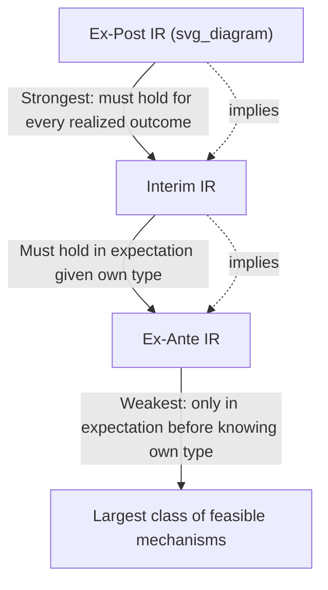

## Individual Rationality Constraints

### Overview

Individual rationality (IR) constraints, also called **participation constraints**, ensure that every agent is willing to voluntarily participate in a mechanism rather than opting out. In any mechanism design problem where participation is not compulsory, an agent will only engage if doing so yields them at least as much utility as their outside alternative (commonly normalized to zero). IR constraints are one of the two central constraint families in mechanism design — alongside incentive compatibility (IC) constraints — and the two interact closely: a mechanism satisfying IC but violating IR is theoretically well-behaved but practically unusable, since rational agents would simply decline to participate.

### Formal Definition

Let $\bar{u}_i$ denote agent $i$'s **reservation utility** — the payoff obtainable outside the mechanism (often normalized to $\bar{u}_i = 0$). A mechanism $(f, t)$, where $f$ is the allocation rule and $t_i$ is agent $i$'s payment, satisfies individual rationality if:

$$u_i(f(\theta), \theta_i) - t_i(\theta) \geq \bar{u}_i \quad \text{(under the relevant informational timing)}$$

The specific form of this constraint depends on **when** the participation decision is evaluated relative to what the agent knows.

### The Three Timing Variants

**Ex-Ante Individual Rationality**: The agent decides whether to participate *before* learning their own type $\theta_i$, based only on the prior distribution over types.

$$\mathbb{E}_{\theta_i}\left[\mathbb{E}_{\theta_{-i}}\left[u_i(f(\theta), \theta_i) - t_i(\theta)\right]\right] \geq \bar{u}_i$$

**Interim Individual Rationality**: The agent decides whether to participate *after* learning their own type but *before* learning others' types (or the realized outcome). This is the most commonly used IR concept in mechanism design, since it models a realistic setting where agents already know their own preferences/costs/values at the moment of deciding whether to engage with a mechanism.

$$\mathbb{E}_{\theta_{-i}}\left[u_i(f(\theta_i,\theta_{-i}), \theta_i) - t_i(\theta_i, \theta_{-i})\right] \geq \bar{u}_i \quad \forall \theta_i$$

**Ex-Post Individual Rationality**: The agent's participation must be individually rational for *every* realized outcome — i.e., the agent never regrets participating, even after all uncertainty is resolved and the actual outcome is known.

$$u_i(f(\theta), \theta_i) - t_i(\theta) \geq \bar{u}_i \quad \forall \theta$$

### Ordering of Strength

**Key Points**:

- Ex-Post IR $\Rightarrow$ Interim IR $\Rightarrow$ Ex-Ante IR (the reverse implications do not hold in general).
- Ex-post IR is the most demanding, since it must hold state-by-state with no room for favorable outcomes to offset unfavorable ones; ex-ante IR is the least demanding, since unfavorable realizations for one type can be "insured against" by favorable expected treatment across the type distribution before the agent even learns their type.
- The choice of which IR notion to impose has significant consequences for what social choice functions are implementable — this is central to understanding results like the Myerson-Satterthwaite theorem, discussed below.

### Interaction with Incentive Compatibility

IR and IC constraints are typically imposed **jointly** in the mechanism designer's optimization problem, and they interact in economically important ways:

- **Information rents**: In screening problems (e.g., a monopolist selling to a buyer with private value, or Myerson's optimal auction), the combination of interim IR and IC constraints generally requires giving strictly positive expected surplus ("information rent") to all but the *lowest* possible type, because IC prevents the designer from extracting full surplus from higher types without inducing them to mimic lower types.
- **Binding types**: In standard "regular" screening problems (monotone virtual value / hazard rate conditions), the interim IR constraint binds (holds with equality) only for the **lowest type** in the type space; all higher types earn strictly positive information rent above their reservation utility, an implication derivable directly from the envelope-theorem characterization of IC discussed in mechanism design.
- **Trade-off with efficiency and revenue**: Extracting more surplus from agents (e.g., raising a reserve price in an auction) generally requires relaxing efficiency to satisfy IR for lower types, or accepting that low-value agents will choose not to participate at all — creating the classic **efficiency-revenue trade-off** in optimal mechanism design.

### The Myerson-Satterthwaite Impossibility Theorem

The most famous application illustrating the bite of IR constraints (combined with other requirements) is the **Myerson-Satterthwaite Theorem (1983)**: in a bilateral trade setting (one seller with private cost, one buyer with private value, values/costs are independently drawn and their supports overlap), **no mechanism can simultaneously achieve**:

1. **Ex-post (Pareto) efficiency** — trade occurs whenever the buyer's value exceeds the seller's cost.
2. **Bayesian incentive compatibility** — truthful reporting is optimal in expectation.
3. **Interim individual rationality** — both parties are willing to participate given their own type.
4. **(Weak) budget balance** — the mechanism does not require external subsidy.

**Key Points**:

- This is a landmark impossibility result showing that private information alone (even with only two agents and one good) can make efficient trade fundamentally impossible without violating at least one of the above requirements.
- The theorem is typically proven precisely by combining the IC-implied envelope/information-rent formula with the interim IR constraints for both buyer and seller, and showing the resulting expected budget requirement is strictly negative (a deficit) whenever gains from trade are uncertain and the value/cost supports overlap.
- **[Inference]** In practice, this motivates institutional responses such as third-party subsidization, sacrificing some efficiency (e.g., posted prices or bid-ask spreads that trade less often than fully efficient), or relaxing to ex-ante rather than interim IR when repeated interactions or reputational mechanisms allow it.

### Worked Example: IR Binding in Optimal Auction Design

**Setup**: A seller auctions a single good to one buyer with private value $\theta \sim \text{Uniform}[0,1]$. The seller wants to maximize expected revenue, subject to the buyer's interim IR constraint (buyer's expected surplus must be $\geq 0$) and IC.

**Step 1** — In the unconstrained-optimal (Myerson) mechanism without a reserve price, the seller could try to extract full surplus by charging each buyer type exactly their value — but this violates IC (a high-value buyer would then report a lower value to pay less if the payment schedule isn't calibrated to make truth-telling optimal).

**Step 2** — With IC properly imposed, the interim-IR-compatible optimal auction typically takes the form of a **reserve price** $r^* > 0$ (the monopoly/optimal reserve, derived from the virtual value formula): the seller does not sell to buyer types below $r^*$, but IR for these types is trivially satisfied since they simply do not trade and get zero surplus, matching their reservation utility of zero.

**Step 3** — For $\theta \geq r^*$: the buyer trades and pays a price less than $\theta$, yielding strictly positive surplus (information rent) — increasing in $\theta$ — ensuring their interim IR constraint holds with strict inequality for all types above the reserve.

**Step 4** — For the lowest participating type $\theta = r^*$: the buyer's expected surplus is exactly zero, meaning the **interim IR constraint binds exactly at $\theta = r^*$** — consistent with the general principle that only the lowest (here, lowest *participating*) type has a binding participation constraint.

### Applications

- **Auction design**: Determining optimal reserve prices, which exist precisely because setting reserves too low would leave money on the table relative to what IR permits extracting, while reserves too high sacrifice trade with types who would trade efficiently but are excluded.
- **Bilateral trade and OTC markets**: The Myerson-Satterthwaite theorem directly explains persistent bid-ask spreads and incomplete trade in markets with asymmetric information about value/cost.
- **Regulation of monopolies with private costs**: A regulator designing a price-quantity menu for a firm must respect the firm's IR constraint (the firm won't operate at a loss relative to its outside option of not producing).
- **Insurance contract design**: Insurers offering menus of contracts to risk-types with private information must ensure each type's IR constraint holds, shaping the classic separating-menu structure of insurance contracts (Rothschild-Stiglitz).
- **Labor contracts and principal-agent models**: Employment contracts must satisfy the worker's IR/participation constraint relative to their outside labor-market option.

### Common Misconceptions

- **Misconception**: IR constraints are trivial to satisfy by simply "not charging too much." **Correction**: In mechanisms with many types and IC constraints simultaneously imposed, IR constraints interact tightly with information rents — satisfying IR for all types often requires leaving substantial surplus to *higher* types even when the designer would prefer to extract it, due to the joint requirement of incentive compatibility.
- **Misconception**: Ex-ante, interim, and ex-post IR are essentially interchangeable modeling choices with similar implications. **Correction**: They differ substantially in what they permit — ex-post IR is considerably more restrictive and can make otherwise-feasible mechanisms (efficient and budget-balanced) infeasible, as in Myerson-Satterthwaite (stated for interim IR, and ex-post IR is even more restrictive).
- **Misconception**: The Myerson-Satterthwaite theorem shows that "trade with private information is generally impossible." **Correction**: It shows that *fully efficient, exactly budget-balanced, interim-individually-rational, Bayesian-incentive-compatible* bilateral trade is impossible under overlapping-support conditions; trade mechanisms that relax one of these four requirements (e.g., accept some inefficiency, or allow subsidy) remain entirely feasible and are commonly used in practice.

### Related Topics

- Incentive Compatibility
- Myerson-Satterthwaite Impossibility Theorem
- Myerson's Optimal Auction Design
- The Revelation Principle
- Information Rents and the Envelope Theorem
- Screening and Adverse Selection Models
- Reserve Prices in Auction Design
- Principal-Agent Contract Theory