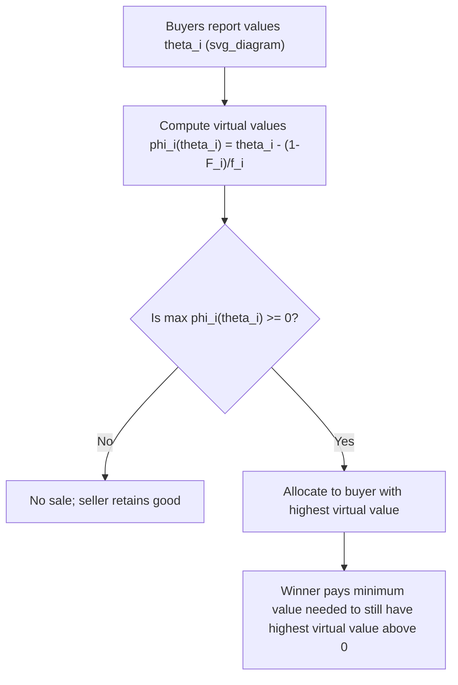

## Myerson's Optimal Mechanism

### Overview

Myerson's Optimal Mechanism (Myerson, 1981) characterizes the **revenue-maximizing** auction (or, more generally, mechanism) a seller can design when selling to buyers with privately known values, subject to Bayesian incentive compatibility and interim individual rationality. This result is a cornerstone of mechanism design and auction theory, providing the theoretical benchmark against which all practical auction formats are measured. Its central innovation is the concept of **virtual value**, which transforms the revenue-maximization problem into a tractable optimization solvable via the same allocation logic as an efficient (surplus-maximizing) mechanism, but applied to virtual values instead of true values.

### Setup and Assumptions

**Environment**: A seller has one indivisible good (generalizable to multiple units/goods) and faces $n$ risk-neutral buyers. Buyer $i$'s value $\theta_i$ is drawn independently from a distribution with CDF $F_i$ and density $f_i$, with support $[\underline{\theta}_i, \overline{\theta}_i]$. Values are private (each buyer knows only their own $\theta_i$) and independent across buyers.

**Objective**: The seller chooses a mechanism (allocation rule $q_i(\theta)$ giving the probability buyer $i$ wins, plus a payment rule $t_i(\theta)$) to maximize expected revenue $\mathbb{E}\left[\sum_i t_i(\theta)\right]$, subject to:

- **Bayesian Incentive Compatibility (BIC)**: truthful reporting is optimal in expectation for each buyer.
- **Interim Individual Rationality (IR)**: each buyer's expected surplus from participating (given their own type) is non-negative.

By the **Revelation Principle**, the seller can restrict attention to direct, truthful mechanisms without loss of generality.

### The Virtual Value Function

Myerson's key construct is the **virtual value** (also called the "virtual valuation" or "marginal revenue"):

$$\phi_i(\theta_i) = \theta_i - \frac{1 - F_i(\theta_i)}{f_i(\theta_i)}$$

**Interpretation**: The term $\frac{1-F_i(\theta_i)}{f_i(\theta_i)}$ is the **inverse hazard rate** and represents the information rent the seller must concede to buyer type $\theta_i$ due to the incentive compatibility constraint — it captures how much the seller "loses" by not being able to perfectly price-discriminate against this type, since higher types could otherwise mimic lower ones. The virtual value nets this rent-driven cost against the raw value, producing the seller's true marginal revenue from allocating to that type.

**Regularity condition**: A distribution $F_i$ is called **regular** if $\phi_i(\theta_i)$ is non-decreasing in $\theta_i$. Regularity holds for many common distributions (e.g., uniform, exponential, and many standard parametric families) and is required for the simplest characterization of the optimal mechanism; irregular distributions require an additional "ironing" procedure (see below).

### The Optimal Mechanism (Regular Case)

**Main Result**: When all $F_i$ are regular, the revenue-maximizing mechanism allocates the good to the buyer with the **highest virtual value**, provided that virtual value is non-negative; otherwise, the good is not sold (kept by the seller).

$$\text{Allocate to } \arg\max_i \phi_i(\theta_i), \quad \text{provided } \max_i \phi_i(\theta_i) \geq 0$$

**Key Points**:

- This is structurally identical to the logic of an *efficient* mechanism (which allocates to the highest *value*, i.e., $\arg\max_i \theta_i$), but performed on **virtual values** rather than raw values — a technique sometimes summarized as "Myerson's replacement principle."
- In the **symmetric case** (all buyers draw values from the same distribution $F$, hence the same $\phi(\cdot)$, which is strictly increasing under regularity), the highest-virtual-value buyer is simply the buyer with the **highest reported value** — so the optimal mechanism reduces to a **standard auction format with an optimally chosen reserve price**.

### Reserve Prices

The condition "$\phi_i(\theta_i) \geq 0$" translates into a **reserve price** $r_i^*$ satisfying $\phi_i(r_i^*) = 0$, i.e.:

$$r_i^* - \frac{1-F_i(r_i^*)}{f_i(r_i^*)} = 0$$

In the symmetric case, this reduces to a single optimal reserve price $r^*$ applied uniformly. Crucially, **[Inference]** this optimal reserve price is generally strictly positive and, in the symmetric case, is independent of the number of bidders $n$ — it depends only on the value distribution $F$, a somewhat counterintuitive result to newcomers who might expect the seller to lower the reserve as competition (number of bidders) increases.

**Payment rule**: Given the virtual-value-maximizing allocation rule, the associated payment rule (derived via the standard IC/envelope-theorem characterization) makes the winning bidder pay exactly the **minimum bid needed to still win** — i.e., the smallest value that would still yield the highest virtual value exceeding the reserve, given other bids. In the symmetric regular case with a single unit, this is precisely realized by a **second-price (Vickrey) auction with reserve price $r^*$**.

### The Revenue Equivalence Theorem

A companion result, often presented alongside Myerson's mechanism, is the **Revenue Equivalence Theorem**: any two auction mechanisms that (a) allocate the good in the same way (same equilibrium allocation rule as a function of types) and (b) give the same expected payoff to the lowest possible type, yield the **same expected revenue** to the seller, and the same expected payment from each buyer type.

**Key Points**:

- This explains why standard formats such as the **first-price sealed-bid auction**, **second-price sealed-bid (Vickrey) auction**, **English (ascending) auction**, and **Dutch (descending) auction** all yield the **same expected revenue** under the standard independent private values (IPV) framework with risk-neutral bidders and the same lowest-type payoff (typically zero) — despite their very different bidding rules and strategic dynamics.
- Myerson's optimal mechanism can then be understood as identifying the (unique, up to revenue-equivalent variants) allocation rule that **maximizes** revenue across this entire equivalence class, showing that revenue-maximization requires *distorting* the allocation away from full efficiency (via the reserve price / virtual value transformation), not merely choosing a different payment rule for a fixed (efficient) allocation.

### Diagrammatic Representation

### Ironing for Irregular Distributions

When $F_i$ is **not regular** (i.e., $\phi_i(\theta_i)$ is not monotonic), directly allocating to the highest virtual value can violate monotonicity of the allocation rule, which is required for incentive compatibility. Myerson's solution is an **ironing procedure**:

1. Construct the function $\phi_i$ from the raw (potentially non-monotonic) virtual value function.
2. Replace the non-monotonic segments with a **flat ("ironed") region** using a technique analogous to the concave-hull / convexification methods used in optimal control and Bayesian persuasion — specifically, taking the derivative of the "ironed" concave closure of the cumulative virtual-value-weighted function.
3. Allocate based on the resulting **ironed virtual value function** $\bar\phi_i$, which is guaranteed to be monotonic, restoring implementability.

**[Inference]** Ironing is a technical fix ensuring the theoretical characterization remains valid for arbitrary type distributions; in practice, many commonly assumed distributions in applied auction theory (uniform, exponential, and other standard textbook distributions) are already regular, making ironing largely a completeness concern in more advanced treatments rather than a frequent practical necessity.

### Worked Numerical Example

**Setup**: A single seller, single buyer (for simplicity), value $\theta \sim \text{Uniform}[0,1]$, so $F(\theta) = \theta$ and $f(\theta) = 1$.

**Step 1** — Compute the virtual value function:

$$\phi(\theta) = \theta - \frac{1-\theta}{1} = 2\theta - 1$$

**Step 2** — Check regularity: $\phi(\theta) = 2\theta - 1$ is strictly increasing in $\theta$, so the Uniform$[0,1]$ distribution is regular — no ironing needed.

**Step 3** — Find the optimal reserve price by setting $\phi(r^*) = 0$:

$$2r^* - 1 = 0 \implies r^* = 0.5$$

**Step 4** — Optimal mechanism: sell to the buyer only if $\theta \geq 0.5$, at price $r^* = 0.5$ (since with one buyer, the "minimum value needed to win" is exactly the reserve price itself).

**Step 5** — Compare to the efficient (no-reserve) benchmark: an efficient mechanism would sell whenever $\theta \geq 0$ (any positive value), generating expected revenue $\mathbb{E}[\theta] = 0.5$ if priced via, e.g., a posted price equal to the buyer's expected value under some other rule — but Myerson's mechanism with reserve $0.5$ achieves expected revenue:

$$\mathbb{E}[\text{Revenue}] = \Pr(\theta \geq 0.5)\times 0.5 = 0.5 \times 0.5 = 0.25$$

This illustrates the fundamental **revenue-efficiency trade-off**: the reserve price causes inefficient no-sale outcomes (whenever $\theta \in [0, 0.5)$, a mutually beneficial trade at any price between 0 and the buyer's value is foregone) purely to extract greater surplus from the higher-value realizations that do trade.

### Applications

- **Auction design in practice**: Setting reserve prices in real-world auctions (art auctions, spectrum auctions, online ad auctions) is directly informed by Myerson-style virtual value reasoning, even when the exact distributional assumptions are only approximately known.
- **Online advertising auctions**: Ad exchanges and platforms use reserve prices derived from (estimated) advertiser value distributions, following the Myerson logic, to maximize platform revenue.
- **Government asset sales and privatizations**: Optimal reserve price-setting in large-scale asset or spectrum license sales.
- **Revenue management more broadly**: The virtual value concept generalizes to nonlinear pricing, price discrimination, and dynamic pricing problems well beyond single-good auctions.

### Common Misconceptions

- **Misconception**: Myerson's optimal mechanism is simply "the second-price auction." **Correction**: It is a **second-price auction with an optimally chosen reserve price** (in the symmetric, regular case) — the reserve price is the crucial revenue-maximizing addition; a plain second-price auction with no reserve is only *efficient*, not revenue-optimal.
- **Misconception**: More bidders should lead the seller to lower the reserve price to encourage participation. **Correction**: In the symmetric IPV framework, the optimal reserve price is **independent of the number of bidders** — it depends solely on the value distribution, since it reflects the point where the marginal buyer's virtual value crosses zero, not competitive pressure among bidders.
- **Misconception**: Revenue Equivalence means all auction formats are "equally good" in every sense. **Correction**: Revenue equivalence concerns only *expected revenue* (and expected payments by type) under specific assumptions (IPV, risk-neutrality, same allocation rule, same lowest-type payoff); formats can still differ substantially in bidder risk exposure, robustness to collusion, computational complexity, and behavior under correlated or interdependent values.

### Related Topics

- Vickrey-Clarke-Groves (VCG) Mechanisms
- Revenue Equivalence Theorem
- Individual Rationality Constraints
- Incentive Compatibility (Bayesian vs. Dominant Strategy)
- Reserve Prices and Optimal Auction Design
- Virtual Values and Marginal Revenue
- Bayesian Persuasion and Concavification Techniques
- Myerson-Satterthwaite Impossibility Theorem