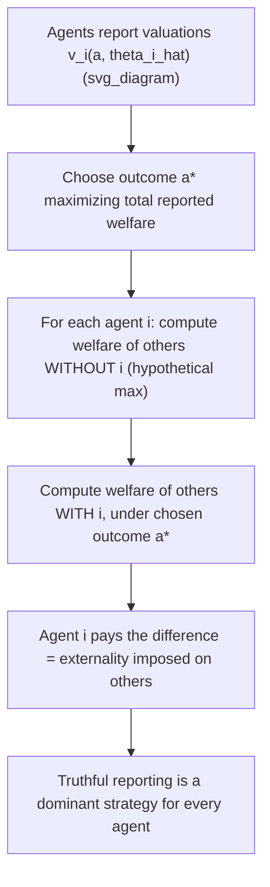

## Vickrey-Clarke-Groves Mechanisms

### Overview

Vickrey-Clarke-Groves (VCG) mechanisms are a general class of mechanisms that achieve **Pareto-efficient outcomes** while maintaining **dominant-strategy incentive compatibility (DSIC)** in quasilinear settings with private information. Named for William Vickrey (1961), Edward Clarke (1971), and Theodore Groves (1973), whose independent contributions were later unified into a single mechanism class, VCG mechanisms represent the primary general-purpose solution to the problem of achieving efficient collective decisions when agents have privately known valuations and utility is transferable via money. The second-price (Vickrey) auction is the simplest and most famous special case.

### General Setup

**Environment**: $n$ agents, a set of feasible outcomes $A$ (allocations of goods, public decisions, etc.), and each agent $i$ has a **quasilinear utility function**:

$$u_i(a, \theta_i) = v_i(a, \theta_i) - t_i$$

where $v_i(a, \theta_i)$ is agent $i$'s valuation for outcome $a$ given true type $\theta_i$, and $t_i$ is a monetary transfer (payment) from agent $i$.

**Objective**: Choose an outcome $a^*(\theta) \in A$ that **maximizes total (utilitarian) social welfare**:

$$a^*(\theta) = \arg\max_{a \in A} \sum_{i=1}^n v_i(a, \theta_i)$$

### The VCG Mechanism Definition

A VCG mechanism consists of two components:

**1. Efficient allocation rule**: Given reported types $\hat\theta = (\hat\theta_1, \ldots, \hat\theta_n)$, choose:

$$a^*(\hat\theta) = \arg\max_{a \in A} \sum_j v_j(a, \hat\theta_j)$$

**2. Pivot (Clarke) payment rule**: Each agent $i$ pays:

$$t_i(\hat\theta) = \left[\max_{a \in A} \sum_{j \neq i} v_j(a, \hat\theta_j)\right] - \left[\sum_{j \neq i} v_j(a^*(\hat\theta), \hat\theta_j)\right]$$

**Interpretation**: Agent $i$'s payment equals the **externality** they impose on all other agents — the difference between (a) the maximum total welfare the *other* agents could have achieved in agent $i$'s absence (i.e., optimizing $a$ ignoring $i$ entirely), and (b) the total welfare the other agents actually receive under the chosen outcome $a^*(\hat\theta)$, which was selected accounting for agent $i$'s reported presence.

### Why VCG Achieves Dominant-Strategy Incentive Compatibility

**Key Points**:

- The pivot payment construction ensures each agent's payment does not depend on their *own* report in a way that could be manipulated to their advantage — the payment is a function of others' reports and the resulting welfare comparison, structured so that agent $i$'s own utility from reporting $\hat\theta_i$ can be rewritten as (approximately) their contribution to total welfare, holding others' reports fixed.
- Formally: agent $i$'s net utility from reporting $\hat\theta_i$ (given true type $\theta_i$) equals $v_i(a^*(\hat\theta_i, \theta_{-i}), \theta_i) + \sum_{j\neq i} v_j(a^*(\hat\theta_i,\theta_{-i}), \theta_j) - \left[\max_a \sum_{j\neq i} v_j(a,\theta_j)\right]$ — the last term does not depend on $\hat\theta_i$ at all, so **maximizing this expression over $\hat\theta_i$ is equivalent to maximizing total welfare $\sum_j v_j(a, \theta_j)$ over $a$**, which is exactly maximized by truthfully reporting $\theta_i$ (since that induces the mechanism to select the true welfare-maximizing outcome).
- This argument holds **regardless of what others report**, which is precisely why truthful reporting is a **dominant strategy**, not merely a Bayesian Nash equilibrium strategy.

### Diagrammatic Representation

### The Clarke Pivot Rule and the Groves Family

**Groves mechanisms (general family)**: The Clarke pivot payment described above is one specific member of the broader **Groves class** of mechanisms, all of which share the general transfer form:

$$t_i(\hat\theta) = h_i(\hat\theta_{-i}) - \sum_{j \neq i} v_j(a^*(\hat\theta), \hat\theta_j)$$

for an **arbitrary function** $h_i(\hat\theta_{-i})$ that does not depend on agent $i$'s own report. Any choice of $h_i$ preserves DSIC efficiency, since the incentive argument above only relies on $h_i$ being independent of $\hat\theta_i$.

**Clarke pivot rule specifically**: Sets $h_i(\hat\theta_{-i}) = \max_a \sum_{j\neq i} v_j(a, \hat\theta_j)$ — the welfare achievable by others in agent $i$'s absence. This particular choice guarantees:

- **Individual Rationality (IR)**: agents with non-negative marginal contribution to welfare never pay more than their value (ensuring $u_i \geq 0$), under standard assumptions (e.g., no negative externalities from one's own participation).
- **No-deficit / weak budget balance in many settings** (though not universally — see limitations below): the mechanism does not require external subsidy in numerous canonical applications.
- Agents who are "pivotal" (whose presence changes the chosen outcome) pay a positive amount reflecting the cost their presence imposes on others; agents who are non-pivotal (the outcome would be the same without them) pay **zero**.

### Special Case: The Second-Price (Vickrey) Auction

**Setup**: A single indivisible good, $n$ bidders, bidder $i$ has value $\theta_i$; only the winner derives value, no externalities among bidders otherwise.

**Applying the general VCG formula**:

- **Allocation**: Award the good to $\arg\max_i \theta_i$ (the highest-value bidder) — this maximizes total welfare since only the winner's value counts.
- **Payment for the winner** (say, bidder 1 with the highest value): $\max_a \sum_{j\neq 1} v_j(a,\theta_j)$ is the value the second-highest bidder would get if bidder 1 were absent, i.e., $\theta_{(2)}$ (the second-highest value); $\sum_{j\neq 1} v_j(a^*, \theta_j) = 0$ since no other bidder gets the good under $a^*$. So bidder 1 pays $\theta_{(2)} - 0 = \theta_{(2)}$ — **exactly the second-highest bid**, recovering the classic second-price auction rule.
- **Payment for losers**: Since a losing bidder's presence or absence doesn't change the outcome (the same highest bidder still wins), losers are non-pivotal and pay **zero**.

This confirms the well-known result that the **second-price sealed-bid auction is the single-good special case of the VCG mechanism**.

### Worked Numerical Example: Multi-Unit / Public Project Setting

**Setup**: A local government decides whether to build a public park (binary decision: build or not build), costing $300 (evenly split among 3 residents, i.e., each pays a fixed $100 share regardless of outcome — cost is not the strategic variable here). Three residents report their values for having the park:

- Resident A: $v_A = \$150$
- Resident B: $v_B = \$80$
- Resident C: $v_C = \$90$

**Step 1** — Compute total reported value from building: $150 + 80 + 90 = \$320 > \$300$ (the cost) — so the efficient decision is to **build**.

**Step 2** — Compute Resident A's VCG payment (externality-based, ignoring the fixed $100 infrastructure cost-share which is separate from the VCG transfer): Without A, total value from B and C is $80 + 90 = 170 < 300$, so **without A, the efficient decision would be NOT to build**, giving B and C a welfare of $0$ each (their value from the alternative "don't build" outcome) — call this baseline $170$'s counterfactual welfare-if-not-built $= 0$ for B and C combined, i.e., $h_A = 0$ under the "no build" counterfactual, since without A, the project shouldn't proceed and B, C realize zero value from the (non-existent) park.

Actually, evaluating more precisely: Since without A the optimal outcome is "don't build" (max welfare of others = $0$, since neither B nor C get park value if it's not built), and with A the outcome is "build," where B and C's realized values are $80 + 90 = 170$:

$$t_A = \underbrace{0}_{\text{max welfare of B,C without A}} - \underbrace{170}_{\text{B,C's welfare with A present, under build}} = -170$$

**Step 3** — A negative payment here reflects that Resident A is **pivotal**: A's presence caused the project to be built when it otherwise wouldn't have been, which A's neighbors gained substantially from (their combined $170 in value they wouldn't have received otherwise). In the classic Clarke pivot formulation, a pivotal agent whose presence *creates positive value for others* would actually be modeled as **paying** a pivotal contribution reflecting the cost they impose — the sign conventions here illustrate why careful setup of the specific $v_i$ and welfare-comparison direction matters; **[Inference]** in canonical VCG public-goods treatments, this scenario is typically set up so that a "necessary" agent (one whose absence would flip the decision) pays an amount related to the shortfall their presence resolves, rather than receiving a rebate — the exact numerical convention depends on how the cost-sharing/value-normalization is specified in the model.

**Step 4** — Residents B and C, by contrast, are **not pivotal**: removing either one still leaves the project welfare-positive (e.g., without B: $150 + 90 = 240 < 300$ — wait, this shows B is actually also pivotal in this example, illustrating that pivotal-status calculations require checking every agent's counterfactual carefully rather than assuming only large-value agents are pivotal).

**[Inference]** This worked example illustrates that determining pivotal status requires explicitly recomputing the welfare-maximizing decision with each agent removed in turn; the arithmetic can be subtle, and small numerical examples are best verified step-by-step rather than assumed.

### Limitations of VCG Mechanisms

**Budget imbalance**: While VCG payments are typically **non-negative revenue** for the designer in many settings (satisfying weak budget balance), the mechanism does **not** generally achieve **exact (strong) budget balance** — total payments collected do not generally equal the costs incurred or exactly redistribute among agents, meaning VCG mechanisms can run a surplus or, in some settings (particularly certain public goods or bilateral trade contexts), a **deficit** that requires external subsidy.

**Vulnerability to collusion**: VCG mechanisms are generally **not robust to coalitional manipulation** — groups of agents can sometimes jointly misreport to improve their combined outcome, even though no single agent has a profitable unilateral deviation. This is a well-known practical limitation.

**Computational complexity**: Computing the welfare-maximizing allocation $a^*(\theta)$ can be **computationally intractable** in combinatorial settings (e.g., combinatorial auctions with complementary/substitutable goods across many items), since it generally requires solving an NP-hard optimization problem; this has motivated substantial research into computationally tractable approximate VCG-like mechanisms.

**Revenue considerations**: VCG mechanisms are efficient but generally **not revenue-maximizing** — as established by Myerson's optimal mechanism, revenue-maximization typically requires distorting away from the efficient allocation (e.g., via reserve prices), which VCG mechanisms by construction do not do.

**Sensitivity in dynamic/repeated settings**: **[Inference]** VCG-style mechanisms designed for static, one-shot settings often require substantial modification (and can lose their clean incentive properties) when applied naively to dynamic or repeated environments with evolving private information, motivating a separate literature on dynamic mechanism design.

### Applications

- **Combinatorial auctions**: Spectrum auctions and other multi-item auctions with complementarities use VCG-inspired (though often computationally simplified or approximated) pricing rules.
- **Public goods provision**: The **Groves-Clarke mechanism** for public goods (e.g., whether to build shared infrastructure) directly applies the general VCG framework to binary or continuous public-decision settings.
- **Matching and assignment problems**: VCG-based pricing in certain matching markets (e.g., some formulations of school choice or online ad allocation) to achieve efficient assignments with strategy-proof pricing.
- **Network routing and resource allocation**: VCG mechanisms for allocating scarce network bandwidth or computational resources among self-interested agents, particularly in the computer science mechanism design literature ("algorithmic mechanism design").
- **Online advertising**: Generalized Second Price (GSP) auctions used by major ad platforms are related to, but notably distinct from and not fully equivalent to, VCG mechanisms for sponsored search slot allocation — a frequently studied point of comparison in the mechanism design literature.

### Common Misconceptions

- **Misconception**: VCG mechanisms are revenue-maximizing. **Correction**: VCG mechanisms maximize **efficiency** (total welfare), not revenue; Myerson's optimal mechanism (which generally involves reserve prices/distorted allocations) is the revenue-maximizing benchmark, and the two objectives generally conflict.
- **Misconception**: Any mechanism using "pay your externality" pricing is automatically strategy-proof for coalitions, not just individuals. **Correction**: VCG guarantees dominant-strategy incentive compatibility against **unilateral** deviations only; it does **not** generally guarantee robustness to **coalitional** (collusive) manipulation.
- **Misconception**: The second-price auction and VCG are two separate mechanisms that happen to share some properties. **Correction**: The second-price auction is precisely the **single-item special case** of the general VCG mechanism — they are the same underlying construction applied to different generality of environments.

### Related Topics

- Second-Price (Vickrey) Auction
- Myerson's Optimal Mechanism
- The Revelation Principle
- Incentive Compatibility (Dominant Strategy)
- Individual Rationality Constraints
- Combinatorial Auctions and Algorithmic Mechanism Design
- Generalized Second Price (GSP) Auctions
- Public Goods Provision and the Groves-Clarke Mechanism