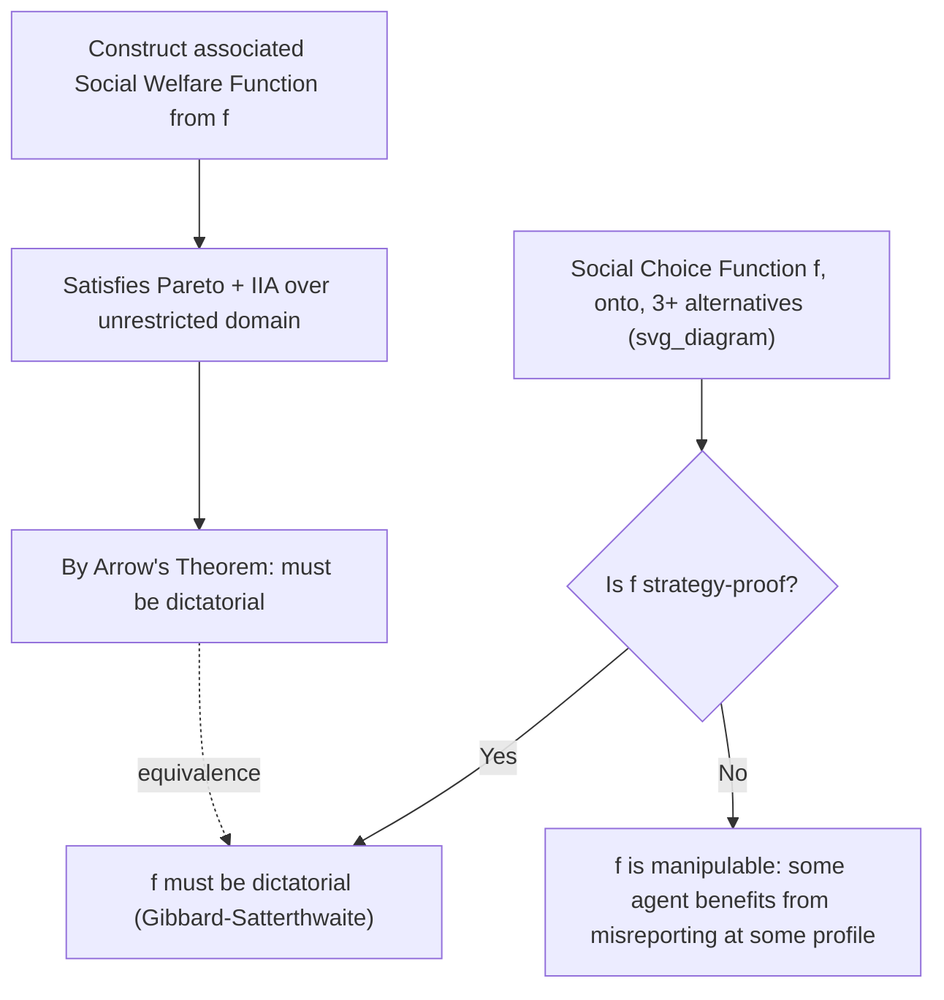

## The Gibbard-Satterthwaite Theorem

### Overview

The Gibbard-Satterthwaite Theorem, established independently by Allan Gibbard (1973) and Mark Satterthwaite (1975), is the central impossibility result governing **strategy-proof social choice functions**. It proves that when there are at least three possible outcomes and preferences are unrestricted, **every** non-dictatorial social choice function is **manipulable** — meaning some agent, for some preference profile, can achieve a better outcome for themselves by misreporting their true preferences rather than reporting truthfully. This is the ordinal-preference, strategic counterpart to Arrow's Impossibility Theorem, and it establishes fundamental limits on voting rule and mechanism design whenever monetary transfers are unavailable and preferences are unrestricted.

### Formal Setup

**Alternatives and preferences**: Let $A$ be a finite set of alternatives with $|A| \geq 3$. Each agent $i \in \{1, \ldots, n\}$ has a strict preference ordering $\succ_i$ over $A$, drawn from the **unrestricted domain** of all possible strict orderings.

**Social choice function (SCF)**: A function $f$ mapping every profile of preference orderings to a single chosen outcome:

$$f: (\succ_1, \ldots, \succ_n) \mapsto a \in A$$

**Strategy-proofness (manipulability)**: $f$ is strategy-proof (non-manipulable) if, for every agent $i$, every true preference $\succ_i$, and every possible misreport $\succ_i'$, truthful reporting is at least as good:

$$f(\succ_i, \succ_{-i}) \succeq_i f(\succ_i', \succ_{-i}) \quad \forall \succ_i, \succ_i', \succ_{-i}$$

**Onto (surjective / non-imposed)**: For every alternative $a \in A$, there exists some preference profile such that $f$ selects $a$ — i.e., every alternative is a possible outcome under some configuration of reports (the SCF's range is the full alternative set).

**Dictatorship**: $f$ is dictatorial if there exists an agent $i^*$ such that $f(\succ) = \text{top}(\succ_{i^*})$ for every profile $\succ$ — the outcome is always $i^*$'s most-preferred alternative, regardless of everyone else's reports.

### Statement of the Theorem

**Gibbard-Satterthwaite Theorem**: If $|A| \geq 3$ and $f$ is a social choice function that is (a) **onto** and (b) **strategy-proof**, then $f$ must be **dictatorial**.

Equivalently, stated as the contrapositive that is most often emphasized: **any non-dictatorial, onto social choice function over 3 or more alternatives is manipulable** — there exists some agent and some preference profile at which that agent benefits from misreporting.

**Key Points**:

- Like Arrow's Theorem, the "3 or more alternatives" condition is essential: with only 2 alternatives, simple majority rule is both strategy-proof and non-dictatorial (misreporting your preference between only two options can never help you, since there's no third option to strategically route votes toward or through).
- The theorem applies to **any** conceivable rule — plurality, Borda count, ranked-choice/instant-runoff voting, approval-based systems adapted to strict rankings, etc. — none can escape the underlying impossibility if they are onto, non-dictatorial, and defined over an unrestricted domain of 3+ alternatives.

### Proof Intuition and Connection to Arrow's Theorem

The theorem's proof typically proceeds by establishing a formal equivalence with Arrow's Impossibility Theorem:

1. Given a strategy-proof, onto, non-dictatorial social choice function $f$, one can construct an associated **social welfare function** by defining a social ranking $x \succ y$ whenever, for a given profile, $f$ selects $x$ over $y$ across an appropriately constructed sequence of related profiles.
2. This constructed social welfare function can be shown to satisfy **Pareto efficiency** and **Independence of Irrelevant Alternatives**, and to be defined over the same unrestricted domain — precisely the conditions of Arrow's Theorem.
3. By Arrow's Theorem, any social welfare function satisfying these conditions over 3+ alternatives must be dictatorial.
4. Tracing the dictator of the constructed social welfare function back to the original social choice function shows that $f$ itself must be dictatorial — contradicting the assumption of non-dictatorship, which completes the proof by contradiction.

**Key Points**:

- This proof strategy reveals that **Gibbard-Satterthwaite and Arrow's Theorem are two manifestations of essentially the same underlying impossibility** — one phrased in terms of full social rankings and Pareto/IIA axioms, the other in terms of single-outcome selection and manipulability, but mathematically interderivable under standard conditions.
- Alternative direct proofs (not routing through Arrow's Theorem) also exist in the literature, often using similar "pivotal voter"-style arguments adapted to the choice-function setting.

### Diagrammatic Representation

### Worked Example: Manipulating the Borda Count

**Setup**: 3 agents, 3 alternatives $\{A, B, C\}$. **Borda count**: each agent ranks all alternatives; an alternative receives 2 points for being ranked first, 1 point for second, 0 points for third; the alternative with the most total points wins.

**True preferences**:

- Agent 1: $A \succ B \succ C$
- Agent 2: $A \succ B \succ C$
- Agent 3: $C \succ B \succ A$

**Step 1** — Compute truthful Borda scores: $A$: $2+2+0=4$; $B$: $1+1+1=3$; $C$: $0+0+2=2$. Truthful winner: $A$.

**Step 2** — Agent 3 sincerely prefers $C \succ B \succ A$, so $A$ winning is Agent 3's **worst** outcome. Agent 3 considers misreporting to improve the outcome (from their own perspective).

**Step 3** — Suppose Agent 3 misreports as $C \succ A \succ B$ (moving $B$ artificially to last, below their true second-favorite): New scores: $A$: $2+2+1=5$; $B$: $1+1+0=2$; $C$: $0+0+2=2$. Winner is still $A$ — this particular manipulation does not help.

**Step 4** — Suppose instead Agent 3 misreports as $B \succ C \succ A$ (dishonestly promoting $B$, their true second choice, to first, to strategically boost $B$ above $A$): New scores: $A$: $2+2+0=4$; $B$: $2+1+1=4$; $C$: $0+0+1=1$ — this creates a **tie** between $A$ and $B$, which (depending on the tie-breaking rule) could result in $B$ winning outright or being selected with positive probability — an outcome Agent 3 sincerely prefers to $A$ winning outright.

**Interpretation**: This demonstrates that the Borda count, despite being a widely used and reasonably well-regarded voting rule, is **manipulable** — exactly as Gibbard-Satterthwaite guarantees must be true for any non-dictatorial rule with 3+ alternatives over the unrestricted domain. **[Inference]** The specific manipulation strategy that succeeds depends on the rule and profile; Gibbard-Satterthwaite guarantees *some* manipulable profile exists for any non-dictatorial rule but does not specify which manipulation will work for a given rule without direct analysis, as illustrated by Step 3 (a failed attempt) versus Step 4 (a successful one) above.

### Escaping the Impossibility

Since the theorem applies specifically to the **unrestricted domain** of preferences with **ordinal rankings only** (no monetary transfers), several routes exist to construct meaningful strategy-proof, non-dictatorial mechanisms:

**Domain restriction**: If preferences are restricted — most notably to **single-peaked preferences** over a one-dimensional alternative space (e.g., budget levels, ideological positions on a left-right spectrum) — the **median voter rule** is strategy-proof, efficient, anonymous, and non-dictatorial. This is the most commonly cited escape route.

**Quasilinear environments with monetary transfers**: If outcomes include both a decision and money, and utility is quasilinear, the **Vickrey-Clarke-Groves (VCG) mechanism** class provides a large family of efficient, strategy-proof (dominant-strategy incentive compatible), non-dictatorial mechanisms — the ability to use money as a transferable instrument to align incentives is precisely what circumvents Gibbard-Satterthwaite's purely-ordinal impossibility.

**Randomization**: Allowing the social choice function to select a **lottery over outcomes** rather than a single deterministic outcome expands the space of implementable strategy-proof rules (e.g., **random dictatorship**, where one agent is randomly selected ex-ante to be the deterministic dictator for that instance, is strategy-proof, though it is dictatorial *conditional on the draw* even if unconditionally "fair" in an ex-ante lottery sense).

**Weakening the equilibrium concept**: Moving from dominant-strategy strategy-proofness to **Bayesian incentive compatibility** substantially expands the class of implementable social choice functions, mirroring the analogous relaxation used to escape purely dominant-strategy limitations elsewhere in mechanism design.

**Two-sided matching mechanisms**: In specific structured environments like the stable matching problem (e.g., the Gale-Shapley deferred acceptance algorithm), certain mechanisms achieve strategy-proofness for one side of the market (though generally not both sides simultaneously) — illustrating how highly specific structural assumptions about the environment (beyond generic domain restriction) can also carve out positive results.

### Applications

- **Voting system design and critique**: Provides the theoretical basis for understanding why every practically used voting system (plurality, ranked-choice, Borda, approval voting adaptations) is theoretically manipulable in principle, informing debates about which manipulability risks are more or less severe in practice for a given electorate and rule.
- **Auction and mechanism design**: Directly motivates the shift, wherever monetary transfers are feasible, toward quasilinear mechanism design (VCG, Myerson's optimal mechanism) as the primary escape route from Gibbard-Satterthwaite's pure-ranking impossibility.
- **Committee and resource allocation problems**: Justifies the widespread use of single-peaked-preference-based solutions (e.g., median-based rules for budget or location decisions) specifically because they escape the general impossibility.
- **School choice and matching market design**: Deferred acceptance mechanisms' strategy-proofness properties (for the proposing side) are directly informed by, and studied in relation to, the broader Gibbard-Satterthwaite framework.

### Common Misconceptions

- **Misconception**: Gibbard-Satterthwaite and Arrow's Theorem are entirely separate, unrelated results. **Correction**: They are formally interderivable under standard conditions — a strategy-proof, onto, non-dictatorial social choice function can be shown to generate a social welfare function violating Arrow's axioms (and vice versa), meaning the two theorems reflect the same fundamental impossibility viewed through different lenses (choice function vs. full ranking).
- **Misconception**: The theorem implies that strategic voting is always successful or common in every real election. **Correction**: The theorem only guarantees that manipulability exists *in principle* for *some* preference profile under any non-dictatorial rule; it says nothing about how *frequently* profitable manipulation opportunities arise in practice, how easy they are to identify and execute (which may require detailed knowledge of other voters' preferences), or how large the resulting distortion typically is.
- **Misconception**: Since strategy-proof, non-dictatorial rules are "impossible," mechanism designers should give up on incentive-compatible design. **Correction**: The impossibility is specific to unrestricted-domain, purely ordinal, deterministic settings; domain restrictions (single-peaked preferences), monetary transfers (VCG mechanisms), and randomization all provide well-developed, widely used routes to non-dictatorial strategy-proof design.

### Related Topics

- Arrow's Impossibility Theorem
- Social Choice Functions
- Single-Peaked Preferences and the Median Voter Theorem
- Vickrey-Clarke-Groves (VCG) Mechanisms
- The Revelation Principle
- Random Dictatorship and Randomized Mechanisms
- Borda Count and Positional Scoring Rules
- Two-Sided Matching and the Gale-Shapley Algorithm