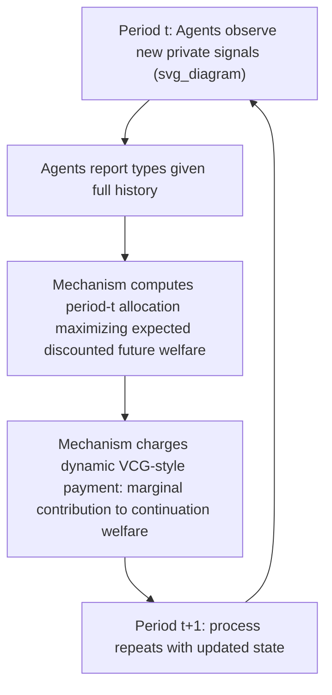

## Dynamic Mechanism Design

### Overview

Dynamic mechanism design extends the static mechanism design framework (VCG mechanisms, Myerson's optimal auction) to settings where agents' private information, the set of feasible outcomes, or both **evolve over time**, and the mechanism must make a sequence of decisions across multiple periods rather than a single one-shot allocation. This introduces substantial additional complexity relative to static mechanism design: agents' incentives to report truthfully depend not only on the current period's outcome but also on how current reports affect **future** allocations and payments, requiring the designer to account for forward-looking strategic behavior across the entire time horizon.

### Key Distinctions from Static Mechanism Design

**Evolving private information**: In static models, each agent's type $\theta_i$ is fixed and drawn once. In dynamic settings, agents may receive a **sequence of private signals** $\theta_i^1, \theta_i^2, \ldots, \theta_i^T$ over time (e.g., a bidder's valuation for advertising evolves period to period based on demand shocks), and the mechanism must elicit truthful reports repeatedly.

**Intertemporal incentive constraints**: An agent's report in period $t$ can affect not just period $t$'s outcome but also **future** allocations and payments (e.g., in a dynamic auction, bidding aggressively today might affect the mechanism's beliefs about the agent's type and hence future treatment). This means incentive compatibility constraints must account for the **full continuation value** of misreporting, not just the immediate-period payoff.

**Limited commitment concerns**: Static mechanism design typically assumes the designer can perfectly commit to the mechanism's rules in advance. In dynamic settings, the question of whether the designer can commit to **future** allocation and payment rules (rather than re-optimizing period-by-period, potentially exploiting information revealed by past reports) becomes a first-order concern — this is often called the **ratchet effect** problem.

### The Ratchet Effect

**Definition**: The ratchet effect refers to the phenomenon where an agent, anticipating that truthfully revealing favorable private information today will lead the mechanism designer to demand *more* from them in the future (e.g., a firm revealing low costs today might face a lower future price ceiling, or a worker revealing high productivity might face a higher future output quota), **strategically under-reports or restrains observable performance** in early periods to avoid this future "ratcheting up" of demands.

**Key Points**:

- The ratchet effect arises specifically when the mechanism designer **cannot commit** to future rules independent of information revealed in earlier periods — if the designer could credibly commit upfront to a full multi-period contract (as in the standard dynamic mechanism design solutions below), the ratchet effect problem would not arise, since the agent's future treatment would already be fixed regardless of the timing or content of their reports.
- This phenomenon was extensively studied in Soviet-style planned economy contexts (managers underreporting factory capacity to avoid higher future quotas) and remains a central concern in **regulation**, **repeated procurement**, and **long-term employment/incentive contracts**.
- **[Inference]** The practical prevalence of the ratchet effect is one of the more debated empirical questions in the dynamic contracting literature, since real-world commitment power varies substantially across institutional settings (a government regulator with weak commitment ability versus a private firm with strong long-term contracting infrastructure).

### The Dynamic Revelation Principle

Analogous to the static Revelation Principle, a **dynamic revelation principle** holds under sufficiently strong commitment assumptions: if the designer can commit at the outset to the entire multi-period mechanism (including how future rules depend on the full history of reports), then any outcome achievable by any dynamic mechanism can also be achieved by a **direct dynamic mechanism** in which each agent truthfully reports their private information in every period, given the history of reports and outcomes so far.

**Key Points**:

- This principle underlies the tractability of most formal dynamic mechanism design results, since — as in the static case — it justifies restricting attention to direct, sequentially truthful mechanisms rather than the vastly larger space of arbitrary dynamic message/communication protocols.
- The relevant incentive compatibility concept in dynamic settings is typically **dynamic incentive compatibility**: truthful reporting in every period, given the correct anticipation of how current reports affect future outcomes, must be optimal — this is a considerably more demanding condition to verify and construct than static IC, since it requires solving a full dynamic programming problem over the agent's optimal reporting strategy.

### The Pivot Mechanism / Dynamic VCG

A leading general-purpose approach to efficient dynamic mechanism design is the **dynamic VCG mechanism** (sometimes called the "Team Mechanism" or generalizations building on Bergemann and Välimäki's and Athey and Segal's contributions), which extends the static VCG logic to dynamic environments with evolving private information via a Markov Decision Process (MDP) framework.

**Core idea**: At each period $t$, given the current state (public information plus reported private signals up to $t$), the mechanism:

1. Chooses the period-$t$ allocation to maximize the **expected total discounted social welfare** from period $t$ onward, computed via dynamic programming over the anticipated future evolution of types.
2. Charges each agent a payment reflecting their **marginal contribution to total expected discounted social welfare**, analogous to the static VCG externality payment, but computed using continuation values rather than static one-shot valuations.

**Key Points**:

- Under standard assumptions (independent, Markovian type processes across agents; full designer commitment), the dynamic VCG/pivot mechanism achieves **dynamic incentive compatibility** (truthful reporting is optimal in every period) and **efficiency** (the socially optimal sequence of decisions is implemented), directly generalizing the static VCG efficiency and DSIC properties to the dynamic setting.
- **[Inference]** Achieving these properties typically requires solving for continuation values via dynamic programming over the full type-transition process, which can be computationally demanding in complex or high-dimensional settings — a practical limitation paralleling (and often compounding) the computational tractability concerns already present in static VCG mechanisms for combinatorial environments.

### Diagrammatic Representation

### Dynamic Optimal (Revenue-Maximizing) Mechanisms

Paralleling Myerson's static optimal auction, a substantial literature (notably associated with contributions from Pavan, Segal, and Toikka, among others) characterizes **revenue-maximizing dynamic mechanisms** using an extension of the virtual value concept:

- The static virtual value formula is generalized to a **dynamic virtual value** or "impulse response" adjustment, which accounts for how a type report in period $t$ affects the *entire future trajectory* of the agent's informational advantage, not just the current-period allocation.
- The resulting optimal dynamic mechanism typically involves period-by-period **distorted allocations** (analogous to reserve prices in the static case) whose distortion depends on the full stochastic process governing how types evolve, and generally requires the same kind of "monotonicity + envelope-theorem" style characterization used in static optimal mechanism design, extended across the time dimension.

**[Inference]** These characterizations are mathematically intricate relative to the static case and often require specific structural assumptions on the type-evolution process (e.g., first-order stochastic dominance shifts, Markov processes with specific monotonicity properties) to yield clean, implementable closed-form mechanisms; fully general dynamic optimal mechanism design without such structure remains a technically challenging and less completely settled area relative to the static theory.

### Applications

- **Sequential/repeated auctions**: Online advertising exchanges, where advertiser valuations evolve over time based on campaign performance, inventory availability, and competitive dynamics, motivating dynamic (rather than static, single-shot) mechanism design.
- **Dynamic pricing and revenue management**: Airlines, hotels, and other capacity-constrained sellers facing buyers whose valuations or arrival times are privately known and evolve, informed by dynamic mechanism design principles even when implemented via simplified heuristic pricing rules in practice.
- **Regulation of firms with evolving private costs**: Classic ratchet-effect settings, such as utility regulation or defense procurement, where a regulator sets prices or quotas repeatedly and firms strategically manage information revelation over time.
- **Sequential resource allocation**: Cloud computing resource allocation, spectrum sharing over time, and other settings where a scarce resource must be repeatedly allocated among agents with private, evolving demand.
- **Cybersecurity and network mechanism design**: Allocation of scarce network capacity or computational resources to self-interested agents whose usage needs vary dynamically.

### Common Misconceptions

- **Misconception**: Dynamic mechanism design is simply "running the static mechanism repeatedly, period by period." **Correction**: Naive period-by-period application of static mechanisms generally **fails** to be dynamically incentive compatible, since agents can strategically manage what they reveal in early periods anticipating effects on future treatment (the ratchet effect); proper dynamic mechanism design requires explicitly accounting for continuation values and the full history-dependent structure of the mechanism.
- **Misconception**: The dynamic revelation principle always applies regardless of the designer's commitment power. **Correction**: The dynamic revelation principle, and the tractable dynamic VCG/optimal-mechanism characterizations built on it, generally **require full commitment** by the designer to the entire multi-period mechanism in advance; under limited or no commitment, the ratchet effect and related dynamic inconsistency problems can arise, and the static-style revelation principle machinery does not straightforwardly apply.
- **Misconception**: Dynamic VCG mechanisms are exactly as computationally simple as static VCG mechanisms. **Correction**: Dynamic VCG mechanisms require computing continuation values via dynamic programming over the type-evolution process, which is generally **substantially more computationally demanding** than the static welfare-maximization problem, particularly in high-dimensional or long-horizon settings.

### Related Topics

- Vickrey-Clarke-Groves (VCG) Mechanisms
- Myerson's Optimal Mechanism
- The Revelation Principle
- Incentive Compatibility (Dominant Strategy, Bayesian, Dynamic)
- The Ratchet Effect in Regulation and Contracting
- Markov Decision Processes in Mechanism Design
- Repeated Games and Limited Commitment
- Dynamic Pricing and Revenue Management