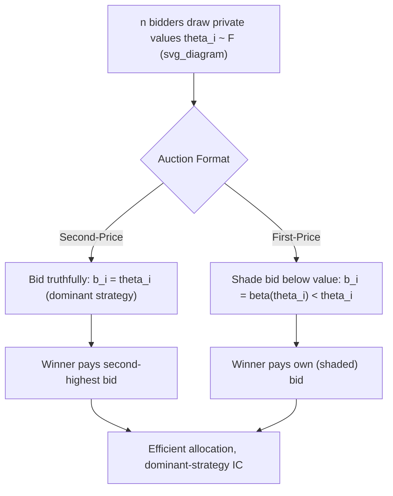

## First-Price and Second-Price Auctions

### Overview

First-price and second-price sealed-bid auctions are the two canonical single-item auction formats in auction theory, differing only in the **payment rule** applied to the winning bidder while sharing the same **allocation rule** (award the good to the highest bidder). Despite this seemingly minor difference in how the winner's payment is determined, the two formats induce fundamentally different bidding incentives and strategic behavior, making them a central point of comparison for illustrating core auction-theoretic concepts including strategy-proofness, bid shading, and revenue equivalence.

### Formal Setup

**Environment**: A single indivisible good, $n$ risk-neutral bidders, each with a private value $\theta_i$ drawn independently from a distribution with CDF $F$ and density $f$ on support $[\underline\theta, \bar\theta]$ (the **independent private values, or IPV, framework**). Bidders simultaneously submit sealed bids $b_i \geq 0$.

**Common allocation rule**: The bidder with the highest bid wins: $i^* = \arg\max_i b_i$.

**Second-price rule**: The winner pays the **second-highest bid**, $b_{(2)}$.

**First-price rule**: The winner pays their **own bid**, $b_{i^*}$.

### Second-Price (Vickrey) Auction

**Dominant strategy**: Bidding truthfully, $b_i = \theta_i$, is a **weakly dominant strategy** for every bidder, regardless of the number of competitors, their value distributions, or their bidding strategies.

**Proof intuition**: Let $p = \max_{j \neq i} b_j$ be the highest bid among all rivals. If $\theta_i > p$, bidding $\theta_i$ wins and pays $p$ (surplus $\theta_i - p > 0$); bidding higher wins the same outcome at the same price; bidding lower than $p$ loses, forfeiting positive surplus — so truthful bidding is weakly optimal. If $\theta_i < p$, bidding truthfully loses (zero surplus, no risk); bidding above $p$ to win would require paying more than one's value, yielding negative surplus — so truthful bidding is again weakly optimal. Since this holds for every possible $p$, truthful bidding is dominant.

**Key Points**:

- The second-price auction is the **single-good special case of the general Vickrey-Clarke-Groves (VCG) mechanism**, inheriting VCG's dominant-strategy incentive compatibility and efficiency properties directly.
- Because bidding is dominant-strategy optimal, the second-price auction requires **no assumptions about bidders' beliefs regarding rivals' values or strategies** — a major practical and theoretical advantage, since bidders need not engage in complex strategic reasoning about competitors to bid optimally.
- The auction is **efficient**: since every bidder bids truthfully in dominant strategy, the good always goes to the bidder who values it most.

### First-Price Sealed-Bid Auction

**No dominant strategy — requires equilibrium bid shading**: Unlike the second-price auction, bidding one's true value is **not** optimal in a first-price auction, because the winner pays their own bid; bidding truthfully would result in **zero surplus upon winning** ($\theta_i - \theta_i = 0$). Rational bidders instead **shade their bids below their true value**, trading off a higher probability of winning (from bidding more) against a lower profit margin conditional on winning (from bidding closer to true value).

**Symmetric Bayesian Nash Equilibrium**: With $n$ symmetric, risk-neutral bidders whose values are i.i.d. draws from $F$, the (unique, symmetric, increasing) equilibrium bidding strategy is:

$$\beta(\theta_i) = \mathbb{E}\left[\max_{j \neq i} \theta_j \; \Big| \; \max_{j\neq i}\theta_j < \theta_i\right]$$

That is, each bidder's optimal bid equals the **expected value of the highest of the other bidders' values, conditional on that highest rival value being below one's own** (i.e., conditional on actually winning).

**Closed-form for Uniform distribution**: If $\theta_i \sim \text{Uniform}[0,1]$ i.i.d. across $n$ bidders, the symmetric equilibrium bidding strategy simplifies to:

$$\beta(\theta_i) = \frac{n-1}{n}\theta_i$$

**Key Points**:

- The shading factor $\frac{n-1}{n}$ shows that bid shading **decreases as the number of bidders increases** — with more competitors, each bidder must bid closer to their true value to maintain a competitive chance of winning, since underbidding becomes riskier as competition intensifies.
- As $n \to \infty$, $\beta(\theta_i) \to \theta_i$: bid shading vanishes in the limit of many competitors, an intuitive result reflecting that competitive pressure eventually forces bids arbitrarily close to true values.
- The first-price auction remains **efficient** in this symmetric IPV setting despite the shading, since the equilibrium bidding function $\beta(\cdot)$ is strictly increasing in $\theta_i$ — the bidder with the highest value still submits the highest bid and wins, even though all bids are shaded below true values.

### Diagrammatic Representation

### Revenue Equivalence Between the Two Formats

The **Revenue Equivalence Theorem** establishes that, under the standard symmetric IPV framework with risk-neutral bidders and the same lowest-type payoff (typically zero), the first-price and second-price auctions yield the **same expected revenue** to the seller, despite their very different bidding rules and equilibrium bid levels.

**Intuition**: In the second-price auction, the winner pays the (unshaded) second-highest value directly. In the first-price auction, the winner pays their own (shaded) bid, which in equilibrium equals the *expected* second-highest value conditional on winning — so while the *realized* payment in any single instance can differ between formats, the winner's payment **in expectation, averaged appropriately over the bidding distribution**, coincides across formats, and this equivalence extends to the seller's total expected revenue.

**Key Points**:

- Revenue equivalence relies critically on the assumptions of **risk neutrality**, **independent private values**, symmetry across bidders, and equal treatment of the lowest type — relaxing any of these (e.g., risk-averse bidders, correlated/interdependent values, asymmetric bidder populations) can break the equivalence and cause the two formats to generate systematically different expected revenues.
- Under **risk aversion**, bidders in a first-price auction tend to bid **more aggressively** (less shading) than risk-neutral theory predicts, since a slightly higher bid trades a small reduction in profit for a valuable reduction in the risk of losing — this typically makes the **first-price auction generate strictly higher expected revenue than the second-price auction** when bidders are risk-averse, breaking the revenue equivalence result.

### Worked Numerical Example

**Setup**: $n = 3$ bidders, values i.i.d. $\text{Uniform}[0,1]$. Realized values: $\theta_1 = 0.9$, $\theta_2 = 0.6$, $\theta_3 = 0.3$.

**Second-price auction**:

- **Step 1**: All bidders bid truthfully: $b_1 = 0.9$, $b_2 = 0.6$, $b_3 = 0.3$.
- **Step 2**: Bidder 1 wins (highest bid).
- **Step 3**: Bidder 1 pays the second-highest bid: $0.6$.
- **Step 4**: Seller revenue = $0.6$; Bidder 1's surplus = $0.9 - 0.6 = 0.3$.

**First-price auction**:

- **Step 1**: Apply the equilibrium bidding function $\beta(\theta_i) = \frac{n-1}{n}\theta_i = \frac{2}{3}\theta_i$.
- **Step 2**: $b_1 = \frac{2}{3}(0.9) = 0.6$; $b_2 = \frac{2}{3}(0.6) = 0.4$; $b_3 = \frac{2}{3}(0.3) = 0.2$.
- **Step 3**: Bidder 1 wins (still highest bid, confirming the allocation remains efficient).
- **Step 4**: Bidder 1 pays their own bid: $0.6$; Bidder 1's surplus = $0.9 - 0.6 = 0.3$.

**Interpretation**: In this particular realization, both formats happen to yield **identical** revenue ($0.6$) and identical winner surplus ($0.3$) — illustrating the revenue equivalence result concretely, though it is important to note that revenue equivalence is fundamentally an **expected-value (ex-ante)** result across the distribution of possible value realizations, not a guarantee that revenue will be identical realization-by-realization; different draws of $(\theta_1,\theta_2,\theta_3)$ would generally produce different (though, in expectation, equal) revenue across the two formats.

### Comparison Table

| Feature | Second-Price | First-Price |
| --- | --- | --- |
| Payment rule | Second-highest bid | Winner's own bid |
| Optimal strategy | Truthful bidding ($b_i=\theta_i$) | Shaded bidding ($b_i = \beta(\theta_i) < \theta_i$) |
| Equilibrium concept | Dominant strategy | Bayesian Nash equilibrium |
| Requires beliefs about rivals? | No | Yes |
| Efficiency (symmetric IPV) | Yes | Yes |
| Expected revenue (risk-neutral, symmetric IPV) | Equal (Revenue Equivalence) | Equal (Revenue Equivalence) |
| Expected revenue (risk-averse bidders) | Lower | Higher |
| Strategic complexity for bidders | Low | Higher (requires computing $\beta$) |

### Applications

- **Procurement auctions**: First-price sealed-bid auctions are the dominant format in government and corporate procurement (reverse auctions), where bid shading dynamics directly parallel the standard forward-auction analysis (with roles reversed for lowest-cost bidding).
- **Real estate and art auctions**: Sealed-bid formats (often first-price) used in real estate transactions and certain art sales, where bid confidentiality is valued.
- **Spectrum and Treasury auctions**: Historical and ongoing debates over the choice between first-price and second-price (or related ascending/uniform-price) formats for major public asset sales, informed directly by revenue equivalence and its potential breakdown under bidder risk aversion or correlated values.
- **Online advertising**: Historically, some ad exchanges transitioned from second-price to first-price rules for certain auction types, motivated by revenue and transparency considerations connected to the theoretical trade-offs described above.

### Common Misconceptions

- **Misconception**: The second-price auction always generates less revenue than the first-price auction because the winner "only" pays the second-highest bid rather than their own (higher) bid. **Correction**: This intuition ignores that first-price bidders **shade their bids** precisely because they know they'll pay their own bid; under standard risk-neutral IPV assumptions, the two formats yield the **same expected revenue** (Revenue Equivalence) — the shading exactly offsets the difference in payment rule, in expectation.
- **Misconception**: Bidding your true value is a dominant strategy in both formats. **Correction**: Truthful bidding is dominant **only in the second-price auction**; in the first-price auction, truthful bidding yields exactly zero profit upon winning and is strictly dominated by shaded bidding.
- **Misconception**: Both auctions are equally simple for bidders to play optimally. **Correction**: The second-price auction's dominant strategy requires no beliefs about competitors; the first-price auction's optimal bid **requires knowledge (or an estimate) of the distribution of rivals' values** to compute the equilibrium shading function, making it strategically more demanding in practice.

### Related Topics

- Vickrey-Clarke-Groves (VCG) Mechanisms
- Revenue Equivalence Theorem
- Myerson's Optimal Mechanism
- English and Dutch Auctions
- Bidder Risk Aversion in Auction Theory
- Interdependent and Common Values in Auctions
- Independent Private Values (IPV) Framework
- Reserve Prices in Auction Design