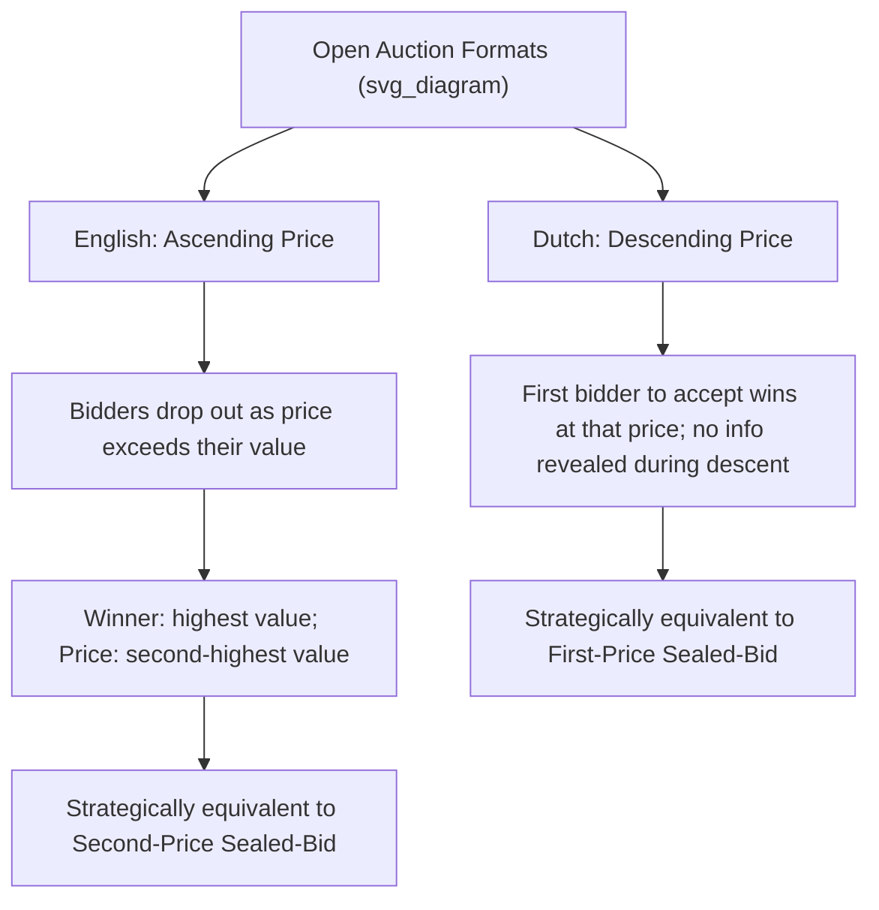

## English and Dutch Auctions

### Overview

English and Dutch auctions are the two canonical **open (dynamic/ascending or descending) auction formats**, distinguished from sealed-bid formats (first-price, second-price) by their real-time, publicly observable price adjustment process. The English auction uses an **ascending** price mechanism familiar from traditional live auctions, while the Dutch auction uses a **descending** price clock. Both formats have strategic-equivalence relationships with their sealed-bid counterparts under the standard independent private values (IPV) framework, making them central to illustrating the connection between auction *format* (open vs. sealed, ascending vs. descending) and auction *strategic structure*.

### The English (Ascending) Auction

**Mechanics**: The auctioneer (or an automated clock) continuously raises the price starting from a low level (often the reserve price). Bidders publicly indicate willingness to continue bidding at the current price (e.g., by raising a paddle or clicking to stay active); a bidder who drops out is irrevocably out for the remainder of the auction. The auction ends when only one bidder remains active, and that bidder wins at the price at which the second-to-last bidder dropped out.

**Equivalent formalization — the "button auction" (Milgrom-Weber model)**: A cleaner theoretical idealization treats the English auction as a continuous clock where all bidders start "active," and each bidder chooses an exit price (a dropout threshold); the auction ends when only one bidder remains, at the price of the second-highest dropout threshold.

**Dominant/optimal strategy under IPV**: In the standard independent private values setting, each bidder's optimal strategy is to remain active (keep bidding) as long as the current price is below their own true value $\theta_i$, and to drop out exactly when the price reaches $\theta_i$. This mirrors — and is strategically equivalent to — **truthful bidding in the second-price sealed-bid auction**: the winner is the highest-value bidder, and the winning price equals the **second-highest value** among all bidders (the price at which the second-to-last bidder dropped out).

**Key Points**:

- Under standard IPV, the English auction and the second-price sealed-bid auction are **strategically equivalent** — they produce the same allocation (highest-value bidder wins) and the same price (second-highest value), and the optimal strategy in each ("bid truthfully" / "drop out at your value") requires no strategic reasoning about competitors' bidding behavior.
- This equivalence **breaks down** in settings with **interdependent or common values**, where a bidder's optimal value estimate depends on information revealed by *other* bidders' behavior during the auction — in the English auction, watching when rivals drop out provides **informative signals** about the asset's common-value component (a phenomenon central to the **Milgrom-Weber linkage principle**), an information channel entirely absent in the sealed-bid second-price format. This makes the English auction generally **revenue-superior** to the second-price sealed-bid auction in interdependent-value settings, even though the two are equivalent under pure IPV.

### The Dutch (Descending) Auction

**Mechanics**: The auctioneer starts the price at a very high level and continuously lowers it. The auction ends the instant a bidder calls out (or signals) acceptance, and that bidder wins, paying the price at which they stopped the clock.

**Historical origin and usage**: Named for its traditional use in Dutch flower auctions (and historically used for a range of perishable and time-sensitive goods, where rapid transaction speed is valuable), the format allows a sale to be concluded almost instantaneously once a bidder accepts.

**Strategic equivalence to the first-price sealed-bid auction**: The Dutch auction is **strategically equivalent** to the first-price sealed-bid auction. In both formats, a bidder must decide, based only on their own value and beliefs about rivals (without observing any rival's behavior during the process), what price to accept/bid — in the Dutch auction, this is the price at which they choose to stop the descending clock; in the first-price sealed-bid auction, this is their sealed bid. Because no information is revealed to bidders during the Dutch auction's descent (no bidder observes when — or whether — any other bidder would have stopped the clock earlier), the **information structure faced by each bidder is identical** to the simultaneous, sealed first-price format.

**Key Points**:

- This strategic equivalence means the **same equilibrium bid-shading formula** derived for the first-price sealed-bid auction applies directly to the Dutch auction: $\beta(\theta_i) = \mathbb{E}[\max_{j\neq i}\theta_j \mid \max_{j\neq i}\theta_j < \theta_i]$, with the closed-form $\beta(\theta_i) = \frac{n-1}{n}\theta_i$ under i.i.d. Uniform$[0,1]$ values.
- Because the Dutch and first-price formats are strategically identical (not merely revenue-equivalent, but equivalent bidder-by-bidder in every realization), all revenue and efficiency properties transfer directly between the two formats without qualification — a stronger relationship than the *expected*-revenue equivalence that connects, say, first-price to second-price sealed-bid auctions.

### Diagrammatic Representation

### Strategic Equivalence Table

| Open Format | Sealed-Bid Equivalent | Key Reason for Equivalence |
| --- | --- | --- |
| English (ascending) | Second-Price Sealed-Bid | Optimal exit price = true value; winner pays second-highest value in both |
| Dutch (descending) | First-Price Sealed-Bid | No information revealed during the auction; bidder faces identical decision problem as sealed submission |

### Worked Numerical Example

**Setup**: 3 bidders with private values $\theta_1 = 0.9$, $\theta_2 = 0.6$, $\theta_3 = 0.3$ (same values as used in the First-Price/Second-Price worked example, for direct comparison), i.i.d. $\text{Uniform}[0,1]$ underlying distribution.

**English auction**:

- **Step 1**: Price rises from 0. Bidder 3 (value $0.3$) drops out first, exactly when price reaches $0.3$.
- **Step 2**: Price continues rising. Bidder 2 (value $0.6$) drops out when price reaches $0.6$.
- **Step 3**: Only Bidder 1 remains active; auction ends. Bidder 1 wins, paying $0.6$ (the price at which the second-to-last bidder, Bidder 2, dropped out).
- **Step 4**: Confirms exact equivalence to the second-price sealed-bid outcome computed earlier: winner = Bidder 1, price = $0.6$.

**Dutch auction**:

- **Step 1**: Price starts high and descends. No bidder observes any information about rivals during the descent.
- **Step 2**: Each bidder applies the equilibrium stopping rule $\beta(\theta_i) = \frac{2}{3}\theta_i$ (identical formula to the first-price sealed-bid equilibrium derived earlier): Bidder 1 would stop the clock at $\frac{2}{3}(0.9) = 0.6$; Bidder 2 at $\frac{2}{3}(0.6)=0.4$; Bidder 3 at $\frac{2}{3}(0.3)=0.2$.
- **Step 3**: As the price descends, it first reaches Bidder 1's threshold of $0.6$ (the highest stopping price among all bidders, since the clock is descending from above and $0.6$ is reached before $0.4$ or $0.2$) — Bidder 1 calls out acceptance immediately at price $0.6$.
- **Step 4**: Bidder 1 wins, paying $0.6$ — confirming exact equivalence to the first-price sealed-bid outcome computed earlier.

**Interpretation**: This example concretely illustrates both strategic equivalences: the English auction reproduces the exact second-price sealed-bid outcome, and the Dutch auction reproduces the exact first-price sealed-bid outcome, for the identical realization of bidder values.

### The Milgrom-Weber Linkage Principle and Interdependent Values

In settings with **interdependent or common values** (where each bidder's true value depends partly on private signals held by *other* bidders — e.g., estimating the value of an oil lease based on partial geological surveys held by multiple firms), the strategic equivalences above break down, and the **English auction generally generates higher expected revenue** than the Dutch or first-price sealed-bid formats.

**Key Points**:

- The **linkage principle** (Milgrom and Weber, 1982) formalizes why: the English auction's gradual price ascent, combined with observable drop-out behavior, reveals information about *other* bidders' private signals to remaining active bidders during the auction — this information revelation allows remaining bidders to bid more aggressively (with less need to shade bids downward as a hedge against the "winner's curse"), which in expectation raises seller revenue relative to formats where no such information is revealed during bidding (Dutch, first-price sealed-bid) or after bidding closes (second-price sealed-bid, which reveals no information about others' signals to the winner before they've already committed to their bid).
- This provides one of the clearest theoretical explanations for the **prevalence of ascending (English-style) formats** in real-world settings prone to common-value elements (e.g., mineral rights, art, and other resale-relevant assets), despite the formats' theoretical equivalence to sealed-bid counterparts under pure private values.

### Applications

- **Traditional live auctions**: Art, antiques, livestock, and collectibles auctions predominantly use the English (ascending) format, partly reflecting the revenue and information-aggregation advantages under interdependent values, and partly reflecting historical/cultural convention and the transparency it offers bidders.
- **Dutch flower auctions and perishables**: The eponymous Dutch flower auction market (e.g., Royal FloraHolland) uses descending-clock auctions specifically for their speed advantage in high-volume, time-sensitive perishable goods markets.
- **Online auction platforms**: Many online auction mechanisms (e.g., historical eBay-style formats) are hybrids or approximations of the English ascending format, often combined with proxy bidding systems that automate the "bid up to your value" strategy.
- **Spectrum and resource auctions**: Simultaneous ascending auctions (a multi-unit generalization of the English format) have been widely used for telecommunications spectrum license sales, directly motivated by the information-aggregation benefits the linkage principle identifies.
- **Procurement (reverse) auctions**: Descending-price reverse auctions (Dutch-style, with roles reversed for lowest-cost bidding) are used in some competitive procurement settings valuing speed and simplicity.

### Common Misconceptions

- **Misconception**: The English and Dutch auctions are just "cosmetic" variations of the same underlying process, differing only in presentation. **Correction**: The two formats have fundamentally different **information structures** (progressive revelation vs. no revelation during bidding), which is precisely why they map to *different* sealed-bid equivalents (second-price vs. first-price respectively) and behave differently in interdependent-value settings.
- **Misconception**: All four standard auction formats (English, Dutch, first-price, second-price) always yield identical expected revenue. **Correction**: This is true **only under the standard independent private values assumption**; with interdependent/common values, the English auction's information-revealing property (per the linkage principle) generally makes it **revenue-superior** to the other three formats.
- **Misconception**: The Dutch auction takes longer to conduct than the English auction because it involves a continuous clock. **Correction**: In practice, Dutch auctions are typically **faster** to conclude than English auctions, since they end the instant any bidder accepts (often within seconds), whereas English auctions require sequential dropout of all-but-one bidder — a key reason for the Dutch format's popularity in high-volume, time-sensitive markets like flower auctions.

### Related Topics

- First-Price and Second-Price Auctions
- Revenue Equivalence Theorem
- Milgrom-Weber Linkage Principle
- Interdependent and Common Values in Auctions
- The Winner's Curse
- Simultaneous Ascending Auctions (Spectrum Auctions)
- Myerson's Optimal Mechanism
- Vickrey-Clarke-Groves (VCG) Mechanisms