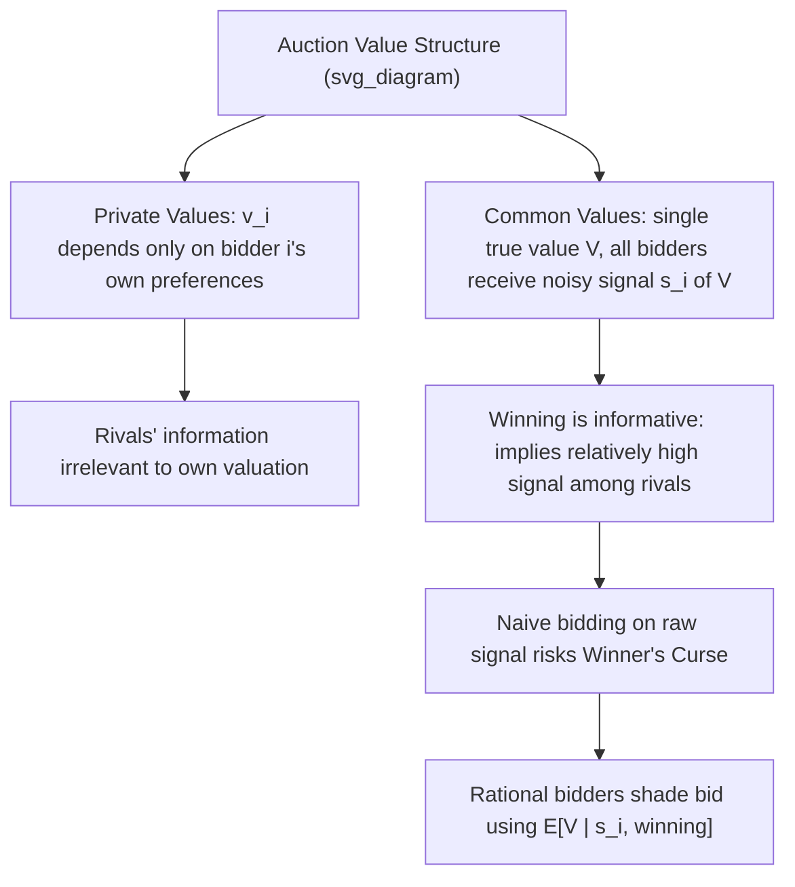

## Private Value and Common Value Models

### Overview

Private value and common value models represent the two polar informational paradigms in auction theory, distinguished by **how a bidder's valuation for the auctioned item relates to information held by other bidders**. In the **private values** model, each bidder's valuation is entirely their own, unaffected by what others know. In the **common values** model, the item has a single, objective (though unknown) true value, and bidders' private signals are merely noisy estimates of that shared underlying value. Most real-world auction settings fall somewhere between these two extremes, motivating the more general **interdependent (or affiliated) values** framework, of which private and common values are special limiting cases.

### The Private Values (PV) Model

**Definition**: Each bidder $i$ has a valuation $\theta_i$ for the item that depends **only on their own preferences/circumstances**, and is unaffected by any information — including private signals — held by other bidders. Formally, bidder $i$'s value $v_i = \theta_i$ is independent of other bidders' signals $\theta_{-i}$; even if a bidder were told everyone else's signals, their own valuation would not change.

**Independent Private Values (IPV)**: The specific (and most commonly studied) sub-case where each $\theta_i$ is drawn **independently** across bidders from some distribution $F$. This is the standard workhorse assumption underlying most foundational auction theory results (Revenue Equivalence Theorem, Myerson's optimal auction, the standard first-price/second-price equilibrium characterizations).

**Key Points**:

- Under IPV, a bidder's optimal strategy in a second-price auction (bid truthfully) or English auction (drop out at true value) requires **no information whatsoever about rivals' signals**, since learning others' information would not change the bidder's own valuation.
- Canonical examples: a piece of art purchased purely for personal aesthetic enjoyment (not resale), a concert ticket for personal attendance, or a custom-made good with no resale market — cases where the item's worth to a bidder is a matter of pure personal taste or use-value, unrelated to what any other bidder happens to know or believe.

### The Common Values (CV) Model

**Definition**: The item has a **single, objective true value** $V$ (the same for all bidders), which is unknown to everyone at the time of bidding. Each bidder $i$ receives a private, noisy **signal** $s_i$ correlated with $V$ (e.g., $s_i = V + \epsilon_i$ for some noise term $\epsilon_i$), but the item's actual worth to whoever wins is identical regardless of which bidder wins.

**Canonical examples**: Oil and mineral rights auctions (the amount of extractable oil under a tract of land is an objective fact, though unknown, and each bidding firm's geological survey provides only a noisy estimate); auctions for a jar of coins (the true total value is fixed and identical to whoever wins, though each bidder can only estimate it by eye); corporate takeover contests (the true post-acquisition value of a target firm is common to any acquirer, though each bidder's due diligence yields only an imperfect estimate).

**Key Points**:

- In a pure common value setting, a bidder's own signal $s_i$ is only *part* of the relevant information — the optimal Bayesian bid must account for the fact that *winning itself is informative*: winning typically means one had the most optimistic (highest) signal among all bidders, which should lead a rational bidder to revise their estimate of $V$ **downward** relative to their initial signal alone. Failing to properly account for this leads to the **winner's curse**.

### The Winner's Curse

**Definition**: The winner's curse refers to the systematic tendency, in common-value (or interdependent-value) settings, for the winning bidder to have **overpaid relative to the item's true value**, because winning the auction is itself evidence that one's own signal (and hence bid) was likely the most optimistic (or among the most optimistic) among all participants — a form of **adverse selection conditional on winning**.

**Mechanism**: If bidders naively bid based on their raw signal $s_i$ (their unconditional best estimate of $V$) without adjusting for the fact that winning implies having had a relatively high signal, the winner will, **on average**, have overestimated the true value $V$ — leading to negative expected profit upon winning if this adjustment is ignored.

**Rational correction**: Sophisticated bidders account for this by shading their bids **below** their raw signal-based estimate, incorporating the conditional expectation $\mathbb{E}[V \mid s_i, \text{winning}]$ rather than the naive unconditional estimate $\mathbb{E}[V \mid s_i]$ — properly executed, this rational adjustment eliminates the winner's curse in equilibrium (it is a curse only for *naive* bidders who fail to make this correction, not an unavoidable feature of rational equilibrium bidding).

**Key Points**:

- The winner's curse becomes **more severe** as the **number of bidders increases**, since winning against more competitors is even stronger evidence of having had an unusually optimistic signal, requiring more aggressive downward correction.
- **[Inference]** Empirical and experimental evidence (notably in studies of offshore oil lease auctions and laboratory auction experiments) has often found that real-world and experimental bidders **under-correct** for the winner's curse relative to fully rational Bayesian benchmarks, though the degree of under-correction and its practical significance remains a topic of ongoing empirical research rather than a settled universal finding.

### Diagrammatic Representation

### The Interdependent (Affiliated) Values Framework

**General framework**: Private values and common values are the two **polar extremes** of a more general **interdependent values** model, where bidder $i$'s valuation $v_i(s_i, s_{-i})$ can depend on *both* their own signal $s_i$ **and** other bidders' signals $s_{-i}$, with private values corresponding to $v_i$ depending only on $s_i$, and pure common values corresponding to all $v_i$ being identical functions of the full signal vector (often symmetric functions of $V$ and the noise structure).

**Affiliation**: A statistical property (formalized by Milgrom and Weber, 1982) describing signals that are "positively correlated" in a specific technical sense (higher realizations of one signal make higher realizations of others more likely) — affiliation is the key mathematical condition underlying the **Milgrom-Weber linkage principle** and its revenue-ranking results across auction formats.

**Key Points**:

- Most real-world auctions exhibit **some** interdependent-value component — even auctions for seemingly "personal use" items can carry resale-value considerations (partially common-value) alongside purely personal taste (private-value) components, making the pure PV/CV dichotomy a modeling simplification useful for isolating distinct theoretical mechanisms rather than a literal description of most real markets.

### Revenue and Format Implications

**Under pure IPV**: The Revenue Equivalence Theorem holds — first-price, second-price, English, and Dutch auctions all yield the same expected revenue (given risk-neutral, symmetric bidders and equal treatment of the lowest type).

**Under interdependent/common values**: The **Milgrom-Weber linkage principle** establishes that auction formats which reveal **more information** about other bidders' signals during the bidding process generate **higher expected seller revenue**, because this information revelation allows remaining bidders to bid more aggressively (mitigating the winner's curse concern that would otherwise require heavier bid-shading). This yields the general revenue ranking (weakly):

$$\text{Revenue}_{\text{English}} \geq \text{Revenue}_{\text{Second-Price Sealed-Bid}} \geq \text{Revenue}_{\text{First-Price Sealed-Bid} = \text{Dutch}}$$

**Key Points**:

- This ranking directly explains the common observation and design preference for **ascending (English-style) auction formats** in markets with substantial common-value elements — such as mineral rights, spectrum licenses, and corporate acquisition contests — where information aggregation during bidding is particularly valuable to the seller.
- Under pure IPV, all these formats collapse to the same expected revenue (the ranking above becomes an equality), consistent with revenue equivalence.

### Worked Conceptual Example: Oil Lease Auction

**Setup**: An oil lease has a true (unknown) value $V$. Three firms conduct independent geological surveys, each yielding a noisy signal: Firm A's survey suggests $s_A = \$12$ million; Firm B's suggests $s_B = \$9$ million; Firm C's suggests $s_C = \$7$ million (true $V$ is unknown to all, say actually $\$9$ million, though no firm observes this directly).

**Step 1 (Naive bidding)** — If each firm bids based purely on its own raw signal (ignoring the winner's-curse adjustment), Firm A, having drawn the most optimistic signal by chance, would bid closest to $12 million and would very likely win.

**Step 2 (The curse realized)** — Since the true value is $9 million, Firm A — having won specifically *because* it had the most optimistic (upward-biased, in this realization) signal among the three — would pay a price reflecting its $12 million estimate for an asset actually worth $9 million, realizing a loss if it paid close to its naive estimate.

**Step 3 (Rational correction)** — A sophisticated Firm A, understanding the winner's curse, would reason: "If I win this auction, it's likely because my signal was the most optimistic among all bidders — I should therefore revise my estimate of $V$ downward from my raw signal of $12 million before deciding how much to bid," leading to a bid meaningfully below $12 million.

**Step 4 (Equilibrium outcome)** — In a properly specified Bayesian Nash equilibrium accounting for this adjustment, all firms shade their bids according to the conditional-on-winning expectation, and the resulting equilibrium bidding avoids the systematic overpayment that plagues naive signal-based bidding — illustrating that the winner's curse is a pitfall of **naive, uncorrected** bidding, not an unavoidable equilibrium outcome for rational bidders.

### Applications

- **Oil, gas, and mineral rights auctions**: The historically most-cited real-world example motivating common-value auction theory and the winner's curse (informed heavily by empirical studies of U.S. offshore oil lease sales).
- **Spectrum auctions**: Telecommunications spectrum licenses have substantial common-value components (resale value, network synergies affecting all potential bidders similarly), motivating the widespread use of ascending simultaneous auction formats informed by the linkage principle.
- **Corporate mergers and acquisitions**: Takeover contests have interdependent-value elements, since the target firm's post-acquisition value may be similar across different acquirers (a common-value-like component) blended with acquirer-specific synergies (a private-value-like component).
- **Art and collectibles with resale value**: Auctions for items with significant investment/resale potential (rather than pure personal enjoyment) exhibit meaningful common-value components, since resale value depends on the broader market's (not just the buyer's) assessment of the item's worth.
- **Wine and antiques auctions**: Frequently cited as blended private/common-value settings — partly personal taste (private), partly investment/resale value (common) — illustrating the practical prevalence of the general interdependent-values case.

### Common Misconceptions

- **Misconception**: The winner's curse means winning an auction is always bad news. **Correction**: The winner's curse specifically describes the pitfall of **naive** bidders who fail to adjust for the informational content of winning; **rational** bidders anticipate and correct for this in equilibrium, and can still profit on average (the correction eliminates the systematic loss, it does not eliminate the possibility of profitable participation).
- **Misconception**: Private values and common values are two entirely separate categories that real auctions fall cleanly into. **Correction**: These are polar cases of the more general **interdependent (affiliated) values** framework; most real auctions exhibit a blend of both private (idiosyncratic taste/use) and common (objective, resale-relevant) value components.
- **Misconception**: Revenue equivalence between auction formats always holds. **Correction**: Revenue equivalence is a special result specific to the **independent private values** framework; under common or interdependent values, the Milgrom-Weber linkage principle establishes that formats revealing more information (like the English auction) generally generate **higher** expected revenue than those that do not.

### Related Topics

- The Winner's Curse
- Milgrom-Weber Linkage Principle
- English and Dutch Auctions
- First-Price and Second-Price Auctions
- Affiliated Random Variables and Information Structures
- Revenue Equivalence Theorem
- Simultaneous Ascending Auctions (Spectrum Auctions)
- Bayesian Updating and Adverse Selection