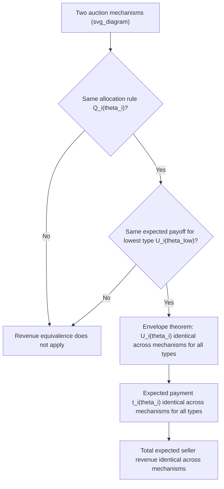

## The Revenue Equivalence Theorem

### Overview

The Revenue Equivalence Theorem (RET) is one of the most celebrated results in auction theory, establishing that **any two auction mechanisms sharing the same allocation rule and the same expected payoff for the lowest possible bidder type yield identical expected revenue** to the seller and identical expected payments from each bidder type. This result, developed through contributions by Vickrey (1961) and later generalized by Myerson (1981) and Riley and Samuelson (1981), explains why seemingly very different auction formats — first-price, second-price, English, and Dutch auctions — all generate the same expected seller revenue under a common set of standard assumptions, despite their starkly different bidding rules and strategic dynamics.

### Formal Statement

**Setting**: $n$ risk-neutral bidders, each with a private value $\theta_i$ drawn **independently** from a common distribution $F$ with support $[\underline\theta, \bar\theta]$ (the independent private values, or IPV, framework).

**Theorem**: Consider any two auction mechanisms (allocation rule plus payment rule) such that:

1. Both mechanisms allocate the good using the **same allocation rule** as a function of the (equilibrium) reported/revealed types — i.e., in equilibrium, the same bidder (e.g., the highest-value bidder) wins under both mechanisms for every realization of types.
2. Both mechanisms give bidders with the **lowest possible value** $\underline\theta$ the **same expected utility** (typically normalized to zero).

Then: **both mechanisms yield the same expected revenue to the seller, and each bidder type $\theta_i$ makes the same expected payment under both mechanisms.**

### Proof Sketch

The proof relies on the **envelope theorem** applied to each bidder's equilibrium interim expected utility.

**Step 1 — Interim expected utility**: In any incentive-compatible mechanism, define $U_i(\theta_i)$ as bidder $i$'s expected utility from participating, given their true type $\theta_i$ and assuming equilibrium (truthful, in the direct-mechanism formulation via the Revelation Principle) behavior:

$$U_i(\theta_i) = \mathbb{E}_{\theta_{-i}}\left[q_i(\theta_i,\theta_{-i})\theta_i - t_i(\theta_i,\theta_{-i})\right]$$

where $q_i$ is the probability bidder $i$ wins and $t_i$ is their expected payment.

**Step 2 — Envelope theorem characterization**: Incentive compatibility (via the standard envelope-theorem argument used throughout mechanism design) implies:

$$U_i'(\theta_i) = Q_i(\theta_i)$$

where $Q_i(\theta_i) = \mathbb{E}_{\theta_{-i}}[q_i(\theta_i,\theta_{-i})]$ is bidder $i$'s **interim probability of winning** given their reported type $\theta_i$. This is a direct consequence of the same first-order/envelope logic underlying the derivation of information rents in Myerson's optimal mechanism.

**Step 3 — Integrating**: This differential relationship implies:

$$U_i(\theta_i) = U_i(\underline\theta) + \int_{\underline\theta}^{\theta_i} Q_i(x)\,dx$$

**Step 4 — The key insight**: Since $Q_i(\cdot)$ (the interim winning probability function) is determined **entirely by the allocation rule**, any two mechanisms sharing the same allocation rule have the **same** $Q_i(\cdot)$ for every bidder. Combined with the same $U_i(\underline\theta)$ (same payoff for the lowest type) assumption, this means $U_i(\theta_i)$ — and hence each bidder's expected payment $t_i(\theta_i) = q_i(\theta_i)\theta_i - U_i(\theta_i)$ — must be **identical** across the two mechanisms, for every type $\theta_i$.

**Step 5 — Aggregating**: Since each bidder's expected payment is identical across the two mechanisms for every type, the seller's total expected revenue (the sum of expected payments across bidders, integrated over the type distribution) must also be identical.

### Diagrammatic Representation

### Application to Standard Auction Formats

Under the symmetric IPV framework with risk-neutral bidders, all four standard single-unit auction formats — **first-price sealed-bid**, **second-price sealed-bid**, **English (ascending)**, and **Dutch (descending)** — share the same allocation rule (the highest-value bidder wins) and give the lowest possible type a payoff of zero (a bidder with the lowest possible value in the support either never wins, or wins only at a price equal to their value, yielding zero surplus in equilibrium under each format). Revenue Equivalence therefore implies **all four formats generate identical expected seller revenue**, despite:

- Second-price and English auctions inducing bidders to reveal their true values (directly or via drop-out behavior).
- First-price and Dutch auctions inducing bidders to strategically **shade** their bids/stopping prices below true values.

**Key Points**:

- This is a striking and non-obvious result: intuitively, one might expect that "paying your own (shaded) bid" in a first-price auction versus "paying the second-highest value" in a second-price auction would produce systematically different revenue — RET shows these effects exactly offset **in expectation**.
- Revenue Equivalence is fundamentally an **ex-ante/expected-value** statement — it does not imply that realized revenue is identical auction-by-auction for any specific realization of bidder values; only that the *expectation* over the underlying value distribution coincides.

### Beyond Standard Formats: A General Tool

Because the theorem applies to **any** two mechanisms sharing the same allocation rule and lowest-type payoff (not just the four canonical formats), it serves as a powerful **general analytical tool** in mechanism design:

- It underlies the derivation of **Myerson's optimal auction**, since the envelope-theorem logic used to prove Revenue Equivalence is the same machinery used to derive the virtual-value characterization of the revenue-maximizing mechanism — RET essentially shows that, for a *fixed* allocation rule, revenue is pinned down once the lowest type's payoff is fixed, so revenue-maximization reduces to **choosing the best allocation rule** (which turns out to require virtual-value-based, reserve-price-distorted allocation rather than the efficient allocation rule).
- It provides a template for computing expected revenue in **novel or non-standard mechanisms** without needing to solve for explicit equilibrium bidding strategies: if a new mechanism's allocation rule can be shown to match a known mechanism's allocation rule (and lowest-type payoffs match), its expected revenue is immediately known without further equilibrium analysis.

### Conditions Required (and What Happens When They Fail)

Revenue Equivalence relies on a specific bundle of assumptions, each of which can independently be relaxed to generate revenue **differences** across formats — a major branch of applied auction theory studies precisely these departures:

**Risk aversion**: If bidders are **risk-averse** rather than risk-neutral, the equivalence breaks down. In a first-price auction, risk-averse bidders bid **more aggressively** (shade less) than risk-neutral theory predicts, since a marginally higher bid reduces the risk of losing at a cost of only a small reduction in profit conditional on winning — this generally makes the **first-price auction generate strictly higher revenue than the second-price auction** under bidder risk aversion.

**Correlated or interdependent/common values**: If bidder values (or signals) are correlated or interdependent (as in common-value settings) rather than independent, the **Milgrom-Weber linkage principle** shows that formats revealing more information during bidding (like the English auction) generate weakly higher revenue than those that do not — breaking the equality that holds under pure IPV.

**Asymmetric bidders**: If bidders draw values from **different** distributions (asymmetric IPV), the allocation rule itself can differ across formats — e.g., a first-price auction with asymmetric bidders may **not** allocate efficiently to the highest-value bidder in equilibrium (weaker bidders may bid more aggressively relative to their own distribution to compensate), which changes $Q_i(\cdot)$ across formats and breaks the equivalence.

**Budget constraints or liquidity constraints**: If bidders face binding budget constraints, payment rules that require the winner to pay a large amount up front (as in first-price/Dutch formats) versus a potentially lower amount determined by rivals (as in second-price/English formats) can interact differently with those constraints, again breaking the standard equivalence.

**Risk of collusion**: Formats differ substantially in their vulnerability to bidder collusion (e.g., second-price and English auctions are often considered more susceptible to certain forms of collusive bidding schemes than first-price formats), a practical consideration RET's idealized framework does not capture.

### Worked Numerical Example

**Setup**: $n=2$ bidders, values i.i.d. $\text{Uniform}[0,1]$.

**Second-price auction expected revenue**: The seller receives the **second-highest** of two i.i.d. Uniform$[0,1]$ draws. For $n=2$, the expected value of the minimum of two i.i.d. Uniform$[0,1]$ draws (which equals the second-highest, i.e., the lower value, when there are only two bidders) is:

$$\mathbb{E}[\min(\theta_1,\theta_2)] = \frac{1}{n+1} = \frac{1}{3} \approx 0.333$$

**First-price auction expected revenue**: Using the equilibrium bid function $\beta(\theta_i) = \frac{n-1}{n}\theta_i = \frac{1}{2}\theta_i$, the winner is the bidder with the higher value $\theta_{(1)} = \max(\theta_1,\theta_2)$, paying $\frac{1}{2}\theta_{(1)}$. The expected value of the maximum of two i.i.d. Uniform$[0,1]$ draws is $\frac{2}{n+1} = \frac{2}{3}$, so expected revenue is:

$$\mathbb{E}\left[\frac{1}{2}\theta_{(1)}\right] = \frac{1}{2}\times\frac{2}{3} = \frac{1}{3} \approx 0.333$$

**Step-by-step confirmation**: Both formats yield expected revenue of exactly $\frac{1}{3}$, confirming Revenue Equivalence numerically for this standard case — despite the fact that the second-price auction's payment (the loser's true value) and the first-price auction's payment (half the winner's true value) are computed via entirely different formulas applied to different underlying order statistics.

### Applications

- **Auction format selection in practice**: Provides theoretical grounding for why sellers might choose formats based on criteria **other** than raw expected revenue (e.g., speed, transparency, bidder risk-aversion, susceptibility to collusion) when the standard IPV assumptions approximately hold, since expected revenue itself is invariant to this choice.
- **Optimal auction design**: Serves as the direct analytical precursor and building block for Myerson's optimal (revenue-maximizing) auction characterization, since it isolates the role of the allocation rule (rather than the payment rule) as the true lever for revenue.
- **Government asset and spectrum sales**: Historical policy debates over format choice for major public asset auctions have directly invoked RET (and its breakdown under risk aversion, correlated values, or collusion concerns) to justify particular format choices.
- **Procurement design**: Analogous reasoning applies to reverse (procurement) auctions, where RET-style arguments inform whether first-price or second-price-style procurement mechanisms should be expected to yield similar expected costs to the buyer.

### Common Misconceptions

- **Misconception**: Revenue Equivalence means all auction formats always generate exactly the same revenue in every single auction instance. **Correction**: RET is an **expected-value (ex-ante)** result — realized revenue can differ between formats for any specific realization of bidder values; only the expectation, integrated over the full distribution of possible values, is guaranteed to coincide.
- **Misconception**: Revenue Equivalence holds universally, regardless of bidder risk preferences or value correlation structure. **Correction**: The theorem's standard form requires **risk-neutral bidders** and **independent (private) values**; relaxing either assumption (risk aversion, correlated/common values, bidder asymmetry) generally breaks the equivalence, often in theoretically well-understood and economically important directions (e.g., risk aversion favors first-price revenue; the linkage principle favors English-auction revenue under correlated values).
- **Misconception**: Revenue Equivalence implies that the choice of auction format is economically irrelevant. **Correction**: Even when the idealized theorem's conditions hold exactly, formats still differ in strategic complexity, transparency, collusion vulnerability, and behavior under any departure from the theorem's assumptions — RET establishes revenue-neutrality **only** under its specific idealized conditions, not a general irrelevance of format choice.

### Related Topics

- First-Price and Second-Price Auctions
- English and Dutch Auctions
- Myerson's Optimal Mechanism
- Private Value and Common Value Models
- Milgrom-Weber Linkage Principle
- Envelope Theorem in Mechanism Design
- Individual Rationality Constraints
- Bidder Risk Aversion in Auction Theory