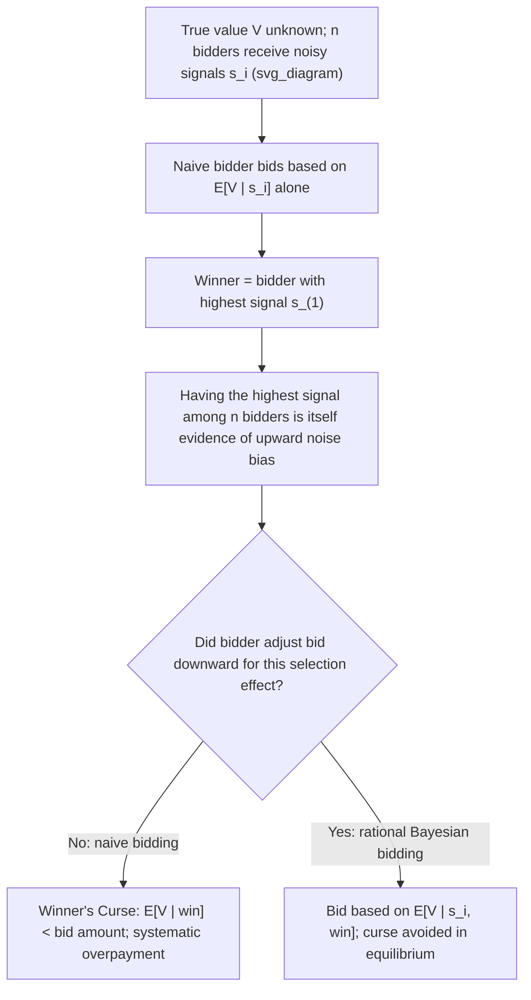

## The Winner's Curse

### Overview

The winner's curse is a phenomenon arising in auctions with **common or interdependent values**, where the winning bidder tends to have overpaid relative to the item's true underlying value. It occurs because winning an auction is itself an informative event: the winner is, by definition, the bidder who submitted the highest bid, which — in a common-value setting where bidders rely on noisy private signals of a shared true value — is disproportionately likely to be the bidder whose signal was the most **optimistic** (upward-biased) among all participants. Bidders who fail to account for this **adverse selection conditional on winning** systematically overbid and, on average, realize losses or below-expected profits. The concept, first identified in the context of oil-lease bidding by petroleum engineers Capen, Clapp, and Campbell (1971), has become a foundational idea across auction theory, corporate finance, and behavioral economics.

### Formal Mechanism

**Setup**: An item has a true, objective but unknown value $V$. Each of $n$ bidders receives a private signal $s_i$, an unbiased but noisy estimate of $V$ (e.g., $s_i = V + \epsilon_i$, where $\epsilon_i$ is independent noise with mean zero).

**The naive bidding error**: A naive bidder computes their bid based on the **unconditional** expectation of $V$ given their own signal alone: $\mathbb{E}[V \mid s_i]$. If all bidders bid this way (or bid up to this amount in an English/second-price format), the winner is the bidder with the highest signal, $s_{(1)} = \max_i s_i$.

**Why this is a systematic error**: Conditional on **winning** (i.e., conditional on having the highest signal among all $n$ bidders), the expected value of $V$ is generally **lower** than $\mathbb{E}[V \mid s_i]$ computed using the winning signal alone — this is because $\max_i s_i$ is itself a biased (upward) estimator of $V$ whenever $n > 1$, since it specifically selects for the most favorable noise realization among all participants:

$$\mathbb{E}[V \mid s_i = s_{(1)}, \text{win}] < \mathbb{E}[V \mid s_i = s_{(1)}]$$

**Consequence**: A naive bidder who bids as if $\mathbb{E}[V \mid s_i]$ were the correct posterior estimate, without further conditioning on the informational content of winning, will on average **pay more than the item is actually worth**, generating negative expected profit — the "curse" of winning.

### Diagrammatic Representation

### The Rational Correction: Bidding on E[V | signal, winning]

**Key Points**:

- A fully rational, Bayesian bidder does **not** naively bid $\mathbb{E}[V \mid s_i]$; instead, they correctly compute and bid based on $\mathbb{E}[V \mid s_i, \text{winning}]$ — explicitly incorporating the fact that winning is conditional on having (likely) the most optimistic signal among rivals.
- This required adjustment grows **larger as the number of bidders $n$ increases**, since winning against more competitors is progressively stronger evidence of an unusually favorable signal draw, demanding a correspondingly larger downward correction.
- Properly executed, this Bayesian correction **eliminates the winner's curse as a systematic phenomenon in equilibrium** — the winner's curse is fundamentally a pitfall of **naive, uncorrected inference**, not an unavoidable structural feature of common-value auctions for fully rational participants. In a correctly specified Bayesian Nash equilibrium, expected profits conditional on winning are non-negative by construction.
- This distinction is important: the term "winner's curse" is sometimes loosely used to describe *any* auction overpayment, but its precise technical meaning concerns this specific **statistical selection effect** arising from the informational content of winning in common/interdependent-value settings.

### Relationship to Auction Format (Milgrom-Weber Linkage Principle)

The **severity** of the winner's curse — and bidders' ability to correct for it — depends significantly on the auction format:

- **English (ascending) auctions**: Because bidders observe **when** rivals drop out during the price ascent, remaining active bidders receive real-time information about the signals held by those who have exited, allowing for **partial in-auction correction** of the winner's curse as the auction proceeds — this is the mechanism underlying the **Milgrom-Weber linkage principle**, which shows that information-revealing formats mitigate the winner's-curse-driven bid-shading that would otherwise be needed, generally raising expected seller revenue.
- **Sealed-bid formats (first-price, second-price)**: No information about rivals' signals is revealed before bids are submitted, so **all** winner's-curse correction must be performed **ex-ante**, purely through the equilibrium bidding function's built-in adjustment — bidders cannot update on rival behavior mid-auction, making the correction entirely a matter of correct prior computation.

**Key Points**:

- This connects directly to why ascending formats are often preferred in markets with strong common-value elements (oil leases, spectrum licenses): the informational structure of the English auction provides a built-in, real-time mitigation channel for the winner's-curse problem that sealed-bid formats lack.

### Worked Numerical Example

**Setup**: An oil tract has a true value $V = \$10$ million (unknown to bidders). Four firms conduct independent surveys, receiving signals $s_i = V + \epsilon_i$, with $\epsilon_i$ independently and identically distributed with mean 0. Suppose, in one particular realization, the four signals happen to be: $s_1 = \$14$M, $s_2 = \$11$M, $s_3 = \$9$M, $s_4 = \$6$M.

**Step 1 (Naive bidding)** — If each firm bids its own signal value directly (or up to that amount in an ascending format, without deeper correction), Firm 1 wins with a bid near $14 million.

**Step 2 (The curse realized)** — Since the true value is $10 million, Firm 1 — having won specifically because it happened to draw the most optimistic noise realization among the four — pays close to $14 million for an asset worth $10 million, realizing an approximate $4 million loss relative to true value if it bid near its raw signal.

**Step 3 (Why this isn't bad luck alone)** — Note that Firm 1's signal ($s_1 = 14$) has the largest *positive* deviation from the true value ($+4$) among all four signals; this is not a coincidental one-off event but a **structural feature** of the winning mechanism itself: whichever firm happens to win via naive signal-based bidding will systematically tend to be whichever firm's noise term was most favorable, across repeated instances of similar auctions.

**Step 4 (Rational correction)** — A sophisticated Firm 1, anticipating that winning against three rivals is itself evidence of having drawn an unusually high noise realization, would shade its bid **substantially below** its raw signal of $14 million — for instance, bidding closer to an appropriately conditional estimate (the exact magnitude depending on the noise distribution's variance and the number of competing bidders) — reducing or eliminating the expected loss that naive bidding would produce.

**[Inference]** The precise numerical adjustment required depends on the specific distributional assumptions about the noise terms $\epsilon_i$ and the number of bidders $n$; the example above illustrates the qualitative direction and structural logic of the correction rather than a universally applicable formula.

### Empirical and Real-World Evidence

**[Inference]** The winner's curse concept originated from empirical observations of offshore oil and gas lease auctions in the United States, where petroleum industry analysts noted that historical winning bids in common-value lease auctions were frequently associated with subsequent below-expected returns, consistent with systematic overbidding relative to true underlying value; this empirical pattern motivated the theoretical formalization of the concept in economics.

**[Inference]** Subsequent experimental economics research (using controlled laboratory common-value auction settings) has generally found that a substantial fraction of subjects **do fall prey to the winner's curse**, particularly as the number of bidders increases, though the degree to which experienced or professional bidders (as opposed to inexperienced laboratory subjects) exhibit the same bias in high-stakes real-world settings remains a topic of ongoing empirical debate rather than a fully settled consensus finding.

### Applications

- **Oil, gas, and mineral rights auctions**: The original and still most-cited empirical domain for the winner's curse, given the strong common-value character of subsurface resource valuation.
- **Corporate mergers and acquisitions**: Acquiring firms in competitive bidding contests for target companies face a structurally analogous risk — winning a bidding war for a target can be evidence that the winning acquirer was unusually optimistic (or overestimated synergies) relative to competing bidders, a phenomenon sometimes explicitly termed the "winner's curse in M&A."
- **IPO and financial market bidding**: Underpricing of initial public offerings has been partly explained (in some theoretical models) via winner's-curse-style adverse selection between informed and uninformed investors bidding for shares.
- **Real estate bidding wars**: Competitive residential or commercial real estate bidding, particularly in "as-is" or opaque-information sales, can exhibit winner's-curse dynamics when buyers rely on imperfect private appraisals of a property's true market value.
- **Sports free agency and player contracts**: Sometimes informally analyzed through a winner's-curse lens, where the team willing to offer the largest contract may be the one most likely to have overestimated a player's future performance relative to competing teams' assessments.

### Common Misconceptions

- **Misconception**: The winner's curse means that winning any auction is inherently bad or that all auction winners overpay. **Correction**: The winner's curse is specific to **common or interdependent-value** settings and describes a bias afflicting **naive** (uncorrected) bidders; a rational bidder who properly conditions on the informational content of winning can — and in equilibrium does — avoid the systematic overpayment, still profiting on average from participation.
- **Misconception**: The winner's curse is primarily a matter of "bad luck" for the specific winning bidder in any given instance. **Correction**: It is a **systematic statistical selection effect** — the winner is not a random draw from all bidders' signals but specifically the bidder with the most favorable (upward-biased) signal realization, a structural feature of the winning mechanism itself, not mere chance in any one auction.
- **Misconception**: The winner's curse applies equally to all auction types, including pure private-value auctions. **Correction**: In a **pure private values** setting, there is no winner's curse, since each bidder's valuation is entirely their own and unaffected by any information (correct or biased) that other bidders possess — the winner's curse is a phenomenon specific to common and interdependent-value environments.

### Related Topics

- Private Value and Common Value Models
- Milgrom-Weber Linkage Principle
- English and Dutch Auctions
- Interdependent and Affiliated Values in Auctions
- Bayesian Updating and Adverse Selection
- Behavioral Economics and Auction Bidding Biases
- Mergers and Acquisitions Bidding Contests
- Simultaneous Ascending Auctions (Spectrum Auctions)