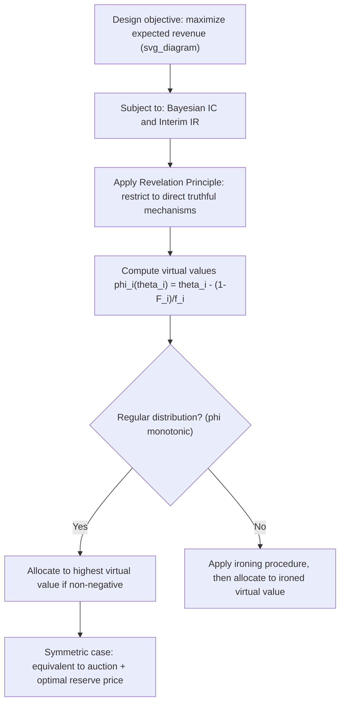

## Optimal Auction Design

### Overview

Optimal auction design addresses the question of how a seller should structure an auction mechanism to **maximize expected revenue**, given that bidders have privately known valuations and behave strategically. This is distinct from — and often in tension with — designing for **efficiency** (allocating the good to whoever values it most). The foundational answer, provided by Myerson (1981), shows that revenue maximization generally requires **deliberately distorting the allocation away from full efficiency**, most commonly through the introduction of a **reserve price**, and more generally through the concept of **virtual values**. This chapter-level topic synthesizes the core results, techniques, and design principles spanning Myerson's mechanism, revenue equivalence, and their practical extensions.

### The Optimal Auction Design Problem

**Setup**: A seller has one indivisible good and faces $n$ risk-neutral bidders with independently drawn private values $\theta_i \sim F_i$. The seller chooses a mechanism (allocation rule $q_i(\theta)$ and payment rule $t_i(\theta)$) to solve:

$$\max_{q,t} \; \mathbb{E}\left[\sum_i t_i(\theta)\right] \quad \text{subject to Bayesian Incentive Compatibility (BIC) and Interim Individual Rationality (IR)}$$

By the **Revelation Principle**, this optimization can be restricted, without loss of generality, to direct truthful mechanisms.

### Core Technique: Virtual Values

The central analytical device is the **virtual value function**:

$$\phi_i(\theta_i) = \theta_i - \frac{1-F_i(\theta_i)}{f_i(\theta_i)}$$

which nets a bidder's raw value against the **information rent** the seller must concede due to the binding incentive compatibility constraint. Myerson's key result: **the revenue-maximizing mechanism allocates to the bidder with the highest virtual value, provided it is non-negative** — structurally identical to an efficient (highest-value) allocation rule, but applied to virtual values rather than raw values.

**Key Points**:

- Under **regularity** (virtual value $\phi_i$ non-decreasing in $\theta_i$, true of many standard distributions), this yields a clean, implementable mechanism.
- Under **irregular** distributions, an **ironing procedure** must be applied to restore the monotonicity required for implementability.
- In the **symmetric** case (all bidders draw from the same $F$), the optimal mechanism reduces to a **standard auction format (e.g., second-price) with an optimally chosen reserve price** $r^*$ satisfying $\phi(r^*) = 0$.

### Diagrammatic Representation

### The Efficiency-Revenue Trade-off

**Central tension**: A fully efficient mechanism (e.g., a standard auction with **no** reserve price) always allocates the good to the highest-value bidder, maximizing total surplus. The **revenue-maximizing** mechanism instead withholds the good whenever the highest bidder's virtual value is negative — i.e., whenever all bidders' values fall below the optimal reserve price $r^*$ — sacrificing efficiency (foregoing mutually beneficial trades) specifically to extract greater surplus from the higher-value realizations that do trade.

**Key Points**:

- **[Inference]** This trade-off is a defining conceptual takeaway of optimal auction theory: revenue maximization and efficiency are generically **distinct objectives** that coincide only in special/limiting cases (e.g., as the number of bidders grows very large, since competitive pressure reduces the seller's need to rely on a reserve price to extract surplus).
- The optimal reserve price $r^*$, in the symmetric case, depends **only on the value distribution** $F$ — not on the number of bidders $n$ — a frequently counterintuitive result, since one might expect a seller facing more competition among bidders to lower the reserve to encourage participation, when in fact the theoretically optimal reserve remains fixed.

### Relationship to Revenue Equivalence

The **Revenue Equivalence Theorem** (any two mechanisms sharing the same allocation rule and lowest-type payoff yield the same expected revenue) is the direct analytical precursor to optimal auction design: it shows that, for a **given** allocation rule, expected revenue is fully determined once the lowest type's payoff is fixed (via envelope-theorem reasoning). Optimal auction design then reduces to the separate question of **which allocation rule maximizes revenue** — and Myerson's answer is the virtual-value-maximizing rule, which is generally **not** the efficient allocation rule (the two coincide only when virtual values are non-negative for all types in the relevant support, which fails whenever a reserve price binds).

### Reserve Prices in Practice

**Optimal reserve price derivation**: Setting $\phi(r^*) = 0$:

$$r^* - \frac{1-F(r^*)}{f(r^*)} = 0$$

**Worked example**: For $\theta \sim \text{Uniform}[0,1]$, $\phi(\theta) = 2\theta - 1$, yielding $r^* = 0.5$ — the seller should never sell for less than half the maximum possible value, regardless of how many bidders participate.

**Key Points**:

- Reserve prices are the most common **practical implementation** of optimal auction theory: real-world auction houses, online platforms, and government asset sales routinely set minimum acceptable bids informed (at least qualitatively) by this logic, even without literally computing a formal virtual-value function from an assumed distribution.
- **[Inference]** In practice, sellers often set reserve prices using rules of thumb, appraisals, or approximate estimates of the value distribution rather than exact Myerson-style calculations, since the precise distribution $F$ is rarely known with certainty — the theory nonetheless provides the conceptual justification for why *some* positive reserve is typically revenue-improving relative to a no-reserve auction.

### Extensions: Asymmetric Bidders

When bidders draw values from **different** distributions $F_i$ (asymmetric bidders), the optimal mechanism still allocates based on **highest virtual value**, but because different bidders have different virtual value functions $\phi_i(\cdot)$, this can require **bidder-specific reserve prices** or **handicapping**, and the allocation may **not** go to the bidder with the objectively highest raw value.

**Key Points**:

- **[Inference]** This means the revenue-optimal mechanism in asymmetric settings can favor a bidder from a "weaker" (lower-value, higher-variance, or otherwise structurally different) distribution over a bidder from a "stronger" distribution, even when the stronger bidder has a higher raw reported value — because the weaker bidder's virtual value at that particular report may exceed the stronger bidder's, reflecting the differing information-rent structure implied by each bidder's respective distribution.
- This result is sometimes cited as counterintuitive relative to naive expectations that optimal mechanisms should simply "sell to the highest bidder" — the virtual-value logic can produce allocations that appear to favor weaker bidders, purely as a revenue-maximizing device.

### Extensions: Multi-Unit and Multi-Object Settings

**[Inference]** The core Myerson logic — allocate based on virtual values, subject to monotonicity/ironing — extends conceptually to **multi-unit auctions** (selling several identical units) and, with substantially greater technical complexity, to **multi-object/combinatorial auctions** (selling heterogeneous items, potentially with complementarities across items for different bidders); however, fully general, computationally tractable optimal mechanisms for complex combinatorial environments remain a considerably harder and less completely settled problem than the single-unit case, motivating substantial ongoing research in "algorithmic mechanism design" combining auction theory with computational complexity considerations.

### Extensions: Dynamic Optimal Mechanisms

When bidder valuations **evolve over time** (rather than being fixed and drawn once), the static virtual-value framework generalizes to a **dynamic virtual value** concept (building on dynamic mechanism design and dynamic incentive compatibility), yielding period-by-period distorted allocation rules whose distortion depends on the full stochastic process governing how types evolve — a technically more intricate extension relative to the static theory, generally requiring stronger structural assumptions (e.g., Markovian type evolution) to produce clean, implementable characterizations.

### Worked Numerical Example: Comparing Efficient vs. Optimal Mechanisms

**Setup**: Single seller, single buyer, $\theta \sim \text{Uniform}[0,1]$.

**Efficient benchmark (no reserve)**: Sell whenever $\theta \geq 0$ (i.e., any positive value trades). Under a posted price of $0$ (giving away the good to any positive-value buyer), the seller's revenue would be $0$ — clearly this particular efficient implementation is revenue-poor; a more standard efficiency benchmark instead considers a **mechanism-agnostic total welfare** comparison rather than a specific zero-reserve pricing scheme.

**Optimal (Myerson) mechanism**: Compute $\phi(\theta) = 2\theta - 1$, set $r^* = 0.5$.

- **Step 1**: Sell only if $\theta \geq 0.5$, at price $r^* = 0.5$.
- **Step 2**: Expected revenue $= \Pr(\theta \geq 0.5) \times 0.5 = 0.5 \times 0.5 = 0.25$.
- **Step 3**: Expected total welfare under this mechanism $= \mathbb{E}[\theta \cdot \mathbb{1}(\theta \geq 0.5)] = \int_{0.5}^{1}\theta \,d\theta = \left[\frac{\theta^2}{2}\right]_{0.5}^{1} = \frac{1}{2} - \frac{0.125}{1}= 0.375$.
- **Step 4**: Compare to fully efficient welfare (sell whenever $\theta \geq 0$, trading with certainty): $\mathbb{E}[\theta] = 0.5$.
- **Interpretation**: The optimal (revenue-maximizing) mechanism achieves total welfare of $0.375$ versus the fully efficient benchmark's $0.5$ — a **welfare loss of $0.125$** (the "deadweight loss" from foregone trades when $\theta \in [0, 0.5)$), incurred specifically to extract the $0.25$ in expected revenue that a giveaway (zero-price) mechanism would not capture at all.

### Applications

- **Online advertising and ad exchange auctions**: Platforms set reserve prices for ad slots informed by (estimated) advertiser value distributions, directly applying Myerson-style virtual value logic to maximize platform revenue.
- **Government spectrum and asset sales**: Reserve price setting in major public auctions (spectrum licenses, natural resource leases, privatizations) is informed by optimal auction theory, balancing revenue extraction against the risk of failing to sell valuable assets.
- **Art, real estate, and luxury goods auctions**: Auction houses' use of reserve prices (minimum acceptable bids, often undisclosed) reflects practical application of the same underlying revenue-extraction logic.
- **Procurement (reverse) auctions**: Analogous "ceiling price" logic (maximum acceptable payment by the buyer) applies symmetrically in procurement settings, informed by the mirror-image of Myerson's framework.
- **Algorithmic and computational mechanism design**: Ad exchange platforms, cloud computing resource markets, and other automated marketplaces increasingly implement approximate or computationally tractable versions of virtual-value-based pricing at scale.

### Common Misconceptions

- **Misconception**: Optimal (revenue-maximizing) auctions and efficient auctions are the same thing. **Correction**: They are generally **distinct objectives**; the revenue-maximizing mechanism typically sacrifices some efficiency (via reserve prices/virtual value distortions) specifically to extract greater expected revenue from higher-value realizations.
- **Misconception**: A seller facing more bidders should lower the reserve price to encourage more competitive bidding and thus more revenue. **Correction**: In the standard symmetric IPV framework, the theoretically optimal reserve price is **independent of the number of bidders** — it depends solely on the underlying value distribution, reflecting the point where the marginal bidder's virtual value crosses zero.
- **Misconception**: Optimal auction design always favors selling to the bidder with the objectively highest value. **Correction**: This holds in the **symmetric** bidder case, but under **asymmetric** bidder value distributions, the virtual-value-maximizing allocation can favor a bidder from a structurally "weaker" distribution over one with a higher raw value, since the mechanism allocates based on virtual value, not raw value, once distributions differ across bidders.

### Related Topics

- Myerson's Optimal Mechanism
- Revenue Equivalence Theorem
- Reserve Prices in Auction Design
- Vickrey-Clarke-Groves (VCG) Mechanisms
- Individual Rationality Constraints
- Incentive Compatibility (Bayesian vs. Dominant Strategy)
- Dynamic Mechanism Design
- Asymmetric Bidders and Virtual Value Handicapping