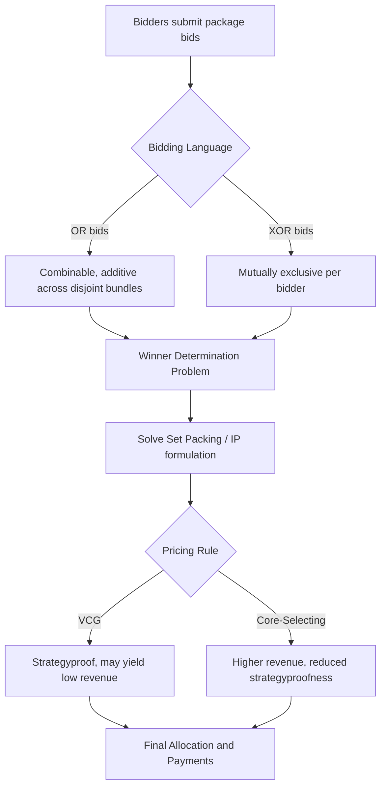

## Combinatorial Auctions

### Overview

Combinatorial auctions allow bidders to submit bids on **bundles** (combinations) of items rather than on individual items alone. This mechanism is essential when items exhibit complementarities or substitutabilities, meaning the value of a bundle to a bidder is not simply the sum of the values of its individual components.

**Key Points**

- Bidders express preferences over subsets $S \subseteq M$ of a set of items $M = \{1, 2, \ldots, m\}$
- Valuations $v_i(S)$ are typically non-additive across bundles
- The core computational problem is the **Winner Determination Problem (WDP)**, which is NP-hard in general
- Widely applied in spectrum auctions, transportation/logistics procurement, industrial procurement, and airport landing slot allocation

### Motivation: Complements and Substitutes

Standard single-item or simultaneous auctions force bidders to bid on items separately, which creates the **exposure problem**: a bidder who needs a bundle of items to realize value may win only some of them, overpaying for items that are individually worthless without the rest.

**Superadditive valuations (complements):** $v_i(A \cup B) > v_i(A) + v_i(B)$ for disjoint $A, B$. Example: a wireless carrier bidding on adjacent spectrum blocks in different regions may only find value if it wins a contiguous nationwide footprint.

**Subadditive valuations (substitutes):** $v_i(A \cup B) < v_i(A) + v_i(B)$. Example: a logistics firm bidding on delivery routes where winning two overlapping routes provides less than double the value of one, since capacity/trucks are shared.

Combinatorial auctions let bidders submit **package bids**, eliminating the exposure problem by guaranteeing they only pay if they win the specific combination they value.

### Formal Model

Let $M = \{1, \ldots, m\}$ be the set of items and $N = \{1, \ldots, n\}$ the set of bidders. Each bidder $i$ has a valuation function $v_i: 2^M \to \mathbb{R}_{\geq 0}$ with $v_i(\emptyset) = 0$.

An **allocation** $X = (X_1, \ldots, X_n)$ assigns disjoint bundles $X_i \subseteq M$ to bidders such that $X_i \cap X_j = \emptyset$ for $i \neq j$.

**Winner Determination Problem (WDP):**

$$\max_{X} \sum_{i=1}^{n} v_i(X_i) \quad \text{s.t.} \quad X_i \cap X_j = \emptyset \; \forall i \neq j, \; X_i \subseteq M$$

This is equivalent to the **Set Packing Problem**, a canonical NP-hard combinatorial optimization problem. As the number of items $m$ grows, the bundle space $2^m$ grows exponentially, making both bid representation and optimization computationally demanding.

### Bidding Languages

Since there are $2^m - 1$ possible non-empty bundles, bidders cannot feasibly enumerate valuations for every bundle when $m$ is large. Compact bidding languages address this.

**Atomic Bids (OR bids):** A bidder submits a set of bundle-price pairs $(S_1, p_1), (S_2, p_2), \ldots$, and can win any combination of these bids as long as the underlying bundles are disjoint (implicitly summing values for non-overlapping bundles). OR bids cannot express substitutes well, since a bidder may be forced to win multiple bids they'd rather not combine.

**XOR bids:** A bidder submits $(S_1, p_1), \ldots, (S_k, p_k)$ but can win **at most one** of these bundles. XOR bids can express any valuation function (given enough atoms) and naturally represent substitutes, but require exponentially many atoms for complex valuations in the worst case.

**OR-of-XOR and XOR-of-OR:** Hybrid languages combining both operators to balance expressiveness and compactness.

**Bidding languages with logical structure:**

- **OR*:** OR bids augmented with dummy items to simulate limited XOR-like exclusivity
- **Straightforward (SF) bids:** Compact representations for valuations with specific structure (e.g., additive, budget-constrained additive)

**[Inference]** In practice, most large-scale deployments (e.g., FCC spectrum auctions) restrict bidders to a manageable subset of expressible packages (often via generic "OR-of-XOR" constructs) to keep the WDP computationally tractable, trading some expressiveness for solvability.

### Winner Determination: Complexity and Algorithms

**Complexity:** The WDP is NP-hard and inapproximable within $m^{1-\epsilon}$ for any $\epsilon > 0$ unless P = NP, by reduction from Set Packing / Independent Set.

**Exact methods:**

- **Integer Programming (IP) formulation:**

$$\max \sum_{i} \sum_{S \subseteq M} v_i(S) \, x_{i,S} \quad \text{s.t.} \quad \sum_{i}\sum_{S \ni j} x_{i,S} \leq 1 \;\forall j \in M, \quad \sum_S x_{i,S} \leq 1 \;\forall i, \quad x_{i,S} \in \{0,1\}$$

Solved via branch-and-bound with LP relaxation bounds, often augmented with cutting planes.

- **Branch-and-bound search over the bid graph:** exploits conflict graphs between overlapping bids (CABOB, CASS algorithms).

**Approximation/heuristic methods:**

- Greedy algorithms (allocate highest value-per-item bundles first) — give weak worst-case guarantees but perform reasonably in practice
- Local search and simulated annealing for large instances
- LP relaxation with randomized rounding

**[Unverified]** Specific runtime benchmarks for solvers like CPLEX or Gurobi on WDP instances vary substantially by bid structure and are not quoted here, since performance is highly instance-dependent.

### Mechanism Design and Pricing

Beyond determining the allocation, combinatorial auctions must decide **payments**.

**Vickrey-Clarke-Groves (VCG) Mechanism:** Generalizes the second-price auction to combinatorial settings.

- Allocation: solve the WDP to maximize total reported value
- Payment for bidder $i$: the externality imposed on others

$$p_i = \left[\max_{X} \sum_{j \neq i} v_j(X_j)\right] - \left[\sum_{j \neq i} v_j(X_j^*)\right]$$

where the first term is the optimal welfare *without* bidder $i$, and the second is the welfare achieved by other bidders in the optimal allocation *with* $i$ present.

**Properties of VCG:**

- **Strategyproof (dominant-strategy incentive compatible):** truthful bidding is a dominant strategy
- **Efficient:** maximizes total value given truthful bids
- Requires solving the WDP $n+1$ times (once overall, once per bidder excluded) — computationally expensive

**Known drawbacks of combinatorial VCG:**

- **Revenue non-monotonicity:** adding bidders or bids can *decrease* seller revenue
- **Vulnerability to collusion/shill bidding** in certain structures
- **Low revenue** relative to core-based outcomes in many practical settings

**Core-Selecting Auctions:** An alternative pricing approach that selects payments from the **core** of the corresponding cooperative game, ensuring no coalition (including the seller) could achieve a better outcome by deviating. Core-selecting auctions (e.g., the mechanism used in the UK 4G spectrum auction and other CCA designs) sacrifice full strategyproofness for higher, more stable revenue and reduced susceptibility to gaming.

### Combinatorial Clock Auction (CCA)

A prominent real-world design combining ascending clock rounds with a final sealed-bid combinatorial stage.

**Clock (Primary) Stage:**

- Prices for generic product categories rise in rounds
- Bidders submit quantity demanded at current prices
- Prices increase for over-demanded categories until demand ≈ supply

**Supplementary (Final) Stage:**

- Bidders submit sealed bids on additional packages (including packages from the clock stage)
- WDP is solved over all submitted bids
- Core-selecting payment rule determines final prices, often subject to bidder-specific caps derived from the clock stage

**[Inference]** The CCA's popularity in national telecom spectrum auctions (Austria, Netherlands, UK, Canada, among others) stems from its balance of practical bidder simplicity (activity-rule-governed clock rounds) with the expressiveness of full combinatorial bidding in the endgame.

### Worked Example

Consider 3 items $\{A, B, C\}$ and 2 bidders:

- Bidder 1: $v_1(\{A,B\}) = 100$, $v_1(\{A\}) = 40$, $v_1(\{B\}) = 40$, $v_1(\{C\}) = 10$
- Bidder 2: $v_2(\{C\}) = 60$, $v_2(\{A,B,C\}) = 130$

**Winner determination:** Compare candidate allocations:

- Bidder 1 gets $\{A,B\}$ (100), Bidder 2 gets $\{C\}$ (60) → total = 160
- Bidder 2 gets $\{A,B,C\}$ (130), Bidder 1 gets nothing → total = 130
- Bidder 1 gets $\{A\}$ (40) + $\{B\}$ (40) separately if using OR bids, Bidder 2 gets $\{C\}$ (60) → total = 140

The optimal allocation is **Bidder 1 wins $\{A,B\}$, Bidder 2 wins $\{C\}$**, total welfare = 160.

**VCG payment for Bidder 1:**

- Welfare without Bidder 1: Bidder 2 can take $\{A,B,C\}$ for 130
- Welfare of others (Bidder 2) with Bidder 1 present: Bidder 2 gets $\{C\}$ = 60
- Payment: $130 - 60 = 70$

**VCG payment for Bidder 2:**

- Welfare without Bidder 2: Bidder 1 takes $\{A,B\}$ = 100
- Welfare of others (Bidder 1) with Bidder 2 present: Bidder 1 gets $\{A,B\}$ = 100
- Payment: $100 - 100 = 0$

Bidder 2 pays nothing under VCG here, illustrating the classic **VCG low-revenue/free-riding pathology** in combinatorial settings — a key motivation for core-selecting alternatives.

### Diagram: Auction Process Flow

### Bundle Overlap Illustration (svg_diagram)

<svg xmlns="http://www.w3.org/2000/svg" viewBox="0 0 500 260">
<text x="250" y="24" font-size="16" text-anchor="middle" font-weight="bold">Bundle Overlap Across Bids (svg_diagram)</text>
<circle cx="180" cy="140" r="80" fill="#4A90D9" fill-opacity="0.4" stroke="#2C5F8A" stroke-width="2" />
<circle cx="280" cy="140" r="80" fill="#D9954A" fill-opacity="0.4" stroke="#8A5A2C" stroke-width="2" />
<text x="130" y="140" font-size="14" text-anchor="middle">Bid 1: {A,B}</text>
<text x="330" y="140" font-size="14" text-anchor="middle">Bid 2: {B,C}</text>
<text x="230" y="140" font-size="13" text-anchor="middle" font-weight="bold">Item B</text>
<text x="230" y="230" font-size="12" text-anchor="middle" font-style="italic">Overlapping bids on item B are mutually exclusive in WDP</text>
</svg>

### Applications

- **Spectrum auctions:** FCC Incentive Auction (US), CCA designs in UK/Canada/Netherlands for mobile spectrum blocks with geographic and frequency complementarities
- **Transportation and logistics procurement:** carriers bid on bundles of lanes/routes to exploit network synergies
- **Industrial procurement:** sourcing multiple components where suppliers offer volume-based bundle discounts
- **Airport landing slot allocation:** airlines value complementary arrival/departure slot pairs
- **Emissions permit and resource allocation markets**

### Challenges and Open Issues

- **Preference elicitation:** eliciting full valuation functions is often infeasible; iterative/interactive mechanisms probe only relevant bundles
- **Computational scalability:** WDP solvers must handle thousands of bids over hundreds of items in real deployments
- **Collusion resistance:** package bidding can enable strategic demand reduction or signaling among bidders
- **Fairness vs. efficiency tradeoffs:** core-selecting rules improve revenue stability at the cost of pure incentive compatibility

**Related Topics**

- Vickrey-Clarke-Groves (VCG) Mechanism (general theory)
- Core-Selecting Auctions and the Core of Cooperative Games
- Combinatorial Clock Auction (CCA) design details
- Set Packing and NP-Hardness Reductions
- Iterative Combinatorial Auctions and Preference Elicitation
- Spectrum Auction Case Studies (FCC, Ofcom)
- Simultaneous Multiple Round Auctions (SMRA)
- Bidding Languages: OR/XOR/Generalized Formulations