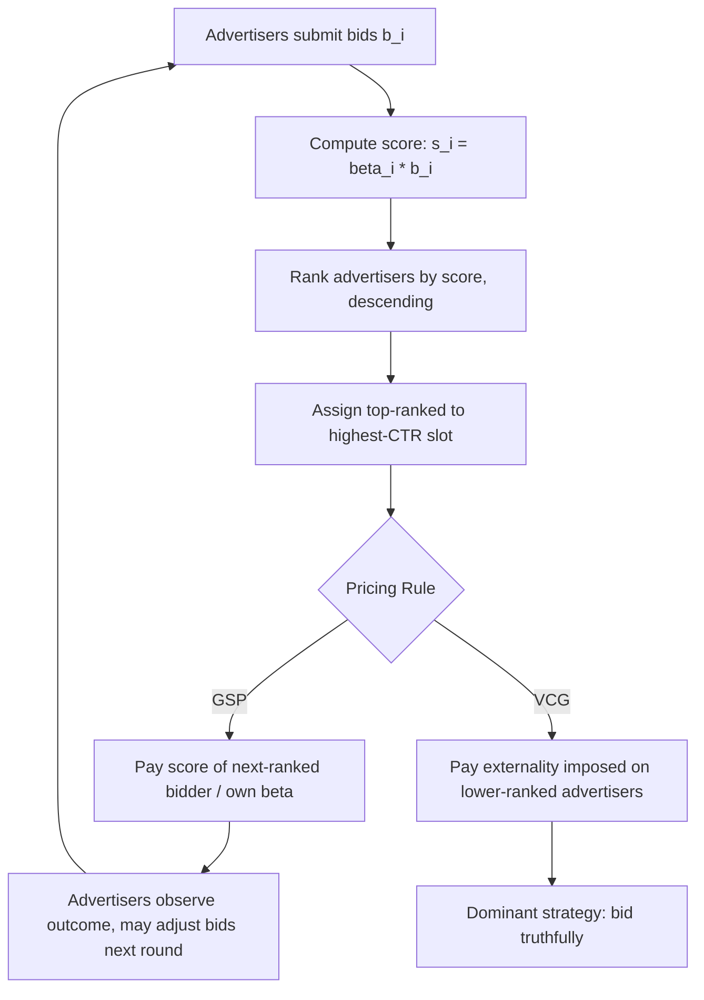

## Position and Ad Auctions

### Overview

Position auctions (also called ad auctions or slot auctions) allocate a set of ranked advertising positions—such as sponsored search results or display ad slots—among competing advertisers. Unlike single-item auctions, position auctions must simultaneously solve an **allocation problem** (which advertiser gets which slot) and a **pricing problem** (what each advertiser pays), typically under a per-click or per-impression payment model.

**Key Points**

- Positions have heterogeneous **click-through rates (CTRs)**, with higher positions generally receiving more clicks
- The dominant real-world mechanism is the **Generalized Second-Price (GSP)** auction, used historically by Google AdWords and Yahoo! Search Marketing
- GSP is *not* incentive compatible in general, unlike the Vickrey-Clarke-Groves (VCG) mechanism
- Position auctions run continuously at massive scale, requiring quality-adjusted scoring beyond raw bids

### The Position Auction Model

**Setup:**

- $n$ advertisers compete for $k$ ad slots (positions), typically $k < n$
- Slot $j$ has a click-through rate $\alpha_j$, with $\alpha_1 > \alpha_2 > \cdots > \alpha_k > 0$ (position 1 receives the most clicks)
- Advertiser $i$ has a private value-per-click $v_i$
- If advertiser $i$ is assigned to slot $j$, their expected utility (assuming a per-click payment $p_j$) is $\alpha_j(v_i - p_j)$

**Separable CTR assumption:** The click-through rate of an ad in slot $j$ is the product of a slot effect $\alpha_j$ and an advertiser/ad effect $\beta_i$ (e.g., ad quality or relevance), so $\text{CTR}_{ij} = \alpha_j \beta_i$. This simplifying assumption underlies most classical theoretical treatments, though real systems use richer, non-separable click models.

### Generalized Second-Price (GSP) Auction

GSP is the standard mechanism used in sponsored search.

**Allocation rule:** Advertisers are ranked by **score** $s_i = \beta_i b_i$ (bid multiplied by a quality/relevance factor), and assigned to slots in decreasing order of score: the highest-scoring advertiser gets slot 1, the second-highest gets slot 2, and so on.

**Payment rule:** Each winner pays a price per click just sufficient to beat the next-highest bidder's score, adjusted for their own quality factor:

$$p_j = \frac{s_{j+1}}{\beta_j} = \frac{\beta_{j+1} b_{j+1}}{\beta_j}$$

where $b_{j+1}$ is the bid of the advertiser ranked just below slot $j$.

**Why "generalized" second-price:** For a single slot ($k=1$), GSP reduces exactly to a standard second-price (Vickrey) auction. With multiple slots, GSP generalizes this rule position-by-position, but this generalization breaks the strategyproofness property that holds for the single-item case.

**[Unverified]** Historical implementation details (exact quality-score formulas, minimum bid thresholds, reserve price mechanics) differ across ad platforms and are proprietary/have changed over time; the model above reflects the standard academic abstraction used in auction theory literature (Edelman, Ostrovsky, Schwarz 2007; Varian 2007).

### Why GSP Is Not Incentive Compatible

Unlike VCG, GSP does not make truthful bidding a dominant strategy. A classic example illustrates this:

Suppose 2 slots with CTRs $\alpha_1 = 10$, $\alpha_2 = 4$, and 3 advertisers with values $v_1 = 10$, $v_2 = 4$, $v_3 = 2$ (assume $\beta_i = 1$ for all, i.e., no quality adjustment).

If all bid truthfully ($b_i = v_i$):

- Advertiser 1 gets slot 1, pays $b_2 = 4$ per click → utility $= 10(10-4) = 60$
- Advertiser 2 gets slot 2, pays $b_3 = 2$ per click → utility $= 4(4-2) = 8$

If Advertiser 1 instead **shades their bid** down to just above $b_2$ (e.g., $b_1 = 4.01$), they might still win slot 1 at a much lower price, or in some parameterizations, deviating bids can shift utilities in ways that make truthful bidding suboptimal. **[Inference]** The core intuition validated in the literature is that because the price advertiser $i$ pays depends on the bid of the advertiser *below* them (not their own bid, as in VCG-style externality pricing), an advertiser's optimal bid depends on competitors' bids in complex ways—destroying dominant-strategy truthfulness.

### Equilibrium Analysis: Locally Envy-Free Equilibrium

Since GSP is not dominant-strategy incentive compatible, the literature analyzes its **equilibrium** behavior instead, particularly the concept of **locally envy-free equilibrium (LEFE)**, introduced by Edelman, Ostrovsky, and Schwarz (2007) and independently as a related "Symmetric Nash Equilibrium" concept by Varian (2007).

**Definition:** A bid profile is locally envy-free if no advertiser would prefer to swap places (and the associated payment) with the advertiser in the position immediately above or below them.

Formally, advertiser $i$ in slot $j$ does not envy the advertiser in slot $j-1$ if:

$$\alpha_j(v_i - p_j) \geq \alpha_{j-1}(v_i - p_{j-1})$$

**Key result:** The revenue of GSP under the locally envy-free equilibrium is shown to be **at least as much as** the revenue of the dominant-strategy equilibrium of VCG applied to the same setting, and under certain conditions equals the VCG revenue. This result helped justify GSP's practical adoption despite lacking full incentive compatibility—advertisers' bid-shading behavior in equilibrium still yields competitive, often higher, revenue relative to a truthful mechanism.

### VCG for Position Auctions

Applying VCG to the position auction setting yields the theoretically "gold standard" incentive-compatible mechanism.

**Allocation:** Same as GSP — rank by score $\beta_i b_i$, assign in decreasing order.

**VCG Payment:** Advertiser $i$ in slot $j$ pays based on the externality imposed on lower-ranked advertisers:

$$p_j^{VCG} = \frac{1}{\alpha_j}\sum_{l=j}^{k} (\alpha_l - \alpha_{l+1}) v_{l+1}$$

(with $\alpha_{k+1} = 0$), where $v_{l+1}$ denotes the value of the advertiser who would occupy slot $l+1$ if $i$ were removed. Intuitively, $i$ compensates each lower-ranked advertiser for the reduction in clicks they suffer because $i$ occupies a higher slot.

**Trade-off:** VCG guarantees truthful bidding as a dominant strategy, but real ad platforms have historically favored GSP for reasons including simplicity of the pricing rule (directly tied to the next bid, i.e., "pay what beats the bidder below you"), advertiser familiarity, and comparable or superior realized revenue at equilibrium.

### Quality Score and Ad Rank

Modern ad auction systems (**[Inference]** based on publicly disclosed platform documentation such as Google Ads' Ad Rank formula) incorporate a **quality score** multiplier that adjusts raw bids:

$$\text{Ad Rank} = \text{Bid} \times \text{Quality Score} \times (\text{other signals: expected CTR, ad relevance, landing page experience})$$

This serves two purposes:

- **Efficiency:** promotes ads more likely to be clicked/relevant, improving user experience and long-run platform value
- **Revenue:** can extract more value from high-quality, high-relevance advertisers even at lower nominal bids

The formal position auction models above treat $\beta_i$ as this quality multiplier, integrating cleanly into both the GSP and VCG frameworks.

### Reserve Prices and Additional Mechanism Features

- **Reserve prices:** minimum bid (or minimum Ad Rank) thresholds below which an advertiser cannot win a slot, used both for revenue extraction and to filter low-quality ads
- **Budget constraints:** advertisers typically specify daily/campaign budgets, requiring the auction system to run repeated allocations (pacing algorithms) rather than a single static auction
- **First-price vs. second-price variants:** Since 2019, several major ad exchanges (in **real-time bidding / programmatic display**, distinct from classical sponsored search) have shifted from second-price to **first-price auctions** for header bidding and exchange-level transactions, motivated by transparency and reduced complexity across multiple simultaneous exchanges. **[Unverified]** Specific platform-by-platform timelines and current auction-type mixes change frequently and should be verified against current platform documentation for any given exchange.

### Worked Numerical Example

3 advertisers, 2 slots, $\alpha_1 = 200$ clicks/day, $\alpha_2 = 100$ clicks/day. Assume $\beta_i = 1$ (no quality adjustment) for simplicity.

| Advertiser | True Value $v_i$ | Bid $b_i$ |
| --- | --- | --- |
| A | $5.00 | $5.00 |
| B | $3.00 | $3.00 |
| C | $1.50 | $1.50 |

**GSP allocation:** A → slot 1, B → slot 2 (C wins nothing)

**GSP payments:**

- A pays $p_1 = b_2 = \$3.00$ per click
- B pays $p_2 = b_3 = \$1.50$ per click

**Revenue (GSP):** $200(3.00) + 100(1.50) = 600 + 150 = \$750$/day

**VCG payments:**

- A's payment: $\frac{1}{200}\left[(200-100)(3.00) + (100-0)(1.50)\right] = \frac{1}{200}[300 + 150] = \$2.25$ per click
- B's payment: $\frac{1}{100}\left[(100-0)(1.50)\right] = \$1.50$ per click

**Revenue (VCG):** $200(2.25) + 100(1.50) = 450 + 150 = \$600$/day

This example illustrates that **truthful-bid GSP revenue can exceed VCG revenue** in this instance — though this comparison is only meaningful once accounting for the fact that GSP bidders would not bid truthfully in equilibrium; the LEFE revenue-ranking result compares *equilibrium* GSP revenue to VCG's dominant-strategy revenue, not naively truthful GSP bids to VCG.

### Diagram: Position Auction Allocation Flow

### Slot CTR Decay Illustration (svg_diagram)

<svg xmlns="http://www.w3.org/2000/svg" viewBox="0 0 480 240">
<text x="240" y="22" font-size="16" text-anchor="middle" font-weight="bold">Click-Through Rate by Slot Position (svg_diagram)</text>
<line x1="50" y1="200" x2="440" y2="200" stroke="black" stroke-width="1.5" />
<line x1="50" y1="200" x2="50" y2="40" stroke="black" stroke-width="1.5" />
<rect x="70" y="60" width="50" height="140" fill="#4A90D9" />
<rect x="150" y="100" width="50" height="100" fill="#5AA0D9" />
<rect x="230" y="130" width="50" height="70" fill="#6AB0D9" />
<rect x="310" y="155" width="50" height="45" fill="#7AC0D9" />
<rect x="390" y="175" width="40" height="25" fill="#8AD0D9" />
<text x="95" y="215" font-size="12" text-anchor="middle">Slot 1</text>
<text x="175" y="215" font-size="12" text-anchor="middle">Slot 2</text>
<text x="255" y="215" font-size="12" text-anchor="middle">Slot 3</text>
<text x="335" y="215" font-size="12" text-anchor="middle">Slot 4</text>
<text x="410" y="215" font-size="12" text-anchor="middle">Slot 5</text>
<text x="20" y="120" font-size="11" text-anchor="middle" transform="rotate(-90 20 120)">CTR</text>
</svg>

### Applications and Extensions

- **Sponsored search:** the canonical application (Google, Bing, historically Yahoo!)
- **Real-time bidding (RTB) / programmatic display:** auctions run per-impression across ad exchanges, often first-price with header bidding
- **Social media feed ads:** similar ranked-slot logic applied to feed insertion points
- **Video ad pre-roll slots:** position-like effects based on skip rates and viewer attention decay

### Open Problems and Research Directions

- **Non-separable click models:** relaxing the $\alpha_j \beta_i$ separability assumption to capture position-advertiser interaction effects (e.g., an ad's relevance may depend on surrounding ads)
- **Dynamic and repeated bidding:** modeling how advertisers learn and adapt bids across repeated auction rounds under budget constraints
- **Multi-objective ranking:** balancing advertiser revenue, user experience, and publisher/platform long-term value in the ranking score
- **Auto-bidding and algorithmic agents:** as advertisers increasingly delegate bidding to automated systems (target-CPA, target-ROAS bidding), the classical single-shot strategic bidder model requires reinterpretation

**Related Topics**

- Generalized Second-Price (GSP) vs. VCG: Formal Equilibrium Comparisons
- Vickrey-Clarke-Groves (VCG) Mechanism (general theory)
- Real-Time Bidding and Programmatic Advertising Architecture
- Envy-Free Equilibrium Concepts in Mechanism Design
- Reserve Price Optimization in Repeated Auctions
- Combinatorial Auctions (contrast: bundled vs. ranked-slot allocation)
- Auto-Bidding and Algorithmic Agents in Ad Markets