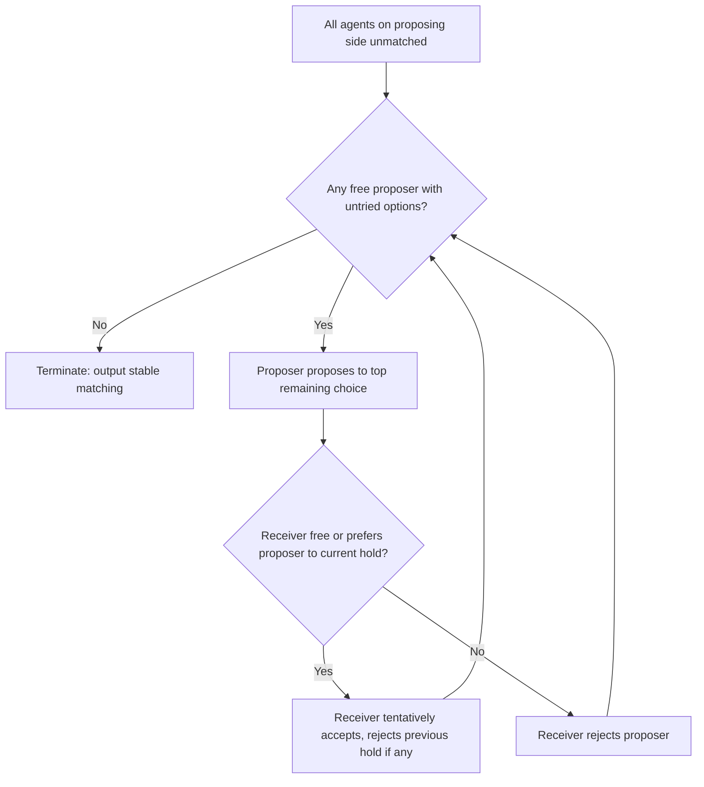

## The Stable Matching Problem


### Overview

The stable matching problem asks how to pair agents from two (or one) sides of a market such that no pair of agents would both prefer to be matched to each other over their assigned partners. Introduced by David Gale and Lloyd Shapley in 1962, the problem and its solution—the **Gale-Shapley deferred acceptance algorithm**—form the foundation of modern matching theory and market design, underlying real-world systems such as medical residency matching (NRMP), school choice programs, and kidney exchange.

**Key Points**

- A matching is **stable** if it contains no **blocking pair**: two agents who prefer each other to their current partners
- The Gale-Shapley algorithm always produces a stable matching in $O(n^2)$ time for markets of size $n$
- Stable matchings are generally **not unique**; the algorithm's proposing side always receives its **optimal stable matching**
- Lloyd Shapley (with Alvin Roth) won the 2012 Nobel Memorial Prize in Economic Sciences for this line of work and its applications

### The Stable Marriage Problem (One-to-One Matching)

**Setup:** Two disjoint sets of agents, $M = \{m_1, \ldots, m_n\}$ (traditionally "men") and $W = \{w_1, \ldots, w_n\}$ (traditionally "women"), of equal size $n$. Each $m_i$ has a strict preference ordering (ranking) over all women, and each $w_j$ has a strict preference ordering over all men.

**Matching:** A bijection $\mu: M \to W$ pairing every man with exactly one woman and vice versa.

**Blocking pair:** A pair $(m, w)$ such that $m \neq \mu(w)$, but $m$ prefers $w$ to $\mu(m)$, **and** $w$ prefers $m$ to $\mu(w)$.

$$\text{Blocking pair: } w \succ_m \mu(m) \;\text{ and }\; m \succ_w \mu(w)$$

**Stable matching:** A matching with no blocking pairs. If a blocking pair exists, both members have an incentive to abandon their assigned partners and match with each other instead, so the matching would unravel.

### The Gale-Shapley Deferred Acceptance Algorithm

**Man-proposing version:**

1. Each unmatched man proposes to the highest-ranked woman on his list to whom he has not yet proposed
2. Each woman receiving proposals tentatively holds the proposal from her most-preferred proposer (among current and any held proposal) and rejects all others
3. Rejected men cross off the woman who rejected them and propose to their next choice
4. Repeat until no man has a woman left to propose to (all are matched or have exhausted their list)
5. Tentative matches become final

**Pseudocode:**



```
Initialize all m in M and w in W as free
while some man m is free and has not proposed to every woman:
    w = m's highest-ranked woman not yet proposed to
    if w is free:
        engage(m, w)
    else if w prefers m to her current partner m':
        break engagement(m', w)
        engage(m, w)
    else:
        w rejects m
return current matching
```

### Correctness: Termination, Feasibility, and Stability

**Termination:** Each man proposes to each woman at most once, so the total number of proposals is bounded by $n^2$, guaranteeing termination.

**Feasibility (all agents matched):** [Proof sketch] Suppose the algorithm terminates with man $m$ unmatched. Then $m$ must have proposed to and been rejected by every woman, meaning every woman is engaged (since a woman, once engaged, never becomes free — she only trades up). This means all $n$ women are matched, so all $n$ men must be matched too (equal set sizes), contradicting $m$ being unmatched.

**Stability:** [Proof sketch] Suppose $(m, w)$ is a blocking pair for the output matching $\mu$: $m$ prefers $w$ to $\mu(m)$, and $w$ prefers $m$ to $\mu(w)$. Since $m$ prefers $w$ to his final match, he must have proposed to $w$ at some point before proposing to (and being accepted by) $\mu(m)$. Since $w$ rejected him at that time (or later replaced him), she must have done so in favor of someone she preferred over $m$ at that time—and by the property that women's held partners only improve over the course of the algorithm, $w$'s final partner $\mu(w)$ is preferred by $w$ to $m$. This contradicts the assumption that $w$ prefers $m$ to $\mu(w)$. Hence no blocking pair can exist.

### Optimality: Proposer-Optimal and Receiver-Pessimal

A stable matching $\mu$ is **man-optimal** if every man is weakly better off under $\mu$ than under any other stable matching. Formally, $w = \mu(m)$ is the best partner $m$ could achieve in *any* stable matching, for every $m$.

**Theorem (Gale-Shapley 1962):** The man-proposing deferred acceptance algorithm produces the **unique man-optimal stable matching**, which is simultaneously the **woman-pessimal** stable matching (every woman gets her worst partner among all stable matchings).

**[Inference]** This asymmetry is the central strategic insight of the algorithm: the side that proposes achieves weakly better outcomes than the side that merely responds, which is why the choice of which side proposes has significant real-world distributive consequences (e.g., debates over hospital-proposing vs. resident-proposing versions of medical match algorithms).

### Multiplicity of Stable Matchings

Stable matchings are generally not unique. A market can admit many stable matchings, forming a **lattice structure** under the partial order "all men weakly prefer $\mu$ to $\mu'$."

**Example:**

|  | $w_1$ pref | $w_2$ pref |
| --- | --- | --- |
| $m_1$ | $w_1 \succ w_2$ |  |
| $m_2$ | $w_1 \succ w_2$ |  |

|  | $m_1$ pref | $m_2$ pref |
| --- | --- | --- |
| $w_1$ | $m_2 \succ m_1$ |  |
| $w_2$ | $m_2 \succ m_1$ |  |

Both $\mu_1 = \{(m_1,w_1),(m_2,w_2)\}$ and $\mu_2 = \{(m_1,w_2),(m_2,w_1)\}$ can be stable depending on exact preference specifications; in markets with such structure, the man-proposing algorithm yields the matching best for men, while the woman-proposing algorithm yields the matching best for women.

**Rural Hospitals Theorem:** In many-to-one matching (see below), the set of agents left unmatched, and the number of positions filled at each institution, is the *same across all stable matchings* — even though who exactly is unmatched can differ.

### College Admissions / Hospital-Resident Problem (Many-to-One Matching)

A generalization where one side has **capacities** $q_c > 1$ (e.g., hospitals have multiple residency slots, colleges admit multiple students).

**Setup:** Students $S$ each rank colleges; colleges $C$ each rank students and have quota $q_c$.

**Stability redefined:** A matching is stable if there is no student-college blocking pair *and* no college can improve by displacing an admitted student for one it prefers who wants in.

**Deferred Acceptance (student-proposing):**

1. Each unmatched student applies to their top remaining choice
2. Each college holds its $q_c$ most-preferred applicants among current and new applicants, rejecting the rest
3. Repeat until no student is rejected/has remaining options
4. Finalize holds

**[Inference]** This is the algorithm (in a hospital-proposing variant) underlying the U.S. National Resident Matching Program (NRMP), redesigned in the early 1990s by Alvin Roth after the original algorithm was found to have undesirable strategic properties; the redesign switched proposing roles to favor applicants.

### Strategic Properties

**Theorem (Dubins-Freedman, Roth 1982):** Under the man-proposing deferred acceptance algorithm, it is a **dominant strategy for men to report their true preferences**. However, it is *not* a dominant strategy for women — women can sometimes benefit by misreporting.

**Theorem (Roth 1982):** No stable matching mechanism can make truthful reporting a dominant strategy for **both** sides simultaneously. This impossibility result is a foundational limitation in matching market design.

**[Inference]** In practice, most large-scale deployed mechanisms are designed so that the side more vulnerable to manipulation, or the side whose truthful participation is more critical for market trust (e.g., residency applicants, students in school choice), is made the proposing side to grant them dominant-strategy truthfulness.

### Worked Example

Preferences:

| Men | Preference order |
| --- | --- |
| $m_1$ | $w_1 \succ w_2 \succ w_3$ |
| $m_2$ | $w_2 \succ w_1 \succ w_3$ |
| $m_3$ | $w_1 \succ w_2 \succ w_3$ |

| Women | Preference order |
| --- | --- |
| $w_1$ | $m_2 \succ m_1 \succ m_3$ |
| $w_2$ | $m_1 \succ m_2 \succ m_3$ |
| $w_3$ | $m_1 \succ m_2 \succ m_3$ |

**Round 1:** $m_1 \to w_1$, $m_2 \to w_2$, $m_3 \to w_1$. $w_1$ receives $\{m_1, m_3\}$, prefers $m_1$, rejects $m_3$. $w_2$ receives $\{m_2\}$, holds.

**Round 2:** $m_3 \to w_2$ (next choice). $w_2$ now has $\{m_2, m_3\}$, prefers $m_2$, rejects $m_3$.

**Round 3:** $m_3 \to w_3$ (last choice). $w_3$ accepts (only proposal).

**Final matching:** $(m_1, w_1)$, $(m_2, w_2)$, $(m_3, w_3)$ — stable, and man-optimal since every man received his highest feasible choice given competition.

### Diagram: Deferred Acceptance Algorithm Flow



### Preference Lattice Illustration (svg_diagram)

<svg xmlns="http://www.w3.org/2000/svg" viewBox="0 0 460 260">
<text x="230" y="24" font-size="16" text-anchor="middle" font-weight="bold">Stable Matching Lattice (svg_diagram)</text>
<circle cx="230" cy="60" r="8" fill="#4A90D9" />
<text x="230" y="45" font-size="12" text-anchor="middle">Man-Optimal</text>
<line x1="230" y1="68" x2="150" y2="130" stroke="black" />
<line x1="230" y1="68" x2="310" y2="130" stroke="black" />
<circle cx="150" cy="130" r="8" fill="#6AB0D9" />
<circle cx="310" cy="130" r="8" fill="#6AB0D9" />
<text x="150" y="150" font-size="11" text-anchor="middle">Intermediate A</text>
<text x="310" y="150" font-size="11" text-anchor="middle">Intermediate B</text>
<line x1="150" y1="138" x2="230" y2="200" stroke="black" />
<line x1="310" y1="138" x2="230" y2="200" stroke="black" />
<circle cx="230" cy="200" r="8" fill="#8AD0D9" />
<text x="230" y="225" font-size="12" text-anchor="middle">Woman-Optimal</text>
<text x="230" y="245" font-size="10" text-anchor="middle" font-style="italic">Higher = better for men, lower = better for women</text>
</svg>

### Applications

- **Medical residency matching:** NRMP in the US, and analogous systems internationally
- **School choice:** Boston, New York City, and other public school assignment systems (adapted with priorities instead of strict preferences)
- **Kidney exchange:** extended to more complex cyclic/chain matching (related but distinct from bipartite stable matching)
- **College admissions**, **labor markets for new economists (job market matching)**, and **online dating/matchmaking platforms** (informally inspired)

### Extensions and Related Concepts

- **Incomplete preference lists / unacceptability:** agents may prefer remaining unmatched to some partners
- **Ties in preferences:** stability definitions and algorithms extend to weak preference orders, though computational complexity increases (finding certain optimal stable matchings with ties is NP-hard)
- **Many-to-many matching:** both sides have capacities (e.g., firms and workers with multiple positions/jobs)
- **Matching with contracts:** generalizes matching to include contract terms (wages, hours) alongside the pairing itself (Hatfield-Milgrom framework)
- **Stable roommate problem:** the one-sided analogue (single set of agents matched among themselves) which, unlike two-sided matching, **may have no stable matching at all**

### Open Problems and Research Directions

- Computational complexity of optimal matchings under preferences with ties and incomplete lists
- Mechanism design for matching markets with **distributional constraints** (e.g., regional caps in medical matching)
- Dynamic and online matching where agents arrive over time
- Fairness and diversity objectives in school choice mechanism design

**Related Topics**

- Deferred Acceptance Algorithm: Complexity and Variants
- College Admissions / Hospital-Resident Problem in Depth
- Roth-Peranson Algorithm and the NRMP Redesign
- Strategy-Proofness and the Roth Impossibility Theorem
- Stable Roommate Problem
- Matching with Contracts (Hatfield-Milgrom Framework)
- School Choice Mechanisms (Boston Mechanism vs. Deferred Acceptance)
- Kidney Exchange and Cyclic Matching Markets