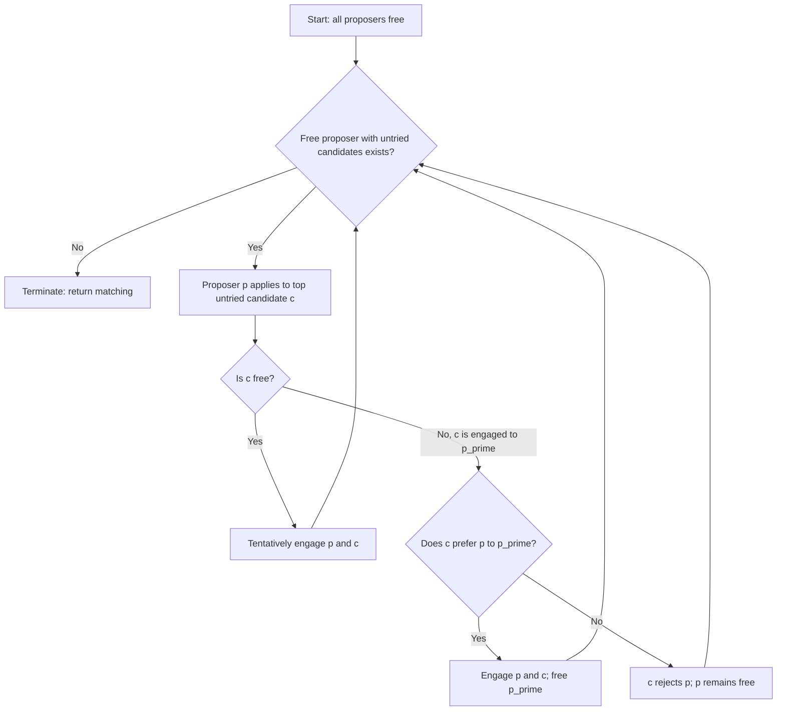

## The Gale-Shapley Algorithm

### Overview

The Gale-Shapley algorithm, published by David Gale and Lloyd Shapley in their 1962 paper "College Admissions and the Stability of Marriage," is a **deferred acceptance procedure** that constructively solves the stable matching problem. It guarantees a stable matching exists for any set of strict preference lists and provides an efficient, implementable method for computing one — making it one of the most influential algorithmic results in economics and computer science.

**Key Points**

- Runs in $O(n^2)$ time for a market of $n$ agents per side
- Produces a **stable** matching: guaranteed to contain no blocking pairs
- The proposing side achieves its **optimal** stable matching; the receiving side achieves its **pessimal** stable matching
- Forms the algorithmic basis for real-world systems including the National Resident Matching Program (NRMP) and numerous school choice systems

### Algorithm Specification

**Input:** Two disjoint sets $M$ and $W$, each of size $n$, with each agent holding a strict, complete preference ranking over all agents on the other side.

**Output:** A perfect matching $\mu: M \to W$ that is stable.

**Procedure (man-proposing version):**



```
function GALE-SHAPLEY(M, W, preferences):
    initialize all m in M as free, all w in W as free
    initialize each m's "next proposal index" to point at top of m's list

    while there exists a free man m who has not proposed to every woman:
        w := next woman on m's preference list to whom m has not yet proposed
        mark that m has proposed to w

        if w is free:
            engage(m, w)
        else:
            m' := w's current partner
            if w prefers m to m':
                free(m')
                engage(m, w)
            else:
                // w rejects m; m remains free
                pass

    return the current matching as final
```

Each proposal is made at most once per (man, woman) pair, and each woman, once engaged, is engaged to a weakly-improving sequence of partners over time (she only trades up, never down).

### Step-by-Step Trace

Consider the preference lists:

| Man | Preferences |
| --- | --- |
| $m_1$ | $w_2 \succ w_1 \succ w_3$ |
| $m_2$ | $w_1 \succ w_2 \succ w_3$ |
| $m_3$ | $w_1 \succ w_3 \succ w_2$ |

| Woman | Preferences |
| --- | --- |
| $w_1$ | $m_3 \succ m_1 \succ m_2$ |
| $w_2$ | $m_1 \succ m_3 \succ m_2$ |
| $w_3$ | $m_1 \succ m_2 \succ m_3$ |

**Round 1:**

- $m_1 \to w_2$: $w_2$ free → engage $(m_1, w_2)$
- $m_2 \to w_1$: $w_1$ free → engage $(m_2, w_1)$
- $m_3 \to w_1$: $w_1$ engaged to $m_2$; $w_1$ prefers $m_3 \succ m_2$ → break $(m_2, w_1)$, engage $(m_3, w_1)$; $m_2$ now free

**Round 2:**

- $m_2 \to w_2$ (next choice): $w_2$ engaged to $m_1$; $w_2$ prefers $m_1 \succ m_2$ → $m_2$ rejected

**Round 3:**

- $m_2 \to w_3$ (last choice): $w_3$ free → engage $(m_2, w_3)$

**Termination:** No free men remain. Final matching: $(m_1, w_2), (m_2, w_3), (m_3, w_1)$.

**Verification of stability:** Check all non-matched pairs for blocking potential — e.g., does $m_2$ prefer $w_1$ (his top choice) to $w_3$, and does $w_1$ prefer $m_2$ to her match $m_3$? $w_1$ ranks $m_3 \succ m_1 \succ m_2$, so $w_1$ does *not* prefer $m_2$ to $m_3$ — no blocking pair from this combination. Systematically checking all pairs confirms no blocking pairs exist.

### Complexity Analysis

**Time complexity:** $O(n^2)$ in the worst case. Each man can propose to each woman at most once, giving at most $n^2$ total proposals. Each proposal involves $O(1)$ comparison work (assuming preference lists are pre-processed into rank arrays for $O(1)$ preference comparisons), so total work is $O(n^2)$.

**Space complexity:** $O(n^2)$ to store preference lists/rank matrices, though this can be reduced with more compact representations for structured preferences.

**Lower bound:** [Inference] $\Omega(n^2)$ is essentially tight in the worst case for full preference lists, since in the worst case (e.g., all agents share a nearly identical preference order over the other side), a linear number of proposals per agent may be required before matching stabilizes, and each proposal requires reading/writing to the data structures.

### Correctness Proofs

**Claim 1 (Termination):** The algorithm terminates after at most $n^2$ proposals, since each man proposes to each specific woman at most once.

**Claim 2 (Produces a perfect matching):** Suppose for contradiction the algorithm terminates with some man $m$ unmatched. Then $m$ has proposed to and been rejected by all $n$ women. Rejection only occurs when a woman prefers her current partner to $m$, meaning she is engaged at the time of rejecting $m$ and remains engaged thereafter (partners only improve). Since $m$ was rejected by *every* woman, all $n$ women must be engaged at termination — engaged to $n$ distinct men (since each woman holds only one partner), which is all $n$ men. This contradicts $m$ being unmatched.

**Claim 3 (Stability):** Suppose $(m, w)$ blocks the final matching $\mu$: $m$ prefers $w$ to $\mu(m)$, and $w$ prefers $m$ to $\mu(w)$. Since $m$ prefers $w$ to his final partner, and men propose in decreasing preference order, $m$ must have proposed to $w$ at some earlier point in the algorithm (before reaching $\mu(m)$ on his list). At that point, either $w$ accepted then later left $m$ for someone she preferred more, or $w$ rejected $m$ outright in favor of someone she already preferred. In either case, $w$'s partner at that moment was preferred by $w$ to $m$. Since women's held partners weakly improve over time, $w$'s final partner $\mu(w)$ must be at least as preferred as that intermediate partner, hence preferred to $m$. This contradicts the assumption that $w$ prefers $m$ to $\mu(w)$. No blocking pair can exist.

### Optimality Theorem

**Theorem:** The man-proposing Gale-Shapley algorithm produces the matching that is **simultaneously optimal for every man** among all stable matchings, and **pessimal for every woman** among all stable matchings.

**Proof sketch:** Define a woman $w$ as "achievable" for man $m$ if some stable matching pairs them. The key lemma shows that no woman ever rejects an achievable partner during the algorithm's execution — if she did, an inductive argument on the sequence of proposals shows this would force a contradiction with the existence of the stable matching achieving that pairing. Since women never reject achievable partners, each man ends up matched to his most-preferred *achievable* woman, which is by definition his optimal outcome across all stable matchings.

**Symmetric consequence:** Because the man-optimal matching gives men their best achievable partners, it correspondingly gives women their worst achievable partners (any improvement for a woman would require some man doing worse than his optimal, but he's already receiving his best across all stable options—so no other stable matching can improve any woman's outcome without violating some man's optimality, and in fact the unique matching satisfying full-simultaneous-man-optimality is provably the woman-pessimal one).

### Proposing Side Matters: Strategic Implications

Running the algorithm with women proposing instead of men yields the **woman-optimal, man-pessimal** stable matching — generally a *different* matching from the man-proposing run, unless the stable matching happens to be unique.

**[Inference]** This is why the choice of which side "proposes" in a real-world deployment is a significant design decision with real distributive consequences, not merely an implementation detail — e.g., in medical matching, whether applicants or hospital programs are the proposing side affects which side receives systematically better outcomes when multiple stable matchings exist.

### Extension: College Admissions (Many-to-One)

The original 1962 paper actually presents the algorithm in the **college admissions** setting, where colleges have quotas $q_c \geq 1$:



```
function GALE-SHAPLEY-MANY-TO-ONE(Students, Colleges, quotas, preferences):
    initialize all students as free
    while some student s is free and has not applied to every college:
        c := s's top remaining choice
        tentatively add s to c's applicant pool
        if size(c's pool) > quota(c):
            c rejects its least-preferred applicant in the pool
    return final assignment
```

This many-to-one version retains all core properties: termination in polynomial time, guaranteed stability, and student-optimality when students are the proposing side.

### Implementation Considerations

- **Preference representation:** store each agent's preferences as a **rank array** (mapping partner ID → rank) for $O(1)$ preference comparisons, rather than repeatedly scanning ordered lists
- **Proposal queue:** maintain a queue or stack of free proposers to process; each dequeued proposer makes one proposal and is re-enqueued if rejected
- **Termination check:** track each proposer's "next index" into their preference list; a proposer with an exhausted list (in the incomplete-preference-list variant) is permanently unmatched

**[Unverified]** Specific production implementations (e.g., the software used to run the actual NRMP match, or the Roth-Peranson algorithm's engineering optimizations for couples' matching) include additional constraint-handling logic beyond the base algorithm described here, since real deployments must handle preference ties, couples applying jointly, and regional caps — architectural details that are documented in specialized market-design literature rather than the base 1962 algorithm.

### Diagram: Algorithm Execution Flow



### Rejection Chain Illustration (svg_diagram)

<svg xmlns="http://www.w3.org/2000/svg" viewBox="0 0 480 240">
<text x="240" y="22" font-size="16" text-anchor="middle" font-weight="bold">Proposal and Rejection Chain (svg_diagram)</text>
<circle cx="80" cy="120" r="28" fill="#4A90D9" />
<text x="80" y="125" font-size="13" text-anchor="middle" fill="white">m1</text>
<circle cx="220" cy="70" r="28" fill="#D9954A" />
<text x="220" y="75" font-size="13" text-anchor="middle" fill="white">w1</text>
<circle cx="220" cy="170" r="28" fill="#D9954A" />
<text x="220" y="175" font-size="13" text-anchor="middle" fill="white">w2</text>
<circle cx="360" cy="120" r="28" fill="#4A90D9" />
<text x="360" y="125" font-size="13" text-anchor="middle" fill="white">m2</text>
<line x1="105" y1="105" x2="195" y2="80" stroke="green" stroke-width="2" marker-end="url(#arrow)" />
<text x="150" y="80" font-size="10">1. propose</text>
<line x1="335" y1="130" x2="245" y2="90" stroke="red" stroke-width="2" stroke-dasharray="4" />
<text x="300" y="100" font-size="10">2. displaces m1</text>
<line x1="105" y1="135" x2="195" y2="165" stroke="green" stroke-width="2" />
<text x="150" y="165" font-size="10">3. m1 proposes to w2</text>
</svg>

### Comparison: Man-Proposing vs. Woman-Proposing

| Aspect | Man-Proposing | Woman-Proposing |
| --- | --- | --- |
| Optimal side | Men (best achievable partner) | Women (best achievable partner) |
| Pessimal side | Women (worst achievable partner) | Men (worst achievable partner) |
| Time complexity | $O(n^2)$ | $O(n^2)$ |
| Truthfulness | Dominant strategy for men | Dominant strategy for women |
| Stability guarantee | Yes | Yes |

### Applications

- **NRMP (National Resident Matching Program):** matches medical residency applicants to hospital programs, using a hospital-proposing variant (Roth-Peranson algorithm) with extensions for couples
- **School choice systems:** New York City and Boston public school assignment (adapted with priorities replacing strict preferences on the school side)
- **College admissions systems** in various countries
- **Content/ad matching platforms:** [Speculation] some large-scale matching-based recommendation systems draw conceptual inspiration from deferred acceptance principles, though production systems typically use different optimization objectives (e.g., relevance scoring) rather than literal preference-list stability

### Limitations and Extensions

- **Requires strict, complete preference lists** in the base version; extensions handle ties (weak preferences) and incomplete lists (allowing agents to be unmatched rather than paired with an unacceptable partner)
- **Two-sided only:** the algorithm does not directly apply to one-sided matching (see the Stable Roommate Problem, which may have no stable solution at all)
- **Static, one-shot:** the base algorithm assumes preferences are known and fixed in advance; dynamic/online matching with arrivals over time requires different algorithmic techniques

**Related Topics**

- The Stable Matching Problem (formal definitions and theory)
- Roth-Peranson Algorithm and Couples Matching in the NRMP
- Deferred Acceptance with Ties and Incomplete Preference Lists
- College Admissions / Hospital-Resident Problem
- Strategy-Proofness of Deferred Acceptance Mechanisms
- Stable Roommate Problem (one-sided matching)
- Lattice Structure of the Set of Stable Matchings