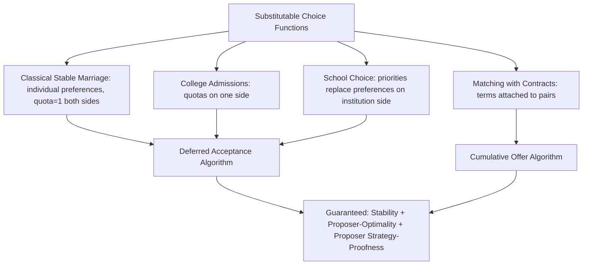

## Deferred Acceptance Mechanisms


### Overview

Deferred acceptance (DA) refers to the general class of matching mechanisms built on the Gale-Shapley proposal-and-tentative-hold procedure, extended and adapted across a wide range of market design settings beyond the original stable marriage problem. The defining feature is that acceptances are **provisional**: an agent holds the best offer received so far but remains open to displacement by a superior offer, with finality only occurring at termination. This framework has become the dominant paradigm in applied market design for two-sided and priority-based matching markets.

**Key Points**

- Generalizes beyond one-to-one matching to many-to-one (college admissions, school choice), many-to-many, and matching with contracts
- Guarantees **stability** (no blocking pairs/coalitions) under quite general conditions on preferences
- The proposing side is (weakly) strategy-proof; DA is the unique mechanism achieving stability with strategy-proofness for the proposing side in broad classes of markets
- Underpins real-world deployments: NRMP (medical residency), NYC and Boston school choice, numerous international matching markets

### Core Structural Property: Substitutability

DA's guarantees extend robustly to settings where preferences (or choice functions) satisfy a generalized condition called **substitutability**, which replaces the "strict preference over individuals" assumption of the classical stable marriage problem.

**Definition (substitutable preferences):** A college's (or firm's) choice function $C(\cdot)$ over sets of applicants is substitutable if, whenever an applicant $a$ is chosen from a larger set of available applicants $S$, $a$ is also chosen from any subset $S' \subseteq S$ that still contains $a$:

$$a \in C(S) \text{ and } a \in S' \subseteq S \implies a \in C(S')$$

Intuitively: no applicant becomes *more* attractive to a college because some other applicant became unavailable — applicants are not complements to each other from the college's perspective.

**Why substitutability matters:** [Inference] It is the precise structural condition identified in the mechanism design literature (Kelso-Crawford 1982; Roth 1984; Hatfield-Milgrom 2005) under which the generalized DA algorithm is guaranteed to terminate, produce a stable outcome, and preserve the proposer-optimality/strategy-proofness results — without it, stable outcomes may fail to exist at all.

### Generalized Deferred Acceptance Procedure

**Abstract algorithm (applicant-proposing form):**



```
function GENERALIZED-DA(Applicants, Institutions, choice_functions):
    initialize all applicants as unassigned
    initialize each institution's tentative_pool = empty

    while some applicant a is unassigned and has untried institutions:
        i := a's most-preferred institution not yet applied to (and rejected by)
        add a to i's applicant_pool
        i's tentative_pool := choice_function_i(applicant_pool)
        every applicant in applicant_pool \ tentative_pool is rejected by i

    return final tentative_pool assignments as the matching
```

This generalizes the pairwise "engage/reject" logic of classical Gale-Shapley into an arbitrary **choice function** evaluation at each institution, allowing institutions to select subsets according to complex internal rules (priorities, quotas, diversity constraints) rather than simple rank-ordered lists.

### Key Theorems in the General Framework

**Existence and Stability (Roth 1984, generalizing Gale-Shapley 1962):** If all institutions' choice functions are substitutable, the generalized DA algorithm terminates and produces a stable matching.

**Applicant-Optimality:** Among all stable matchings, the applicant-proposing DA outcome is weakly preferred by every applicant to any other stable matching (a direct generalization of the man-optimal theorem).

**Strategy-Proofness for Proposers (Dubins-Freedman 1981; Roth 1982):** Reporting true preferences is a dominant strategy for every agent on the proposing side, regardless of what others report or how institutions' choice functions behave (so long as institutions truthfully apply their stated choice functions).

**Impossibility for the Responding Side (Roth 1982):** No stable mechanism can be strategy-proof for both sides simultaneously; the responding side (e.g., colleges/hospitals) may have incentives to misrepresent preferences or capacities under some circumstances.

**Rural Hospitals Theorem (Roth 1986):** Across all stable matchings in a many-to-one market, the same set of institutions fails to fill its quota, and each institution that is undersubscribed in one stable matching is matched with the *exact same set* of applicants in every stable matching. This has direct policy relevance: hospitals in undersupplied rural areas cannot fix their shortfall merely by switching to a different stable matching mechanism.

### Matching with Contracts (Hatfield-Milgrom Framework)

A major generalization: agents are matched not just to partners but to **contracts** specifying additional terms (wages, hours, task assignments). This unifies stable matching theory with classical models of labor markets and even certain auction formats.

**Setup:** A set of contracts $X$, each specifying a worker-firm pair plus terms. Firms have choice functions over sets of contracts; workers have preferences over individual contracts (including the option of no contract).

**Cumulative offer algorithm:** A DA-style procedure where workers propose contracts in preference order, and firms hold their most-preferred **substitutable** subset of contracts offered to date, permanently rejecting others.

**Theorem (Hatfield-Milgrom 2005):** If firms' choice functions satisfy substitutability, the cumulative offer algorithm produces a stable allocation of contracts, and this framework nests both two-sided matching *and* certain auction models (e.g., the Kelso-Crawford labor market model, and package auction models under substitutable valuations) as special cases.

**[Inference]** This unification was significant because it showed that matching theory and auction theory, previously studied largely as separate fields, share a common mathematical core when valuations/choice functions satisfy substitutability — a connection that has since motivated cross-pollination between matching-based and auction-based market designs (e.g., in spectrum and school-choice hybrid designs).

### School Choice: A Priority-Based Special Case

In school choice, "preferences" on the school side are typically **priorities** (determined by policy: sibling attendance, walk zones, test scores) rather than genuine strategic preferences, since schools do not have independent interests in particular students the way firms value particular workers.

**Student-proposing DA in school choice:**

1. Each student applies to their most-preferred school
2. Each school tentatively admits students in priority order up to capacity, rejecting the rest
3. Rejected students apply to their next choice
4. Repeat until stable

**Abdulkadiroğlu-Sönmez (2003):** Formalized the application of DA to school choice, showing it dominates the previously common **Boston mechanism** (an immediate-acceptance, non-deferred mechanism) on strategy-proofness grounds — in the Boston mechanism, families have strong incentives to strategically misrepresent preferences (ranking a "safe" school first rather than their true favorite), which DA eliminates for students.

**[Inference]** This research directly informed real policy changes; multiple large urban school districts (widely cited examples include Boston and New York City) redesigned their assignment systems around (or moved toward) deferred-acceptance-based mechanisms following this and related work, motivated by strategy-proofness and fairness considerations, though the specific mechanism variant and priority structure differs by district and has continued to evolve over time.

### Trade-off: Stability vs. Efficiency

A key tension in the DA literature: applicant-optimal stable matchings are **not** generally Pareto efficient from the applicants' perspective when priorities (rather than genuine preferences) determine institution-side rankings.

**Example intuition:** In school choice, if priorities are not meaningful preferences (schools don't inherently "want" one acceptable student over another beyond policy priority), giving up strict stability could allow trades that make some students better off without harming others. Mechanisms like **Top Trading Cycles (TTC)** achieve Pareto efficiency and strategy-proofness but sacrifice stability (some justified-envy blocking pairs may remain).

| Mechanism | Stability | Strategy-Proof (applicant side) | Pareto Efficient |
| --- | --- | --- | --- |
| Deferred Acceptance | Yes | Yes | Not generally |
| Boston (Immediate Acceptance) | No | No | Not generally |
| Top Trading Cycles | No | Yes | Yes |

### Worked Example: Many-to-One with Substitutable Priorities

3 students, 2 schools with quotas $q_A = 1$, $q_B = 2$.

Student preferences: $s_1: A \succ B$; $s_2: A \succ B$; $s_3: B \succ A$

School priorities: $A: s_2 \succ s_1 \succ s_3$; $B: s_1 \succ s_2 \succ s_3$

**Round 1:** $s_1 \to A$, $s_2 \to A$, $s_3 \to B$. School $A$ has pool $\{s_1, s_2\}$, quota 1; by priority $s_2 \succ s_1$, holds $s_2$, rejects $s_1$. School $B$ has pool $\{s_3\}$, quota 2; holds $s_3$.

**Round 2:** $s_1 \to B$ (next choice). School $B$ pool becomes $\{s_3, s_1\}$, quota 2; both fit, holds both.

**Final matching:** $A = \{s_2\}$, $B = \{s_1, s_3\}$. Stable: check that no rejected student-school pair blocks — $s_1$ prefers $A$ but $A$'s priority ranks $s_2$ above $s_1$ and $A$ is full with a higher-priority student, so no blocking pair.

### Diagram: Generalized DA Across Market Types



### Substitutability Condition Illustration (svg_diagram)

<svg xmlns="http://www.w3.org/2000/svg" viewBox="0 0 480 220">
<text x="240" y="22" font-size="15" text-anchor="middle" font-weight="bold">Substitutable vs. Complementary Choice (svg_diagram)</text>
<rect x="30" y="50" width="180" height="130" fill="none" stroke="#4A90D9" stroke-width="2" />
<text x="120" y="45" font-size="12" text-anchor="middle" font-weight="bold">Substitutable</text>
<text x="120" y="75" font-size="11" text-anchor="middle">Chosen from {a,b,c}</text>
<text x="120" y="95" font-size="11" text-anchor="middle">a still chosen from {a,b}</text>
<text x="120" y="115" font-size="11" text-anchor="middle">a still chosen from {a,c}</text>
<text x="120" y="135" font-size="11" text-anchor="middle">a still chosen from {a}</text>
<text x="120" y="160" font-size="11" text-anchor="middle" fill="green">DA guarantees hold</text>
<rect x="270" y="50" width="180" height="130" fill="none" stroke="#D9954A" stroke-width="2" />
<text x="360" y="45" font-size="12" text-anchor="middle" font-weight="bold">Complementary</text>
<text x="360" y="75" font-size="11" text-anchor="middle">a chosen only with b present</text>
<text x="360" y="95" font-size="11" text-anchor="middle">a rejected from {a} alone</text>
<text x="360" y="115" font-size="11" text-anchor="middle">a rejected from {a,c}</text>
<text x="360" y="160" font-size="11" text-anchor="middle" fill="red">Stability may fail to exist</text>
</svg>

### Implementation Considerations

- **Choice function evaluation cost:** in general settings, institutions' choice functions may be computationally expensive to evaluate (e.g., diversity-constrained school admissions), affecting per-round complexity beyond the simple $O(n^2)$ bound of classical stable marriage
- **Tie-breaking:** priorities frequently contain ties (e.g., many students share the same priority category); a **tie-breaking rule** (single lottery vs. multiple/independent lotteries per school) must be fixed before running DA, and the choice materially affects efficiency and fairness outcomes
- **Batch vs. incremental processing:** large-scale deployments (e.g., citywide school choice with tens of thousands of students) implement DA as a batch computation rather than a literal real-time proposal sequence, though the outcome is mathematically equivalent to running the sequential algorithm to completion

**[Unverified]** Exact tie-breaking policies and computational implementations differ by jurisdiction and school district and are subject to ongoing policy revision; specific current-year mechanism parameters for any given district should be verified against that district's published assignment policy documentation.

### Applications Summary

- **Medical and other labor markets:** NRMP and analogous residency/fellowship matching systems internationally
- **School choice:** numerous public school districts using DA-based assignment
- **College admissions systems** in centralized national systems (used in various countries' university admissions)
- **Labor market matching with contracts:** models of firm-worker matching incorporating wage/hour terms
- **Course allocation and auction-adjacent design:** substitutability-based results extend to combinatorial assignment problems sharing the same mathematical structure

### Open Problems and Research Directions

- Balancing stability against efficiency and diversity objectives in school choice via mechanism modifications (e.g., "stable improvement cycles")
- Dynamic and multi-period matching where preferences or capacities evolve over time
- Matching with complementary (non-substitutable) preferences, where classical DA guarantees break down and alternative solution concepts are needed
- Large-market approximation results characterizing when strategic incentives to misreport become negligible as market size grows

**Related Topics**

- The Stable Matching Problem (formal foundations)
- The Gale-Shapley Algorithm (canonical one-to-one case)
- Matching with Contracts and the Cumulative Offer Algorithm
- Top Trading Cycles and Pareto-Efficient Matching
- Boston Mechanism vs. Deferred Acceptance in School Choice
- Substitutability and Choice Function Theory
- Rural Hospitals Theorem and Policy Implications
- Kelso-Crawford Labor Market Matching Model