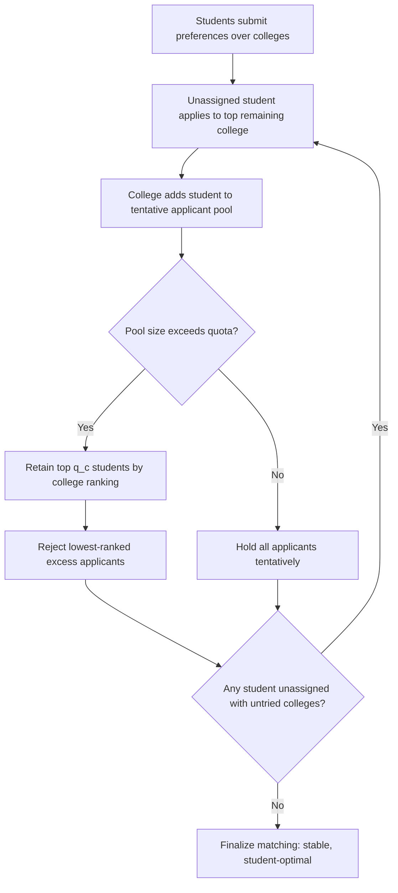

## Many-to-One Matching Markets


### Overview

Many-to-one matching markets generalize the classical one-to-one stable marriage problem to settings where agents on one side of the market — colleges, hospitals, firms — can be matched with **multiple** agents from the other side, subject to a capacity constraint (quota). This structure captures a large share of real-world matching applications, including college admissions, medical residency matching, and school choice, and requires a more careful treatment of stability, since blocking can now occur through capacity-driven displacement rather than simple pairwise preference reversal.

**Key Points**

- Formalized as the **College Admissions Problem** by Gale and Shapley (1962) in the same paper introducing stable marriage
- Each institution $c$ has a quota $q_c$ specifying the maximum number of agents it can accept
- Stability requires no blocking *individual* pair, generalizing but not fully replicating one-to-one stability
- The deferred acceptance algorithm extends naturally and preserves core existence, optimality, and strategy-proofness results under a **substitutability** condition on institution preferences

### Formal Model

**Agents:** A set of students (or workers, applicants) $S = \{s_1, \ldots, s_n\}$ and a set of colleges (or hospitals, firms) $C = \{c_1, \ldots, c_m\}$.

**Preferences:** Each student has a strict preference ordering over colleges (plus the option of remaining unmatched). Each college has a strict preference ordering (ranking) over individual students, plus a quota $q_c \geq 1$.

**Matching:** An assignment $\mu$ where each student is matched to at most one college, and each college $c$ is matched to a set of students $\mu(c)$ with $|\mu(c)| \leq q_c$.

**Individual rationality:** No agent is matched to a partner it finds unacceptable (worse than remaining unmatched).

### Defining Stability in Many-to-One Markets

A key subtlety: with quotas, stability cannot simply be "no pair prefers each other to their assignments," because a college is matched to a *set*, not an individual.

**Blocking pair:** A student-college pair $(s, c)$ blocks a matching $\mu$ if:

1. $s$ prefers $c$ to $\mu(s)$ (their current assignment, possibly unmatched), **and**
2. Either $|\mu(c)| < q_c$ (college $c$ has an open seat), **or** $c$ prefers $s$ to some student currently in $\mu(c)$

**Stable matching:** A matching with no blocking pairs and no individually irrational assignments.

This definition captures the intuition that if a student would rather be at college $c$, and college $c$ either has a free seat or would rather admit this student over one it currently has, the pairing would unravel absent regulation.

**Important distinction — pairwise vs. group stability:** The above defines stability against pairwise deviations only. A stronger notion, **group stability** (or core stability), would also rule out coalitional deviations where multiple students and a college jointly restructure their assignments. **[Inference]** In the general many-to-one setting, pairwise stability and the core can diverge under complex preference structures, but under the standard **responsive preferences** assumption described below, the two notions coincide, and this equivalence underlies most standard theoretical results.

### Responsive Preferences

Since colleges rank individual students but must ultimately compare *sets* of students (when deciding whom to admit up to quota), the standard model requires a link between individual and set preferences.

**Definition:** A college's preference over sets of students is **responsive** to its individual student ranking if, for any set $S$ and two students $s, s' \notin S$ with $|S| < q_c$:

$$S \cup \{s\} \succ_c S \cup \{s'\} \iff s \succ_c s'$$

and adding any acceptable student to a set (below quota) is preferred to not adding them. Responsiveness ensures a college's preferences over groups are fully determined by, and consistent with, its ranking of individuals — ruling out complementarities between specific student combinations (e.g., a college cannot prefer a specific *pair* of students together more than the sum of preferring each individually).

**Relation to substitutability:** Responsive preferences are a special case of the broader **substitutable preferences** condition (see Deferred Acceptance Mechanisms), which is the more general structural property needed for DA's guarantees. All responsive preferences are substitutable, but substitutability also accommodates richer choice functions (e.g., distributional/diversity constraints) that are not strictly responsive to a single ranking.

### Deferred Acceptance for Many-to-One Markets

**Student-proposing algorithm:**



```
function COLLEGE-ADMISSIONS-DA(Students, Colleges, quotas, preferences):
    initialize all students as unassigned
    initialize each college's tentative_pool = empty

    while some student s is unassigned and has untried colleges:
        c := s's most-preferred college not yet applied to (and not rejected by)
        add s to c's applicant_pool (tentative_pool + new applicant)
        if size(c's applicant_pool) > q_c:
            c retains its q_c most-preferred students from the pool (by its ranking)
            c rejects the remaining lowest-ranked applicants
        // else: c retains everyone tentatively

    return final tentative assignments as the matching
```

Each rejected student proceeds to their next-preferred college. The process terminates when no student is both unassigned and has remaining colleges to apply to.

**Correctness:** Under responsive (or more generally substitutable) college preferences, this algorithm terminates, produces a matching satisfying no blocking pairs (stable), and gives every student their most-preferred achievable college among all stable matchings (**student-optimal stable matching**).

### Worked Example

3 students, 2 colleges: $q_A = 2$, $q_B = 1$.

Student preferences: $s_1: A \succ B$; $s_2: B \succ A$; $s_3: A \succ B$

College preferences (responsive, ranking individuals): $A: s_1 \succ s_3 \succ s_2$; $B: s_2 \succ s_1 \succ s_3$

**Round 1:**

- $s_1 \to A$: pool $\{s_1\}$, quota 2, size ≤ quota → hold $s_1$
- $s_2 \to B$: pool $\{s_2\}$, quota 1, size ≤ quota → hold $s_2$
- $s_3 \to A$: pool $\{s_1, s_3\}$, quota 2, size ≤ quota → hold both

**No rejections occur.** Final matching: $A = \{s_1, s_3\}$, $B = \{s_2\}$.

**Stability check:** All students matched to their top choice — trivially stable (no student would prefer a different college to their current best option).

### The Rural Hospitals Theorem

One of the most policy-relevant results specific to many-to-one markets.

**Theorem (Roth 1986):** Across *all* stable matchings of a given college admissions market:

1. The same set of colleges are undersubscribed (fail to fill their full quota)
2. Each college that is undersubscribed in one stable matching is matched to the **exact same set** of students in every stable matching
3. The total number of students matched (and total seats filled at each college) is identical across all stable matchings

**Policy implication:** [Inference] This theorem explains a persistent real-world phenomenon in medical residency matching — hospitals in less popular locations (historically, rural or underserved areas, hence the name) that fail to fill their positions under one stable matching cannot resolve this shortfall simply by adopting a different stable mechanism or tie-breaking rule; the theorem implies the *set* of unfilled positions is essentially invariant across all stable outcomes, meaning solving such shortfalls requires non-mechanism interventions (e.g., adjusting the pool of eligible applicants, compensation, or the quotas/preferences themselves) rather than mechanism redesign alone.

### Many-to-One vs. One-to-One: Key Differences

| Property | One-to-One | Many-to-One (Responsive) |
| --- | --- | --- |
| Existence of stable matching | Guaranteed | Guaranteed (under responsiveness/substitutability) |
| DA produces stable outcome | Yes | Yes |
| Proposer-optimal stable matching exists | Yes | Yes |
| Strategy-proof for proposing side | Yes | Yes |
| Strategy-proof for receiving side | No | No (and colleges may also manipulate *quotas*) |
| Pairwise stability = Core | Yes | Yes, under responsiveness; may diverge otherwise |
| Rural Hospitals Theorem applies | N/A (quotas = 1) | Yes |

### Capacity Manipulation

A many-to-one-specific strategic concern: colleges may have an incentive to **misreport their quota** (understating capacity) to manipulate outcomes, even when they cannot misreport preferences to their advantage.

**[Inference]** This is a distinctive vulnerability absent from one-to-one markets (where "quota" is trivially fixed at 1) and has been studied as a variant strategic margin in the college admissions literature — a college might report a smaller quota than its true capacity in an effort to secure a more preferred subset of applicants under certain preference configurations, though the conditions under which this is profitable, and the magnitude of any such incentive, are studied case-by-case in the mechanism design literature rather than characterized by one simple universal rule.

### Diagram: Many-to-One DA Process



### Quota-Constrained Matching Illustration (svg_diagram)

<svg xmlns="http://www.w3.org/2000/svg" viewBox="0 0 480 240">
<text x="240" y="22" font-size="16" text-anchor="middle" font-weight="bold">College Quota Filling (svg_diagram)</text>
<rect x="60" y="50" width="140" height="150" fill="none" stroke="#4A90D9" stroke-width="2" />
<text x="130" y="45" font-size="12" text-anchor="middle" font-weight="bold">College A (q=2)</text>
<circle cx="130" cy="90" r="20" fill="#4A90D9" />
<text x="130" y="95" font-size="11" text-anchor="middle" fill="white">s1</text>
<circle cx="130" cy="140" r="20" fill="#4A90D9" />
<text x="130" y="145" font-size="11" text-anchor="middle" fill="white">s3</text>
<text x="130" y="185" font-size="10" text-anchor="middle" fill="green">Quota filled</text>
<rect x="280" y="50" width="140" height="150" fill="none" stroke="#D9954A" stroke-width="2" />
<text x="350" y="45" font-size="12" text-anchor="middle" font-weight="bold">College B (q=1)</text>
<circle cx="350" cy="90" r="20" fill="#D9954A" />
<text x="350" y="95" font-size="11" text-anchor="middle" fill="white">s2</text>
<text x="350" y="185" font-size="10" text-anchor="middle" fill="green">Quota filled</text>
</svg>

### Applications

- **National Resident Matching Program (NRMP):** hospitals (colleges) with multiple residency slots matched to individual applicants (students), using a hospital-proposing DA variant with extensions for couples applying jointly
- **College and university admissions:** centralized national admissions systems in various countries
- **School choice programs:** schools as capacity-constrained institutions, students as the proposing side, priorities in place of genuine preferences
- **Firm-worker matching:** simple many-to-one labor market models where firms hire multiple workers under responsive preferences

### Extensions Beyond Responsiveness

- **Distributional constraints:** school districts imposing diversity, socioeconomic, or geographic balance requirements on admitted cohorts — these choice functions may be substitutable but not strictly responsive to a single individual ranking
- **Regional caps:** medical matching systems imposing maximum numbers of residents per region (beyond individual hospital quotas), requiring modified DA variants to preserve stability and feasibility simultaneously
- **Couples matching:** in medical residency matching, couples submit joint preferences over pairs of hospital assignments, which breaks the standard substitutability assumption and requires specialized algorithmic handling (the Roth-Peranson algorithm) since a stable matching is not guaranteed to exist in general with couples

**[Unverified]** The precise algorithmic techniques used to handle couples and regional caps in production matching systems (heuristics for near-stable outcomes when exact stability cannot be guaranteed) are implementation-specific and documented in specialized market design literature rather than the base college admissions model.

### Open Problems and Research Directions

- Characterizing when stable matchings exist under non-responsive, non-substitutable preferences (e.g., with complementarities from diversity constraints)
- Quota manipulation incentives and mechanisms robust to capacity misreporting
- Efficient near-stable algorithms for couples matching and other complementarity-inducing extensions
- Large-market analysis of when many-to-one strategic incentives (for the receiving side) become asymptotically negligible

**Related Topics**

- The Stable Matching Problem (one-to-one foundations)
- The Gale-Shapley Algorithm
- Deferred Acceptance Mechanisms (general substitutability framework)
- Rural Hospitals Theorem in Depth
- Responsive Preferences and Choice Function Theory
- Couples Matching and the Roth-Peranson Algorithm
- School Choice with Distributional Constraints
- Matching with Contracts (Hatfield-Milgrom Framework)