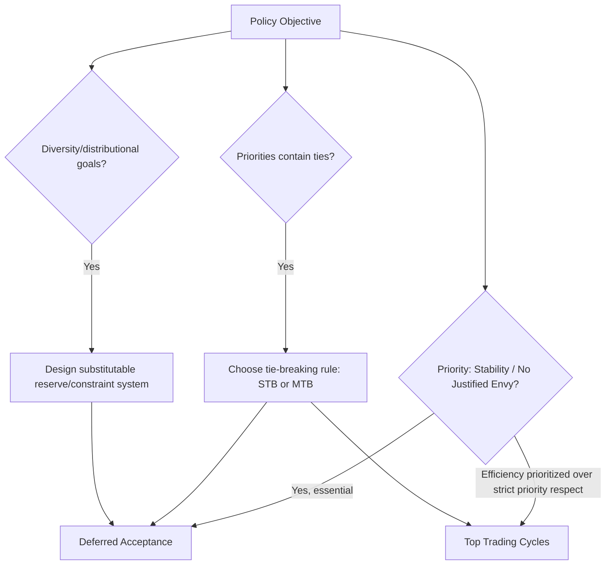

## School Choice Design

### Overview

School choice design is the applied branch of matching theory concerned with assigning students to public schools when families are permitted to express preferences over schools rather than being assigned solely by residential zoning. It combines the theoretical machinery of two-sided matching (stability, strategy-proofness, efficiency) with practical policy considerations unique to education: legally mandated priorities, capacity constraints, diversity goals, and the political economy of public sector reform.

**Key Points**

- The central design choice is which **mechanism** to use: Boston (immediate acceptance), Deferred Acceptance (Gale-Shapley), or Top Trading Cycles (TTC)
- School-side rankings are typically **priorities** set by policy (siblings, walk zones, test scores, lottery numbers) rather than genuine preferences, which shapes which efficiency and welfare concepts are meaningful
- No mechanism simultaneously achieves stability, strategy-proofness, and Pareto efficiency — every real deployment reflects an explicit trade-off among these
- Pioneered in practice by Abdulkadiroğlu and Sönmez's collaboration with Boston Public Schools (2005) and the NYC Department of Education (2003–2004)

### The School Choice Problem, Formally

**Setup:** A set of students $S$, a set of schools $C$ with quotas $q_c$, student preferences $\succ_s$ over schools (strict, or with indifference), and school **priorities** $\succeq_c$ over students (often with many ties, since priority categories are coarse).

**Key conceptual distinction from college admissions:** In the classical college admissions model, colleges are treated as strategic agents whose stated preferences reflect genuine interests. In school choice, priorities are **not** preferences in this sense — a school does not "want" a higher-priority student more in any welfare-relevant way; priority is a policy instrument, not an objective to be maximized. This distinction is what opens the door to mechanisms (like TTC) that intentionally violate stability in exchange for efficiency gains that would be illegitimate to pursue in a genuine two-sided market.

### The Boston Mechanism (Immediate Acceptance)

Historically the most common mechanism before the wave of DA-based reforms.

**Procedure:**

1. Each student applies to their first choice
2. Each school **immediately and permanently** admits applicants in priority order up to its quota; if oversubscribed, excess lower-priority applicants are rejected outright (not tentatively)
3. Rejected students apply to their second choice among schools with remaining capacity
4. The process repeats for successive choice ranks; each round's admissions are final

**Core flaw — manipulability:** Because acceptances are immediate and permanent, a student who ranks a popular school first but has low priority there risks losing access to lower-ranked but still desirable schools that fill up in earlier rounds. This creates a strong strategic incentive to rank a "safe" school (one where the student has high priority) first rather than their true favorite — the opposite of straightforward preference revelation.

**[Inference]** This vulnerability was central to the empirical and theoretical case that displaced the Boston mechanism in several major districts: sophisticated families who understood the strategic incentive could gain systematically better placements than families who reported preferences truthfully, raising equity concerns about a mechanism that effectively rewards strategic sophistication rather than genuine preference intensity.

### Deferred Acceptance for School Choice

**Procedure (student-proposing, as in the Gale-Shapley algorithm):**

1. Each unassigned student applies to their most-preferred remaining school
2. Each school holds its highest-priority applicants up to capacity, **tentatively** — rejections are provisional, not final
3. Rejected students apply to their next choice; previously-held students can be displaced by higher-priority later applicants
4. Repeat until no student is both unassigned and has schools left to try

**Guaranteed properties:**

- **Stability (no justified envy):** no student prefers another school where they have higher priority than some admitted student
- **Strategy-proofness for students:** truthful preference reporting is a dominant strategy, directly resolving the Boston mechanism's core flaw
- **Student-optimality:** among all stable matchings, DA yields the one every student weakly prefers

**Trade-off:** DA is not generally Pareto efficient when priorities are policy instruments rather than genuine preferences — some students could be made better off via mutually beneficial trades that DA's stability constraint forbids.

### Top Trading Cycles (TTC)

An alternative mechanism prioritizing efficiency over stability, adapted from the housing markets literature (Shapley-Scarf).

**Procedure (school choice adaptation):**

1. Each school points to its highest-priority student among those still in the pool; each student points to their most-preferred school among those still in the pool
2. This pointing structure necessarily contains at least one **cycle** (a sequence of students and schools pointing to each other in a loop)
3. Every student in a cycle is assigned their pointed-to school, and removed from the pool (schools' quotas are decremented; a school is removed from the pool once its quota is exhausted)
4. Repeat with the remaining students and schools until everyone is assigned

**Guaranteed properties:**

- **Pareto efficiency:** the outcome cannot be improved for any student without harming another
- **Strategy-proofness:** truthful reporting is a dominant strategy for students
- **Not stable:** TTC can produce **justified envy** — a rejected student may have higher priority at a school than someone admitted there, since TTC allows priority to be "traded away" as part of an efficiency-improving cycle

**[Inference]** TTC's departure from stability is considered more defensible in school choice than it would be in labor markets precisely because priorities are not preferences the mechanism is obligated to respect for their own sake — the same property that would be an unacceptable violation of a hospital's genuine interests in a residency match is, in school choice, simply the mechanism relaxing a policy default in service of a Pareto improvement.

### Comparison Table

| Property | Boston (Immediate Acceptance) | Deferred Acceptance | Top Trading Cycles |
| --- | --- | --- | --- |
| Stability (no justified envy) | No | Yes | No |
| Strategy-proof for students | No | Yes | Yes |
| Pareto efficient | Not generally | Not generally | Yes |
| Respects priorities strictly | Attempts to, but manipulable | Yes | Not always |
| Historical use | Widespread pre-2000s | Boston (2005–), NYC (2003–) | Adopted in some districts/contexts |

### Tie-Breaking in Priorities

Real priority structures contain extensive **ties** — many students share the same priority category (e.g., "in walk zone, no sibling") — but DA and TTC as formally defined require strict orderings. A **tie-breaking rule** converts weak priorities into a strict order, typically via a random lottery number assigned to each student.

**Single tie-breaking (STB):** One lottery number per student, applied uniformly as the tie-breaker across all schools.

**Multiple tie-breaking (MTB):** Each school draws its own independent lottery ordering over tied students.

**[Inference]** The choice between STB and MTB is not merely implementational — it has been shown in the school choice literature to affect the efficiency of the resulting DA outcome, with single tie-breaking generally associated with better efficiency properties than multiple independent lotteries, since MTB can create additional artificial conflicts between students competing for the same schools. Exact efficiency comparisons and magnitudes are context- and preference-distribution-dependent rather than universal constants.

### Distributional and Diversity Constraints

Many school choice systems layer additional policy objectives onto the base matching problem: controlled choice for racial/socioeconomic balance, set-asides for specific populations, or geographic diversity targets.

**Modeling approach:** These constraints are typically incorporated by replacing a school's simple priority-based choice function with a more complex **constrained choice function** — e.g., reserving a subset of seats for students meeting a socioeconomic criterion, or capping the share of any one priority group.

**Substitutability concerns:** Naively implemented diversity constraints can violate the **substitutability** condition required for DA's stability and strategy-proofness guarantees (see Deferred Acceptance Mechanisms), since admitting one student can suddenly make another student's admission *less* likely in a way that depends on group composition rather than individual merit alone. Specialized choice function designs (e.g., **reserve systems** with careful ordering of how reserves are processed) have been developed in the market design literature to restore substitutability while achieving diversity goals.

### Worked Example: DA vs. TTC Divergence

2 students, 2 schools, $q_A = q_B = 1$.

Priorities: $A: s_2 \succ s_1$; $B: s_1 \succ s_2$

Preferences: $s_1: A \succ B$; $s_2: A \succ B$

**Deferred Acceptance:** $s_1 \to A$, $s_2 \to A$. School $A$ holds higher-priority $s_2$, rejects $s_1$. $s_1 \to B$ (next choice), accepted. Final: $A=\{s_2\}$, $B=\{s_1\}$.

**Check stability:** $s_1$ prefers $A$ to $B$, but $A$ has higher-priority $s_2$ already assigned there — no blocking pair (respects $A$'s priority order). Stable, but is it efficient? Both students got the school where they weren't the top priority-holder for their favorite option in different ways—in this small example DA's outcome is actually also Pareto efficient here, illustrating that divergence from TTC requires slightly richer preference/priority combinations to manifest.

### Diagram: School Choice Mechanism Selection

### Justified Envy Illustration (svg_diagram)

<svg xmlns="http://www.w3.org/2000/svg" viewBox="0 0 480 220">
<text x="240" y="22" font-size="15" text-anchor="middle" font-weight="bold">Justified Envy Under TTC (svg_diagram)</text>
<rect x="40" y="50" width="150" height="120" fill="none" stroke="#4A90D9" stroke-width="2" />
<text x="115" y="45" font-size="12" text-anchor="middle" font-weight="bold">School X</text>
<text x="115" y="80" font-size="11" text-anchor="middle">Admits: student_low</text>
<text x="115" y="100" font-size="11" text-anchor="middle">(lower priority)</text>
<text x="115" y="130" font-size="11" text-anchor="middle" fill="red">via priority trade</text>
<rect x="290" y="50" width="150" height="120" fill="none" stroke="#D9954A" stroke-width="2" />
<text x="365" y="45" font-size="12" text-anchor="middle" font-weight="bold">student_high</text>
<text x="365" y="80" font-size="11" text-anchor="middle">Higher priority at X</text>
<text x="365" y="100" font-size="11" text-anchor="middle">but assigned elsewhere</text>
<text x="365" y="130" font-size="11" text-anchor="middle" fill="red">Justified envy exists</text>
<text x="240" y="200" font-size="11" text-anchor="middle" font-style="italic">Traded away for a Pareto-improving cycle</text>
</svg>

### Implementation and Political Economy Considerations

- **Transparency and trust:** strategy-proof mechanisms (DA, TTC) allow districts to credibly tell families "just rank your true preferences," simplifying communication and building public trust relative to strategically vulnerable mechanisms
- **Wait-list and re-assignment dynamics:** most deployed systems run a single centralized clearing round (batch DA) rather than an ongoing sequential process, since real proposal-by-proposal execution at city scale is unnecessary given the algorithm's outcome is mathematically determined
- **Legally mandated priorities:** sibling priority, walk-zone priority, and similar categories are frequently embedded in state or district law, constraining the choice function design space independent of market design considerations
- **[Unverified]** Specific current-year mechanisms, priority categories, and tie-breaking implementations vary by district and are revised periodically through local policy processes; details for any specific school district should be verified against that district's current published assignment policy.

### Applications and Notable Deployments

- **Boston Public Schools:** transitioned from the Boston mechanism to a DA-based system following the Abdulkadiroğlu-Sönmez critique and subsequent collaboration with the district
- **New York City Department of Education:** redesigned its high school admissions process around DA in the early-to-mid 2000s in collaboration with market design economists
- **[Inference]** Numerous other US school districts and some international education systems have since adopted DA-based or TTC-based mechanisms, though the specific mechanism, priority structure, and tie-breaking approach vary considerably by jurisdiction

### Open Problems and Research Directions

- Designing substitutable choice functions that achieve diversity goals without sacrificing DA's strategy-proofness or stability guarantees
- Empirically estimating the efficiency cost of stability (DA) versus the equity cost of abandoning it (TTC) in real district-level data
- Communicating strategy-proofness to non-expert families in a way that changes actual reported-preference behavior
- Dynamic school choice with re-assignment as families move or circumstances change mid-year

**Related Topics**

- The Stable Matching Problem and The Gale-Shapley Algorithm (theoretical foundations)
- Deferred Acceptance Mechanisms (general substitutability framework)
- Many-to-One Matching Markets (college admissions parallel)
- Top Trading Cycles and the Shapley-Scarf Housing Market Model
- Reserve Systems and Diversity-Constrained Choice Functions
- Strategy-Proofness and the Boston Mechanism Critique
- Tie-Breaking Rules: Single vs. Multiple Lottery Comparisons