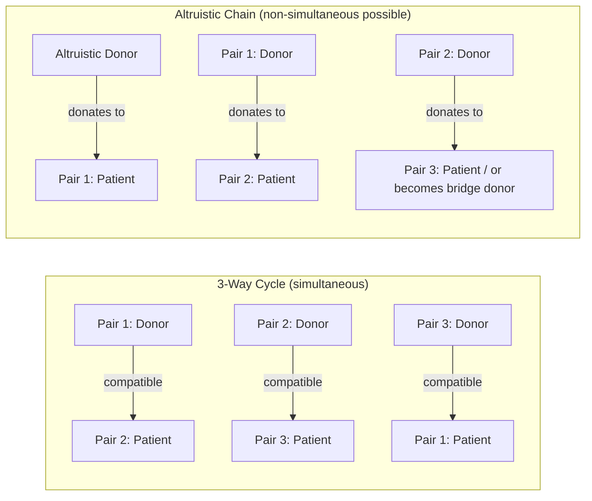

## Kidney Exchange Markets

### Overview

Kidney exchange markets apply matching theory to a medical setting where monetary transactions for organs are illegal in virtually all jurisdictions, making a **pure exchange-based** market design the only viable mechanism for expanding the pool of compatible living-donor kidney transplants. Patients with willing but biologically incompatible donors are matched into exchange cycles or chains with other incompatible pairs, so each patient receives a compatible kidney and each donor's organ still goes toward helping someone in need. This is one of the most consequential real-world applications of market design, credited with saving thousands of lives.

**Key Points**

- Built on the theoretical foundation of the **Shapley-Scarf housing market** and the **Top Trading Cycles (TTC)** mechanism, adapted for medical constraints
- Because organ sales are illegal (National Organ Transplant Act in the US, and analogous laws elsewhere), no price mechanism can be used to clear the market — matching, not pricing, does the allocative work
- Exchanges take the form of **cycles** (closed loops among incompatible pairs) or **chains** (initiated by non-directed/altruistic donors)
- Alvin Roth, Tayfun Sönmez, and Utku Ünver's theoretical work directly led to the founding of real-world kidney exchange programs (e.g., the New England Program for Kidney Exchange)

### The Underlying Problem: Incompatible Pairs

**Setup:** A patient $p_i$ needs a kidney and has a willing donor $d_i$ (typically a spouse, relative, or friend) who is medically incompatible with them — due to blood type mismatch or a positive crossmatch (immune sensitization against the donor's tissue).

**The core insight:** Even though donor $d_i$ cannot give to their own intended recipient $p_i$, $d_i$ might be perfectly compatible with a *different* patient $p_j$ in a similar situation, whose own donor $d_j$ might in turn be compatible with $p_i$. Swapping donors between the two pairs allows both transplants to proceed.

**Compatibility as a binary relation:** Unlike school choice or labor markets, "preferences" here are largely reducible to a compatibility indicator (blood type and crossmatch compatibility), producing a specific and highly structured matching problem rather than one driven by rich subjective rankings.

### Graph-Theoretic Formulation

**Representation:** Model the market as a directed graph $G = (V, E)$ where each vertex is an incompatible patient-donor pair, and a directed edge $(i \to j)$ exists if pair $i$'s donor is compatible with pair $j$'s patient.

**A kidney exchange** corresponds to a **cycle** in this graph: pairs $i_1 \to i_2 \to \cdots \to i_k \to i_1$, where each donor in the cycle gives to the next patient in the cycle, and every patient in the cycle receives a compatible kidney simultaneously.

**Objective:** Find a set of vertex-disjoint cycles (each pair can only be used once) that maximizes some welfare criterion — typically the total number of transplants, though weighted variants can prioritize hard-to-match patients or account for graft quality.

**This is a generalization of TTC:** In the classical Shapley-Scarf housing market, each agent has one indivisible good (a house) and ranks others' goods; TTC finds cycles where everyone gets their most-preferred available house. Kidney exchange restricts "preferences" to a binary compatible/incompatible relation but otherwise inherits the same cycle-based logic.

### The Critical Constraint: Simultaneity and Cycle Length

**Why exchanges must be simultaneous:** All transplants in a cycle are typically performed **at the same time** (or in immediate succession), because a donor could otherwise back out after their intended recipient has already received a kidney, leaving another patient in the cycle without their promised organ. This simultaneity requirement is the single largest logistical constraint distinguishing kidney exchange from other matching markets.

**Practical consequence — bounded cycle length:** Because a $k$-way cycle requires $2k$ simultaneous surgical teams and operating rooms (one donor nephrectomy and one transplant per pair, all coordinated in parallel), real-world exchanges are almost always restricted to short cycles — historically dominated by **2-way** and **3-way** exchanges, since coordinating logistics for very long cycles is often practically infeasible.

**[Inference]** This logistical bound is a defining feature that separates the theoretical optimization problem (find maximum-weight cycle cover, unrestricted length) from the practically implementable one (find maximum-weight cycle cover subject to a small maximum cycle length, typically capped at 2 or 3 in most historical program designs), and much of the applied algorithmic literature in this space is specifically about solving the length-constrained variant efficiently.

### Computational Complexity

**Unconstrained maximum cycle cover:** Finding a set of vertex-disjoint cycles of *any* length maximizing the number of matched pairs is solvable in polynomial time (reducible to a matching problem in an auxiliary bipartite graph).

**Length-constrained version:** Restricting cycles to length at most $k$ (e.g., $k=2$ or $k=3$) makes the maximum cycle cover problem **NP-hard** for $k \geq 3$, since it becomes equivalent to variants of hypergraph matching/packing problems. For $k=2$ specifically, the problem reduces to (polynomial-time solvable) **maximum matching** in an undirected graph, since a 2-cycle just requires mutual compatibility between two pairs.

**Practical solution methods:** Integer programming formulations (similar in spirit to combinatorial auction winner determination) are solved using specialized solvers; given the relatively modest size of most regional/national kidney exchange pools historically, exact IP solutions have generally been computationally tractable, though scale considerations grow as national and multi-national pools expand.

### Altruistic Donors and Non-Simultaneous Chains

A major innovation beyond simple closed cycles: **non-directed (altruistic) donors** — individuals who wish to donate a kidney without a specific intended recipient.

**Chains:** An altruistic donor initiates a chain: they donate to a patient in an incompatible pair; that patient's own incompatible donor then donates to the next patient in the chain; and so on. Unlike cycles, a chain does not need to close back on itself.

**Non-simultaneous extended altruistic donor (NEAD) chains:** Because a chain doesn't require every link to happen at once (the final donor in the chain, before finding their intended next match, can even choose to end their obligation, becoming a "bridge donor" who postpones their donation until a suitable next recipient is identified), chains can be executed with **greater time flexibility** than closed cycles — removing much of the strict simultaneity constraint that limits cycle length.

**[Inference]** This flexibility is a major reason chains initiated by non-directed donors have become an increasingly significant share of matches facilitated by kidney exchange programs relative to pure closed cycles, since a single altruistic donor can, in principle, trigger a long sequence of transplants over an extended period without requiring dozens of simultaneous operating rooms — though the precise current share of chain-based versus cycle-based transplants varies by program and year and should be checked against current program-reported statistics for any specific figure.

### Mechanism Design Objectives

**Efficiency:** Maximize the number of transplants (or a weighted variant favoring highly sensitized/hard-to-match patients, since these patients have exponentially fewer compatible options and disproportionately benefit from a larger matching pool).

**Fairness and priority:** Some designs incorporate priority weighting for patients who have been waiting longer, are pediatric, or are highly sensitized, analogous to priority categories in school choice.

**Incentive compatibility:** [Inference] Because transplant centers (rather than patients directly) typically report compatibility information and enroll pairs into exchange pools, incentive concerns in kidney exchange partly resemble the "receiving side" strategic concerns familiar from many-to-one matching — a center might be tempted to withhold an easy-to-match pair from the shared pool in order to arrange an in-house exchange first, use their own easier pairs to satisfy their own harder pairs, and only contribute residual pairs to the wider exchange — a documented concern in the mechanism design literature that has motivated specific pool design and information-sharing rules.

### Worked Example: 3-Way Cycle

Three incompatible pairs:

| Pair | Patient blood type | Donor blood type |
| --- | --- | --- |
| 1 | A | B |
| 2 | B | O |
| 3 | O | A |

**Compatibility check (simplified ABO-only model):** O-type donors are universal donors; A-type donors can give to A or AB patients; B-type donors can give to B or AB patients.

- Donor 2 (type O) → Patient 1 (type A): compatible ✓ (O is universal donor)
- Donor 3 (type A) → Patient 2 (type B): **not compatible** under strict ABO rules (A donor cannot give to B patient)

**[Inference]** This simplified illustration shows why real compatibility determination requires the full crossmatch/tissue-typing process beyond ABO blood type alone; the actual worked cycle in practice would be verified against full HLA crossmatch data, not blood type alone. A valid 3-way cycle requires that each consecutive donor-patient pair in the loop passes both blood type and crossmatch compatibility.

### Diagram: Kidney Exchange Cycle vs. Chain

### Exchange Pool Illustration (svg_diagram)

<svg xmlns="http://www.w3.org/2000/svg" viewBox="0 0 480 260">
<text x="240" y="22" font-size="15" text-anchor="middle" font-weight="bold">Incompatible Pair Exchange Graph (svg_diagram)</text>
<circle cx="120" cy="80" r="30" fill="#4A90D9" />
<text x="120" y="85" font-size="12" text-anchor="middle" fill="white">Pair 1</text>
<circle cx="340" cy="80" r="30" fill="#D9954A" />
<text x="340" y="85" font-size="12" text-anchor="middle" fill="white">Pair 2</text>
<circle cx="230" cy="200" r="30" fill="#5AAA6A" />
<text x="230" y="205" font-size="12" text-anchor="middle" fill="white">Pair 3</text>
<line x1="148" y1="95" x2="312" y2="95" stroke="black" stroke-width="2" marker-end="url(#arr)" />
<line x1="325" y1="105" x2="250" y2="180" stroke="black" stroke-width="2" marker-end="url(#arr)" />
<line x1="205" y1="180" x2="140" y2="105" stroke="black" stroke-width="2" marker-end="url(#arr)" />
<text x="240" y="240" font-size="11" text-anchor="middle" font-style="italic">Directed edge = donor compatible with next pair's patient</text>
</svg>

### Comparison: Kidney Exchange vs. Other Matching Markets

| Aspect | Kidney Exchange | School Choice | Labor Market Matching |
| --- | --- | --- | --- |
| Monetary transfers | Illegal / prohibited | N/A (public good) | Central feature |
| "Preferences" | Binary compatibility | Priorities (policy) | Genuine strategic preferences |
| Key mechanism | Cycles / chains (TTC-derived) | DA or TTC | Deferred Acceptance |
| Binding constraint | Simultaneity, cycle length | Capacity/priority | Capacity |
| Core strategic risk | Center withholding easy pairs | Boston mechanism manipulation | Preference misrepresentation |

### Real-World Programs and Impact

- **New England Program for Kidney Exchange (NEPKE):** one of the earliest formal kidney exchange programs in the US, closely associated with the founding theoretical work of Roth, Sönmez, and Ünver
- **National Kidney Registry and United Network for Organ Sharing (UNOS) Kidney Paired Donation program:** larger-scale, national US programs pooling incompatible pairs across many transplant centers
- **[Inference]** International kidney exchange programs and even some multi-country exchange arrangements have also been developed, reflecting the broader applicability of the underlying matching theory beyond any single national system, though the scale, legal framework, and specific design details differ substantially by country and should be verified against current program documentation for specifics.

### Extensions and Advanced Topics

- **List exchange / paired with deceased donor waitlist:** hybrid mechanisms where a live donor's kidney goes to a waitlist patient in exchange for their intended recipient receiving higher priority on the deceased-donor list
- **Global kidney exchange:** proposals to include international patient-donor pairs, addressing financial barriers to transplantation in lower-income countries — the subject of both enthusiasm and significant bioethical debate
- **Compatible pairs joining exchange pools:** even *compatible* pairs sometimes join an exchange pool if doing so yields a better-matched kidney (e.g., better long-term graft survival) than their own compatible donor, expanding the pool and improving overall match quality
- **Machine learning and predictive modeling:** [Speculation] increasing interest in incorporating predicted graft survival and long-term outcome modeling into exchange optimization objectives, beyond simple compatibility-based cycle maximization, though the maturity and adoption of such approaches in production exchange programs is not well established in what is verifiable here

### Open Problems and Research Directions

- Optimal cycle/chain length policies balancing logistical feasibility against realized match rate
- Incentive-compatible pool design preventing transplant center gaming (withholding easy-to-match pairs)
- Fair and efficient prioritization of highly sensitized and hard-to-match patients
- Legal, ethical, and mechanism design questions raised by global/international kidney exchange proposals
- Dynamic/online matching as pairs and altruistic donors arrive and depart the pool over time

**Related Topics**

- Top Trading Cycles and the Shapley-Scarf Housing Market Model
- The Stable Matching Problem and Deferred Acceptance Mechanisms
- Graph-Theoretic Algorithms for Maximum Cycle Cover
- Non-Directed Donor Chains and NEAD Chain Design
- Many-to-One Matching Markets (contrast: strategic vs. compatibility-based receiving side)
- Mechanism Design Under Legal Prohibition of Monetary Transfers
- Global Kidney Exchange: Ethical and Design Considerations