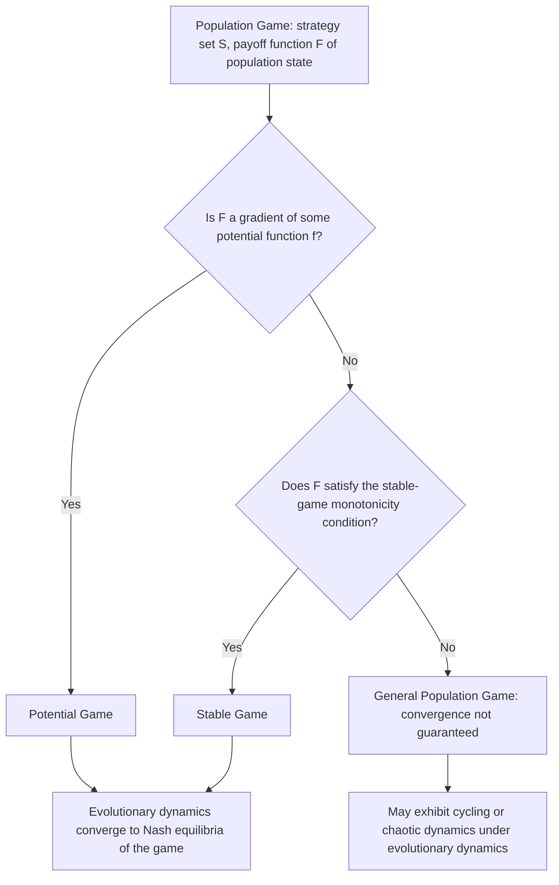

## Population Games

### Overview

Population games generalize the two-strategy, two-player symmetric games underlying the hawk-dove model and the classical replicator equation into a broader framework for modeling strategic interaction among large populations of agents, each individually negligible, choosing from a common strategy set. Rather than modeling a single pairwise contest, population games directly specify how an agent's payoff depends on the **distribution of strategies across the entire population**, making the framework naturally suited to large-scale economic, social, and biological settings — congestion games, market entry, epidemic behavior, and more.

**Key Points**

- Formalizes games with a continuum (or large finite number) of agents, each an infinitesimally small part of the population, choosing strategies from a common finite set
- Payoffs are defined as functions of the **population state** (the distribution of strategies), not of individual opponents' specific choices
- Nash equilibrium in a population game corresponds to a rest point where every strategy in use earns the (locally) maximal payoff
- Provides the general mathematical setting in which replicator dynamics and other evolutionary dynamics (best-response, imitation, projection dynamics) are typically studied

### Formal Framework

**Setup:** A population game specifies a finite strategy set $S = \{1, \ldots, n\}$ and a **payoff function** $F: \Delta^{n-1} \to \mathbb{R}^n$, where $\Delta^{n-1}$ is the simplex of population states $\mathbf{x} = (x_1, \ldots, x_n)$ with $x_i \geq 0$, $\sum_i x_i = 1$. The $i$-th component $F_i(\mathbf{x})$ gives the payoff earned by an agent playing strategy $i$ when the population is in state $\mathbf{x}$.

**Key modeling assumption — anonymity:** An individual agent's payoff depends only on their own strategy choice and the aggregate population state, **not** on which specific other agents chose which strategies. This anonymity assumption is what distinguishes population games from general $n$-player games and is what makes the framework tractable for large populations — no agent needs to track the identity of interaction partners, only the aggregate distribution.

**Special case — linear (matrix) population games:** When $F(\mathbf{x}) = A\mathbf{x}$ for a fixed payoff matrix $A$, the population game reduces exactly to the symmetric matrix game setting used in the classical replicator equation and ESS analysis. General population games allow $F$ to be an arbitrary (possibly nonlinear) function of the population state, capturing richer strategic phenomena like congestion effects or network externalities that matrix games cannot represent.

### Nash Equilibrium in Population Games

**Definition:** A population state $\mathbf{x}^*$ is a (Nash) equilibrium of the population game if every strategy actually used in the population earns a payoff at least as high as any unused (or any) alternative strategy:

$$x_i^* > 0 \implies F_i(\mathbf{x}^*) \geq F_j(\mathbf{x}^*) \quad \text{for all } j \in S$$

Equivalently: no agent (an infinitesimally small share of the population) can improve their payoff by unilaterally switching to a different strategy, since the aggregate state is essentially unaffected by any one agent's individual choice — a direct analogue of the standard Nash equilibrium condition, adapted to the population setting.

**Connection to variational inequalities:** Nash equilibria of population games can be equivalently characterized as solutions to a **variational inequality** over the simplex: $\mathbf{x}^*$ is an equilibrium if and only if $F(\mathbf{x}^*)^T(\mathbf{y} - \mathbf{x}^*) \leq 0$ for all $\mathbf{y} \in \Delta^{n-1}$. This connects population game equilibrium analysis to a well-developed body of mathematical tools from convex analysis and optimization.

### Potential Games

An important and widely studied subclass of population games, where the incentives of all agents can be summarized by a single scalar function.

**Definition:** A population game $F$ is a **potential game** if there exists a scalar function $f: \Delta^{n-1} \to \mathbb{R}$ (the potential function) such that:

$$F_i(\mathbf{x}) = \frac{\partial f}{\partial x_i}(\mathbf{x}) \quad \text{for all } i, \, \mathbf{x}$$

**Significance:** In a potential game, Nash equilibria correspond exactly to the critical points of $f$ restricted to the simplex, and — crucially for dynamic analysis — many natural evolutionary dynamics (including the replicator dynamics, under conditions) are guaranteed to **converge** to Nash equilibria in potential games, since the potential function acts as a Lyapunov function for the dynamics (it is monotonically non-decreasing along trajectories under many standard dynamics).

**Examples:** Congestion games (where an agent's payoff from a strategy/route depends on the number of others sharing it) are a classical example of potential games, extensively studied in both the economics/transportation literature and algorithmic game theory (price of anarchy analysis).

**[Inference]** The potential game property is one of the most useful sufficient conditions identified in the population games literature for guaranteeing that decentralized, myopic adjustment by individually rational (or boundedly rational, evolutionarily selected) agents converges to equilibrium — without it, convergence of natural dynamics to Nash equilibrium is not guaranteed and cycling or chaotic behavior can occur in some population games.

### Stability Concepts for Population Games

The dynamic stability apparatus developed for matrix games (ESS, asymptotic stability under replicator dynamics) generalizes to population games, though with additional subtlety due to potentially nonlinear payoff functions.

**Evolutionarily stable state (generalization of ESS):** A state $\mathbf{x}^*$ is evolutionarily stable in a population game if it is a Nash equilibrium and, for every alternative state $\mathbf{y} \neq \mathbf{x}^*$ in a neighborhood, the incumbent payoff advantage condition analogous to the classical ESS definition holds against small perturbations toward $\mathbf{y}$.

**Stable games (a broader class):** A population game is called a **stable game** (in the sense of Hofbauer and Sandholm) if it satisfies a self-defeating-externality condition:

$$(F(\mathbf{y}) - F(\mathbf{x}))^T(\mathbf{y} - \mathbf{x}) \leq 0 \quad \text{for all } \mathbf{x}, \mathbf{y} \in \Delta^{n-1}$$

This condition (a form of monotonicity, generalizing the negative semi-definiteness condition familiar from stability analysis of matrix games) is sufficient to guarantee convergence of a wide class of evolutionary dynamics to the set of Nash equilibria — considerably more general than the potential game condition, and covering many economically relevant games (e.g., games with negative externalities from congestion) that are not themselves potential games.

### Worked Example: A Simple Congestion Population Game

Consider a population of commuters choosing between two routes, $R_1$ and $R_2$, where travel cost (negative payoff) increases with the fraction of the population using that route (a standard congestion effect):

$$F_1(\mathbf{x}) = -x_1, \qquad F_2(\mathbf{x}) = -x_2 - 0.2$$

(Route 2 has a fixed cost disadvantage of $0.2$ in addition to congestion, e.g., representing a longer base distance.)

**Finding the equilibrium:** At an interior equilibrium where both routes are used, $F_1(\mathbf{x}^*) = F_2(\mathbf{x}^*)$:

$$-x_1^* = -x_2^* - 0.2 \implies x_2^* - x_1^* = 0.2$$

Combined with $x_1^* + x_2^* = 1$: solving the system gives $x_1^* = 0.4$, $x_2^* = 0.6$.

**Verification:** $F_1(\mathbf{x}^*) = -0.4$, $F_2(\mathbf{x}^*) = -0.6 - 0.2 = -0.8$...

**[Inference]** Re-deriving carefully: with $F_2(\mathbf{x}) = -x_2 - 0.2$, setting $F_1 = F_2$ gives $-x_1 = -x_2 - 0.2$, i.e., $x_2 - x_1 = -0.2$, i.e., $x_1 - x_2 = 0.2$. Combined with $x_1+x_2=1$: $x_1^*=0.6$, $x_2^*=0.4$. Checking: $F_1 = -0.6$, $F_2 = -0.4-0.2=-0.6$ ✓. This is a **potential game** (a standard result for this class of congestion cost structure), and this equilibrium is the unique interior critical point of the associated potential function, consistent with the general theory above.

### Diagram: Population Game Equilibrium Structure

### Congestion Game Illustration (svg_diagram)

<svg xmlns="http://www.w3.org/2000/svg" viewBox="0 0 480 220">
<text x="240" y="22" font-size="15" text-anchor="middle" font-weight="bold">Congestion Population Game (svg_diagram)</text>
<rect x="40" y="60" width="180" height="40" fill="#4A90D9" fill-opacity="0.6" />
<text x="130" y="85" font-size="12" text-anchor="middle" fill="white">Route 1: x1 = 0.6</text>
<rect x="40" y="120" width="120" height="40" fill="#D9954A" fill-opacity="0.6" />
<text x="100" y="145" font-size="12" text-anchor="middle" fill="white">Route 2: x2 = 0.4</text>
<text x="330" y="85" font-size="11" text-anchor="middle">Cost: -x1 = -0.6</text>
<text x="330" y="145" font-size="11" text-anchor="middle">Cost: -x2-0.2 = -0.6</text>
<text x="240" y="195" font-size="11" text-anchor="middle" font-style="italic">Equal cost at equilibrium — no agent benefits from switching</text>
</svg>

### Relationship to Classical Evolutionary Game Theory

| Concept | Matrix / Symmetric Game Setting | Population Game Generalization |
| --- | --- | --- |
| Payoff structure | Linear, $F(\mathbf{x}) = A\mathbf{x}$ | Arbitrary function $F(\mathbf{x})$, possibly nonlinear |
| Equilibrium concept | Nash equilibrium of the matrix game | Nash equilibrium of the population game |
| Stability refinement | Evolutionarily Stable Strategy (ESS) | Evolutionarily stable state / stable games |
| Dynamics | Standard replicator equation | Replicator, best-response, projection, and other dynamics defined generally on $F$ |
| Convergence guarantee | Depends on payoff matrix structure (e.g., zero-sum, potential-like) | Guaranteed for potential games and stable games; not guaranteed generally |

### Applications

- **Traffic and network routing (congestion games):** modeling how commuters or data packets distribute across routes/links under congestion-dependent costs, closely tied to the **price of anarchy** literature in algorithmic game theory
- **Market entry and industrial organization:** modeling firm entry decisions across markets or product niches where profitability declines with the number of competitors present
- **Epidemiology and behavior:** modeling adoption of preventive behaviors (mask-wearing, vaccination) where individual incentives depend on the prevalence of the behavior in the population
- **Wireless and communication networks:** channel/resource selection games where interference or congestion depends on the aggregate usage pattern
- **Evolutionary biology beyond pairwise contests:** modeling frequency-dependent selection in settings with more than two interacting individuals or continuous phenotype distributions

### Advanced Topics and Dynamics on Population Games

- **Best-response dynamics:** population state moves toward the best response to the current state, generalizing naturally from matrix games to the population game setting
- **Projection dynamics and other "target dynamics":** a broad class of dynamics constructed to have desirable convergence properties on potential and stable games, used extensively in the algorithmic and control-theoretic treatment of population games
- **Stochastic stability and finite-population versions:** as with matrix games, finite-population stochastic analogues (large but finite numbers of agents with random matching or random revision opportunities) converge to the deterministic population game dynamics in appropriate limits, while offering additional tools (stochastic stability, equilibrium selection under noise) not available in the pure deterministic setting
- **Revision protocols:** the microfoundational layer specifying exactly how individual agents in a large population decide when and how to switch strategies (imitation, best response, or other rules), which in aggregate generate the macro-level population game dynamics (replicator dynamics being the aggregate outcome of a specific imitation-based revision protocol)

### Open Problems and Research Directions

- Characterizing broader classes of population games (beyond potential and stable games) for which natural dynamics provably converge to equilibrium
- Connecting revision-protocol microfoundations to specific observed dynamics in real economic and social systems
- Extending population game theory to settings with heterogeneous sub-populations (multi-population games) and network-structured interaction rather than uniform random matching
- Algorithmic and computational complexity questions: efficiently computing equilibria and convergence rates for large-scale population games relevant to network design and mechanism design applications

**Related Topics**

- Replicator Dynamics (matrix-game special case of population game dynamics)
- Evolutionarily Stable Strategies (stability refinement, matrix-game case)
- Potential Games and the Price of Anarchy
- Congestion Games in Algorithmic Game Theory
- Best-Response, Projection, and Other Target Dynamics
- Revision Protocols and Microfoundations of Evolutionary Dynamics
- Stochastic Stability in Finite-Population Evolutionary Models